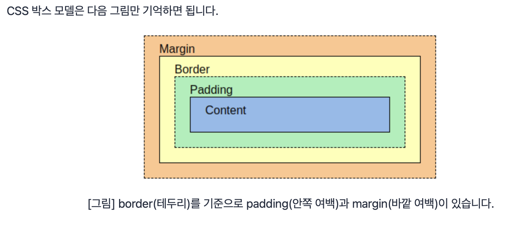
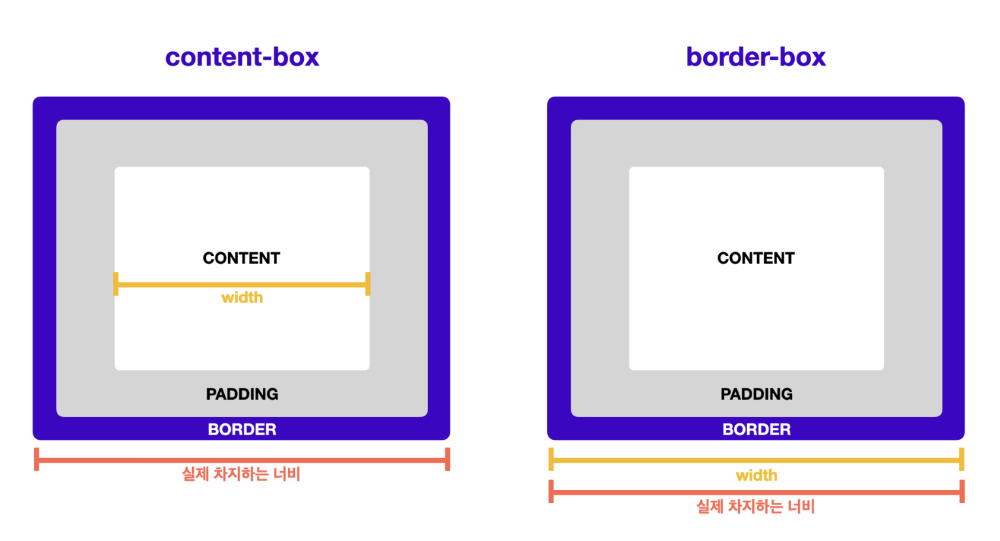

>   본 글은 Codestates BEB 코스의 자료에서 내용을 가져와 작성하였음을 알립니다.  

# CSS
CSS란 Cascading Style Sheets의 이니셜이다. HTML과 같은 마크업 언어가 표현되는 방법을 결정한다.

## Achievement Goals
- CSS의 사용 목적
- 프론트 엔드 개발자의 기초 소양
- CSS의 기본 문법과 구조
- CSS를 HTML에 적용하기
- 직접 html안에 css를 정의하는 것을 권장하지 않는 이유는?
- id및 class와 관련된 selector 규칙을 이해할 수 있다.
- CSS를 이용해 텍스트를 꾸밀 수 있다.
- CSS에서 쓰이는 단위의 두가지 경우를 구분할 수 있다.
- CSS 박스 모델을 이해할 수 있다.
- box model
    - width, height
        - margin, padding, border
    - 박스 크기를 측정하는 두가지 기준의 차이를 이해할 수 있다.

## Introduction

### CSS도 화려함만을 위해 사용되지는 않는다.
- 콘텐츠의 배치와 위치 (레이아웃 디자인)
- 텍스트를 강조하거나 밑줄을 치는 등, 최소한의 타이포그래피  

위 두가지 요소를 갖추고 있으면 더 나은 UX (User Experience) 를 제공할 수 있다.  
css는 기존 웹 페이지에 다른 css 파일을 적용해 활자 매체로 출판을 하거나,  
색약이나 장애인이 웹 페이지를 이용할 때 도움을 줄 수도 있다.  

### CSS는 디자이너의 영역이다?
혹자는 이렇게 생각할 수 있다.  
***나는 서버 개발자가 될 테니까 / 나는 디자인 감각이 없으니까 / 기본 소양을 학습하는데 방해일 뿐***  
하지만, CSS를 작성해서 간단한 UI를 만드는 일은 개발자의 기본적인 소양이다. (헉!)  
즉, 콘텐츠를 적당한 위치에 배치하는 레이아웃 디자인은 디자이너가 아니더라도 할 수 있어야만 한다.  

### UI의 중요성
일반 사용자를 대상으로 하는 어플리케이션은 UI가 없으면 소용없다.  
물론 UX도 고려해야한다.  

***그러면 디자인을 배워야하는 것 아닌가?***  
배우면 더 잘하겠지만 당연히도. 무료 리소스들이 많다.  
또한 간단한 도형은 CSS를 통해서 만들 수 있다.  
실제로 Google이나 New York Times와 같은 페이지는 전문 디자이너만 만들수 있음을 알 수 있다.  

### Being FE Developer
프론트 엔드란, 사용자가 웹 서비스를 이용할 때, 크롬과 같은 브라우저에 보이는 부분을 프론트 엔드라고 한다.  
프론트엔드 개발자는 레이아웃 디자인과 타이포그래피 정도는 다룰 수 있어야한다.  
- 화면의 구성이나 배치 (레이아웃 디자인)
- 굵은 글씨와 같은 타이포그래피와 색상을 적용하는 일 etc.
- 개발자에게 있으면 좋고, 없어도 상관없는 것
    - 정렬이나 배색에 대한 감각
    - UX에 대해 고민해보고, UX가 잘 적용된 웹이나 앱을 분석해본 경험

사실 일반인도 보노보노ppt 따위의 것들을 보면 못 만들었다고 느끼기 마련이다.  
어떤 종류의 개발자이든간에, (FE, App, BE, etc.) 모두가 자신을 개발자라고 소개할 수 있다면,  
최소한의 UI는 직접 만들 수 있어야한다.

### Why CSS is hard?
CSS는 웹개발자가 배우기 가장 쉬우면서도 어렵다.  
특정한 HTML 요소에 적용할 스타일 속성과 값을 적용하면 필요한 부분이 거의 완성되는데,  
~~모든 프로젝트가 그렇듯~~ 프로젝트의 규모가 조금만 더 커져도,  
CSS를 의미있게 구성하는 일이 복잡하고 어려워진다.  


이를테면 특정 HTML 요소를 CSS로 스타일링 하기 위해서, CSS 파일 중 한 부분을 변경했을 때,  
다른 페이지의 HTML 요소가 변경되는 의도치 않은 상황이 연출될 수 있다.

그래서 다양한 종류의 모범사례, best practice가 만들어져왔다.  
물론 무엇이 가장 좋은 사례인지에 대해 합의된 건 없다.  
그래서 서로 상충되기도 한다.  
~~디자인 패턴과 비슷한 맥락!~~

아래 Basics에서 소개하는 CSS 지식들은, 실제 업계에서 권장되는 내용을 위주로 소개한다.  
늘 그렇듯, 방법론에는 정답이 없다.  
그러나 벙봅론에 대해 학습하기 전에 무엇이 CSS를 어렵게 만드는지 이해해야한다.  

## CSS Basics
### Semantic Tags
CSS는 스타일링 도구이므로, 독립적으로 기능하지 않는다. 반드시 HTML이 있어야만 동작할 수 있다.  
HTML에는 이름이 다르지만 의미가 같은 태그들이 많다.  
이를테면, header, main, nav, aside, footer는 모두 div 태그와 똑같다.  
이렇게 이름에 의미를 붙여 부르는 태그를 시맨틱 태그라고 한다.  
시맨틱 태그는 이 태그가 감싸고 있는 영역이 어떤 역할을 담당하는지, 개발자가 쉽게 파악하도록 한다.  
  
추가로, meta 태그는 해당 문서에 대한 정보인 메타데이터를 정의할 때 사용한다.  
메타 데이터는 언제나 head 요소 내부에 위치해야 한다.  

### Linking CSS to HTML
CSS는 셀렉터로 HTML의 태그로 지정하고, 선언 블록(declaration block) 안에, 여러 선언(declaration)들을 나열한다.  
하나의 선언은, 속성명(property) : 속성값(value);로 이루어진다.  

```html
<link rel="stylesheet" href="1_layout.css"/>
```

link 태그는 HTML 파일과 다른 파일을 연결 하는 목적으로 사용한다.    
rel 태그는 연결하고자하는 파일의 역할이나 특징을 나타낸다.  
CSS 은 style sheet이기 때문에, rel 속성에 style sheet를 추가한다.  
경로는 절대경로 / 상대경로 다 가능하다.  

link 태그를 추가함으로써 똑같은 구조에 다른 스타일을 적용할 수 있다.  
아래 예시에서 나오는 layout.css는 index.css와 달리 HTML 태그를 배치하는 역할을 한다.  
  
예시 HTML
```html
<!DOCTYPE html>
<html lang = "en">
<head>
    <meta charset="utF-8">
    <title>Modern CSS</title>
    <link rel="stylesheet" href="index.css" />
    <link rel="stylesheet" href="layout.css"/>
</head>

<body>
<header>This is header.</header>
<div class = "container">
    <nav>
        <h4>This is the navigation section.</h4>
        <ul>
            <li>Home</li>
            <li>Mac</li>
            <li>iPhone</li>
            <li>iPad</li>
        </ul>
    </nav>
    <main>
        <h1>This is the main content.</h1>
        <p>...</p>
    </main>
    <aside>
        <h4>This is an aside section</h4>
        <p>...</p>
    </aside>
</div>
<footer>
    <ul>
        <li>개인정보 처리방침</li>
        <li>이용 약관</li>
        <li>법적 고지</li>
    </ul>
</footer>
</body>
</html>

<!-- 
    HTML 태그들은 section 태그를 사용하지 않으면 VStack처럼 쌓인다.
    html이 뼈대를 만든다고 했는데 이 뼈대라는 말이 참 애매하다.
    내가 생각했을 땐
    - 각 영역별 구분
    - 헤더의 폰트 크기 
    - 컴포넌트 구역 
        이를테면 라디오버튼, 체크박스, input, 링크, 리스트 등
-->
```

index.css 의 구조
```css
body {
    margin: 0;
    padding: 0;
    background: #fff;
    color: #4a4a4a;
}
header, footer {
    font-size: large;
    text-align: center;
    padding: 0.3em 0;
    background-color: #4a4a4a;
    color: #f9f9f9
}
nav {
    background: #eee;
}
main {
    background: #f9f9f9;
}
aside {
    background: #eee;
}

/*
    텍스트 가운데 정렬 : text-align: center
    글자색 : color 
    배경색 : background
    background: 다양한 background 속성을 부여할 수 있는 축약 속성
    background-color, image, repeat, attachment, position을 모두 포함함.
    em의 의미: em단위는 상위 요소 크기의 몇배인지로 크기를 정한다.
*/
```
layout.css 의 구조
```css
body{
    min-height: 100vh;
    display: flex;
    flex-direction: column;
}
.container{
    display: flex;
    flex: 1;
}
main{
    flex: 1;
    padding: 0 20px;
}
nav {
    flex: 0 0 180px;
    padding: 0 10px;

}
aside{
    flex: 0 0 130px;
    padding: 0 10px;
}
```

직접 html 태그에 css 속성을 추가할 수도 있다. 
하지만 역시 관심사 분리 측면에서 권장하지는 않는다.  

### Basic CSS Styling
css스타일을 적용할 수 있는 방법은 3가지가 있다. 
- 인라인 스타일 : 같은 줄에서 스타일을 적용
- 내부 스타일 시트 : CSS 파일 내에 작성하는 내용을, 별도의 파일로 구분하지 않고, style 태그 내에 작성
- 외부 스타일 시트 : 앞서 설명한 방법

```css
<nav style:"background : #e0e0e0; color:blue">...</nav>
```

특정 태그에 대해서 셀렉터를 지정해서 가능하다.  
만약 모든```<h4>``` 에 대해서 바꾸고 싶으면 다음과 같이 한다.  

```css
h4 {
    color: red;
}
```
#### id in HTML
하지만 특정 h4만 바꾸고 싶다면, HTML에서 id를 지정해주어야 한다.  
```html
<h4 id="navigation-title">This is the navigation section.</h4>
```
```css
#navigation-title{
    color:red;
}
```
하지만 id는 하나의 문서에서 한 요소에만 사용해야한다.  
즉, id는 문서 내에 단 하나의 요소에만 적용할 수 잇는 유일한 이름이어야한다.  

#### class in HTML
동일한 기능을 하는 CSS를 여러 요소에 적용하기 위해서 HTML에서 class를 사용한다.

```html
<!-- 잘못된 예제 -->
<ul>
    <li id="menu-item">Home</li>
    <li id="menu-item">Mac</li>
    <li id="menu-item">iPhone</li>
    <li id="menu-item">iPad</li>
</ul>

<!-- 옳은 예제 -->
<ul>
    <li class="menu-item">Home</li>
    <li class="menu-item">Mac</li>
    <li class="menu-item">iPhone</li>
    <li class="menu-item">iPad</li>
</ul>
```

CSS에서 클래스 지정은 id 지정에서 #으로 했던 것과 달리, .으로 한다.  
```css
.menu-item{
    text-decoration: underline;
}
```
여러 class를 하나의 요소에 적용하려면, 공백으로 class의 이름을 분리한다.  

```html
<li class="menu-item selected">Home</li>
```

```css
.selected{
    font-weight: bold;
    color: #009999;
}
```

#### Difference between id and class
- id  
CSS에서 #으로 선택하며, 한 문서에 단 하나의 요소에만 적용한다. 특정 요소에 이름을 붙이는 데 사용한다.
- class  
CSS에서 .으로 선택한다. 동일한 값을 갖는 요소가 많다. 스타일의 분류(classification)에 사용한다.  

#### 글자, 배경, 박스의 테두리의 색상
CSS에서 color 속성에 HEX 값을 넘겨주어 색을 지정할 수 있다.
`color : {value; HEX (RGB)};`

#### 글꼴
font-family: "글꼴 이름"
디바이스에 따라 지원하지 않는 글꼴을 대비해 fallback 글꼴을 추가 가능하다.  
적은 순서대로 fallback이 적용된다.  
디바이스 별로 적용할 수 있는 글꼴 문제를 해결하기 위해서, 웹 폰트 기술로 해결한다.  
웹 폰트는 link 태그를 이용하여 embedding 한다.  

#### 글자의 크기
CSS에서 font-size 속성에 숫자 + 단위 값으로 글자의 크기를 지정할 수 있다.  
font-size: 24px  
단위에는 여러가지가 있는데, 다음 단위 문단에서 자세히 설명한다.  

#### 단위
- 절대 단위: px, pt
- 상대 단위: %, em, rem, ch, vw, vh

##### 단위를 각각 언제 쓰는가
- 기기나 브라우저 사이드 등의 환경에 영향을 받지 않는, 절대적인 크기로 정하는 경우
픽셀.  
픽셀은 글꼴의 크기를 고정하는 단위이기 때문에, 사용자 접근성이 불리하다.  
작은 글씨를 보기 힘든 사용자가 브라우저의 기본 글꼴 크기를 더 크게 설정하더라도, 크기가 고정된다.  
그러므로, 픽셀은 모바일 기기처럼 작은 화면이면서, 동시에 고해상도인 경우에도 적합하지 않다.  
고해상도에서는 1px이 한 점보다 크게 업스케일(upscale)되기 때문에, 뚜렷하지 못한 형태로 출력된다.  
그래서 인쇄와 같이 화면의 사이즈가 정해진 경우에 쓴다.  

- 일반적 경우
rem 추천!  
root의 글자 크기, 즉 브라우저의 기본 글자 크기가 1rem이다.  
두배로하려면 2rem, 작게 하려면 0.8rem등을 사용한다.  
사용자가 설정한 기본 글꼴 크기를 따르기때문에, 접근성에 유리하다.  
em은 부모 엘리먼트에 따라 상대적으로 크기가 변경되므로 계산이 어렵지만,  
rem은 root글자 크기에 따라서만 상대적으로 변한다.  

- 반응형 웹(responsive web)에서 기분점을 만들 때
반응형 웹은 디바이스의 너비(width)에 따라 유동적인 레이아웃이 적용되는 웹사이트를 말한다.  
이를테면, 테블릿 모드, 데스크탑 모드처럼, 디바이스에 따라 다르게 나오는 것을 들 수 있다.  
디바이스 크기별로 CSS를 다르게 적용해야한다.  
이때, 디바이스 크기를 나누는 기준을 보통 px로 한다.  

- 화면 너비나 높이에 따른 상대적인 크기가 중요한 경우  
vh나 vw를 사용한다.  
웹사이트의 보여지는 영역을 viewport라고 한다.  
vw, vh는 각각 viewport의 width, height을 의미한다.  
화면을 가득 채우며 딱 떨어지게 스크롤 되는 것을 100vh, 100vw로 표현한다.  
참고로 ```<body>```태그에서의 %는, HTML이 차지하는 모든 영역을 표현한다.  
즉, 지금은 보이지 않으나, 스크롤 했을 때 보이는 영역까지 포함했을 때의 비율이다.  

### Alignment
text-align : elft, right, center, justify(양쪽 정렬)
  
특이한 점은 세로 정렬이 좀 어렵다는 점이다.  
vertical-algin 속성을 쉽게 떠올릴 수 있는데, 부모 요소의 display 속성이, 반드시 table-cell이어야 한다.  
세로 정렬은 정렬하고자하는 글자를 둘러싸고있는 박스의 높이가, 글자 높이보다 큰 경우에만 적용 가능하다.  
따라서 박스에 대한 이해가 깊어야한다.  
#### and more...
- 굵기 : font-weight
- 밑줄, 가로줄 : text-decoration
- 자간: letter-spacing
- 행간: line-height

### Separation of Concern
이전에는 HTML에서 center, font태그를 사용했다면, 이제는 사용하지 말도록 하자.  
HTML 파일로는 구조를 설계하는 일에만 신경쓰고, css로 스타일링을 하자.  

### Box model
모든 콘텐츠는 각자의 영역을 가지며, 일반적으로 하나의 콘텐츠로 묶이는 엘리먼트들이(요소) 하나의 박스가 된다.  
박스는 항상 직사각형이고 width, height을 가진다.  
css를 이용해 속성과 값으로 그 크기를 설정한다.  
```html
<h1>Basic document flow</h1>
<p>I am a basic block level element. My adjacent block level elements sit on new lines below me.</p>
<p>By default we span 100% of the width of our parent element, and we are as tall as our content. Our total width and height is our content+ padding + border width/height.</p>
<p>We are weperated by our margins. Because of margin collapsing, we are separated by the width of one of our margins, not both.</p>
<p>inline elements<span>like this one<span>and</span>this one</span>sit on the same line as one another, and adgacent text nodes, if there is space on the same line. Overflowing inline elements will <span>wrap onto a new line if possible (like this one containing text)</span>, or just go on to a new line if not</p>
```

```css
h1 {
    background: gray;
    width: 60%;
}

p{
    background: rgba(255, 84, 104, 0.3)
    width: 80%;
    height: 200px;
}
span{
    background: yellow;
    width: 100px;
    height: 100px
}
```


#### Difference between block and inline, inline-block
- 줄바꿈이 되는 박스 : block
- 옆으로 붙는 박스 : inline, inline-block  

박스의 종류는 줄바꿈으로 구별 가능하다.  
줄바꿈이 되는 박스는 block박스라 하며, 인라인 박스는 줄바꿈이 일어나지 않고, 크기지정을 할 수 없다.  

이 두가지 박스 종류의 특징이 섞인, 줄바꿈이 일어나지 않는 동시에 block 박스의 특징을 가지는 inline-block 박스도 있다.  
위의 예시에서는 ```<h1>``` , ```<p>```는 block 박스이며 ```<span>```은 inline 박스이다.

- block요소의 대표적 예: ```<div>``` ,```<p>```  
- inline 요소의 대표적 예: ```<span>```  

위의 예시에서는 사실 span의 width, height이 적용되지 않는다.  
block 박스와는 다르게 inline 박스는 width, height 속성이 적용되지 않기 때문이다.  

```css
span {
    background: yellow;
    display: inline-block;
    width: 100px;
    height: 100px;
}
```

width, height을 적용시키기 위해, display에 inline-block을 추가한 모습이다.  
  
|구분|줄바꿈 여부|기본으로 갖는 너비 (width)|width, height 사용 가능 여부|
|:---:|:---:|:---:|:---:|
|block|줄바꿈이 일어남|100%|가능|
|inline-block|줄바꿈이 일어나지 않음|글자가 차지하는 만큼|가능|
|inline|줄바꿈이 일어나지 않음|글자가 차지하는 만큼|불가능|

css 박스 모델은 다음 그림만 기억하면 된다.
  

#### border
border는 테두리를 의미한다.  
심미적 용도 외에도 개발과정에서 의미있게 사용한다.  
각 영역이 차지하는 크기를 파악하기 위해서, 레이아웃을 만들면서 그 크기를 시각적으로 확인할 수 있도록 한다.  
```css
p { 
    border: 1px solid red;
}
```
- border 속성에 추가할 수 잇는 세부 속성: border width, border-style, border-color  
위의 예시에서 나온 solid는 border-style 속성에 추가할 수 있는 옵션 중 하나이다.  

#### margin
margin은 바깥쪽 여백을 의미하며 다음과 같이 사용한다.  
```css
p { 
    margin: 10px, 20px, 30px, 40px
}
```
각각 topm right, bottom, left로 시계방향이다.  
값을 두개만 넣으면 top, bottom | left right으로 값이 적용된다.  
하나만 넣으면 모든 방향에 대해 같은 값이 들어간다.  
각각 특정지어 속성을 넣어도 된다.  
위 규칙은 padding에도 그대로 적용된다.  

#### padding
padding은 안쪽 여백을 의미하며, border를 기준으로 박스 내부의 여백을 지정한다.  
배경색이나 border를 지정했을 때 안쪽 여백을 더 잘 확인 가능하다.  

#### Contents out of box
박스 크기보다 콘텐츠 크기가 더 큰 경우에는, 콘텐츠가 박스 바깥으로 빠져나온다.  
하지만, `overflow : auto;` 를 하면, 박스 크기에 맞게 콘텐츠를 더이상 표시하지 않고, 박스 안에 스크롤을 추가해준다.  
overflow 속성은 overflow-x, overflow-y 속성으로 두 방향 모두 지정가능하다.  
참고로, `hidden` 을 쓰면 내용을 가린다.

#### Measuring box size
다음과 같은 HTML과 CSS가 있다고 하자.  
```html
<div id ="container">
    <div id="inner">
        안쪽 box
    </div>
</div>
```
```css
#container {
    width: 300px;
    padding: 10px;
    background-color: yellow;
    border: 2px solid red;
}

#inner {
    width: 100%;
    height: 200px;
    border: 2px solid green;
    background-color: lightgreen;
    padding: 30px;

}
```
##### 문제점
id가 container인 박스의 width 속성에 300px를 지정한 것이 문제이다.  
실제로 개발자 도구로 확인하면 width 값이 324px이다.  
```bash
# container
# 브라우저는 다음과 같은 계산을 한다.
300px(콘텐츠 영역)
+10px (padding-left)
+10px (padding-right)
+2px (border-left)
+2px (border-right)

# inner의 100%은 300px이 아닌 364px이다.
300px(콘텐츠 영역)
+30px (padding-left)
+30px (padding-right)
+2px (border-left)
+2px (border-right)
```
박스에 적용할 여백을 고려하지 않고, 박스의 크기를 디자인하는 경우 실수가 생긴다.  
박스의 크기를 디자인할 때 콘텐츠 영역만 고려하면, 개발 과정에서 처음 생각한 레이아웃을 벗어날 수 있다.  
반드시 레이아웃 디자인을 할 때, 계산 시 여백을 고려해야한다.  

#### 레이아웃 디자인을 쉽게하기
여백과 테두리를 포함한 박스 계산하면 레이아웃 디자인을 쉽게 할 수 있다.  
*은 모든 요소를 선택하는 셀렉터이다.  
모든 요소를 선택해 box-sizing 속성을 추가하고, border-box라는 값을 추가한다.  

```css
*{
    box-sizing: border-box;
}
```
모든 요소에 `box-sizing: border-box`를 적용하면, 모든 박스에서 여백과 테두리를 포함한 크기로 계산된다.  
일반적으로 box-sizing은 html문서 전체에 적용한다.  
box-sizing을 일부 요소에만 적용시킬 경우 혼란을 가중시킨다.  

박스 측정 두가지를 항상 염두하자.  
- content-box : 박스의 크기를 측정하는 기본값이다.
- border-box : 그러나 대부분의 레이아웃 디자인에서, 여백과 테두리를 포함하는 박스 크기 계산법인 border-box를 권장한다.




## Practice
일기장 포맷을 HTML, CSS, JavaScript를 통해서 만들어보자.  
아직 JavaScript에 대해서 충분히 배우지 않았기 떄문에,  
이번 실습에서는 오늘 날짜를 가져와 표시하는 것만 실습해본다.  

```html
<!-- 
    !이나 html:5를 하고 enter하면 빈 body가 있는 html을 자동으로 생성한다.
-->
<!DOCTYPE html>
<html lang="en">
<head>
    <meta charset="UTF-8">
    <meta http-equiv="X-UA-Compatible" content="IE=edge">
    <meta name="viewport" content="width=device-width, initial-scale=1.0">
    <title>오늘의 일기</title>

    <!-- css파일을 연결할 때에는 link를 사용한다. -->
    <link rel="stylesheet", href ="4_diary.css">

</head>
<body>
    <!--  html은 태그를 통해서 줄바꿈을 인식한다. 단순 줄바꿈은 반영되지 않는다.

    날짜: 3월 7일

    제목: 안녕

    내용: 일기 html 실습. 줄바꿈을 인식하는지 확인하자.

    -->

    <div>3월 7일</div>

    <h1>제목: 안녕 >> 제목은 h1~5태그를 사용합니다. 강조 표시는 브라우저마다 달라요.</h1>

    <p>semantic하게 내용, paragraph는 p 태그를 씁니다. div를 써도 되긴 함. (아무거나)</p>

    <!-- 오늘 날짜를 표시하는 영역을 만들자.
        
        하지만 이게 html에서는 어렵다. 그래서 js를 사용한다.
    
    -->
    <div class = "today-date"></div>

    <!-- 자바스크립트 파일 연결은 body의 맨 마지막에 붙여준다.-->
    <script src="4_diary.js"></script>
    
</body>
</html>
```

```css
h1 {
    color: #3bcde3
}

h1:hover {
    /* hover: 커서를 올리면 색이 바뀐다. */
    color:red
}
```

```javascript
// 컨텐츠 값을 변경하려면 두가지 과정을 거쳐야한다.
// 1. 특정 요소로를 가져와야한다.

// 클래스는 . 으로 호출한다.
// id는 #으로 호출한다.
// 태그는 바로 태그 이름을 넣어 호출한다.
const todayDate = document.querySelector(".today-date");

// 2. 가져온 요소를 조작한다.
// 값을 요소에 저장할 떄에는 .textContent를 한다.
todayDate.textContent = new Date().toDateString()
```
