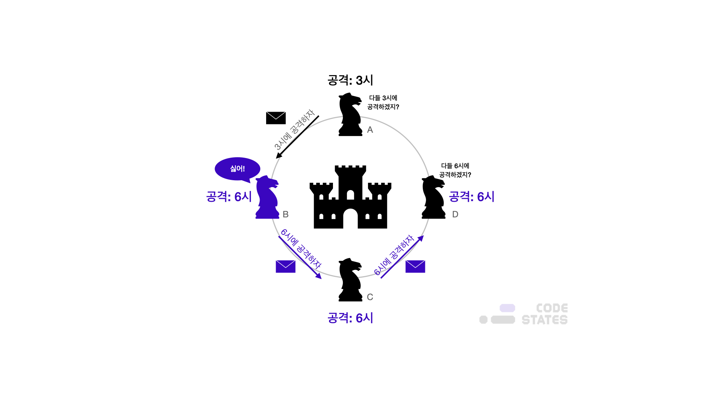
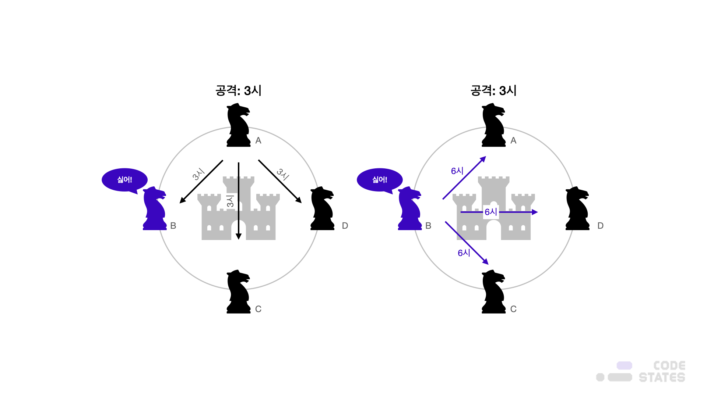
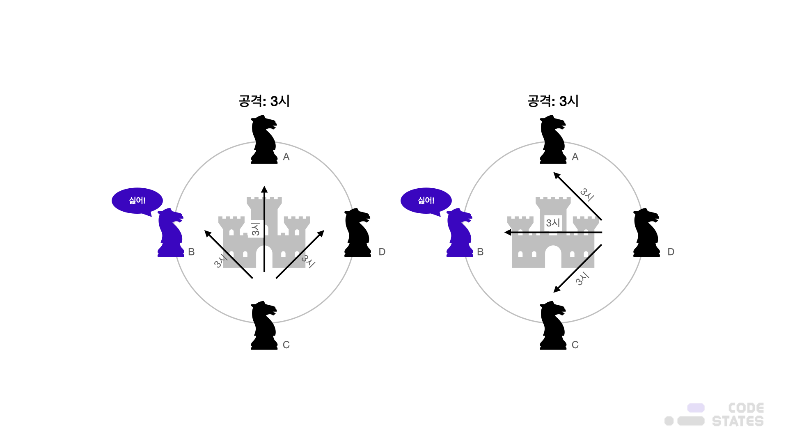
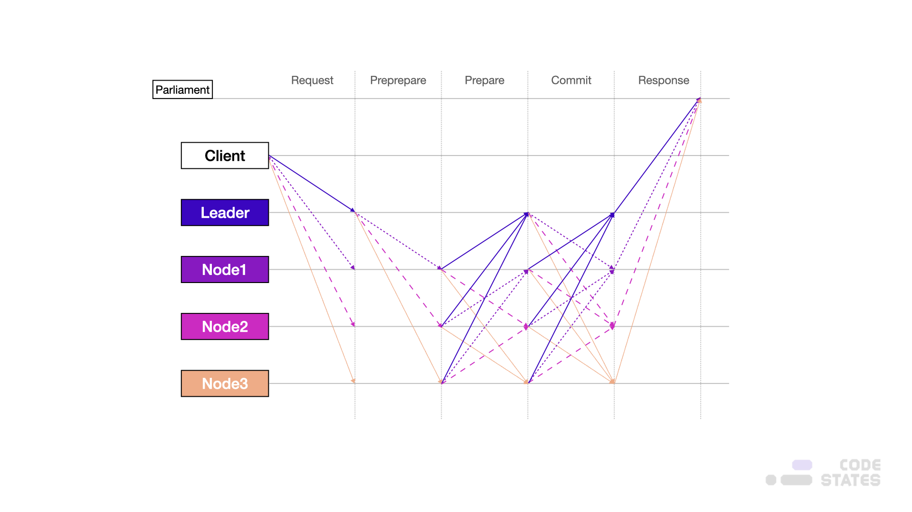
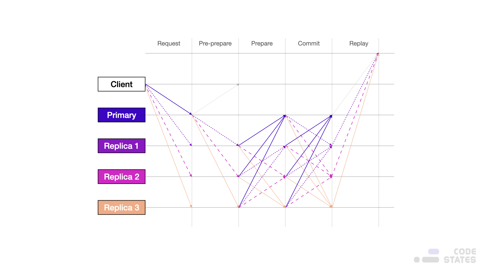
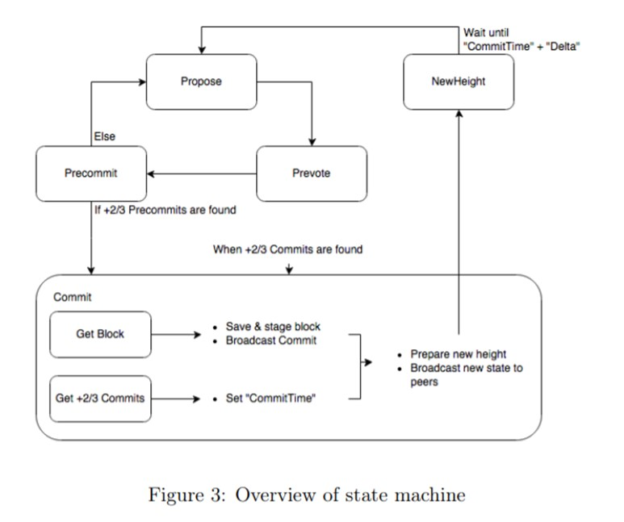
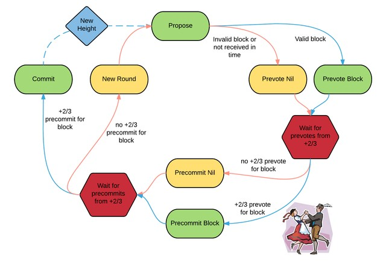
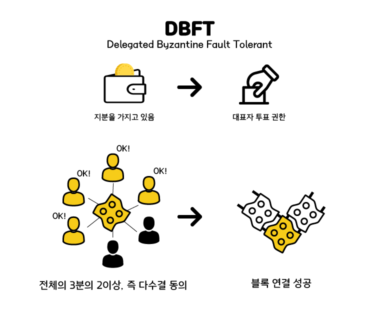

> 본 글은 Codestates BEB 코스의 자료에서 내용을 가져와 작성하였음을 알립니다.  

# Byzantine Falut Tolerance

---

## READ ME
분산 네트워크 분야에서 가장 오래된 이슈이며 풀어야 할 대표적인 문제가 “비잔틴 장군의 딜레마"이다.  

---

## Byzantine Generals Problem  
전쟁 중이라고 가정해 보자.
적군의 성을 함락시켜야 전쟁을 승리로 가져갈 수 있다.
여기서 아군은 N개의 군대로 분산되어 있다.  
각 군대는 지리적으로 떨어져 있다.  

> 편의상 N은 4개라고 가정한다.
> (군대 A, 군대 B, 군대 C, 군대 D)

4개의 군대는 오랜 전투 끝에 적군의 도시를 포위할 수 있었다.  
하지만 워낙 방어가 잘 되어있어 함락시키기 위해서는 4개의 군대가 모두 합심하여 동시에 공격해야 한다.  
 
이를 위해 공격 시간, 공격 방식을 전달하고 인지하는 과정이 필요한데,  
이때 만약 4개의 군대 중에 배신자가 존재한다면 악의적인 정보를 전파하게 되고, 결국 공격을 실패하게 될 것이다.  
 
위에서의 예처럼 분산 네트워크 환경에서 악의적인 노드(배신자)가 존재할 때,  
이를 어떻게 극복하고 합의에 도달할 수 있느냐가 “비잔틴 장군의 딜레마"이다.  

  

다시 쉽게 위의 예시를 기반으로 설명한다.  
4개의 부대 중 최소 3개 부대 이상이 동시에 공격해야 적군의 도시를 함락시킬 수 있다고 가정한다.  
공격 시간(메시지) 전파를 아래와 같다고 가정해보자.  

- **A → B** : 3시에 공격하자  
- **B → C** : 6시에 공격하자  
- **C → D** : 6시에 공격하자  

이렇게 된다면 결국 A만 3시에 공격을 할 것이고, 결국 실패하게 된다.  
이러한 문제점을 해결하기 위해 메시지를 전송하는 방법을 바꿔보자.  
각 부대가 모든 부대에서 메시지를 전파하는 방법이다.  

  
  

- **A → B, C, D** : 3시에 공격하자  
- **B → A, C, D** : 6시에 공격하자  
- **C → A, B, D** : 3시에 공격하자  
- **D → A, B, C** : 3시에 공격하자  

각 부대는 3개의 메시지를 받게 되고 아래와 같다.  

||3시 공격|6시 공격|판단|
|:---|:---|:---|:---:|
|A|2|1|3시 공격(2/3)|
|B|||배신자|
|C|2|1|3시 공격(2/3)|
|D|2|1|3시 공격(2/3)|

A, C, D 셋 다 다수결에 의해 **“3시 공격"**으로 판단하게 된다.  
 
결과적으로 공격은 **3명 이상이라는 조건에, 충족에 성공**하게 됩니다.
 
위 방법이 성공하기 위해서는 중요한 가정이 필요하다.

- 배신자의 수보다 신뢰 자의 수가 많아야 한다.  
- 2/3 다수결이 충족되어야 한다.  

즉, 악의적인 노드 N개 있을 때, 총 노드가 3N + 1이어야 하고 N을 제외하고는 모두 신뢰할 수 있는 노드여야 한다.  
다시 말해, 3N + 1의 노드 개수가 있다면 N개의 악의적인 노드가 있더라도 2/3 다수결에 의해 합의를 끌어낼 수 있게 되는 것이다.  
이러한 방식의 합의 알고리즘을 PBFT(Practical Byzantine Fault Tolerance), 프랙티컬 비잔틴 허용이라고 한다.  
 
하지만 여기에도 단점이 있다.  
각 노드가 모든 노드에게 메시지를 전달해야 하므로 비용이 너무 크다는 것이다.  
소규모 노드라면 크게 문제가 없겠지만, 노드가 늘어날수록 통신량은 기하급수적으로 늘어나게 된다.  
따라서 PBFT 방식은 Public 블록체인에는 적합한 방식이 아니라고 할 수 있다.  

---

## Issues With The Existing Consensus 
작업증명 알고리즘과 지분증명 알고리즘이 적용된 블록체인이 작동하기 위해서는 내부 가상 화폐 등의 보상 시스템이 꼭 필요하다.  
블록체인의 노드들이 작업증명 알고리즘에서 사용하는 에너지 낭비 방식의 채굴을 수행하는 이유는,  
블록체인 네트워크에서 주는 가상 화폐 보상을 얻기 위해서이다.  
 
지분 증명 또한 마찬가지다.  
내부 화폐 및 보상이 없으면 블록을 생성할 이유도 없고 지분 증명 메커니즘 자체를 사용할 수 없다.  
 
따라서 가상 화폐 외의 다른 많은 서비스를 수행하는 사설 블록체인의 경우,  
내부화폐라는 보상 없이 합의 알고리즘을 사용할 수 없다.
 
기존 알고리즘은 가상화폐가 필요하다는 문제 외에도 부분 분기가 일어날 수 있다는 문제가 있다.  
간단하게 작업증명 알고리즘을 예로 들면 A와 B블록이 거의 동시에 생성될 경우,  
각 노드는 자신의 선택에 따라 A와 B블록 중 하나를 선택한다.  
이후 블록들이 확정되어야지만 이전 블록들이 확실하게 합의를 이루게 된다.  
이러한 문제는 즉각적인 거래 확정을 요구하는 서비스에서는 적용이 어려운 문제점이 있다.  
 
기존 확률적 합의 알고리즘의 문제점을 개선하고자 기존 분산시스템에서 상태 기계 복제(State Machine Replication)를 위해 활용한 BFT (Byzantine Fault Tolerance) 합의 알고리즘 방식을 소개합니다.

---

### CFT vs BFT
CFT(Crash Fault Tolerance)는 분산시스템에서 노드가 비정상적인 충돌에 의해 문제가 생기더라도,  
나머지 시스템에서 서비스를 할 수 있게 하는 작동방식을 말한다.  
반면 BFT는 더 복잡하며 악의적인 행위자가 있을 수 있는 시스템을 처리한다.  
 
블록체인 시스템에선 둘 다 합의라는 방식을 거치게 되는데,  
비트코인의 경우는 일반적인 CFT, BFT 보다 높은 수준의 신뢰 작업이 필요하다.  
이것이 바로 PoW(작업증명)이다.  
 
컨소시엄형 블록체인 시스템(하이퍼레저 패브릭 등)에서는 보통 조직들이 이미 신원확인 등을 통해 허가받은 상태에서 참여하기 때문에, 악의적인 행위를 하지 않을 것이라 믿고 서비스한다.  
따라서, 특정 상황에, 노드에 문제가 생기는 경우에 대해서만 염두에 둔 CFT 기반의 오더링 알고리즘이 우선되고 있다.  

---

### BFT(Byzantine Fault Tolerance)
  
 
인공위성과 비행기에서 쓰기 위한 장애 없는 분산 컴퓨터 시스템을 연구하던 Lamport, Shostak, Pease 3인이 1982년 공저한 논문에서,  
중앙 통제장치가 없는 분산 컴퓨터 시스템은 일부 노드의 장애와 해킹 공격이 있으면 시스템을 안정적으로 운영하기 어렵다는 원리를 설명한다.  
 
이때, 비잔티움 장군 문제 Byzantine Generals Problem을 처음으로 언급한다.  
배신자가 있는 상황에서는 여러 장군이 받은 명령을 진실이라고 확정하기 어렵다는 비유이다.  
 
이 논문에서 몇 가지 해결책을 제안하지만, 시스템을 실제로 구현한 것은 2009년 사토시 나카모토의 비트코인이 처음이다.  

> ‘Byzantine Fault Tolerance’라는 용어를 ‘비잔티움 장애 허용’이라고 주로 번역되는데,  
> 번역에 따라 ‘Tolerance’를 ‘내성’이라고 번역하는 경우도 있다.  
> 이는 비잔티움 장군 중 배신자를 ‘허용한다’가 아니라 “배신자가 있어도 견딘다”라는 의미를 나타내기도 한다. 

---

#### The Situation of the Byzantine Generals Problem
n개의 비잔틴 부대가 적의 도시를 포위하고 있고, 각 부대는 부대마다 배치된 장군의 명령에 따른다.  
한 명의 장군은 나머지 n-1명의 장군과 통신할 때 각각의 장군에게 전령을 보내는 것으로만 통신할 수 있다.  
 
장군들은 지금 총공격할지, 조금 더 기다릴지 합의하여야 한다.  
그러나 장군 중 배신자가 있을 수 있고, 배신자들은 근거 없이 아무 의견이나 제시할 수 있다.  
배신한 장군들의 방해를 뚫고 공격 여부를 합의할 방법(알고리즘)이 필요하게 된다.  

---

#### The Process
  
 
우선 클라이언트가 모든 노드에 요청을 브로드캐스팅한다.  
리더가 처음 순차적으로 명령을 다른 노드에 전달한다.  
각 노드는 브로드캐스팅된 명령을 받게 되면 리더를 포함한 모든 노드에 회신한다.  
 
각 노드는 전달된 명령을 일정 수 이상(2n)이 수신하면,  
리더를 포함한 모든 노드에 수신한 신호를 재전송한다.  
각 노드는 수신된 명령을 일정 수 이상(2n) 수신하면 명령을 실행하고 블록을 등록해,  
Client에 Replay 된 메시지를 반환합니다.
 
PoW나 PoS와는 달리 다수결로 의사 결정한 뒤 블록을 만들기 때문에 블록체인의 분기가 발생하지 않는다.  
따라서 한 번 확정된 블록은 변경되지 않기 때문에 완결성을 확보할 수 있다.  
또한 PoW와 같이 조건을 만족시킬 때까지 계산을 반복하지 않아도 되기 때문에 매우 고속으로 동작한다.  
 
부정 사용을 하고자 해도 과반수를 얻어야 하며, 만약 리더가 거짓말을 한다고 해도 모든 참가자가 리더의 움직임을 감시해 거짓말이라고 판단한다면,  
다수결로 리더 교체를 신청할 수 있기 때문에 장애에 매우 강력한 내성을 지닌 알고리즘이다.  
 
반면 언제나 참가자 전원과 의사소통해야 하므로 참가자가 증가하면 통신량이 증가하고 처리량이 저하된다.  
따라서 PoW나 PoS는 수천 개의 노드를 만들 수 있지만 BFT는 수십 개의 노드가 한계이다.  

---

### PBFT
PBFT(Practical Byzantine Fault Tolerance)는 분산시스템이 약속된 행동을 하지 않는, 비잔틴 노드가 존재할 수 있는 비동기 시스템일 때,  
해당 분산시스템에 참여한 모든 노드가 성공적으로 합의를 이룰 수 있도록 개발된 합의 알고리즘이다.  
 
PBFT는 기존의 BFT 합의 알고리즘이 동기식 네트워크에서만 합의할 수 있었던 문제를 해결하여,  
비잔틴 노드가 있는 비동기 네트워크에서 합의를 이룰 수 있게 하였다.

  

위의 그림은 PBFT 알고리즘이 동작하는 방식을 나타낸 것이다.  
이러한 기존 분산 시스템에서 사용하던 합의 알고리즘은 Primary 혹은 Leader라 불리는 특별한 노드가 존재한다.  
이 노드는 클라이언트의 요청 순서를 정렬하고, 요청에 대한 결과를 기재하여 최초로 다른 노드들에게 전달하는 역할을 한다.  

합의는 다음과 같이 수행한다.  
1. 리더가 클라이언트의 요청을 수집하여 정렬하고 실행 결과와 함께 다른 노드들에 전파항다.  
2. 리더의 메시지를 받은 노드들은 다른 노드들에서 받은 메시지를 다시 한번 나머지 노드들에게 전파한다.  
3. 모든 노드는 자신이 다른 노드에서 가장 많이 받은 같은 메시지(정족수 이상의)가 무엇인지 다른 노드들에게 전파합니다. 
4. 1) 2) 3)의 과정이 끝나면 모든 노드는 정족수 이상이 동의한, 즉 합의를 이룬 같은 데이터를 가지게 된다.  

PBFT는 두 번의 브로드캐스팅 과정을 이용해,  
비잔틴 리더나 비잔틴 검증 노드가 네트워크 분기를 위해 이상한, 혹은 임의의 메시지를 보내도,  
네트워크의 모든 노드는 같은 메시지를 가질 수 있게 하였다.  
이러한 PBFT 알고리즘은 IBM Fabric 0.6v이나 1.0v의 Orderer서비스, R3 Corda의 Notary와 같은 프라이빗 블록체인에서 사용하고 있다.

---

#### Pros
- **트랜잭션 완결성과 빠른 거래 확정**  
 PBFT는 다음 블록 합의가 이루어진다면 제안된 블록의 합의 내용이 확정되어서,  
 한번 확인(1 Confirmation)으로 거래가 완결되므로 거래 확정 시간이 짧다.
- **저에너지로 비용 감소**  
PBFT는 작업증명방식(PoW)이 아니고 지분증명방식(PoS)을 기본으로 하여 에너지 사용량이 적고, 따라서 거래 비용이 적다.

---

### Tendermint
  

Tendermint는 Cosmos에서 사용하는 합의 알고리즘으로 PBFT 알고리즘을 공개 및 비공개 블록체인에 맞도록 개량한 합의 알고리즘이다.  
Tendermint는 전통적인 합의 알고리즘이 블록체인에 적용된 의미 있는 사례이며 DPoS(Delegated Proof-of-Stake) 개념과 PBFT 개념을 섞어 공개 및 비공개 블록체인에서 사용할 수 있도록 한 합의 알고리즘이다.
 
Tendermint의 전체 합의 프로세스는 PBFT와 거의 유사하다.  
Tendermint 프로세스에서의 Propose는 PBFT의 Pre-Prepare, Prevote는 Prepare, Precommit은 PBFT의 Commit으로 매칭시키면 이해가 쉽다.  
 
Tendermint는 앞에서 언급하였듯이 PBFT에 DPoS개념을 추가하여 블록체인에 적합한 합의 알고리즘을 개발하였다.  차이점을 요약하면, 기존의 PBFT는 하나의 노드가 하나의 투표를 하는 방식으로 투표를 받아, 가장 많은 투표를 받은 블록을 승인하지만, Tendermint는 지분(Stake)을 기반으로 투표한다.  
이때 투표하는 노드의 수보다는 지분이 중요하다.  
 
Tendermint는 투표할 때 Locking 메커니즘을 통해 투표에 참여한 지분을 네트워크에 동결시키고 이를 해제하는 메커니즘을 통해 이중 투표 문제를 막고 지분으로 네트워크를 유지하게 한다.  
또한 이중 투표 시도와 같은 블록체인을 공격하려는 악의적인 행위를 하면 지분을 빼앗는 방법으로 기존의 블록체인이 네트워크 공격 노드에 아무런 처벌을 하지 않던 문제(Nothing of Stake) 문제를 해결하였다.  

---

#### Pros
1. Tendemint는 블록을 노드들에게 전파(Gossip)하는 방식을 단순화하고 노드의 수를 늘릴 수 있게 했다.
2. Tendermint는 블록제안자를 수시로 교체할 수 있게 하여 안정성을 높였다.
3. Tendermint는 비잔티움 노드를 쉽게 발견하여 처벌할 수 있도록 했다.

---

#### Limitations of PBFT
  
 
PBFT는 합의 그룹 크기가 커짐에 따라 합의 속도가 느려지는 문제가 있다.  
100개 이상의 노드를 운영하기는 쉽지 않다.  
예를 들면 Cosmos는 100개 노드로 운영하면서 거래 확정에 약 6초 걸립니다.  
합의 그룹의 각 노드는 모든 다른 노드들과 두 번씩 메시지를 주고받아야 하므로 전체 노드 N의 제곱 수준의 커뮤니케이션 교환이 필요하다.

> Number of communications = `N-1 + (N-1) x (N-1) + 2/3(N-1) x (N-1) = N-1 +5/3(N-1)²`

100개 노드로 합의를 이루려면 16,434번의 통신이 필요하고,  
49개 노드로 합의를 이루려면 3,888번의 통신이 필요하다.

---

### DBFT(Delegated Byzantine Fault Tolerant)
  

- Pros : 빠른 처리 속도, 포크가 일어나지 않고 완료성이 좋다.
- Cons : 특정 노드에 권력 집중, 노드 간의 단합 위험.

---

## Further Study
- DBFT (Delegated Byzantine Fault Tolerant)
- IBFT (Istanbul BFT)
- RBFT
- Mir-BFT 
- NCCU BFT
- Simple BFT
- MinBFT