> 본 글은 Codestates BEB 코스의 자료에서 내용을 가져와 작성하였음을 알립니다.  

# Bitcoin Block Strucutre
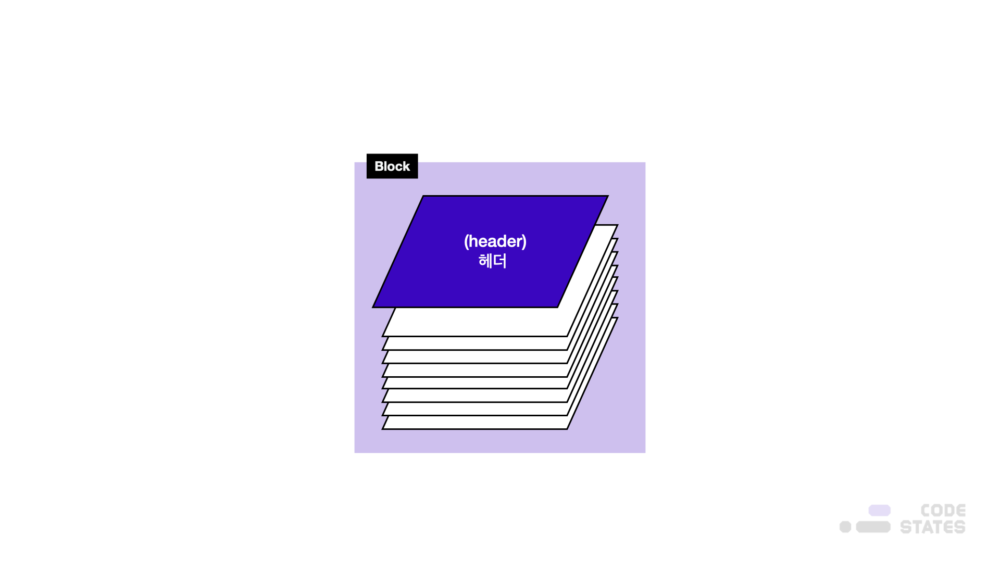  

위 그림은 비트코인이 구성하고 있는 블록체인의 구조이다.  
블록의 구조는 다음과 같이 헤더(Header), 그리고 거래로 나누어져 있다.  
 
사실 블록 구조에는 바디(Body)라는 필드는 존재하지 않는다.  
블록의 구성으로 블록 헤더 외에 블록 크기, 거래 개수도 있으며,  
거래를 담은 부분을 주로 바디라고 칭하며 실제로 대부분의 크기를 차지한다.  
 
블록체인이 왜 체인인지, 즉 암호화되어 있다고 하는지는, 헤더를 보면 알 수 있다.  

---

## Header
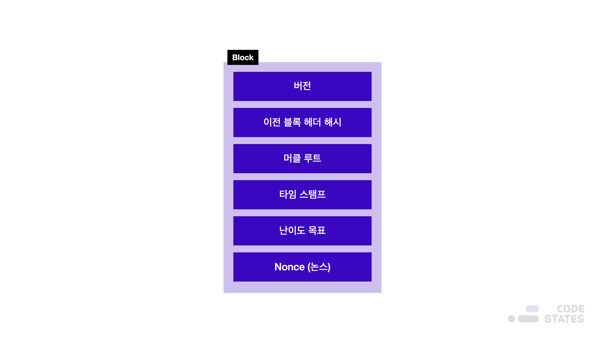  

1. **버전(Version)**  
비트코인의 어떤 버전을 쓰고 있는지를 표기한다.  
이는 소프트웨어 프로토콜 업그레이드 추적을 위한 버전 번호이기도 하다.  
2. **이전 블록 헤더 해시**  
이는 블록체인을 체인으로 만드는 중요한 개념이다.  
재밌는 사실은 블록 해시라고 많이 칭하지만, 실제로 블록 전체가 아닌 헤더를 해시한다.  
 
이 블록 해시는 현재 블록의 해시를 담지 않아 오해를 바로잡기 위해, 이전 블록 헤더 해시라고 명시했다.  
즉, N 번째 블록을 채굴하려는 노드가 N-1 번째 블록을 전송받았을 때,  
바로 이전 블록(N-1 번째 블록)에 대한 헤더 해시를 직접 계산(정확히는 2번 해시)하여, 헤더에 넣는다는 뜻이다.  
3. **타임스탬프**  
유닉스 타임(1970년 1월 1일) 기준으로 초 단위 해당 블록 채굴 시각을 기록한다.  
4. **머클 트리 (Merkle Tree)**  
머클 트리는 블록체인 내의 각각의 블록에 존재하는 트리이다.  

실제 비트코인 블록을 통해 알아보자.  

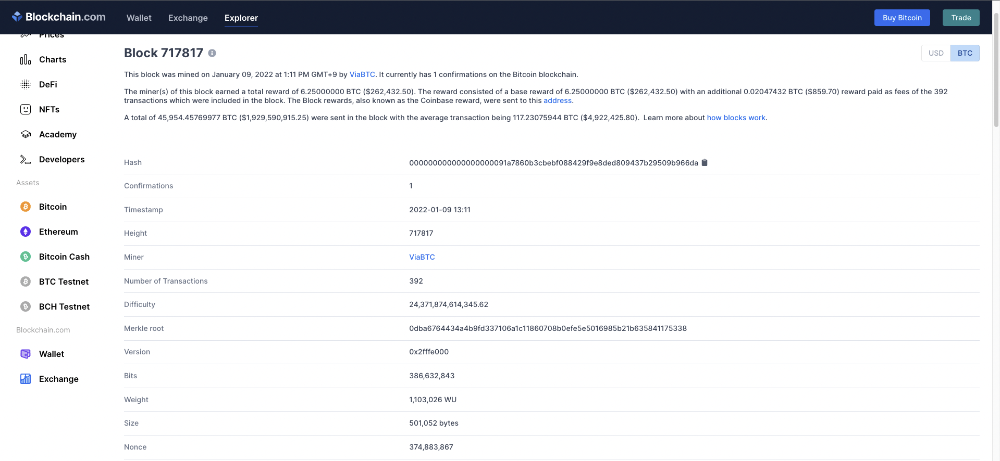  
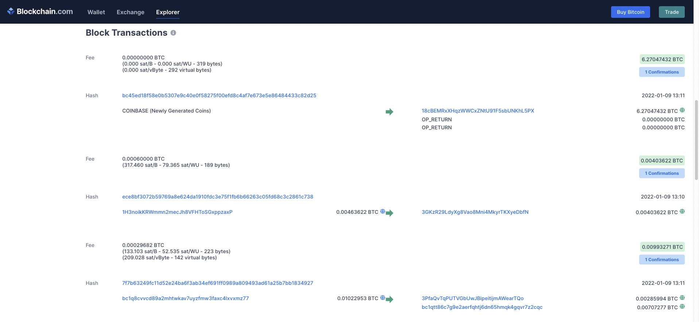  
위의 두 사진은 최근 생성된 블록 정보이다.  

## Merkle Tree
트랜잭션의 수를 보면 392개임을 알 수 있는데,
머클 트리는 392개의 Tx들을 각각 해싱하여 2개씩 짝을 짓고, 해싱하고, 이를 반복하여 최종적으로 하나 해시값이 남을 때까지 해싱을 반복하는 트리 구조이다.  
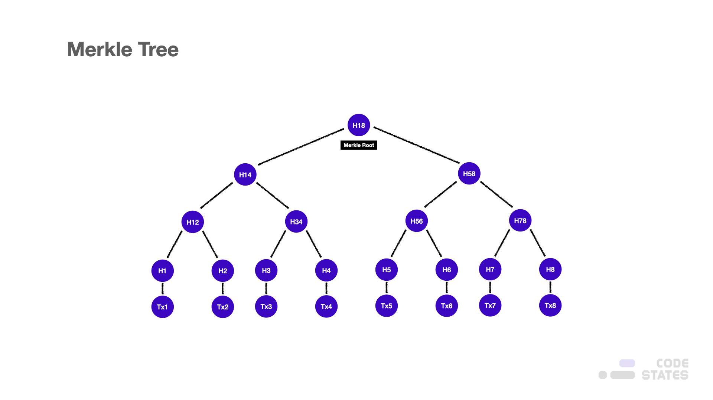  
위의 그림은 머클 트리를 나타내고 있다.  
 
Tx는 트랜잭션 번호를 의미하고 있고, Hxy는 Tx의 x번부터 y번까지 해싱한 것을 의미한다.  
즉, 머클 트리를 구성하는 과정은 다음과 같다.  

1. 최초 데이터(트랜잭션)를 SHA256 형태의 해시값으로 변환한다.  
2. 가장 가까운 노드 2개를 한 쌍으로 묶어 합친 후 해시값으로 변환한다.  
3. 계속해서 해시값으로 변환하여 마지막 하나가 남을 때까지 이 과정을 반복한다.  

여기서 알 수 있는 것은,  
H18이 머클 루트가 되고, 제일 위의 사진에서 블록 #717817의 머클 루트는,  
392개의 모든 거래를 합친 해시값이 된다는 것이다.  

### Why Merkle Tree?
라이트 노드들은 블록체인을 전부 다운로드할 여유가 없다.  
왜냐하면, 블록체인 네트워크 정보를 모두 다운로드하면 약 130GB 정도이기 때문이다.  
따라서 최소한의 정보로 인증할 방법이 필요하다.  
 
라이트 노드들은 거래정보, 머클 트리 같은 정보들을 하나도 가지지 않고 머클루트 값만 가지고 있다.  
만약 이 방법으로 블록이나 거래의 유효성을 검사할 수 있다면,  
거래가 100건이든 1,000건이든 최종적으로 라이트 노드가 가지는 요약본은 항상 64자로 일정합니다.  
> 위의 사진에서 머클 루트는 `0dba6764434a4b9fd337106a1c11860708b0efe5e5016985b21b635841175338`로써 64자이다.  

이렇게 용량을 줄이면 다양한 디바이스들의 참여가 가능해지기에,  
블록체인 네트워크가 더 견고해질 수 있다.  
> ex: 용량이 크지 않은 태블릿 PC, 스마트폰 등등  

그리고 머클루트만 있다면 다양한 검증을 빠르고 확실하게 할 수 있다.  
그 이유는 머클트리 자체가 해시로 이루어져 있기 때문에,  
하나의 트랜잭션 혹은 블록 내 필드 값이 변조되면 머클루트 해시값이 변조되기 때문이다.  
 
따라서 이를 통해 잘못된 해시값이 검출되면,  
해당 블록을 거부할 수 있게 되고, 블록체인 네트워크를 계속해서 안정적으로 유지할 수 있다.  
 
아래 그림을 보면 하나의 트랜잭션이 변조되면 머클 루트까지 모든 값이 바뀌게 됨을 알 수 있다.  

> 이러한 현상을 [쇄도 효과(Avalanche Effect)](https://ko.wikipedia.org/wiki/%EC%87%84%EB%8F%84_%ED%9A%A8%EA%B3%BC)라고 한다.  

  
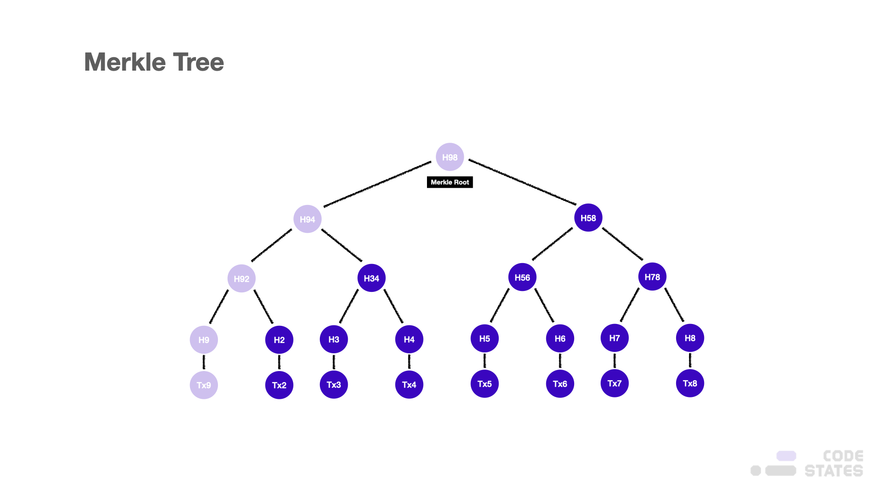  

---

### Merkle Path and Merkle Root
머클 루트를 이용하여 우리는 블록이 가짜 블록인지 진짜 블록인지 판단하기는 쉽다는 것을 알았다.  
해당하는 블록 넘버끼리 머클 루트를 비교해 보면 진짜인지 가짜인지 판단하기가 쉽기 때문이다.  
 
그런데 블록이 아니라 트랜잭션을 검증해 달라고 하면 말이 조금 달라진다.  
머클 루트 해시는 가지고 있으나 개별적인 트랜잭션 해시값들은 없기 때문이다.  
 
하지만 우리는 풀 노드(Full Node)에게 머클 경로를 받음으로써 검증을 쉽게 할 수 있다.  
아래 그림을 살펴보자.  
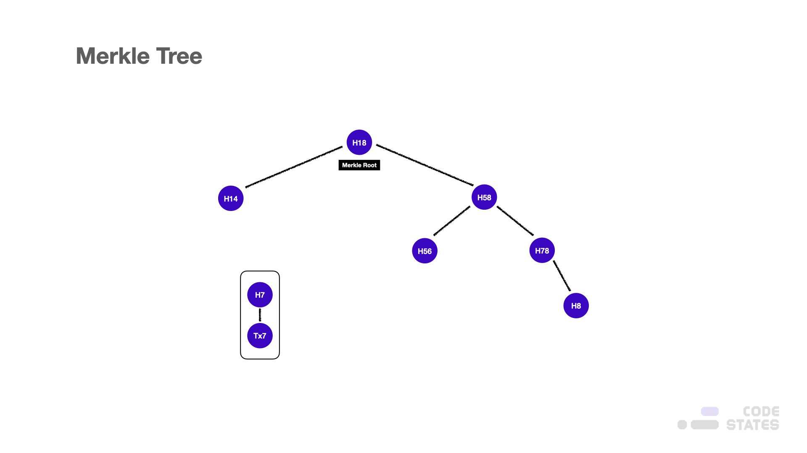  
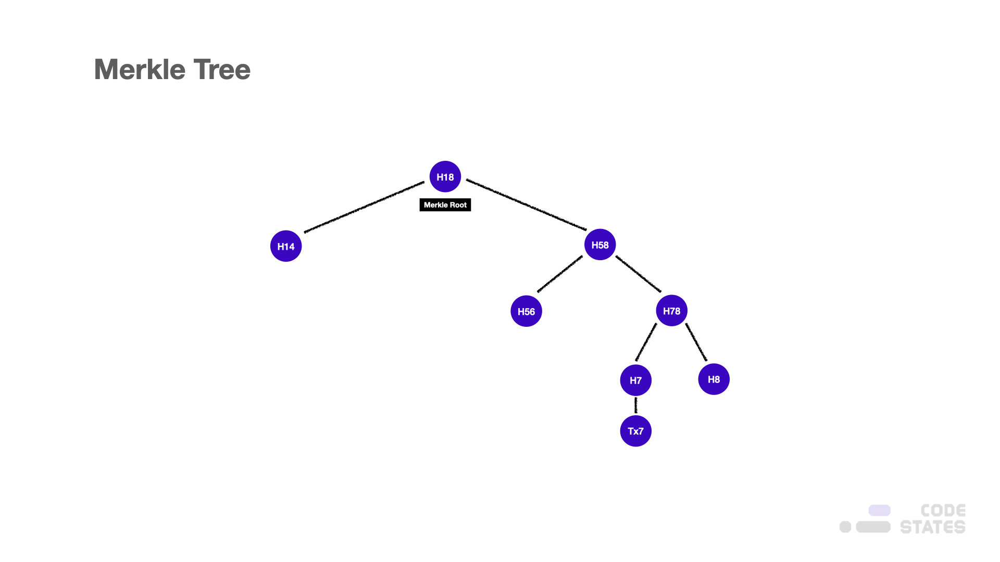  
우리는 Tx7 트랜잭션이 올바른 트랜잭션인지 알고 싶은 상황이다.  
 
그때 풀 노드에게 머클 경로를 요청하면, 첫 번째 사진과 같이 경로를 알려준다.  
 
이때, 모든 머클트리를 받지 않고도, 손쉽게 Tx7의 해시값을 이용하여, 머클 경로를 따라가다 보면,  
머클 루트와 결과값이 같은지 알 수 있다.  
결과값이 다르다면, 해당 트랜잭션은 유효하지 않은 트랜잭션임을 검증할 수 있다.  

---

### Time Complexity
데이터의 유효성 검증을 시간복잡도 O(log_2N) 만에 할 수 있기 때문에 머클트리는 중요하게 여겨진다.  
모든 데이터를 가지고 있지 않아도 머클루트와 머클경로로 무결성 검사를 할 수 있다. (용량 절감)  

---

## Difficulty Bit
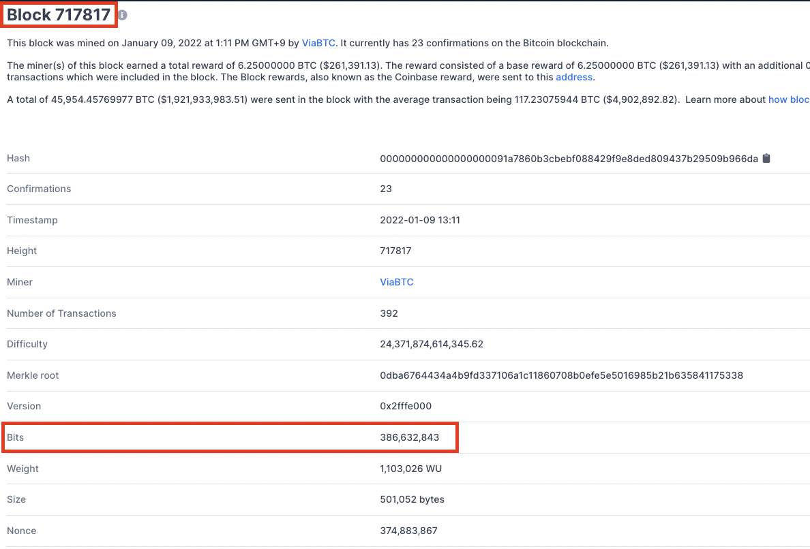  
위 사진에 나온 Difficulty(난이도)와 Bits (난이도 비트)에 대해 살펴보자.  
> 해당 내용은 약간의 수학적인 계산이 들어가므로,  
> 기본적인 개념을 살펴본 이후에 계산 과정은 스킵해도 괜찮다.  

먼저 사진 속 Difficulty는 위에서 말한 난이도를 표기한 형태이다.  
> 야기이ㅐ겨이ㅕ기여기
이는 해당 블록을 채굴할 때의 난이도를 의미하며, 해당 숫자는 블록의 높이에 따라 자동 설정이 됩니다. 왜 자동 설정이 되는지, 어떠한 방식으로 설정이 이루어지는지는 후반부에 설명이 이어질 예정입니다.

블록을 생성할 때는 해당 난이도에 맞는 목표값이 존재하며 그 목표값을 ‘Bits’로 표기합니다. 이 수는 계수와 지수로 이루어져 있습니다.

해당 숫자에 대한 의문이 드는 분들을 위해 수학적인 계산을 이어 나가 보겠습니다. 16진법 계산기를 이용하여 직접 계산하면서 비교해 보면 더욱 이해하기 편하실 겁니다.

먼저 난이도와 목표값의 관계에 대해 의문이 들 텐데, 이 둘 사이의 공식은 다음과 같습니다.

Difficulty = MAX_TARGET / current_target

MAX_TARGET은 첫 난이도로서 비트코인 블록체인이 처음 구동될 때 설정된 난이도 값으로 값 1을 의미하며, 4바이트로 ‘1d00ffff’라고 표기되었습니다.
채굴은 목표값보다 작은 해시값을 찾는 과정입니다. 그렇다면 current_target(목표값), 즉 bits는 해시값과의 비교를 위해 어떻게 계산될까요?

위 그림1, 2를 예로 들어보겠습니다.

bits값인 386,632,843을 16진법으로 변환하면 0x170b8c8b의 값이 나옵니다. bits는 지수와 계수로 표기된다고 설명했었는데, 첫 1바이트는 지수, 이후 3바이트는 계수가 됩니다. 즉, 해당 bits의 0x17은 지수, 0x0b8c8b 계수가 됩니다. (0x는 16진법을 의미합니다.)

이는 다음과 같은 특정식을 통해 해시값과 비교할 수 있는 목표값 형태가 나옵니다.

목표값 (target) = 계수 2 ^( 8 (지수 — 3) )

해당 값을 대입하면 0x0b8c8b * 2 ^ (0x08 * (0x17–0x03))이 되고, 이를 10진법으로 변환하면 756875 * 2 ^( 8 * (23–3) )= 1.106174051754828e.54의 값이 나옵니다. (e는 매우 크거나 작은 수를 부동 소수점으로 표현할 때 사용하는 값입니다. e.54는 10의 54승을 의미합니다) 이때 해당 결과값을 다시 16진법으로 변환할 때 아래의 비교 가능한 목표 해시값이 나오게 됩니다.

0x0000 0000 0000 0000 000b 8c8b 0000 0000 0000 0000 0000 0000 0000 0000 0000 0000

여기서 블록 7178의 실제 해시값을 보았을 때

0x0000 0000 0000 0000 0009 1a78 60b3 cbeb f088 429f 9e8d ed80 9437 b295 09b9 66da인 값은
0x0000 0000 0000 0000 000b 8c8b 0000 0000 0000 0000 0000 0000 0000 0000 0000 0000인 목표값보다 작음을 확인할 수 있습니다.

난이도의 상승 또한 다른 블록을 통해 확인할 수 있으며, 실제 277316번째 블록의 목표값은 다음과 같습니다.
0x0000 0000 0000 003A 30C0 0000 0000 0000 0000 0000 0000 0000 0000 0000 0000 0000

0x0000 0000 0000 0000 000b 8c8b 0000 0000 0000 0000 0000 0000 0000 0000 0000 0000의 목표값을 가지는 717817번째와 비교를 했을 때, 최근 블록인 717817번째 목표값의 앞자리 0의 숫자가 더 긴 것을 확인할 수 있습니다.
이는 목표값이 더 낮아졌음을 의미하며, 목표값보다 낮은 값을 찾는 난이도가 높아졌음을 의미합니다.

특정 길이의 공간에서 앞자리의 0의 숫자(Leading Zeros)가 길수록 난이도는 높다고 표현할 수 있습니다. 0의 숫자를 1비트 증가시킬 때마다 검색 공간은 반으로 줄어들기 때문입니다.
즉, 해시를 통해 나올 수 있는 결과값은 무수히 많은 경우의 수를 가지지만, 난이도가 높을수록 작은 숫자(목표값)보다 작은 값을 찾는 과정이 어렵게 됩니다. 이를 비유로 설명해 보자면, 방 안(256비트의 해시 결과값 공간)에서 침대보다 작은 물건 찾기(난이도가 낮은, 즉 목표값이 높은 값)보다 양말보다 작은 물건 찾기(난이도가 높은, 즉, 목표값이 낮은)가 어렵습니다.

결국 채굴은 목표값보다 낮은 현재 블록 헤더 해시값을 찾는 과정으로 설명할 수 있습니다. 블록 헤더 해시는 해시값이기 때문에 입력값에 비례하여 점진적으로 작아지거나 커지는 형태가 아닌 무작위의 결과값을 갖는다는 사실을 인지하면, 채굴이 왜 어려운지 그리고 왜 무작위인지 이해할 수 있습니다.

논스 (Nonce)
이 모든 랜덤한 과정에 있어서 유일하게 변하는 값은 논스(Nonce)입니다. 논스는 한 번만 쓰이는 숫자이며 Number + Once라고 생각하면 더 쉽게 이해할 수 있을 것입니다. 논스는 0부터 시작하여 무수히 많은 숫자까지 증가시키며 목표값보다 낮은 해시 결과값을 찾도록 쓰이며, 결국 모든 채굴의 과정은 논스로 인해 좌지우지되게 됩니다.

논스를 제외한 헤더의 구조를 살펴봤을 때, 모든 것은 주어져 있다고 볼 수 있습니다. 버전과 타임스탬프는 채굴하는 순간의 값이며, 난이도 비트는 자동으로 설정되어 있습니다. 이외에 이전 블록 헤더 해시와 머클 루트는 단순 계산으로 구할 수 있습니다.

채굴자들은 채굴하고자 하는 블록을 위해 우선 바디(트랜잭션)를 준비해 놓습니다. 그리고 어떤 노드에 의해 이전 블록이 완성되어 전달받으면, 해당 블록 헤더 해시를 계산하여 논스를 제외한 헤더의 모든 값을 준비하게 됩니다.
논스만 바꿔주면 되는데 채굴이 간단한 것 아니냐고 생각할 수 있지만 한 글자의 차이도 완전히 다른 결과값을 만들어내는 해시의 특성을 생각하면 논스의 중요성을 알 수 있습니다. 또한 난이도가 매우 높더라도, 목표값 이하를 만족시키는 해시를 찾기 위한 논스가 단 두 번 만에, 2와 같은 매우 낮은 숫자에도 채굴이 성공할 수 있다는 것을 알 수 있습니다. 여기서 확률이 매우 낮다는 사실을 인지했다면 채굴을 정확히 이해했다고 볼 수 있습니다.

지금까지 블록의 구조를 살펴볼 수 있었고 그에 따라 채굴의 원리를 좀 더 정확히 알아봤습니다.
이 채굴의 원리를 이해하는 과정에서 다음과 같은 의문 사항이 들 수도 있습니다.

난이도는 항상 일정한가? 그러면 해시 파워(채굴 능력)가 세질수록 블록이 점점 빠르게 생성될 수 있고 결국 1초 만에 블록이 형성될 수 있는 것 아닌가?

그러한 우려로 사토시 나카모토는 난이도가 자동 조절이 가능하도록 설계했습니다. 사토시 나카모토는 10분에 블록 1개가 적정한 난이도가 되어야 한다고 생각하였고, 그에 맞춰 난이도 조절이 자동으로 진행되도록 만들었습니다. 아직도 왜 10분인지 명확하게 밝히진 않았지만, 이는 목표일 뿐 그보다 작은 시간에 블록이 형성된다면 거래는 정상적으로 이루어집니다.

10분보다 짧은 시간이 소요된다면 정산 시간은 짧아지지만, 포크(Fork)가 자주 발생할 것이고, 이와 반대로 10분보다 긴 시간이 소요된다면 분기는 줄어들지만, 거래가 블록에 담길 때까지 시간이 오래 걸리게 되어 거래 정산 시간이 길어지게 됩니다. 이에 적당한 시간을 10분으로 생각해 설정하였고 그를 위한 난이도 조절 방법은 다음과 같습니다.

Next Difficulty = current difficulty * 2 weeks / T ( Time in which previous 2016 blocks found)

비트코인은 2,016개의 블록을 주기로, 이전 주기에서 2,016개의 블록이 형성될 때까지의 시간을 체크하여 새로운 난이도를 조정합니다. 예를 들어 2,016개의 블록이 형성될 때까지 블록 1개 생성당 평균 5분이 걸렸다면 난이도가 높아지고, 15분이 걸렸다면 난이도가 낮아지는 방식입니다. 즉 난이도 조절은 각각의 목표값이 낮아지고, 높아지게 형성하는 것으로 이루어집니다.

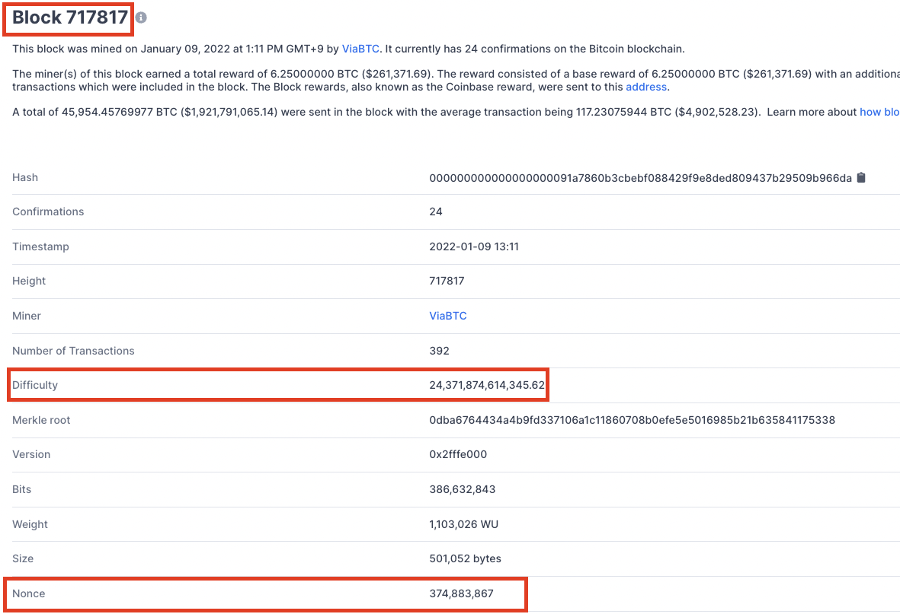  
[노드 & 비트코인 블록 구조 2-그림. 2] 717817번째 블록

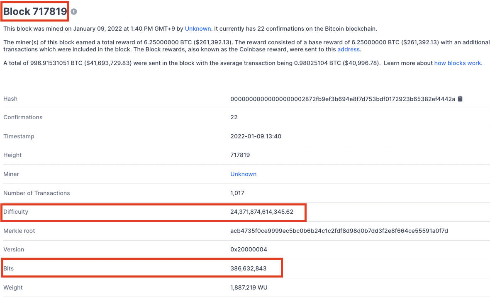  
[노드 & 비트코인 블록 구조 2-그림. 3] 717819번째 블록

사진 속 난이도는 해당 블록에 맞게 설정된 난이도로서, 이전 블록과 이후 생기는 블록에도 같은 난이도 값이 들어가 있음을 확인할 수 있습니다. 즉, 새로 난이도가 조정되기 전까지 같은 값으로 유지가 되고 있다는 것을 그림으로 확인할 수 있습니다.

