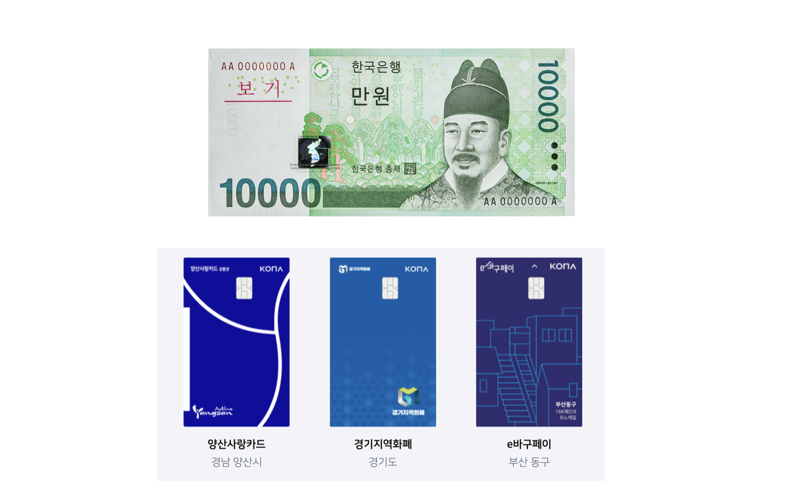
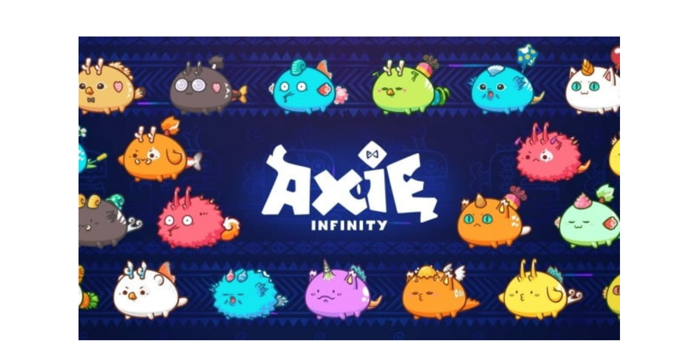
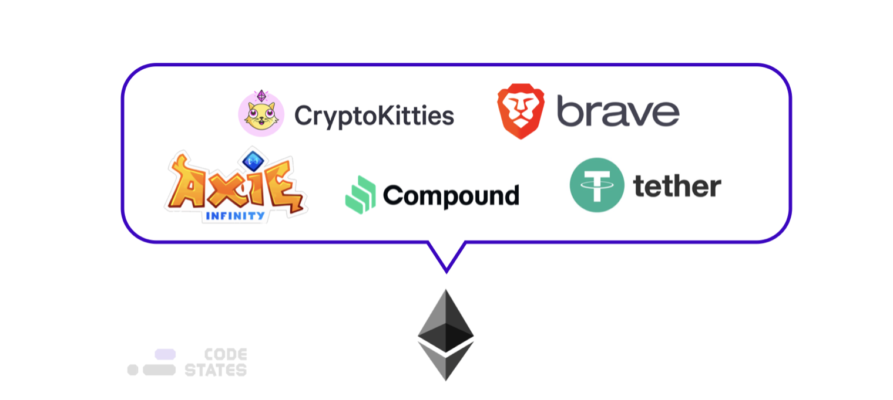

> 본 글은 Codestates BEB 코스의 자료에서 내용을 가져와 작성하였음을 알립니다.  

# Read Me
블록체인을 공부하다 보면, '코인' 또는 '토큰'이라는 단어를 자주 접하게 된다.  
또 우리가 암호화폐에 투자한다고 햇을 때 다음과 같은 말을 듣기도 한다.  
> 'OO 코인에 투자했다', 'OO 토큰의 가치가 올랐다'  

그렇다면, 코인과 토큰은 무슨 차이가 있을까?

---

## Generating Tokens _ Smart Contract
코인과 토큰의 차이를 살펴보기에 앞서, 토큰이 어떻게 발행되는지 간단하게 확인해보자.  
이더리움 블록체인은 비트코인과 다르게, 단순히 코인을 주고받는 것 이외에 아래와 같은 다양항 행위를 할 수도 있다.  

- 토큰의 발행
- 특정 조건을 만족했을 때, 토큰 전송  

그렇다면 이더리움은 어떻게 위와 같은 기능을 구현할까?  
<br>
이더리움의 **스마트 컨트랙트(Smart Contract)** 기능을 사용해 새로운 토큰을 발행하거나, 조건을 걸어 전송할 수 있다.  
스마트 컨트랙트는 이름처럼, **계약서**이다.  
<br>
일반적으로 계약서에는, "계약의 당사자", "계약의 조건", 그리고 "조건을 만족했을 때의 이행해야할 일" 등이 적혀 있다.  
스마트 컨트랙트도 일반적인 계약서와 비슷한 형태를 가지고 있다.  
<br>
스마트 컨트랙트에는 계약의 주체와 조건, 행위 등이 적혀있다.  
다만, 스마트 컨트랙트는 한글이나 영와 같이 살마이 해석하는 방식으로 작성되어있지 않고,  
기계가 해석하고 읽을 수 있는 **프로그래밍 언어**로 적혀있다.  

> 이더리움과 클레이튼에서는 `Solidity`라는 프로그래밍 언어를 사용해 스마트 컨트랙트를 작성할 수 있다.  

프로그램이 언어로 적힌 스마트 컨트랙트를 이더리움 네트워크에 배포하면,  
**누구든지 이 스마트 컨트랙트에 접근하여 함수를 실행할 수 있다.**  
<br>
가령, 토큰을 발행한다면 다음과 같이 컨트랙트를 작성할 수 있다.  

```python
contract CozToken {
    constructor() {
        _name = "CosToken";
        _totalSupply = 10000000 * E18;
        _balances[msg.sender] = 1000*E18;
    }

    // ...

    function mintToken(address recipient, uint256 amount) public {
        if (msg.sender == isOwener()) {
            return _mint(address recipient, uint256 amount);
        }
    }

    // ...
}
```
CozToken 컨트랙트를 배포하면 `constructor`함수가 실행되면서, CozToken이 생겨난다.  
또한 토큰의 총 발행량 `_totalSupply`이 정해지고, `_balances` 변수에 누가 토큰을 얼마나 가졌는지 저장한다.  
<br>
누군가가 `CozToken` 컨트랙트의 `mintToken`함수를 실행한다면,  
`if`문을 통해 해당 계약서의 조건을 확인한다.  
그리고 게약의 조건이 충족되어 `if`문을 통과할 수 있다면, `_mint`함수를 실행하여 토큰을 발행해준다.  

---

## Coins vs Tokens
코인과 토큰은 **독립된 블록체인 네트워크를 소유하고 있는지 (자체 메인넷을 가지고 있는지)**에 따라 나뉜다.  

||**코인**|**토큰**|
|:---:|:---:|:---:|
|발행하는 곳|블록체인 네트워크에서 발행한다.<br>따라서 코인은 독립된 블록체인 네트워크를 가진다.|특정 플랫폼에서 스마트 컨트랙트를 통해 발행한다.|
|특징|메인넷이 존재한다<br>채굴에 대한 보상으로 발행한다.|특정 메인넷에 기생하여 특정 목적을 위해 발급한다.|
|목적|채굴에 대한 보상<br>블록체인 생태계 활성화|서비스 플랫폼 생태계 활성화|

---

### Example
법정화페와 지역화폐로 예를 들어보자.  
  
한국의 법정 화폐는 대한민국 중앙은행인 `한국은행`에서 발행하는 화폐이다.  
이 화폐는 대한민국 어디에선 법적으로 화폐로 인정된다.  
즉, 대한민국 영토에 있다면, 법적인 지지가 보장된다.  
<br>
반면 지역화폐는 대한민국의 특정 지역 내에서, 특정 구성원들이 유통하는 화폐를 의미한다.  
따라서 지역이나 구성원 등, **특정 조건을 만족할 때만 사용할 수 있는 화폐**라고 할 수 있다.  
<br>
예를 들어, 경남 양산시에서 발행한 지역 화폐인 양산사랑카드는 양산시에 있는 가게에서만 활용할 수 있다.  
이는 양산사랑카드가 양산시의 지역 경기를 살리기 위한 목적으로 발행된, 카드형 지역화폐이기 때문이다.  
<br>
하지만 양산시에서 법정화폐를 사용하지 않는 것은 아니다.  
법정화폐를 사용하되, 특별히 양산시에서는 지역 경기를 활성화하기 위해 양산사랑카드라는 특별한 목적의 지역 화폐도 있는 것이다.  
<br>
양산시에서 양산사랑카드를 사용할 경우, 각종 할인 혜택과 소득공제를 제고아형 주민들이 지역화폐를 많이 사용하도록 유도한다.  
양산시 주민들은 이러한 혜택을 누리기 위해 양산사랑카드를 더 많이 이용하려고 할 것이다.  
지역화폐를 사용할 수록 지역 경졔가 활성화되기 때문에, 양산사랑카드의 목적을 달성하게 된다.  

---

## Coins
코인은 **블록체인 네트워크에서 발행**하는 것이다.  
가령, 비트코인 네트워크에서는 비트코인(BitCoin, BTC)을, 이더리움 네트워크에서는 이더(Ether, ETH)를 발행한다.  
그렇다면, 왜 블록체인 네트워크에서는 코인을 왜 발행할까?  
<br>
블록체인 네트워크에 있는 노드들이 트랜잭션을 공유하고 합의에 도달하기 위해서는 **채굴(Mining)**이 필요하기 때문이다.  
누군가는 네트워크에서 채굴을 해야 블록체인에 트랜잭션이 올라가 기록될 수 있다.  
따라서 채굴을 블록체인 네트워크를 활성화하는 필수 불가결한 과정이다.  
<br>
비트코인에서는 채굴을 하고자 하는 노드 중, 가장 먼저 퀴즈를 푸는 노드가 채굴을 할 수 있다.  
이더리움의 경우, 네트워크에 가장 많은 코인을 예치(Staking)한 노드가 채굴을 할 수 있다.  
<br>
비트코인에서 채굴을 하기 위해서는 엄청난 양의 컴퓨팅 자원을 소모하며,  
이더리움에서 채굴을 할 때는 많은 코인을 네트워크에 묶어두어야 한다.  
따라서 채굴 행위를 통해 생태계에 기여한 노드에게 보상을 제공해야 한다.  
<br>
보상을 제공한다고 하면, 현금을 주거나, 그에 상응하는 가치를 지닌 재화를 주는 것이 일반적이다.  
블록체인 네트워크에서는 해당 네트워크에서 자체적으로 생산하고 사용하는 **코인**을 발행함으로써,  
**채굴 노드에게 보상을 지급**한다.  
블록체인 네트워크상에서 채굴을 목적으로 발행되는 코인이 해당 네트워크의 기축통화 역할을 한다.  

---

## Tokens
반면, **토큰**은 **특정 블록체인 네트워크 위에서 특별한 목적을 가지고 발행**된다.  

---

### Example
액시 인피니티를 예로 들어본다.  
  
<br>
액시 인피니티는 액시(Axie)라는 용 캐릭터를 수집하여 전투를 펼치는 게임이다.  
액시 인피니티의 재화는 `AXS(Axie Infinity Shard)`, `SLP(Smooth Love Potion)`를 사용한다.  
> AXS, SLP는 토큰이다.

액시 인피니티에서 전투에 이기기 위해서는 강력한 액시를 전투에 추가해야한다.  
이를 위해 액시 인피니티에서는 자신이 가지고 있는 두 액시를 교배하여 새로운 액시를 만들 수 있다.  
교배할 때는 액시 두 개와 일정량의 SLP, 그리고 수수료로 약간의 AXS를 필요로 한다.  
<br>
또한 교배를 통해 강력한 액시를 얻어 시즌 상위 200위 안에 들어가면 AXS를 받을 수 있다.  
이 AXS는 교배 시 수수료를 낼 때 사용되거나, 커뮤니티 거버넌스에서 투표를 진행할 때 투표권으로 사용할 수도 있다.  
<br>
결국, 강력한 액시를 얻어 전투에 많이 승리할 수록 액시 인피니티 커뮤니티에 행사할 수 있는 영향력도 커지는 것이다.  
또한 액시 인피니티 제작사인 `Sky Mavis`는 앞으로 ACS와 SLP를 사용할 수 있는 다양한 콘텐츠를 추가할 예정이라 밝혔다.  

---

#### Difference
메소나 골드처럼 SLP와 AXS도 결국 게임 내 콘텐츠를 즐기기 위해 필요하다는 점에서는 동일한 역할을 한다.  
그러나 SLP와 AXS는 여타 다른 게임 내 재화와는 다른 점이 있다.  
<br>
메소나 골드는 해당 게임 서버에서 그 발행량이나 발행 방식을 임의로 조절할 수 있다.  
해당 재화를 발행하는 주체가 게임사이기 때문이다.  
따라서 게임사에서 부당한 방식으로도 메소나 골드를 특정 사용자에게만 제공할 수 있다.  
<br>
반면 AXS나 SLP는 이더리움 블록체인 상에엇 발행되는 토큰이다.  
따라서 AXS와 SLP는 다른 게임 내 재화처럼 게임사에서 재화를 발행하는 것이 아니라,  
**액시 인피니티의 토큰 컨트랙트에 적힌 조건에 따라서만 제공**할 수 있다.  
<br>
왜냐하면, AXS와 SLP는 액시 인피니티라는 플랫폼의 **생태계를 활성화하는 목적**으로,  
**이더리움 네트워크에 스마트 컨트랙트를 사용해 발행된 토큰**이기 떄문이다.  
<br>
유저가 전투에서 승리하면, 액시 인피니티 게임 서버는 스마트 컨트랙트 함수를 실행한다.  
컨트랙트에서는 유저에게 지급해야하는 SLP의 양을 계산해서 유저에게 지급한다.  
그리고 "A유저가 전투에서 승리하여 n SLP를 지급함"이라는 내용의 트랜잭션을 이더리움 네트워크에 올린다.  
<br>
액시 인피니티 게임사는 스마트 컨트랙트를 수정할 수는 없기 떄문에,  
스마트 컨트랙트에서 계산하는 SLP의 양을 임의로 조작할 수 없다.  

> 액시 인피니티는 이더리움을 메인으로, 확장성을 위해 이더리움의 사이드 체인으로 로닌 네트워크를 사용한다.  

---

#### Further Study
- AXS와 SLP의 차이는? 
- 액시 인피니티의 Multi-token economy의 형태는?

---

### Etherium Tokens
오늘날, 다양한 web3 플랫폼들이 블록체인 네트워크 위에서 스마트 컨트랙트를 사용해 서비스를 제공한다.  
  

**이더리움 네트워크 기반 토큰을 발행하는 플랫폼**  
- **CryptoKitties**  
고양이 캐릭터 토큰을 발행하여 육성하는 게임 플랫폼  
- **Brave Browser**  
브레이브 브라우저는 웹사이트 트래커와 광고를 차단하여 사용자의 개인정보를 보호하는 데 초점을 두는 크롬 기반 브라우저이다.  
기존의 `알파벳`, `메타`등 거대 플랫폼들은 사용자아게 서비스를 제공하는 대가로 개인정보를 수집하여, 맞춤형 광고를 게시해 수익을 창출했다.  
그러나 브레이브 브라우저는 사용자의 개인정보를 보호하고, 반대로 사용자에게 광고를 볼 것인지 선택권을 주고,  
광고를 보는 경우, 브레이브 소프트웨어에서 발행하는 BAT(Basic Attention Token)을 제공한다.  
- **Compound**  
컴파운드는 사용자들이 암호화폐 유동성 풀을 만들어, 유동성 풀 내에 있는 암호화폐를 빌려주는 대출 플랫폼이다.  
컴파운드에서 예치한 금액에 비례하게 COMP 토큰을 발행한다.  
- **Tether**  
테더는 토큰 하나당 1달러의 가격에 맞게 고정된 토큰이다.  
이렇게, 특정 법정화폐의 가격과 동일한 가치를 가지는 토큰을 `Stable Coin`이라 한다.  

---

## Further Study
- 비트코인
- 솔라나
- 클레이튼
