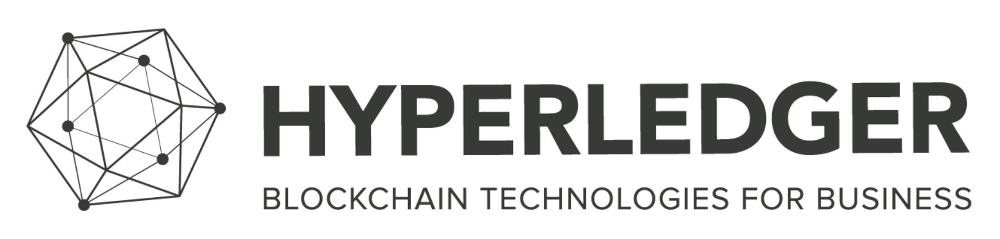

> 본 글은 Codestates BEB 코스의 자료에서 내용을 가져와 작성하였음을 알립니다.  

# Cryptocurrency with Compromised Decentralization

---

## READ ME
트릴레마를 극복하기 위한 시도는 아직 초기 단계이다.  
따라서 생각지 못한 문제와 개선의 여지가 많을 수밖에 없다.  

> 이더리움에서 확장성을 개선하는 목적으로 만들어진 오프체인들은,  
> 오프체인이라는 무 신뢰 환경에서 신뢰성을 확보한다는 명목으로,  
> 예치금이라는 경제적 가치를 담보로 하는 경우가 다반사이다.  
>  
> 그러나 예치금을 금전적 또는 스마트 컨트랙트 형태로 거래하는 매 순간 예치하는 것이 가능할지,  
> 그 예치금의 강제집행 등 소요되는 리소스의 수수료를, 참여자들 사이에서 정의하고 어느 정도 범위에서 제한할 것인지 등에 대한 부분은, 아직 제대로 논의조차 되지 않고 있다.  
> 한마디로 개념만 있는 수준이거나 상용화되기에는 아직 갈 길이 멀다.  

---

## EOS
  
 
3세대 플랫폼 EOS는 이더리움과는 다른 방향으로 확장성 문제를 극복하려고 한다.  
이오스는 불특정 다수의 합의 노드 참여를 제한하는 위임지분증명(DPoS) 합의 알고리즘을 채택하여 탈중앙화와 확장성 문제를 해결하려고 한다.  
 
위임지분증명방식은 전체 코인 보유자들이 21명의 블록 생성자(BP)를 선출한 후,  
그들에게 블록체인의 운영을 맡기는 방식이다.  
 
이는 각 노드가 가진 이오스 코인에 대한 지분 투표를 통해 대표 노드에게 위임함으로써,  
민주적인 의사결정 시스템을 가진다는 점과 대표 노드를 견제할 수 있다는 점에서 탈중앙화를 추구한다고 볼 수 있다.  
 
전체 노드가 아닌, 선출된 21개의 노드에서만 거래를 검증하면 더욱 빠른 연산이 가능하다.  
전체 네트워크로부터 합의하는 방식이 아니라,  
선출된 21명의 대표 노드만 합의 과정에 참여시킴으로써 트랜잭션 처리 속도, 즉 확장성 문제의 해결을 추구한다.  
 
이더리움이 확장성 문제를 정공법으로 풀고자 시도하는 것이라면,  
EOS는 확장성 확보를 위해, 불특정 다수의 합의 과정을 통한 탈중앙화에 타협하고, 투표라는 방식을 통해 간접적으로 탈중앙화를 달성한다고 볼 수 있다.  

---

하지만 이오스 역시 블록체인의 트릴레마 문제를 겪고 있다.
 
노드의 개수가 소수(21개)라는 것은 블록 생성 시간을 단축하고, 트랜잭션 속도를 높이지만,  
이는 탈중앙화라는 가치에서 벗어날 수 있다.  
 
소수의 노드만이 블록 생성에 대한 보상인 이오스를 독점하며 이오스가 투표권을 가지고 있는 경우,  
블록 생성자의 권한은 시간이 지날수록 급격히 성장할 것이다.  
따라서 이오스의 확장성이 아무리 좋더라도, 이오스는 블록체인의 탈중앙화에서 벗어났다고 볼 수 있다.  
 
그리고 보안 또한 문제가 될 수 있는데,  
비트코인과 이더리움의 경우, 다수의 노드를 공격하는 것이 어려워 높은 보안성을 가지고 있다.  
그러나 이오스의 경우 소수의 노드가 블록을 생성하기 때문에 노드에 대한 공격이 쉬워져 보안이 떨어진다.  

> [탈중앙화를 벗어날 수 있는 사례](https://dealsite.co.kr/articles/17675)  

---

## Hyperledger

  

---

### Background

비트코인과 같은 퍼블릭 블록체인 모델은 누구나 참여할 수 있다.  
그러나 이후 참여자를 제한하는, 새로운 모델로 프라이빗 블록체인이 등장했다.  
프라이빗 블록체인의 대표주자인 `하이퍼레저`는 **기업용(Enterprise Version) 블록체인 기술 개발을 위한 오픈소스 프로젝트**이다.  
 
하이퍼레저의 합의 과정에 참여하려면, 사전 승인이 필요하다.  
그 과정에서 신원이 모두 밝혀져서 익명성도 없고, 시스템 전체를 관리하는 중앙관리 주체가 존재하며, 이 주체가 참가자의 범위를 결정한다.  
 
특정 그룹 내에서 사전 합의에 따라 쓰기(Write) 권한을 가지는 컨소시엄 블록체인도 비슷한 형태이다.  
프라이빗 블록체인과 컨소시엄 블록체인을 합쳐서 허가형(permissioned) 블록체인이라고도 부른다.  
 
프라이빗 블록체인은 미리 참가자를 제한하고, 신뢰할 수 있는 참가자끼리 거래를 승인한다.  
합의 역시 퍼블릭 블록체인에 비해 간단하며 네트워크 운영에 대한 보상도 필요 없다.  
 
따라서 프라이빗 블록체인은 정보를 공개하지 않고 빠른 처리 속도가 중요한 기업을 중심으로 개발되고 있으며,  
높은 수준의 보안성이 필요한 정부에서도 프라이빗 블록체인 형태로 블록체인을 도입하려고 한다.  
 
많은 블록체인에서 높은 보안 성능을 유지하고 확장성 문제를 해결하기 위해 탈중앙화 요소와 타협하기도 합니다.  
 
탈중앙화 요소에 타협한다는 것은 무슨 의미일까?  
일반적인 퍼블릭 블록체인에서는 모든 노드가 채굴 과정에 참여할 수 있다.  
 
이렇게 완전히 네트워크 참여자의 자율에 맡기는 채굴 방식 대신,  
처음부터 채굴 노드의 수를 제한해서 극적인 성능 향상을 달성하는 것이다.  
 
이처럼 채굴 노드의 숫자를 처음부터 제한하면, 채굴 권력이 몇몇 노드에게 집중되기 때문에 중앙집중화된다.  
이러한 방식은 시스템에 매우 높은 가용성을 제공한다.  
 
극단적으로 생각해 보자면, 최고의 효율성을 달성하기 위해 단 한 개의 대표 노드를 선출하여 대표 노드만 블록을 생성하게 할 수도 있다.  
이렇게 된다면, 1개의 대표 노드가 블록을 생성하면 포크와 체인 재구성이 발생하지 않고, 수행 순서까지 보증하는 블록체인이 탄생할지도 모른다.  
 
이런 극단적인 예는 상상만으로 끝난 것이 아니다.  
대표적으로 기업형 블록체인(Enterprise Blockchain)을 표방하고 있는 하이퍼레저 패브릭이 합의가 아닌, 수행 순서만 보증하는 `Kafka`를 사용하고 있습니다.  

> Kafka는 메시징 시스템이다.  

---

## Hybrid and Consortium
하이브리드 블록체인과 컨소시엄 블록체인은 같은 것처럼 보일 수 있지만, 실제로는 다르다.  
컨소시엄 블록체인과 하이브리드 블록체인 모두 다른 접근 방식을 사용하며 고유한 특성이 있다.  
이러한 특성을 알면 비즈니스 또는 조직에 어떤 특성을 선택해야 하는지에 대한 지식을 갖추게 될 것이다.  

---

### Consortium Blockchain
컨소시엄 블록체인에는 네트워크를 관리하는 그룹이 있다.  
이 그룹은 블록체인의 작동 방식이나 접근 권한을 관리힌다.  
누구나 네트워크에 참여할 수 있는 퍼블릭 블록체인과는 다르게 허가받은 사용자만 네트워크에 참여할 수 있는 셈이다. 
 
이는 퍼블릭 블록체인의 ‘무허가성’과는 상충하지만, 더 빠른 트랜잭션, 높은 확장성 및 더 나은 트랜잭션 개인 정보 보호와 같은 장점이 있다.  
대표적인 컨소시엄 블록체인에는 클레이튼이 있다.

---

### Hybrid Blockchain
하이브리드 블록체인은 퍼블릭 블록체인과 프라이빗 블록체인을 합친 형태이다.  
쉽게 생각하면, 하이브리드 블록체인은 사설 네트워크에서 호스팅 되는 퍼블릭 블록체인과 같은 것이다.  
 
하이브리드 블록체인에서는 사설 네트워크를 사용하여 데이터 블록을 생성한 다음,  
데이터 프라이버시를 훼손하지 않고 해당 데이터를 공개적으로 저장하는 방식으로 작동한다.  
 
컨소시엄 블록체인과 달리 하이브리드 블록체인은 블록체인에 대한 유연한 제어를 제공한다.  
즉, 공유된 데이터에 대한 제어 정도는 컨소시엄 블록체인보다 떨어진다.  
하이브리드 블록체인의 가장 좋은 사용 사례는 확장성과 탈중앙화이다.  

---

## Wrap Up  

||**Hybrid Blockchain**|**Consortium Blockchain**|
|:---|:---|:---|
|접속 권한|일부 인스턴스는 공개, 일부는 제한|선택한 참가자만 전체 액세스 권한 획득|
|거래 속도|빠름|빠름|
|권한|부분적으로 분산|탈중앙화|
|프라이버시|부분적|부분적|
