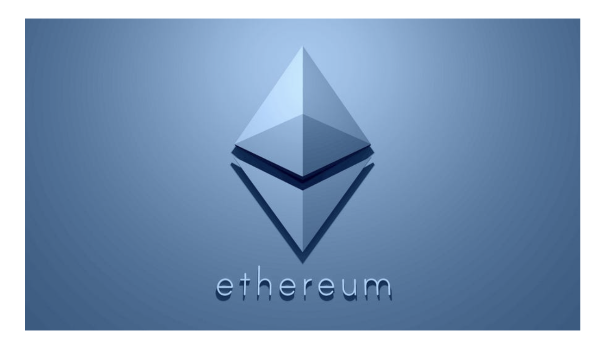

> 본 글은 Codestates BEB 코스의 자료에서 내용을 가져와 작성하였음을 알립니다. 

# Cryptocurrency with Compromised Scability

---

## READ ME
지금까지 발표된 대표적인 블록체인 플랫폼들을 트릴레마(Trilemma) 관점에서 바라보면,  
1세대, 2세대, 3세대를 거치면서 합의 알고리즘(Consensus Algorithm), 데이터구조(Ledger Data format), H/W 보완 등 다양한 접근방식을 통해 트릴레마 문제를 해결하려 노력하고 있다 볼 수 있다.  
 
이번 장에서는 블록체인 트릴레마 중에서, 확장성을 타협한 블록체인을 살펴본다.  

---

## Bitcoin
  
 
비트코인은 높은 탈중앙화와 보안을 갖추고 있다.  
그러나 확장성의 한계로 인해 트릴레마를 극복하지 못했다.  
 
비트코인은 설계부터 탈중앙화와 보안에 집중하였으며, 특히 보안 측면에서는 최고의 암호화폐라고 평가된다.  
실제로 비트코인은 암호화된 기술을 바탕으로, 서버 역할을 하는 노드들이 네트워크를 구성하고 블록체인을 검증하기 때문에 쉽게 위변조 하기 어렵다.  
 
하지만 시간이 흐름에 따라 비트코인은 점점 더 많은 사용자를 확보하게 됐고,  
자연스럽게 네트워크가 확장됨에 따라 트랜잭션 속도가 느려지는 확장성 문제가 대두되었다.
 
비트코인은 7TPS 정도의 처리 속도를 가지고 있다.  
3세대 블록체인이라고 불리는 이오스의 3,000TPS에 비하면 현저히 낮은 수치이다.  
 
비트코인 개발자들은 확장성 문제를 해결하기 위해 라이트닝 네트워크(Lightning Network)와 같은 방법을 활용하여 속도를 높이고자 했다.  
그러나 속도를 높이려고 노드의 수를 섣불리 줄이거나, 노드의 일부만 검증하는 방식을 적용하게 되면,  
네트워크 전체의 보안이 떨어지는 문제에 봉착하게 되었다.  
 
이에 비트코인은 보안을 위해 과감히 트랜잭션 속도를 포기했으며,  
지금까지도 확장성은 비트코인의 최대 단점으로 꼽히고 있다.

---

## Ethereum
  
 
비트코인의 다음 세대로 불리는 이더리움 또한 확장성 문제에 부딪혔다.  
현재 이더리움은 이더리움 플랫폼 위의 dApp 상에서 이루어지는 거래를 1초에 약 20건밖에 처리할 수 없는 속도를 가지고 있다.  
 
이를 개선하고자 이더리움의 창시자인 비탈릭 부테린(Vitalik Buterin)은 확장성 문제의 해결을 추구하는 이더리움 2.0을 발표했다.  
부테린에 따르면 이더리움 2.0은 작업증명(PoW) 방식의 대안으로 등장했으며,  
지분증명(PoS) 방식과 샤딩(Sharding) 기술을 바탕으로 실생활에서 이더리움을 사용할 수 있는 수준까지 끌어올릴 수 있다고 한다.  
 
작업증명 방식은 불필요한 전력을 낭비하고, 컴퓨팅 파워를 소모해 비용이 많이 발생하는 단점이 있다.  
이더리움은 지분증명 방식으로 합의 방식을 변경해 작업증명 방식의 단점을 극복하고,  
빠른 블록 검증과 합의가 가능하도록 개선했다.  
 
지분증명 방식은 네트워크에 암호화폐를 보관(스테이킹)하면, 보관 지분에 따라 채굴 가능성이 올라가는 방식이다.  
따라서, 채굴 과정에서 컴퓨터 연산 비용이 필요하지 않고, 블록체인 네트워크 수수료가 낮아지는 효과를 기대할 수 있다.  
 
이더리움 2.0의 또 다른 핵심기술은 샤딩(Sharding)이다.  
샤딩은 이더리움의 트랜잭션 처리 속도를 높이기 위한 기술로,  
지분증명의 검증자를 소규모 그룹(샤드, Shard; 조각)으로 분리해 각 그룹이 서로 다른 이더리움 트랜잭션을 동시다발적으로 처리하는 방식이다.  
 
비탈릭 부테린은 "이더리움 2.0은 지분증명 방식과 샤딩 등 블록체인 아키텍처를 새롭게 구성한 만큼 실시간으로 거래 처리를 할 수 있다."라고 말했다.  
이에 이더리움 2.0으로 블록체인 트릴레마를 해결할 수 있을지에 대한 사람들의 관심이 쏠리고 있다.  

> 샤딩(Sharding)은 '조각내다'라는 뜻을 가지고 있으며, 데이터베이스 저장기법 중 하나이다.  
> 하나의 데이터를 조각내고, 네트워크를 통해 분산하여 저장한다.

---

### Scalability Problem of Ethereum
이더리움의 거래처리 속도는 20TPS이다.  
이 수치도 정상적인 네트워크 환경에서 성능이라고 하나, 비자카드와 같이 초당 6,000건 이상 처리할 수 있는 지불수단과 비교가 불가능하다.  
 
물론 이더리움은 지불수단으로만 쓰이는 가상화폐 또는 암호화폐라기보다 더 폭넓은 영역에서 사용되는 것을 목적으로 하고 있다.  
그 목적이란 바로 계약서를 프로그래밍 코드 형태로 블록체인상에 저장하고,  
조건을 만족하면 자동으로 실행시켜 트랜잭션을 생성하는 스마트 컨트랙트 기능이다.  
프로그래밍 코드를 실행하는 범용 컴퓨터와 같은 특징 때문에 이더리움을 세계 컴퓨터(World Computer)라고 부르기도 한다.  
 
이더리움은 이 계약화된 프로그램을 실행하기 위해 적지 않은 리소스를 지속해서 사용해야 한다.  
이 리소스는 결국 이더리움의 블록을 생성하는 채굴 노드가 감당해야 하는 것으로 무한정 공급이 불가능하다.  
 
이런 이유로 이더리움에서는 트랜잭션 실행 비용으로 가스(Gas) 방식의 수수료를 설정한다.  
한 개의 블록이 만들어질 때, 비트코인과 같이 블록 크기는 정해져 있지 않지만,  
리소스 할당에 상응하는 한계를 정해 놓기 위해 수수료 명목으로 그 최대치(GasLimit)가 670만으로 정해져 있다.  

  

그렇지만, 가스 수수료로 모든 문제를 해결할 수는 없었다.  
2017년 11월, 이더리움 플랫폼 위에서 구현한 고양이 NFT 수집 게임 크립토키티는,  
출시된 지 얼마 되지 않아 20만여 명의 플레이어를 모으는 등 선풍적인 인기를 끌었다.  
 
그러나 크립토키티에서 사용하는 스마트 컨트랙트 실행 트랜잭션이,  
이더리움 전체 네트워크의 하루 트랜잭션 중 20%를 차지하며 전체 네트워크 속도가 떨어지고,  
거래 비용인 수수료(Gas)가 상승하는 문제를 발생시켰다.  

> NFT(Non-fungible token)는 블록체인 네트워크에서 고유한 속성을 가지는 토큰의 한 종류이다.  

이더리움 네트워크의 트랜잭션 처리량은 한정되어 있는데,  
이 처리량보다 더 많은 트랜잭션이 네트워크에 브로드캐스팅되면, 트랜잭션이 처리되는 데 더 오랜 시간이 걸리게 된다.  
즉, 네트워크 과부하 및 병목 현상이 발생한다.  
 
또한 채굴 노드들은 여러 트랜잭션 중 가스 수수료를 많이 받을 수 있는 트랜잭션을 우선적으로 처리하려 하므로,  
가스 수수료에 인플레이션이 발생한다.  

  
 
이더리움의 노드는 약 500,000개(출처: beaconcha.in)로,  
비트코인의 11,000여 개와 비교해 보더라도 2배 가까이 많은 노드가 운영되고 있다. (2018년 6월 7일 기준)  
 
분산화된 네트워크 형태를 잘 유지하고 있어,  
데이터 위변조에 대한 보안성과 탈중앙화 측면에서 비교적 성공적인 생태계를 만든 것으로 평가된다.  
 
이렇게 된 이유로 dApp 생태계의 조성이라는 측면을 간과할 수 없다만,  
위에서 설명한 바와 같이 dApp이 활성화되면 될수록,  
스마트 컨트랙트의 증가와 수수료의 가중문제는 이더리움 확장성에 치명적인 장애물로 인식될 수 있다.

  
 
이더리움은 확장성 확보와 dApp 생태계 조성이라는 딜레마적 상황에 부딪혀 있다.  
이를 극복하기 위해 이더리움 재단은 다양한 시도를 차근차근 준비하면서 진행해가고 있으며,  
지금까지 구축해 온 탈중앙 및 분산화 구조를 건드리지 않는다는 전제하에 확장성 확보를 최우선으로 하고 있다.  
 
확장성을 타협한 암호화폐의 약점을 두 가지로 정리해 보면 다음과 같습니다.  

1. 블록에 거래가 포함될 때 속도의 지연  
2. 합의 노드 간 합의 과정에 드는 속도의 지연 문제  

1)의 경우가 블록 생성 주기, 데이터 크기 등 블록체인 플랫폼 구조에 기인한 수수료와 리소스 할당의 문제라면,  
2)는 합의 알고리즘과 네트워크 확장성 요구에 따른 네트워크 자체의 문제로 볼 수 있다.
 
비트코인이 1)의 문제에서 쉽게 접근해서 개선안을 도출할 수 있지만,  
2)의 경우는 기존의 채굴업체들의 권력화로 인해 변경이 쉽지 않다.  
 
반면에 이더리움은 스마트 컨트랙트와 dApp 생태계 조성이라는 명제 때문에,  
2)의 관점에서 개선안을 도출하는 것이 쉽지만 1)의 관점에서의 확장성 확보 방법은 쉽지 않다.  
 
이더리움은 2) 측면에서는 CASPER 알고리즘을 이용한 PoS(Proof of Stake)를 적용하고,  
샤딩(Sharding)에서 발생하는 리소스 할당의 한계로 인해 본질적인 해결 방법을 제안하기 쉽지 않다 보니,  
블록에 포함되는 정보의 양을 줄여나가는 방법으로 확장성을 확보하려고 한다.  
 
Raiden과 Plasma는 On-Offchain 방식, 하위체인 생성 방식으로 메인넷에 등록하는 거래량을 줄일 수 있고,  
Truebit은 컴퓨팅 연산에 대한 부담을 Offchain의 여러 노드가 분산하여 처리하는 방식으로 메인넷의 리소스 할당의 한계를 극복하려고 한다.

  
