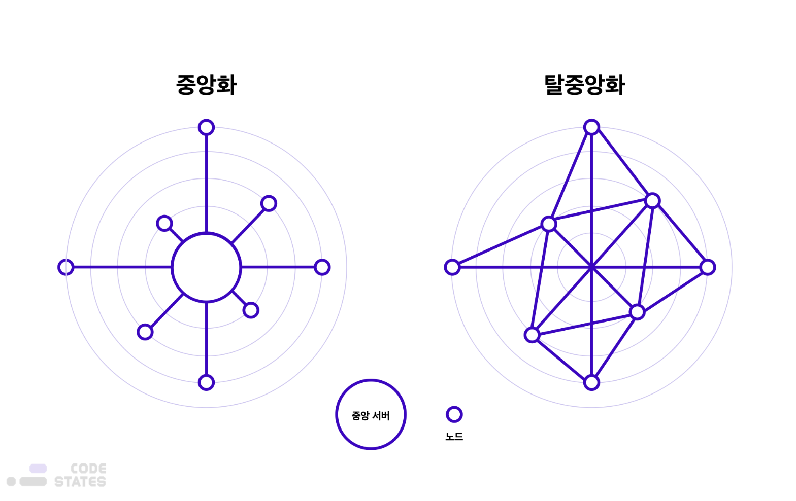

> 본 글은 Codestates BEB 코스의 자료에서 내용을 가져와 작성하였음을 알립니다.  

# Crptocurrency
`Crptocrrency`는 **분산 장부(Distributed Ledger)**에서 **비대칭키 암호화**를 통해 안전하게 전송하고,  
**해시 함수**를 이용해 쉽게 소유권을 증명할 수 있는 디지털 자산이다.  

---

## Diffrence from Currency
일반적인 가상 화폐(게임 내 통화; 골드, 메소)와 비교했을 때,  
암호화폐는 단일 주체가 소유하거나 고나리하지 않는 탈중앙화된 전자화폐 시스템이다.  
 
암호화폐를 판별할 떄는 여러 기준을 들 수 있지만, 일반적으로 강력한 탈중앙성을 들 수 있다.  
암호화폐는 중앙은행이 아닌 탈중앙성에 기반한 블록체인 네크워크에 의해 관리된다.  
  
왼쪽은 일반적인 은행에서 사용하는 모델이다.  
사용자(클라이언트)가 은행 시스템에서 거래를 하기 위해서는,  
반드시 중앙 서버와 통신해야한다.  
 
중앙 서버는 사용자의 거래 요청을 확인하고, 은행 데이터베이스를 사용해 유효성을 검사한 뒤, 거래를 처리한다.  
즉, 은행과 같은 중앙화된 시스템에서는, 중앙 관리자(중앙 서버)가 모든 거래를 검열하고 관리한다.  
 
암호화폐 네트워크의 탈중앙성은 상당한 수준의 차단과 **검열 저항성**을 가능하게 한다.  

> 검열 저항성 : 감시하더라도 거래를 막지 못하는 성질.  

또한, 탈중앙화된 모델은 중앙화된 모델에 비해 가용성 측면에서 우수하다.  
 
중앙화된 네트워크를 제대로 기능하지 모샇게 만들려면 메인 서버만 방해하면 된다.  
만약 한 은행의 데이터베이스가 유실되었을 때, 미리 백업해 두지 않았다면, 데이터가 영영 유실될 수 있다.  
 
반면, 탈중앙화된 모델에서는 모든 노드가 동일한 데이터베이스 사본을 보관한다.  
따라서 노드 일부가 공격당해 정상적으로 작동하지 못하더라도,  
다른 노드에 의해 네트워크는 정상적으로 서비스 될 수 있다.  
 
이런 탈중앙화 모델의 장점으로 인해, 암호화폐를 사용ㅇ하면 인터넷에 접속하는 누구나,  
언제든 중개자의 간섭 없이 자산을 전송할 수 있다.  
이것이 암호화폐를 `Permissionless(무허가성)`이라고 하는 이유이다.  

---

## Etymology
암호화폐라는 용어는 `Cryptography`와 `Currency`를 조합한 것이다.  
이는 암호화폐가 사용자 간의 트랜잭션을 보호하기 위해 암호학적 기술을 광범위하게 사용하기 때문이다.  
 
암호화폐에 쓰이는 암호학적 기술은 많지만, 대표적으로 `Hash`를 이용하여 중앙 관리자 없이도 거래의 신뢰성과 안정성을 보장한다.  

> **Hash**
> 다양한 길이를 가진 데이터를 고정된 길이를 가진 데이터로 매핑한 값으로, 해시함수의 출력값이다.  
> 해시함수는 어떠한 값을 입력하든 항상 고정된 길이의 무작위 랜덤 값을 출력한다.  