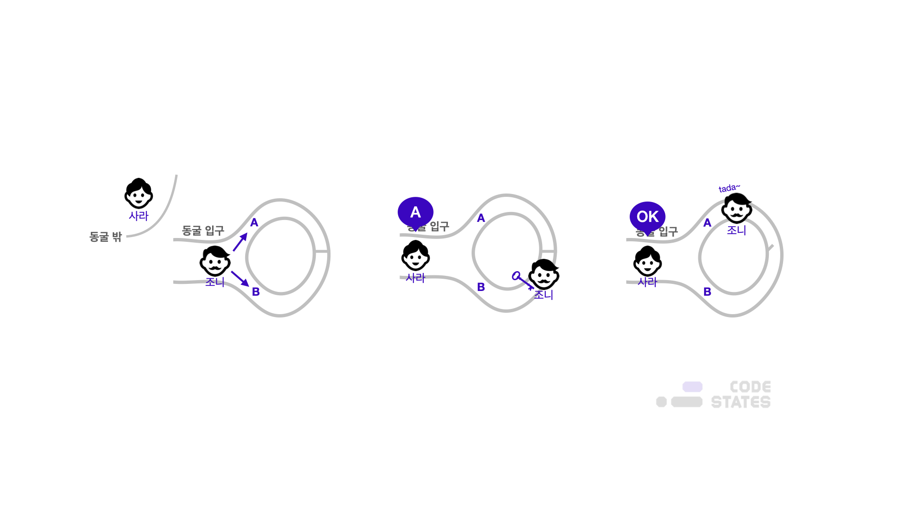

> 본 글은 Codestates BEB 코스의 자료에서 내용을 가져와 작성하였음을 알립니다.  

# Read Me
실크로드(Silk Road)는 마약 등 불법 물품을 판매하는 암시장 웹사이트이다.  
실크로드는 다크 웹을 이용하기 때문에 일반 인터넷을 통해 접근할 수 없고,  
`Tor`와 같은 익명 브라우저를 통해서만 이용할 수 있었다.  
 
2013년 7월까지 95만 7,079명의 이용자가 있었으며,  
미국 달러 등 법정화폐 대신 비트코인으로만 거래를 할 수 있었다.  
 
2013년 7월 미 연방수사국은 실크로드 서버 접근에 성공했고,  
같은 해 10월 서버를 압수하고 실크로드 운영자인 로스 윌리엄 울브리히트를 체포했다.  
만약 실크로드가 서버를 운영하지 않았다면, 연방수사국은 수사에 실패했을지도 모른다.  
 
이렇게 암호화폐의 익명성을 악용하여 범죄에 사용되는 사례는 실크로드 외에도 다양하다.  
또한 비트코인이 아닌 익명성 코인에 의해 일어나는 경우도 매우 많다.  
 
비트코인은 기본적으로 거래내역이 지갑에 남는다.  
만약 개인 정보 하나로 지갑 주소를 관리한다면, 개인의 거래내역을 열람할 수도 있다.  
 
그러나 익명성 코인은 영지식증명(Zero-knowledge Proof)을 통해, 거래내역 자체를 숨길 수 있다.

---

## Zero Knowledge Proof
영지식증명이란, 거래 상대방에게 어떠한 정보도 제공하지 않은 채, 자신이 해당 정보를 가지고 있다는 사실을 증명하는 방법이다.  
  
위 그림처럼, 조니가 동굴 내의 갈림길에서 아무 곳이나 선택해서 동굴의 끝까지 들어간다.  
사라는 동굴 밖에 있어서, 조니가 어디로 들어갔는지 알지 못한다.  
 
이때 동굴의 끝은 하나의 문으로 막혀있고, 조니는 증명자로서 이 문을 열 수 있는 열쇠를 가지고 있다.  
동굴 안으로 들어간 사라가 조니에게 A나 B 둘 중 하나를 골라 말해 주면, 조니는 사라가 정한 곳에 나타난다.  
 
이 방식으로 조니가 이 동굴의 끝에 있는 문의 열쇠를 가지고 있다는 걸 증명할 수 있다.  
그러나 조니가 우연히 사라가 고른 문으로 들어간 상태라면 열쇠가 없어도 사라가 정한 곳에 나타날 수 있다.  
 
하지만, 이 과정을 40번 정도 반복한다면 어떨까?  
40번 연속으로 사라가 고른 문으로 조니가 들어갔을 확률은 약 1조 분의 1입니다.  
영지식증명은 이렇게 상대에 대해 알지 못하더라도 거래가 가능하게 됩니다.  

---

## Prerequisites
- **완전성(Completeness)**  
어떤 조건이 참이라면 신뢰할 수 있는 검증자(Honest Verifier)는 신뢰할 수 있는 증명자(Honest Prover)에 의해 이 사실을 납득할 수 있어야 한다.  
위 실험을 여러 번에 걸쳐 수행하더라도, 증명자가 검증자의 지시를 계속 따르게 된다면 검증자는 증명자가 열쇠를 가지고 있다고 납득할 수 있다.  
- **건전성(Soundness)**  
어떤 조건이 거짓이면 신뢰할 수 없는 증명자(Dishonest Prover)는 거짓말을 통해 검증자에게 조건이 참임을 절대 납득시킬 수 없다.  
증명자가 사실은 열쇠가 없지만, 있다고 거짓말을 한 경우, 언젠가 한 번은 검증자의 지시에 따르지 못하는 경우가 생기기 때문에, 검증자에게 열쇠가 있다는 것을 증명할 수 없다.  
- **영지식성(Zero-knowledge)**  
어떤 조건이 참일 때, 검증자는 이 조건이 참이라는 사실 이외의 아무 정보를 알 수 없다.  
여러 번의 반복을 통해 검증자는 증명자가 열쇠를 가지고 있다는 것은 알지만, 그 열쇠가 어떻게 생겼는지는 알지 못한다.

---

## Anonymous Coin
익명성 코인에는 프라이버시 코인, 다크코인이라고도 부른다.  
대표적으로 대시(Dash), 지캐시(Zcash), 지캐시를 포크해서 만든 코모도(Komodo), 모네로(Monero) 등이 있다.  
 
대시코인의 옛 이름 중에는 다크코인이 사용되기도 했다.  
그리고 그 이름과 특성 때문에 불법 사이트와 연관이 있다는 오해를 받자, 대시로 이름을 바꾸었다.  
 
이 코인들은 다크코인이라고도 하는데, 개인 정보를 보호해 주며, 거래내역이 남는 것이 아니라 잔고가 증가하고 줄어든 흔적만 찾을 수 있다.  
 
따라서 누가 누구에게 얼마만큼의 코인을 전송했는지 파악할 수 없으며,  
이런 특성으로 인해 마약류 거래나 사이버 범죄자들 사이에서 결제 수단으로 사용되었다.  
이런 특징과 악용으로 인해, 다크코인들은 2019년 6월부터 거래소들로부터 퇴출당하기 시작한다.  
 
2019년 6월, 국제자금세탁방지기구(FATF; Financial Action Task Force)가 발표한 암호화폐 규제 권고안에는 거래소와 같은 가상자산 취급업소(VASP)들은 트래블 룰(Travel Rules)을 준수해야 한다는 항목이 있다.
 
**트래블 룰은 암호화폐 거래에 필요한 수신자와 발신자 정보를 수집·보유하고, 정부 당국이 요청할 경우 관련 정보를 제공해야 한다는 규정**이다.  
익명성이 특징인 다크코인은 이 같은 정보 수집이 힘들 수밖에 없다.  
이 때문에 국내 거래소에서는 암호화폐 송금 시 송·수취인 및 기관의 정보를 수집해야 하는 규칙을 맞추기 위해,  
익명성이 보장된 다크코인 상장폐지 절차를 밟은 것이다.
 
FATF 권고안이 강제성을 지닌 것은 아니지만, 평가 결과가 국제 신용등급에 반영되기 때문에 사실상 가이드라인을 따를 수밖에 없다.  
일부 다크코인이 FATF의 자금세탁방지(AML) 규정을 준수하는 데 문제가 없음을 피력하고 있는 것도 이 때문이다.  
 
최근 지캐시는 'FATF 권고안을 준수하는 법'이라는 글을 공개했는데 여기에는 고객 주의의무(CDD), 트랜잭션 모니터링, 문서 보존, 의심 거래 포착, 트래블 룰 등 규정을 모두 준수한다는 내용을 담고 있다.  
 
우리나라와 달리 해외에서는 아직 다크코인 거래를 지원하는 경향이 있다.  
미국 암호화폐 거래소 코인베이스는 지난 9월 사용자 등록 절차를 밟는 형식으로 익명성을 보장하지 않는다는 방침을 가지고 대시를 상장했다.  
바이낸스는 대출 서비스에 모네로, 제트캐시, 대시 등 다크코인 3종을 추가하기도 했다.  
전문가들은 FATF 가이드라인을 따르더라도 각국의 상황과 세부 법령이 다를 수 있어 이 부분에서 다크코인의 운명이 갈릴 것으로 보고 있다.

> 여전히 국내 거래소에는 다크코인이 거래되지 않고 있다.

추가로, 영지식 증명은 다크 코인뿐 아닌, 고객의 신원정보를 확인해야 하는 의무와 동시에 개인정보보호법에 위반되지 않도록,  
처리 및 관리를 해야 하는 많은 기업 사이에서 새롭게 대두되고 있는 기술이다.
 
예를 들어 Wifi 무선랜 보안 방식인 WPA-3에도 활용되고 있을 뿐 아니라,  
블록체인에서도 레이어2 솔루션인 zk 롤업에서의 유효성 증명(validity proofs)에서도 활용되고 있다.

