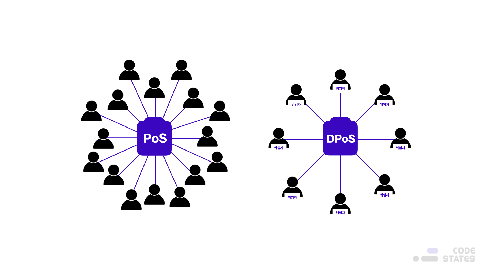
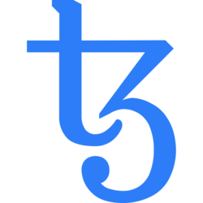

> 본 글은 Codestates BEB 코스의 자료에서 내용을 가져와 작성하였음을 알립니다.  

# DPoS
위임지분증명(DPoS, Delegated Proof of Stake)이란,  
암호화폐 소유자들이 각자의 지분율에 비례하여 투표권을 행사하여 자신의 대표자를 선정하고,  
선정된 대표자들끼리 합의하여 의사결정을 내리는 합의 알고리즘이다.  
 
지분 증명(PoS)이 자산을 가진 사람들이 전부 참여할 수 있는 방식이라면,  
**위임지분증명(DPoS)은 특정 인원에게만 지분 증명(PoS)을 할 수 있도록 권한을 위임**하는 것이다.  
 
즉, 특정인 몇 명만이 블록을 생성하여 증명할 수 있는데,  
이는 국민의 대표로 의원을 뽑아 의회를 구성하는 대의 민주주의 제도와 유사하다.  
 
위임지분증명(DPoS)을 사용하는 암호화폐로는 스팀, 비트셰어, 엘프, 리스크, 테조스, 라이즈, 아크, 시프트, 보스코인 등이 있다.
 
지분 증명(PoS)에 대한 비판으로 위임지분증명(DPoS) 방식이 등장하게 되었으며,  
암호화폐 소유자들이 각자의 지분율에 비례하여 투표권을 행사하여 자신의 대표자를 선정하고,  
이 대표자들끼리 합의하여 의사결정을 내리는 방식으로 진행된다.  
 
위임지분증명 방식은 지분증명 방식과 달리 누구에게나 대표자가 될 기회가 주어지지 않는다.  
대표자가 되기 위해선 투표를 거쳐야 하며, 이때 명칭이 바뀌는데 투표를 통해 선출된 사람을 대표자라고 한다.  
 
선출된 대표자들은 블록을 생성하고, 블록을 확정하기 위해선 2/3 이상의 승인이 필요하다.  
대표자의 지위는 일정 시간 이내에 블록 셋업에 참여해야 유지된다.  

  

---

## Pros
- 소규모 참여자도 이득을 볼 수 있다.  
- 거래속도(TPS)가 빠르다.  

위임지분증명(DPoS)은 지분 증명(PoS)과 달리,  
**같은 시간에 훨씬 더 많은 거래를 처리할 수 있다는 점**과 **수수료가 없다**는 장점이 있다.  

---

## Cons
- **네트워크 보안**  
블록체인은 탈중앙화 되어 강력한 보안성을 지닌다는 특징을 가지고 있다.  
위임지분증명 방식의 경우에는 지분을 위임받은 대표자들의 수가 제한되어 있다 보니 탈중앙화가 되지 않아 보안에 취약할 수 있다.  
 
또한 탈중앙화된 네트워크가 외부 공격에 강한 이유가 익명성 때문이다.  
위임지분증명의 경우에는 대표자를 선출하고자 한다면 대표자에 대한 정보를 밝혀야 한다는 딜레마를 가지고 있다.  
- **대표자의 수**  
네트워크가 커짐에도 불구하고 대표자의 수가 일정하다면 상대적인 중앙화가 이루어질 수 있기 때문에,  
암호화폐를 보유하고 있는 사람들의 수가 많아질수록, 네트워크가 커질수록 대표자의 수는 늘어나야 한다.  
하지만 이렇게 대표자의 수가 증가하면 반대로 위임지분증명이 가지고 있는 속도의 장점이 줄어들게 되는 문제가 발생한다.  

---

## Popular DPos Models  

|이오스|스팀|비트셰어|엘프|테조스|
||||||  