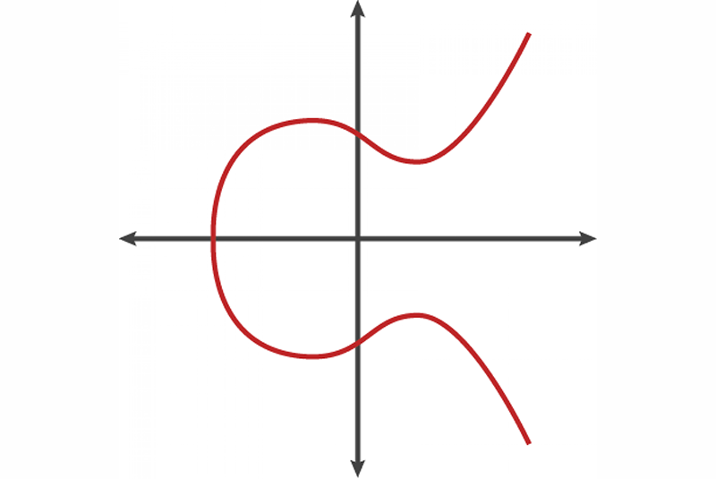
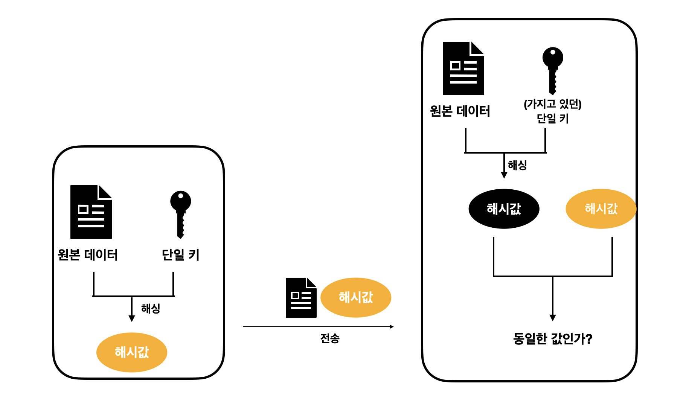

> 본 글은 Codestates BEB 코스의 자료에서 내용을 가져와 작성하였음을 알립니다.  

## SHA
SHA는 Secure Hash Algorithm의 약자로, 해시함수를 이용해 만든 해시 암호화 알고리즘의 모음이다.  
SHA는 미 국가보안국(NSA)에서 1993년 처음으로 설계하였으며,  
미국 국립표준기술연구소(NIST)에서 발전시켜 오늘날 미국의 국가표준으로 자리 잡았다.
<br>
SHA의 종류로는 `SHA-0`, `SHA-1`, `SHA-2`, `SHA-3` 등이 있으며,  
`SHA-0`과 `SHA-1`에는 충돌이 감지되어 더 이상 사용되지 않는다.  
<br>
오늘날 가장 많이 사용되는 함수 군은 `SHA-2`이다.  
`SHA-2`에는 `SHA-224`, `SHA-256`, `SHA-384`, `SHA-512`가 있다.
<br>
일반적인 암호화 알고리즘은 데이터를 숨기고 안전하게 전달하는 기밀성이 그 목적이지만,  
SHA의 목적은 데이터의 위변조가 불가능함을 보장하는 무결성이다.  
실제 비트코인이나 이더리움에서 블록헤더, 디지털 서명, 공개키에서는 데이터 무결성을 위해 SHA를 사용한다.

---

## ECDSA
ECDSA(Elliptic Curve Digital Signature Algorithm; 타원곡선 디지털 서명 알고리즘)는,  
비대칭키 방식 중 하나인 ECC(Elliptic Curve Cryptography; 타원곡선암호)에 디지털 서명 방식을 접목한 알고리즘이다.  
  
디지털 서명에서는 수신자가 송신자의 공개키를 사용해 메시지를 검증하기 위해서는 디지털 서명을 필요로 한다.  
디지털 서명은 개인키로만 생성할 수 있어야 하며,  
수신자가 트랜잭션에 작성된 `디지털 서명`과 `송신자의 공개키`를 통해 `송신자의 디지털 서명`인지 판별할 수 있어야 한다.  
<br>
ECC는 타원곡선으로 수학적으로 연결된 개인키와 공개키 한 쌍을 생성하고,  
개인키로 암호화한 디지털 서명을 공개키로 복호화할 수 있다.

---

## HMAC
  
HMAC은 Hash-based Message Authentication Code의 약자로,  
대칭키 암호 방식을 사용하여 디지털 서명을 구현한다.  
<br>
HMAC은 송신자와 수신자가 `단일키`를 공유하고,  
`해당 단일키`와 `원본 데이터를 해싱한 값`과 `원본 데이터`를 함께 트랜잭션으로 보내 데이터의 무결성을 증명한다.
<br>
HMAC의 디지털 서명 공식은 다음과 같다.

```javascript
HMAC 트랜잭션 = Hash(원본 데이터, 단일 키) + Message
```

공개키 암호 방식에서는 개인키로 원본 데이터의 해시값에 서명하고, 공개키로 이를 복호화하여 원본 데이터와 비교했지만,  
HMAC에서는 단일키와 원본 데이터로 만든 해시값이 서명의 역할을 한다.

---

## PKI
PKI(Public Key Infrastructure, 공개키 인프라)는 디지털 인증서와 공개키를 생성, 관리, 배포, 사용, 저장 및 해지하는 데 필요한 일련의 하드웨어, 소프트웨어, 정책, 프로세스와 절차의 집합이다.  
PKI는 대규모 사용자 집단에서 디지털 서명 및 암호화와 같은 기술을 사용할 수 있는 기반이다.  
<br>
PKI의 목적은 데이터를 안전하게 전송하는 것이며, 이를 위해 시스템 및 리소스 접근 권한, 데이터 보호, 트랜잭션 무결성 및 진위성, 기밀성을 보장한다.
<br>
PKI는 공개키 암호 방식을 사용하여 웹 서버, 임베디드 시스템, 서로 연결된 장치, 비즈니스 프로세스를 실행하는 소프트웨어 간에 데이터를 안전하게 교환할 수 있도록 해준다.  
오늘날 비즈니스 모델은 전자 상거래나 전자 문서에 점점 더 의존하면서 진화하고 있으며,  
인터넷 장치들은 기업 네트워크에 점점 더 많이 연결되고 있다.  
<br>
이에 따라 PKI는 단순 보안 이메일, 웹 트래픽뿐만 아니라,  
여러 개의 복잡한 생태계 내의 다양한 애플리케이션, 사용자, 장치를 지원하고 있다.  
<br>
또한 정부 및 산업 데이터 보안에 대한 규제가 점점 엄격해지고 있기 때문에,  
정부 기관과 기업들은 신뢰를 보장하기 위해 조직적인 PKI를 구성하고자 노력하고 있다.

---

## Schnorr Signature
일반적인 디지털 서명에서는 공개키, 서명할 메시지 및 서명이 포함되어 있으며, 공개키의 소유자가 주어진 메시지에 서명했음을 보여준다.  
<br>
가령 멀티시그 주소에서 송금하는 등, 여러 이해당사자가 하나의 메시지에 서명을 하기 원하는 경우,  
각 이해당사자는 하나의 메시지에 서명과 공개키를 포함해야 한다.  
<br>
만약 3명의 당사자가 동일한 메시지에 서명하기를 원하는 경우, 3개의 공개키와 3개의 서명이 포함될 것이다.  
각 노드는 서명을 검증하는 과정을 3번 수행해야 하고, 블록은 3개의 공개키와 3개의 서명을 저장해야 하므로 자리를 많이 차지하고 있다.
<br>
슈노르 서명에서는 키 집합(Key Aggregation)을 사용한다.  
슈노르 서명은 서명하는 당사자의 공개키들을 결합하여 단일한 하나의 공개키를 구성한다.  
그리고 각 당사자의 개인키를 사용하여 해당 메시지에 서명을 할 수 있다. 
<br>
또한 당사자들의 서명을 결합하여 합쳐진 단일 공개키에 유효한 단일 서명을 구성할 수 있다.  
검증 노드가 당사자들이 모두 메시지에 서명했는지 확인할 때는 단일 서명과 단일 공개키로 확인할 수 있다.
<br>
슈노르 서명은 당사자들의 정보를 하나로 통합하기 때문에 개인 정보 보호에 유리하며,  
블록에 들어가는 멀티시그 공개키들과 서명들의 크기를 일반적인 블록 크기 정도로 줄이기 때문에,  
블록 공간을 매우 절약하고, 검증의 속도를 빠르게 할 수 있다.