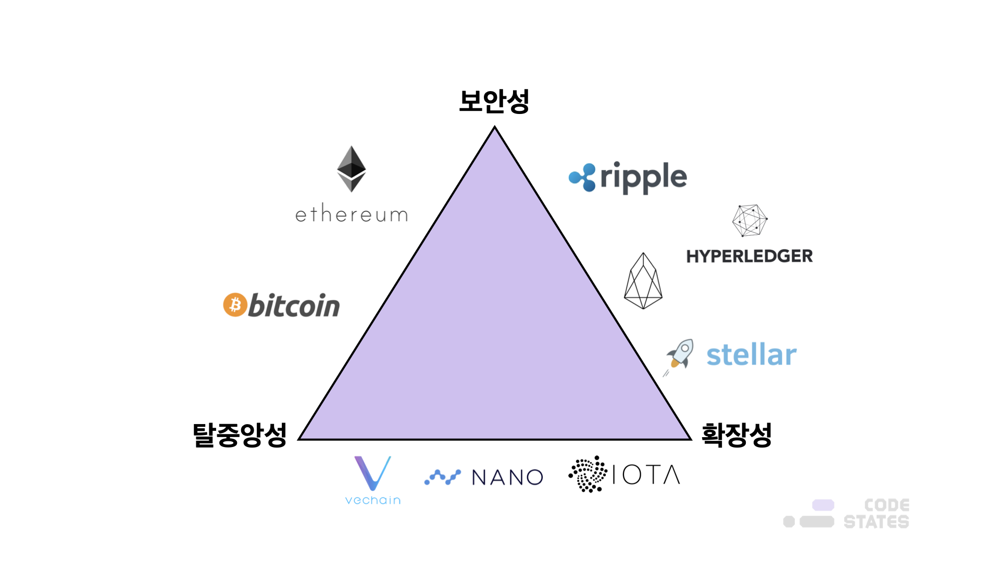

> 본 글은 Codestates BEB 코스의 자료에서 내용을 가져와 작성하였음을 알립니다.  

# READ ME
블록체인 네트워크에서 거래를 하기 위해서는 트랜잭션을 전파해서 검증하는 과정이 필요하다.  
이때 검증은 모든 노드가 진행하기 때문에, 시스템에 노드(참가자)가 많을수록,  
하나의 계약을 처리하는 데 오랜 시간이 걸릴 수 있다.  
 
다시 말해, **많은 노드 수는 탈중앙성을 강화하지만, 확장성을 저하하게 된다.**  

---

이러한 관계성으로 인해, **세 가지 요소를 동시에 최적화할 수 없으며 상호 간 절충**이 필요하다.  
 
한 요소를 강화하기 위해서는 다른 요소에서 양보해야 한다.  
이러한 관계를 자세히 들여다보면, 사실상 이는 중앙화/탈중앙화에 대한 대치 관계임을 알 수 있다.  
 
탈중앙성을 확립하기 위한 타협점은 확장성이다.  
 
강력하게 분산된 비트코인은 확장성과 타협했기 때문에 매우 느리다.
이더리움 1.0과 비트코인은 탈중앙성과 보안성을 확보한 대신 확장성을 포기해 TPS가 낮다.
낮은 TPS 덕에 트랜잭션 처리 속도가 늦어질 수밖에 없다.  
이용자는 빠른 트랜잭션 처리를 위해서 수수료를 계속 추가하기 때문에, 수수료 또한 비싸진다.  
반면, 리플은 탈중앙성보다 보안성과 확장성을 선택했고, 이오스는 탈중앙성과 보안성을 희생하고 확장성을 선택했다.  

  

## Pros and Cons

---

### Scalibility Focused Networks  

**장점**  
- 네트워크가 많은 양의 트랜잭션을 지원할 수 있도록 한다.  
- SNS 애플리케이션과 같이 보안이 주요 초점이 아닌 애플리케이션에서 유용할 수 있다.  
 

**단점**  
- 확장성은 탈중앙성을 희생해야 한다.  

---

### Security Focused Networks

**장점**  
- 보안성이 중심이 된다는 것은 많은 노드 수와 높은 네트워크 해시 파워를 의미한다.  
따라서 트랜잭션에 대한 수수료가 낮은 가격으로 안정적으로 책정된다.  
 
- 퍼블릭 블록체인의 보안은 네트워크 참여자에게서 나온다.  
높은 보안은 복제하기 쉽지 않은 높은 네트워크 효과를 의미한다.  
 

**단점**  
- 노드 수가 많아야 하고, 네트워크 해시 파워가 높아야 하므로 노드 운영 비용이 증가한다.  
특히, PoW 합의 방식을 채택한 경우 채굴로 인해 컴퓨터 연산 자원을 많이 소모하게 된다.  

> 이더리움 클래식(ETC) 공격에서, 공격자는 4,000개 이상의 블록 1을 재구성했다.  
> 이 과정에서 공격자는 200만 달러에 가까운 ETC를 지출했습니다.
>  
> 공격자가 공격에 성공한 원인은 무엇일까?
> 전체 네트워크 해시파워의 51% 이상을 획득하는 데 드는 비용(200만 달러)은, 도난당한 가치에 비해 미미했기 때문이다.  
> 다시 말해, 이 4,000개 블록에 담긴 이더리움 클래식의 가치는,  
> 공격자가 사용한 2백만 달러보다 훨씬 많은 가치를 가지고 있었기 때문이다.

---

### Decentralizaed Networks
**장점**  
- 탈중앙화를 통해 사용자가 단일 엔티티를 신뢰하지 않고도 합의를 유지할 수 있다.  
- 분산 네트워크는 누구나 네트워크에 참여할 수 있으며,  
네트워크에 참여하는 노드가 많아질수록 더욱 분산화되기 때문에,  
중앙화된 노드가 네트워크 데이터에 대해 검열할 수 없도록 한다.  
이는 개인의 재산권, 다시 말해 개인이 자신의 자산을 제3자가 아닌 스스로 관리할 수 있도록 한다.  
 

**단점**  
- 합의 알고리즘을 사용하는 분산 장부 네트워크에서는 노드 수가 많아질수록 전체 네트워크가 합의에 도달하는 시간이 길어진다.  
따라서 네트워크에서 처리할 수 있는 트랜잭션 양이 감소하게 되며 확장성 문제로 이어지게 된다.  
- 중복성을 도입하기 때문에 비용이 많이 들고 모든 애플리케이션에는 바람직하지 않다.  

 
 

||확장성 중심|보안성 중심|탈중앙성 중심|
|:---:|:---:|:---:|:---:|
|장점|- 네트워크가 많은 양의 트랜잭션을 지원할 수 있도록 한다. - 소셜 메시징 애플리케이션과 같이 보안이 주요 초점이 아닌 애플리케이션에서 유용할 수 있다.|- 기존 가치 이전보다 빠르고 저렴한 대규모 가치 이전이 가능하다. - 퍼블릭 블록체인의 보안은 네트워크 참여자에게서 나온다. 높은 보안은 복제하기 쉽지 않은 높은 네트워크 효과를 의미한다.|- 탈중앙화를 통해 사용자가 단일 엔티티를 신뢰하지 않고도 합의를 유지할 수 있다. - 분산화는 시스템의 견고성을 증가시키기 때문에 바람직하다. 네트워크를 검열에 저항하게 하여 누구나 네트워크를 사용할 수 있도록 하여 재산권을 향상하게 한다.|
|단점|- 확장성은 보안을 희생해야 한다. - 네트워크가 확장됨에 따라 합의 메커니즘도 확장해야 중앙 집중화를 희생할 수 있다.|- 더 많은 자원, 다시 말해 더 많은 투자가 필요하다.|- 분산화는 지연을 초래하고 네트워크 속도를 늦춘다. - 중복성을 도입하기 때문에 비용이 많이 들고 모든 애플리케이션에 바람직하지 않다.|