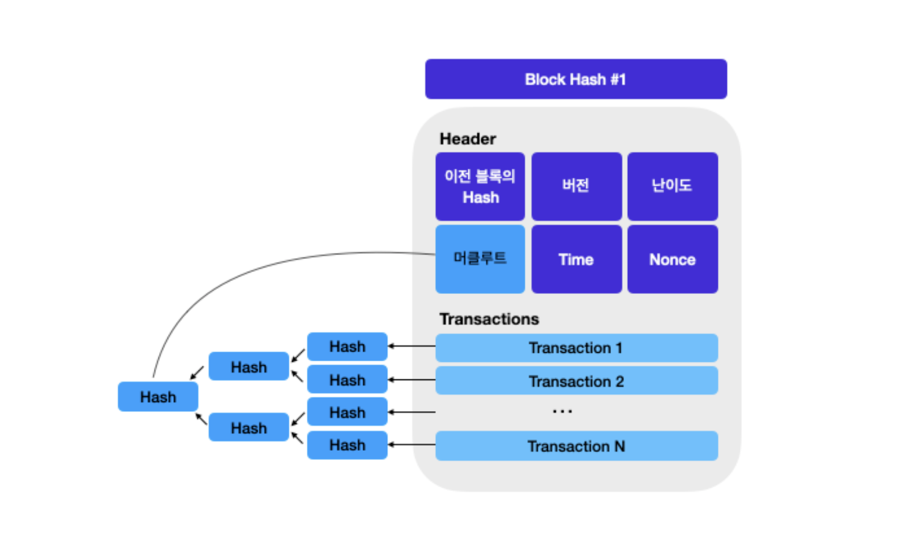

> 본 글은 Codestates BEB 코스의 자료에서 내용을 가져와 작성하였음을 알립니다.

# Merkel Tree
머클트리는 여러 데이터에 대해 단계적으로 해시함수를 적용하여 하나의 해시값으로 나타내는 데이터 구조이다.  
즉, 여러 개의 데이터를 하나의 해시값으로 만드는 데이터 구조이다.  
 
머클 트리는 블록체인에 있는 **데이터의 위변조를 방지**하고, **데이터가 변하지 않았음을 보장**하는데 사용된다.  

---

## Operating Mechanism
  
머클 트리는 위의 그림처럼 여러개의 데이터(A, B, C, D)를 여러 단계를 거쳐 하나의 해시값으로 만드는 트리이다.  
이렇게 여러 데이터를 모다 만들어진 하나의 해시값을 **Merkle Root**라고 한다.  
머클 루트는 다음의 과정을 거쳐 만들어진다.  

1. 리프 데이터를 해시함수에 넣어 해시값을 만든다.  
2. 각 해시 값을 두 개씩 짝지어서 연결한다.  
3. 연결된 두 해시값을 해싱한다.  
4. 최종적으로 하나의 해시값만 남을 때까지 이 과정을 반복한다.  
5. 마지막으로 남은 해시값을 다시 한번 해싱한다.  

이렇게 최종적으로 나오는 해시 값이 **머클 루트**이다.  
머클 루트는 트리의 루트이자, 모든 데이터를 모아 해싱한 값이다.  

---

## Integrity
해시함수는 충돌저항성을 지니기 때문에, 서로 다른 입력에 대해 동일한 출력값을 갖지 않는다.  
따라서 데이터 값이 바뀌면 해싱한 값이 바뀌기 때문에,  
머클 루트값까지 바뀌게 된다.  
  
이렇게, 머클 트리는 해시 함수의 충돌저항성을 활용하여,  
여러 데이터의 집합 중 단 하나라도 변경되었는지 찾을 수 있다.  

---

## With Blockchain
비트코인의 블록 구조는 대략 다음과 같다.  
  
 
모든 블록은 고유한 해시값을 가지고 있다.  
헤더에는 이전 블록의 해시값, 버전, 난이도, 머클루트, 블록 생성 시간, 논스 등 블록에 대한 내용이 들어있다.  
그리고 트랜잭션들이 담겨있다.  
 
블록의 해시값은 블록 헤더의 모든 값들을 연결하여 해싱한 값이 블록의 고유한 해시값이 된다.  
또한 1번 블록의 해시값은 그 다음 이어디는 2번 블록의 헤더에 포함된다.  
따라서 모든 블록은 자신 바로 앞의 블록 해시값을 가지고 있다.  
 

블록 헤더의 머클루트는, 트랜잭션을 사용해 머클트리를 만들고,  
그 결과로 나온 머클루트값이다.  
  

즉, 블록에 담긴 모든 트랜잭션에 대한 무결성을 보장하는 머클루트 값이,  
블록 헤시에도 들어가게 되는 것이다.  
 
만약 악의적인 노드가 1번 블록의 트랜잭션을 조작한다고 가정해보자.  
먼저, 악의적인 노드는 블록 내 트랜잭션을 변경하고, 머클트리의 특성에 따라 머클루트 값도 변경된다.  
  
머클 루트 값이 변경되면, 블록 헤더의 모든 값을 연결하여 해싱한 값인, 블록 해시값도 변경된다.  
  
1번 블록의 블록 해시값이 변경되면, 2번 블록의 헤더 안에 있는 "이전 블록의 Hash"값도 함께 바뀌어야 한다.  
이는 연쇄적으로 이후의 해시값도 바꿔야하게 만든다.  
  
이처럼 특정 블록에 들어있는 트랜잭션을 단 하나라도 변경하는 경우,  
블록은 체인처럼 모두 연결되어 있기 때문에, 해당 블록 이후에 연결된 블록을 모두 수정해야한다.  
 
블록의 논스 값을 찾는데 10분 정도 걸리기 때문에,  
트랜잭션을 하나 수정하기 위해서는 연결된 모든 블록의 논스값을 다시 찾는 비용은 매우 크게 들 것이고,  
데이터의 위변조를 불가능하게 만든다.  

---

## Further Study
비트코인과 다르게, 이더리움에서는 단순 이진 머클 트리가 아닌,  
머클 트리의 개선된 버전인 머클 패르리샤 트리를 채택하여 사용하고 있다.  

- What is `Merkle Patricia Tree`?
- Why `Etherium` uses `Merkle Patricia Tree`?
- In the `Etherium`, what is inside of `State Tree`, `Transactions Tree`, and `Receipts Tree`?