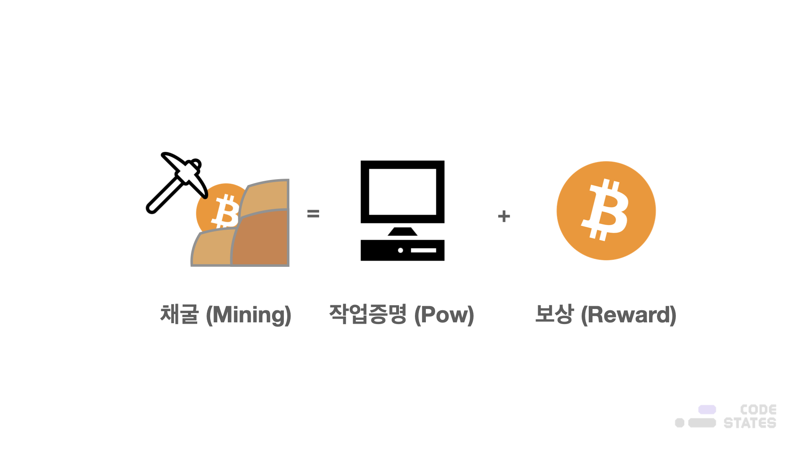
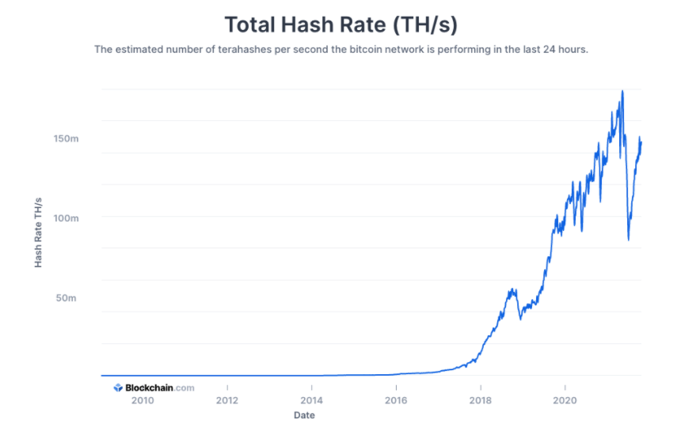
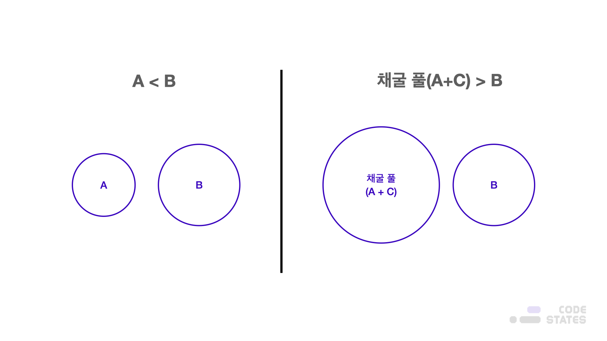
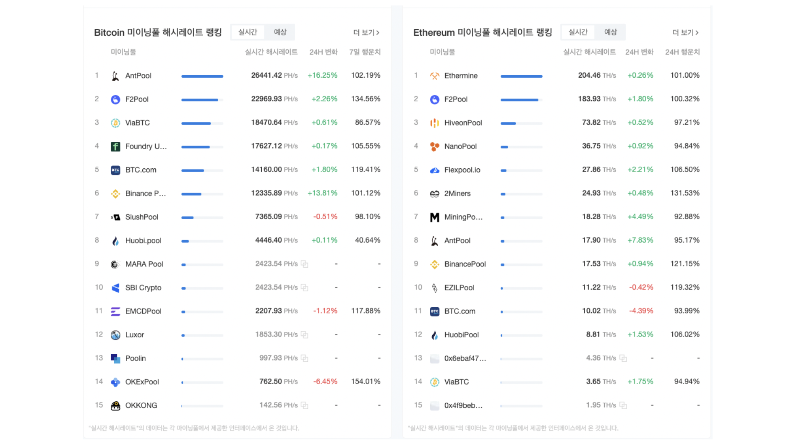
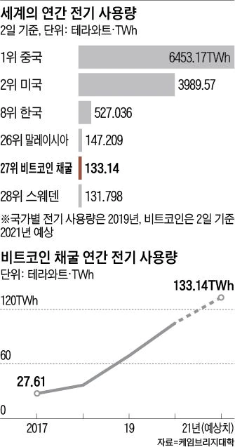

> 본 글은 Codestates BEB 코스의 자료에서 내용을 가져와 작성하였음을 알립니다.  

# Miners
채굴(mining)이란, **블록체인 네트워크에서 노드로 트랜잭션을 검증하여 분산원장(블록)에 기록하고, 보상으로 암호화폐를 얻는 것**을 뜻한다.  
 
새로운 블록을 만드는 것이 바로 채굴의 핵심이며, 블록을 생성하여 체인에 연결한 노드는 행위에 대한 보상을 받는다.  
 
비트코인의 경우, 블록이 생성될 때마다 다음 블록 생성을 위한 해시 퍼즐 문제가 함께 주어진다.  
이 해시 퍼즐 문제를 가장 먼저 푸는 작업자가 블록을 생성할 수 있는 권한을 갖게 되고,  
생성한 블록을 체인에 올림과 동시에 채굴 보상을 받는다.  
 
해시 퍼즐을 푼다는 것은 특정한 조건을 갖춘 해시를 찾아내는 일련의 과정을 의미한다.  
비트코인은 내부적으로 채굴자들의 해시파워(해시 퍼즐을 푸는 연산력)에 맞춰 자동으로 난이도를 조정하여,  
약 10분을 주기로 채굴이 가능하도록 프로그래밍되어 있다.  
 
블록체인 기반의 암호화폐에서 새로운 블록을 생성하고 그 대가로 암호화폐를 지급받는 노드들이 바로, 채굴자(Miner)이다.  

> 통상적으로 PoW 합의 알고리즘에서의 블록 생성 및 보상을 수령하는 노드를 채굴자(miner)라고 하고,  
> PoS방식 등 전력 소모를 통해 블록을 생성하지 않는 다른 합의 알고리즘에서는 블록 제안자(proposer)라고 한다.  

  

왜 채굴자(Miner)들은 설명만 들어도 복잡한 과정을 진행하며 채굴할까?  
이는 채굴을 하는 행위가 채굴자들에게 이익이 되기 때문이다.  
이 부분은 앞에서 배운 **토큰 이코노미(Token Economy)**와 **크립토 이코노미(Crypto Economy)**의 생태계를 통해 파악할 수 있다.  

---

## What Does the Miners Do
토큰 이코노미(Token Economy)와 크립토 이코노미(Crypto Economy)를 통하여 채굴(Mining)하는 행위는  
**블록체인 네트워크를 유지**하면서 개인에게는 이익을 줄 수 있다.  
그렇다면, 비트코인에서는 채굴자가 **어떤 작업을 통해 채굴하는지**, 또한 **보상은 어떻게 받는지** 알아보자.  
 
노드(Node)가 비트코인 네트워크에 접속하면, 비트코인 채굴자는 다음과 같이 몇 가지 작업을 수행한다.  

- **네트워크 동기화**  
새 노드가 비트코인 네트워크에 합류하면, 다른 노드에게 과거의 블록들을 요청해 블록체인을 다운로드한다.  
- **트랜잭션 검증**  
새로운 트랜잭션을 수신한 노드는 반드시 해당 트랜잭션이 올바른 트랜잭션인지 검증하는 과정이 필요하다.  
 
> **비트코인에서 트랜잭션이 생성되고 검증되는 절차**  
> 1. 원본 데이터를 자신의 **개인키**로 암호화를 진행하여 **디지털 서명**을 진행  
> 2. 원본 데이터와 **디지털 서명된 데이터**를 노드에 전파  
> 3. 트랜잭션을 받은 노드는 해당 트랜잭션이 **진짜**인지에 대한 검증을 위해 트랜잭션을 **송신한 노드의 공개키**를 이용하여 복호화 진행  
> 4. 복호화 한 거래 데이터와 원본 데이터를 비교하여 수정된 데이터가 있는지 데이터의 무결성을 검증  
> 5. 수신받은 트랜잭션이 **진짜** 거래로 판단될 경우,  
> 블록체인에 해당 트랜잭션을 업데이트하고, 블록체인 네트워크에 연결된 노드들에게 해당 트랜잭션을 다시 전파  

- **블록 유효성 검사**  
채굴자와 풀 노드는 특정 규칙에 따라 수신한 블록을 평가하여 유효성 검사를 시작한다.  
- **새로운 블록 생성**  
채굴자는 네트워크에 브로드캐스팅된 트랜잭션의 유효성을 검사한다.  
- **작업 증명(PoW) 수행**  
채굴 과정의 핵심으로 채굴자가 해시 퍼즐을 풀어 유효한 블록을 찾는다.  
이때, 채굴자는 논스값을 계속 바꿔가며 블록 해시값이 미리 결정된 목표값보다 작을 때까지 반복 계산한다.  
조건을 만족하는 논스값을 블록 헤더에 추가하여 결과를 브로드 캐스팅한다.  
- **보상 수령**  
다른 노드들이 해시퍼즐(PoW)의 해를 구한 노드가 브로드 캐스팅한 블록을 검증하여 승인한다.  
승인되면 채굴자는 비트코인과 관련된 트랜잭션 수수료를 보상으로 받는다.  

> 블록 보상은 약 210,000 블록이 채굴될 때마다 반으로 줄어들고 있으며, 지금도 보상이 줄어들고 있다.  
> 이렇게 비트코인의 개수를 제한하는 이유는 무엇일까?

---

## Rewards
위의 **보상 수령** 단계에서 알아보았듯이,  
해시 퍼즐(PoW)의 해를 구한 노드는 즉시 결과를 브로드캐스팅하고,  
다른 노드들은 그 결과를 검증하여 블록을 승인한다.  
 
그렇게 블록이 승인되면, 채굴자는 비트코인과 관련된 트랜잭션 수수료를 보상으로 받는다.  
 
비트코인의 작업증명(PoW) 해를 구하는 데에 약 **10분**이 소요되도록 알고리즘이 형성되어 있기 때문에,  
더 많은 채굴자가 등장하고, 빨리 채굴할수록 채굴 난이도가 상승하게 되어있다.  
 
이 보상은 일정량을 지속해서 보상하는 것이 아니라,  
**반감기**로 인하여 2009년 초반에는 블록 하나를 생성할 때마다 50개의 비트코인을 보상으로 받을 수 있었지만,  
2018년에는 12.5개의 비트코인을 블록 보상으로 받을 수 있는 등,  
시간이 지나면 지날수록 블록 보상에도 변화가 생긴다.  
 
이에 따라 비트코인의 총공급량은 약 2,100만 개가 되며, 그에 따른 희소가치가 부각될 것이다.  

> [Bit-coin Half life](https://www.coindeskkorea.com/news/articleView.html?idxno=70609)  

---

## Transaction Fee
블록 보상 난이도가 어려워지고, 반감기로 인해 수령하는 코인의 개수도 줄어들면 채굴자들이 채굴을 하는 메리트가 떨어지지 않도록, 거래(Transaction) 수수료가 존재한다.  
 
거래 수수료란, 채굴자들이 특정 거래 기록들을 블록에 포함시키고, 이를 체인에 추가한 대가로 받는 인센티브이다.  
거래 수수료는 여러 중요한 목적을 가지고 있는데, 그중 하나는 채굴자와 검증자에게 보상을 지급하는 것이다.  
 
채굴자와 검증자는 채굴을 통해 트랜잭션을 승인하는데 도움을 제공하거나,  
스팸 공격으로부터 네트워크를 보호하도록 자신의 자원을 소모했기 때문에,  
보상으로 거래 수수료를 함께 제공한다.  

> 합의 알고리즘에 따라 채굴자에게만 보상을 주는 경우(비트코인 PoW)도 있고,  
> 채굴자와 함께 블록을 검증한 검증자에게도 보상을 주는 경우도 있다.(이더리움 PoS)  

거래 수수료는 대부분의 블록체인 시스템의 중요한 부분으로 자리매김해 왔다.  
대부분의 암호화폐는 두 가지 중요한 이유에서 트랜잭션 수수료를 사용한다.  

- **네트워크상의 스팸 공격을 줄이기 위해서**  
거래 수수료는 대규모 스팸 공격과 이를 실행하는 데 무척 많은 비용이 들도록 한다.  
- **거래 수수료는 트랜잭션을 확인하고 유효성을 검증하는 사용자에게 인센티브를 제공**  
이를 네트워크에 일조하는 행동에 대한 보상이라 이해할 수 있다.  

대부분의 블록체인에서 트랜잭션 수수료는 합리적인 수준으로 저렴하지만, 네트워크 트래픽에 따라 상당히 비싸질 수도 있다.  
얼마의 수수료를 지불하기로 결정하느냐에 따라 우리의 트랜잭션이 다음 블록에 추가되는 우선순위가 정해진다.  
더 많은 수수료를 지불할수록, 확인 과정이 더 빨라진다.  

---

## Hashrate
해시율은 초당 해시 계산 개수를 나타낸다.  
즉, 블록을 찾기 위해 비트코인 네트워크상의 채굴자들이 해시를 계산하는 속도이다.  
 
비트코인 초기에 해시율은 개인용 컴퓨터의 CPU 자원이 사용되었기에 꽤 낮았다.  
그러나, 전문 마이닝풀과 Application Specific Integrated Circuits(ASICs)가 도입되며,  
해시율은 기하급수적으로 증가하였으며, 그 결과 비트코인 난이도도 급격하게 증가하였다.  
 
아래 그래프는 연도에 따른 테라 해시율을 보여준다.  
예를 들어 150M TH/s는 초당 150,000,000,000,000,000,000개의 해시값이 계산됨을 의미한다.  

  

---

## TPS
실제로 이더리움, 비트코인을 전송해 보면 몇 시간이 걸리기도 하고, 높은 수수료까지 지불해야 한다.  
그래서 확장성 문제를 해결하고자 많은 프로젝트가 치열한 경쟁을 하고 있다.  
 
이는 **TPS(Transaction per Second)**의 특징을 보면 알 수 있다.  
TPS란, **1초당 처리할 수 있는 트랜잭션의 개수**를 의미하며,  
100만 TPS는 1초당 100만 건의 트랜잭션을 처리할 수 있는 속도를 말한다.  
 
**원장이 분산화되고, 참여 노드가 증가할수록 TPS는 느려지고, 수수료는 증가**한다.  
중앙화를 통해 TPS를 높일 수 있으나, 그 경우 블록체인의 원래 목적인 탈중앙화라는 가치가 훼손된다.  

> 이런 역설을 블록체인의 트릴레마라고 한다.

---

## Mining Pool
채굴 풀(Mining Pool)은 의미 그대로 **채굴(Mining)을 위해 만들어진 풀(Pool)**이다.  
풀(Pool)은 일종의 조합을 의미한다.  
즉, 채굴 풀은 채굴자들이 모여서 만들어진 **채굴자 조합**이다.  

---

### Backgrounds
채굴자들은 왜 서로 모이게 되었을까? 이 해답은 비트코인 채굴 원리에서 찾을 수 있다.  
비트코인은 논스값을 가장 먼저 찾고 거래장부에 블록을 생성하게 되면, 보상으로 비트코인을 받는 방식으로 채굴된다.  
 
A와 B라는 채굴자가 있고, 1블록을 생성하기 위해서 논스를 찾는 작업을 수행했다고 가정해 보자.  
이때 A의 해시파워(Hash Power)가 10, B의 해시파워가 20이라면,  
블록 하나를 생성하는 데에는 해시파워가 높은 B가 먼저 작업을 수행하고 비트코인을 보상으로 받는다.  

> **해시파워(Hash Power**  
> 블록체인 네트워크에서 채굴자들이 가지고 있는 채굴 역량을 뜻한다.  
> 쉽게 말해, 10대의 PC와 20대의 PC가 경쟁한다고 생각하면 된다.  
> 본 문에서에서는 PC의 단위를 빼고, 10/20으로 표현한다.  

그런데, 해시파워 15를 가진 C가 나타나 A의 채굴을 돕게 된다면 상황은 역전된다.  
A와 C의 해시파워가 도합 25가 되어 B의 해시파워를 넘는다.  
결국, B보다 A와 C가 블록을 먼저 생성한다.  
 
이렇게 생성된 블록으로 지급받은 비트코인은 두 채굴자가 일정 비율로 나눠야겠지만,  
아예 채굴하지 못하는 것보단 이렇게 힘을 합치는 게 더 나을 것이다.  
 
이러한 개념에서 발생한 것이 바로 채굴자 집단인 채굴 풀(Mining Pool)이다.  
오늘날 다양한 네트워크에 여러 채굴 풀이 존재한다.  
이러한 채굴 풀들은 네트워크에서 다른 노드들과 동일하게 채굴 경쟁을 한다.  

  

---

## The Kinds of Mining Pools
비트코인 채굴 풀 중 하나인 [BTC.com](https://btc.com/)의 홈페이지를 보면 아래와 같은 각 채굴 풀의 해시레이트를 확인할 수 있다.  
> 우리나라 사람이 만든 채굴조합에는 마이닝풀 허브(Mining Pool Hub, 약칭 '마풀허')가 있다.

  

---

## The Risks of Mining Pools
채굴 풀이 존재함으로 네트워크에 영향을 끼치는 위험성은 대표적으로 **51% 공격**이 있다.  
51% 공격이란, 블록체인의 전체 노드 중 50%를 초과하는 해시파워를 확보한 뒤,  
거래 정보를 조작함으로써 이익을 얻으려는 해킹 공격을 뜻한다.  
 
만약, 특정 채굴 풀이 비트코인 네트워크의 해시율을 51% 이상 점유하게 되는 경우 채굴 중앙 집중화가 발생할 수 있다.  
이 경우 51% 공격으로 이중 지불 공격을 성공할 수 있으며, 합의에 영향을 미치고 실제로 비트코인 네트워크에 다른 버전의 거래 내역을 강요할 수 있다.  
 
특정 채굴풀이 네트워크 전체 해시파워의 51% 이상을 점유한 사건은 비트코인의 역사에서 딱 한 번 발생했는데,  
대형 채굴 풀인 [지해시(GHash.IO)](http://wiki.hash.kr/index.php/%EC%A7%80%ED%95%B4%EC%8B%9C%EC%95%84%EC%9D%B4%EC%98%A4)가 51% 이상의 해시율을 점유했다가,  
지해시에 해시파워를 제공했던 개인들이 해당 채굴 풀에서 빠져나오면서 문제는 일단락되었다.  
후에 이러한 문제를 해결하기 위해 지분 증명(PoS) 방식이 생겨났다.  

---

## Custody Service
거버넌스 블록체인의 채굴 풀의 경우, 우리가 알고 있는 일반 채굴 풀과는 다른 형태의 방식을 취하고 있다.  
 
본래 커스터디(Custody)란, 보호, 관리라는 뜻을 가진 영어 단어로,  
금융 거래에 있어 수탁업무를 의미하며, 수탁업무란 다른 사람의 자산 관리를 위탁받는 것을 말한다.  
결국, 남의 코인을 위임받아서 운용하는 서비스. 즉, 자산운용이다.  
 
전통의 지분 증명(PoS) 서비스를 이용하려면 특정 노드가 자산으로 스테이킹해서 운영한다.  
그런데, 그 자산이 어느 정도 이상 있어야 많은 돈을 받을 수 있는 구조이기 때문에,  
돈이 적은 사람은 상대적으로 취약할 수밖에 없는 방식이다.  

> **스테이킹(Staking)**  
> 자신이 보유하고 있는 가상화폐 중 일정 지분량을 고정하는 것으로,  
> 가상 화폐의 보유자는 가격의 등락과 상관없이 가상 화폐를 예치하고, 예치 기간 일정 수준의 이익을 얻을 수 있다.  

그래서 돈이 적은 사람도 PoS 채굴 풀에 합류하여 이익을 얻을 수 있는 새로운 채굴풀이 등장하게 되었다.  
이러한 채굴풀에서 사용자들은 코인만 제공해 주고 노드는 채굴풀이 운용하여,  
보상에서 일정 수수료를 제외하고 자신이 예치한 코인에 비례하는 이익을 얻는다.  
 
이런 형태의 채굴 풀이 한 단계 성장한 방식이 위임지분 증명(DPoS) 방식을 사용하는 채굴 풀이며,  
이는 사용자가 시스템에 스테이킹을 해두고 투표를 통해 채굴자(노드)를 선정하는 시스템이다.  

---

## Problems of PoW Mining
오늘날 수천, 수만 대 컴퓨터를 24시간 내내 가동하고 열기를 식히기 위한 냉방까지 필요한 가상 화폐 채굴이,  
전기 요금이 싼 저개발 국가를 중심으로 만연해졌다.  
이로 인해 비트코인 채굴을 위한 전력 소모량(133테라와트시·TWh)이 말레이시아나 스웨덴이 1년간 사용하는 전력량에 맞먹을 만큼 커졌다.  
 
그 폐해가 커지자 아예 가상 화폐 채굴을 단속하거나 금지하는 나라도 속출하고 있다.  
 
빌 게이츠 마이크로소프트 창업자는 “비트코인은 인류에게 알려진 그 어떤 방식보다도 많은 거래당 전기를 소비한다”며 “거래마다 평균 이산화탄소 300kg을 생산한다”라고 비판했다.  
 
현재 중국의 채굴 공장은 신장·내몽골 등 지역에 집중돼 있다.  
가장 큰 비트코인 채굴공장에는 2만 5,000대의 채굴기가 24시간 작동하며,  
전기사용료만 한 해 1억 위안(약 173억 원) 넘게 지불하는 것으로 알려졌다.  
 
내몽골 정부는 지난달 “원래 올해 화력 발전용 석탄 증가 폭을 3,000만t 이내로 조절하겠다는 목표를 세웠지만,  
채굴 공장 성행으로 목표의 6배에 달하는 1억 8,000만t을 더 쓰게 될 것 같다”며,  
지역 내 모든 채굴 공장에 영업 정지령을 내렸다.  

  

전 세계 비트코인 채굴 순위 6위인 이란도,  
2020년 말부터 2021년 초까지 채굴 공장 때문에 대규모 정전 손해를 입었다.  
이란 정부는 지난 1월 1,620개의 가상 화폐 채굴장을 전력 소비 과다의 이유로 강제 폐업시켰다.  

