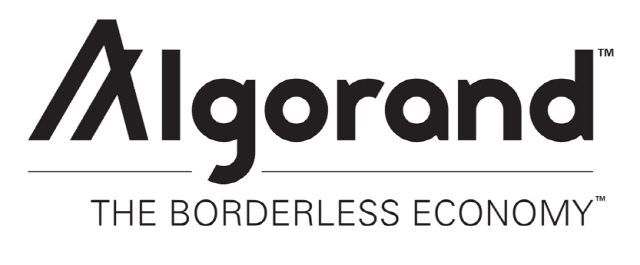

> 본 글은 Codestates BEB 코스의 자료에서 내용을 가져와 작성하였음을 알립니다. 

## Cardano
  

카르다노(에이다)는 3세대 블록체인으로 지분 증명 메인넷 중 가장 탈중앙화가 잘 이루어진 메인넷이다.  
블록체인 트릴레마의 해결을 위해 거래와 연산을 구분하는 2개의 레이어를 사용해 스마트 컨트랙트 사용에 따른 트랜잭션 체증을 방지하였다.  
또한, 우로보로스 지분증명(Ouroboros PoS)이라는 합의 알고리즘을 사용해 지분 증명의 예상되는 공격을 사전에 방지하여 안전성을 높였다.  
 
그러나 카르다노는 스마트 컨트랙트 도입에서 어려움을 겪고 있다.  
카르다노는 수년간의 개발을 통한 알론조 업그레이드로 네트워크에 스마트 컨트랙트를 도입하였으나 동시성 이슈로 인해서 스마트 컨트랙트 도입 시의 확장성의 문제가 대두되고 있다.  
이에 따라 현재 출시된 선데이스왑 등의 디앱에서 트랜잭션이 몰리면 처리 속도가 급격히 늦어지는 문제점이 발견되어 해결책이 필요한 상황이다.

> **Concurrency**  
> 동시성(Concurrency)은 두 개의 작업이 동시에 발생하는 경우를 일컫는다.  
> 두 개 이상의 프로그램이나 작업을 동시에 비동기적으로 실행할 수 있고, 그 두 작업 모두 최종 결과에 영향을 주지 않는다.  
>  
> 카르다노는 UTXO 기반인 EUTXO 모델로 구동한다.
>  
> EUTXO 모델은 자금을 주고받을 때 미사용 거래 금액(UTXO)으로 저장되고, 수행 시 각각 한 번만 사용할 수 있다.  
> 또한, 카르다노의 스마트 계약은 UTXO를 저장하고, 해당 스마트 계약에 저장된 UTXO를 사용할 수 있는 방법을 제어하는 특정 조건이 프로그래밍되어 있다.  
> 이는, 한 블록당 한 사람만 상호 작용이 가능하다는 것을 뜻한다.  
>  
> 이것을 카르다노의 동시성 문제라고 칭한다.  

---

## Algorand
  

알고랜드(Algorand)는 **블록체인의 트릴레마를 해결하기 위한 플랫폼**을 위한 암호화폐이다.  
알고랜드의 창시자이자 튜링상(Turing award)의 수상자이며 영지식증명(ZKP)의 권위자인 실비오 미칼리(Silvio Micali)는 알고랜드가 무허가형 순수지분증명(PPoS) 합의 알고리즘을 통해 블록체인이 트릴레마를 해결할 수 있다고 밝혔다.  
 
순수지분증명 방식은 두 단계로 진행된다.  
첫 번째 단계에서는 알고랜드 네트워크의 블록 생성자가 토큰 보유자 중에서 무작위로 한 명을 선정하고,  
두 번째 단계에서는 다시 무작위로 뽑힌 1천 명이 1단계에서 선정된 위원이 생성한 블록을 검증한다.  
 
이 방식에서는 매번 새로운 사람이 블록을 채택하기 때문에 보안성을 갖출 수 있게 된다.  
특히, 네트워크에서 전파되는 메시지는 위원회 선출을 통해 전파되지만, 공격자가 위원회를 공격하려 해도 그 시점엔 위원회 역할이 종료되어 안전하다.  
 
실비오 미칼리 교수는 "블록체인에서 어려운 것은 다음 블록을 생성하는 것"이라고 했는데, 이는 단순히 체인을 만들기는 쉬우나 누가 다음 블록을 선택할 것인가에 따라서 거래의 유용성과 효율성이 달라지기 때문이다.  
알고랜드는 이에 다음 세 가지 솔루션을 제시했습니다.

- **순수지분증명(Pure Proof of Stake)**   
모든 토큰에 할당된 권리는 같으며, 누구나 블록 생성에 참여할 수 있다. 또한, 체인의 개념에서 이슈가 되는 포크(fork)가 일어날 수 없다.  
- **즉각적인 제시와 합의(Immediate Propose & Agree)**  
한 명의 사용자만이 블록을 생성하는 것이 아닌 전체가 블록을 선택하고 생성한다.  
이 과정은 빠르고 정교하게 발생한다.  
- **진화하는 합의(Consensual Evolvability)**  
알고랜드의 합의는 99.9% 바로 이루어진다. 시스템을 개선해야 할 때도 공정한 과정을 통해 진행되며, 토큰 알고리즘과 통화 정책도 마찬가지다.  

지금은 3세대라 불리는 이오스, 스팀 블록체인과 차세대 블록체인으로 발표되고 있는 알고랜드는 지분증명(PoS, Proof of Stake) 합의 구조와 시스템적 차별성을 이용해 트릴레마를 해결하려는 노력이 계속해서 진행 중이다.

---

### Algorand's Trilemma Alternatives
비트코인의 주요 과제 중 하나는 확장성(Scalability)이다.  
비트코인 트랜잭션이 최종 상태로 확정되려면 약간의 시간이 필요하고, 시간을 가장 가치 있는 자산으로 꼽는 현대사회에서 이렇게 느린 과정은 용인될 수 없다.
 
확장성을 높이기 위한 대안으로 이더리움이 등장했지만,  
지분증명 컨센서스의 경우 부유한 노드 운영자가 네트워크를 통해 더 많은 권한을 가지므로 탈중앙화 수준이 저해된다.  
 
비트코인도 마찬가지이다.  
알고랜드 창업자는 비트코인이 탈중앙화 네트워크로 출발했지만,  
치열한 채굴 경쟁으로 인해 중앙집중화된 흐름을 설명한 바 있다.  
이는 비트코인 채굴 경쟁으로 인해 채굴 과정에 더 큰 비용이 필요해졌다는 것이다.
 
그렇다면 어떻게 블록체인의 보안과 탈중앙화에 영향을 미치지 않고 확장성을 보장할 수 있을까?  
 
우선 신속한 트랜잭션을 필요로 하는 전 세계적인 수요를 해결해야 한다.  
새로운 데이터를 추가하고 네트워크 내에서 공유하며 유효성을 검증하는 모든 과정이 빠르게 처리되어야 한다는 뜻이다.  
 
현재 시점을 기준으로 세상에 1초당 최소 1,000건의 트랜잭션을 처리할 수 있는 초당 트랜잭션 처리(TPS) 성능을 갖춘 원장이 필요하다.  
이상적으로는 평균 16,000TPS를 기록하며 40,000TPS까지 도달할 수 있는 신용카드와 경쟁해야 합니다.  
그러나 중앙집중화된 주체가 운영하는 신용카드와 달리 블록체인의 목표는 트랜잭션을 처리할 뿐만 아니라 공유, 게시, 검증 가능한 상태까지 유지하는 것이다.  
 
확장성이 뛰어난 블록체인 솔루션으로는 위임형 지분증명(Delegated Proof of Stake, DPoS)을 꼽을 수 있습니다. 이 경우 선별을 통해 정해진 검증자 그룹이 새 블록 추가를 처리한다.  
중앙집중식 기관보다는 민주적인 접근법이지만, 탈중앙화의 관점에서 이것으로는 부족하다.  
따라서 하나의 주체가 처리하는 것을 중앙집중화라고 하므로, 주체를 21명으로 늘린다고 해도 여전히 중앙화되었다고 볼 수 있다.
 
그렇다면 알고랜드는 어떻게 탈중앙화 수준을 유지하면서 확장성을 달성할까?
알고랜드는 임의성을 통해 블록체인 삼중고를 해결한다.
 
알고랜드는 새 트랜잭션(새 블록)을 추가하는 작업을 수행하는 검증자에 초점을 맞춘다.  
블록체인의 주요 목표는 분산화 수준을 유지하고 확장성을 허용하는 방식으로 검증자에게 블록 검증을 위탁하는 것이어야 한다.  
 
알고리즘은 모든 토큰 보유자 중에서 검증자를 임의로 선택하여 검증 작업을 수행한다.  
네트워크는 다음 노드 그룹을 자동으로 선정하는 알고리즘을 활용해 블록을 추가하도록 한다.  
이 접근 방식을 통하면 모든 사용자가 시스템에서 선택받을 수 있으므로 분산성이 유지된다.  
다음 검증자가 누구일지 아무도 모른다는 사실은 보안을 보장해 준다.  

> 보안 역시 삼중고에서 중요한 요소였다는 점을 기억하자.  

**임의성(Randomness)**은 목표로 하는 분산화 수준을 달성하고 네트워크가 "51% 공격"에 당하지 않도록 예방해 주는 강력한 도구이다.  
 
알고랜드 네트워크를 손상하는 유일한 방법은 토큰 보유자 중 자기 파괴적인 행동을 하는 보유자가 과반수를 차지하는 것뿐이다.  
토큰의 가치를 잃고자 하는 보유자는 없으므로 실질적으로 불가능한 일이다.  
 
유일한 문제는 무작위 선택을 보장하기 위해 신뢰할 수 있는 시스템이나 주체 유무이다.  
알고랜드에서 가장 중요한 요소도 바로 여기에 있다.  
알고랜드는 새로운 순수 지분증명(Pure Proof of Stake, PPoS) 컨센서스 알고리즘을 채택하여 삼중고를 해결하였기 때문이다.

---

### Operations
알고랜드에서는 전통에서 벗어난 작업을 수행한다.  
본질적으로 토큰 보유자는 무작위로 자신을 선택한다.  
 
생각해 보면 끔찍한 아이디어로 보일 수 있다.  
누군가 악성 행위자라고 가정해 보자.  
당사자는 검증 위원회의 일원이 되기 위해 계속해서 자신을 검증자로 선정할 것이다.  
 
여기서 주의할 점은, 창시자인 미칼리는 모든 토큰 보유자가 자기만의 추첨을 실행한다고 말했다는 것이다.  
즉, 슬롯머신의 레버를 한 번만 당기는 것과 같다.  
그러니 추첨 결과는 당첨과 탈락 중 하나로 결정된다.  
 
추첨에서 당첨되면 알고랜드에 다음 블록을 추가하고 트랜잭션이 정확한지 확인할 수 있는 1,000명의 토큰 보유자 중 한 명이 된다.  
미칼리는 이것이 암호화된 추첨이라고 설명했다.  
 
국가 전체에 비견될 정도로 강력하고 놀라운 컴퓨팅 파워를 갖춘다고 하더라도,  
토큰 중 하나가 추첨에서 당첨될 확률을 개선할 수는 없다.  
 
따라서 모든 사람이 레버를 당겨 추첨에 참여하지만, 다음 블록의 검증이 가능한 것은 1,000명의 당첨자뿐이다.  
1 마이크로 초만에 추첨이 이루어진다는 점을 고려하면 이러한 추첨 시스템은 확장성까지 갖추었다고 볼 수 있다.  

> [알고랜드 개요 유튜브 영상](https://www.youtube.com/watch?v=gACVKaNqxPs&ab_channel=Algorand)을 통해 더 자세한 내용을 확인할 수 있다.