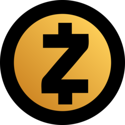

> 본 글은 Codestates BEB 코스의 자료에서 내용을 가져와 작성하였음을 알립니다.  

# PoS
  
지분 증명(PoS)은 Proof of Stake의 약자이며,  
해당 암호화폐를 보유하고 있는 지분율에 비례하여 채굴을 할 수 있게 해주는 합의 알고리즘이다.  
PoS는 컴퓨팅 파워 낭비가 심한 PoW와는 달리 자신의 지분(Stake),  
즉 **스테이킹(Staking)**한 자산의 양에 비례하여 블록을 생성(채굴)할 권리를 가질 수 있다.  
 
지분 증명(PoS)은 네트워크 참여자 모두가 블록을 생성할 기회를 얻게 되는 방식인데,  
가지고 있는 지분이 많으면 많을수록 블록 생성 기회를 더 얻을 수 있다.  
다시 말해 가진 재산에 비례하여 보상이 주어지게 되는 것이다.  
 
주주총회에서 주식 지분율에 비례하여 의사결정 권한을 가지는 것과 유사하게  
지분의 크기만큼 다음 블록의 블록 생성자로 선택될 확률이 결정되며, 블록 생성 권한과 거래 수수료를 보상으로 받게 된다.  
 
PoW처럼 무의미하게 논스값을 찾거나 할 필요가 없어서 경제적이고 친환경적이며,  
전체적으로 작업 증명(PoW)의 단점을 보완하는 합의 알고리즘이다.  
 
**스테이킹(Staking)**한 자산을 통해 블록을 생성하면 되기 때문에 비싼 하드웨어가 필요하지 않고,  
작업증명(PoW) 방식에 비해 전기를 많이 소모하지 않는다.  
코인을 일정 기간 네트워크에 스테이킹해야 하기 때문에 작업증명 방식과 비교했을 때, 다른 코인으로 이탈할 가능성이 적다.  

---

## Cons
- **불완전한 해결책**  
지분증명(PoS) 방식 시스템은 체인 선택에 대한 해결책만을 제시했다.  
그 외 나머지 문제점들에 대한 해답을 제시하진 못하였다.  
- **불공평한 경제 모델**  
이 시스템은 암호화폐 보유량에 비례하여 채굴할 기회를 제공하고 보상을 지급한다.  
다시 말해 소수의 사람에게 자금이 집중될 수 있다는 것을 의미한다.  
- **Nothing at Stake Problem**  
지분증명(PoS) 방식 최대의 문제점은 Nothing at Stake라고 하는 문제이다.  
Nothing at Stake는 위험에 노출되지 않는 문제를 뜻하며,  
블록 작성자가 네트워크 분기가 될 때 위험에 처하지 않다는 것을 뜻한다.  
쉽게 풀어 설명하면, 회사 사장님을 때려도 직장을 계속 다닐 수 있는 문제라는 비유가 있다.  
우리가 회사에서 사장님을 때리지 않는 이유는 그런 행동을 했을 경우에 직장에서 잘릴 수 있는 위험에 노출되어 있기 때문이고, 이런 위험은 우리가 나쁜 행동을 하는 것을 억제하고 있다.  

> **Nothing at Stake Problem 예시**  
> 지분 증명(PoS) 방식은 모든 노드가 제한 없이 여러 블록에 자신의 지분을 증명할 수 있기 때문에,  
> 만약 하나의 거래에서 서로 다른 거래내용이 발생한 경우,  
> 많은 지분을 가진 노드가 공격을 목적으로 두 개의 블록에 모두 증명해 놓고,  
> 거짓인 체인도 참인 것처럼 길게 체인을 형성시킬 수 있다.  
>  
> 블록에 새로 참여한 검증자(Validator)는 어느 것이 정당한 블록체인인지 알 방법이 없다.  
> 그래서 새로 많은 지분을 사들여 검증에 참여하는 노드가 거짓인 블록체인에 증명(합의)해버릴 경우,  
> 제대로 된 거래를 한 사람은 모두 공격에 당하는 꼴이 되는 것이다.  

---

## Ethereums PoW to PoS Transition
이더리움 개발팀은 이런 PoW에서 PoS로의 전환을 용이하게 하기 위해서 바로 전부 전환하지 않고,  
1%를 먼저 PoS로 전환하고 점차 그 비중을 늘리는 방식을 선택했다.  
 
그 과정에서 채굴 난이도가 급격히 상승하는 난이도 폭탄이 작동하도록 하여,  
PoW로 얻을 수 있는 코인 양을 급격히 저하시켜 PoW에서 PoS로의 전환이 자연스럽게 이행되게끔 설계되어 있다.  
 
또한 이더리움 2.0 세레니티 프로젝트에서 PoW→ PoS 전환을 시도하였다.  
> **캐스퍼 FFG (Casper Friendly Finality Gadget)**  
> 이더리움 체인에 완결성을 부여하는 이더리움 2.0의 핵심 기술 중 하나이다.  

32블록마다 PoS 체인에 자금을 예치해 놓은 validator들은 자신이 옳다고 생각하는 체인의 블록에 투표를 진행하고,  
2/3 이상의 동의를 받은 블록은 checkpoint가 되며,  
이후 완결성이 부여되어 이더리움 체인이 공격을 받게 되더라도 checkpoint 이전의 체인에 대한 공격이 불가하다.  

---

### Casper Project
이더리움의 합의 알고리즘인 PoW를 PoS로 전환하는 것을 목표로 하는 프로젝트이다.  
캐스퍼 네트워크는 캐스퍼 CBC 사양으로 구축된 최초의 라이브 베팅 증거 블록체인이다.  
Casper는 오늘날 기업과 개발자의 블록체인 기술 채택을 가속화하고 미래의 사용자 요구를 충족하도록 진화하도록 설계되었다.  

---

### Casper vs PoS
캐스퍼(Casper) POS 작동 방식의 핵심 중 하나가 악한 행위를 하는 검증인들을 처벌하는 것이다.  
검증인들은 블록을 검증 전에 자신의 이더 지분을 맡겨야 한다. (테스트넷에서는 최소 1,500이더 필요)  
검증인들은 체인에 연결될 것이라고 믿는 블록에 원하는 만큼 베팅을 한다.  
 
만약 자신이 베팅한 블록이 체인에 연결이 되면 검증인들은 베팅한 만큼 보상을 받는다.  
또한 기존 PoS 합의 알고리즘의 문제점을 보완하여,  
검증인들이 Nothing at Stake 문제와 같이 체인을 어지럽히는 악한 행위를 하면 처벌받는다.  
> 여기서 처벌이란 검증인들이 자신이 걸어 놓았던 지분을 몰수당하는 것을 의미한다.  

  

---

## Popular PoS Models  

|Ethereum|ZCash|Quantum(QTUM)|AD(Cardano)|Peercoin|Cosmos|
|:---:|:---:|:---:|:---:|:---:|:---:|
|||||||