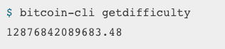
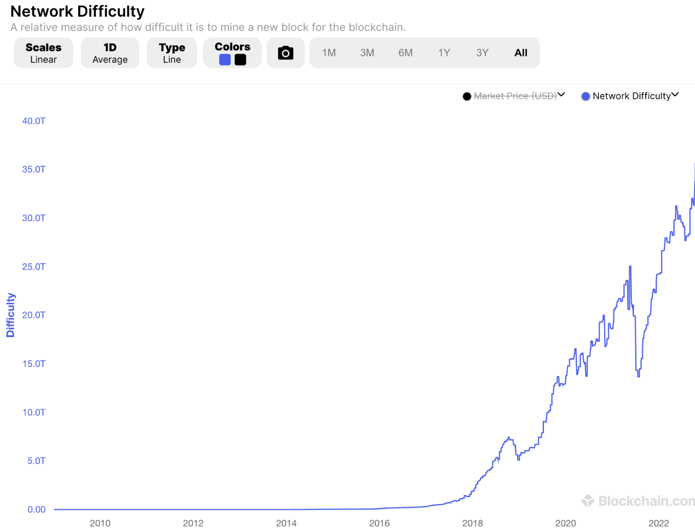

> 본 글은 Codestates BEB 코스의 자료에서 내용을 가져와 작성하였음을 알립니다.  

# PoW
작업 증명(PoW)은 Proof of Work의 약자이며, 유효한 블록을 만드는 데 충분한 계산 자원을 소모했다는 증명이다.  
PoW의 대표적인 코인에는 비트코인, 비트코인 캐시 등이 있다.  
<br>
  

---

## Nonce Value
비트코인에서 작업증명은 반복적인 과정을 통해 무작위로 **특정한 조건보다 낮은 값(Nonce)**을 찾아내어 그에 대한 대가로 비트코인을 받는 과정이다.  
<br>
이때 무작위의 논스값을 찾아내기 위해 비트코인에서는 SHA-256 방식을 이용하는데,  
이 과정에서 컴퓨터의 계산 능력이 필요하며, 서로 다른 컴퓨터가 같은 문제를 풀기 위해 경쟁한다.  
<br>
경쟁을 통해 결국 하나의 블록이 생성되므로, 블록 생성에 성공한 블록 외의 다른 컴퓨터가 사용한 전력은 고스란히 낭비된다.  
즉, 자신의 해시파워가 높을수록 원하는 값을 얻기가 쉬워지지만, 그러려면 엄청난 금액의 채굴기와 전기료를 감당해야 한다.  

```bash
작업 증명(PoW)의 식
여기서 N은 논스(Nonce)이고, P_hash는 이전 블록의 해시, Tx는 블록의 트랜잭션을 나타내며, 
Target은 네트워크의 난이도 목표값이다.

아래 식의 의미는 필드들을 연결한 값의 해시가 목표 해시값보다 작아야 한다는 뜻이다.
H(N || P_hast || Tx || Tx || ...Tx) < Target
```

위의 식에서 논스를 찾는 방법은 무차별 대입 방법밖에 없다.  
작업증명에서는 **특정한 조건보다 낮은 값**인지에 대해 식별할 때,  
앞에 붙은 0의 개수를 확인한다.  
목표 난이도보다 앞에 0이 많이 붙은 값을 발견하면, 이것이 곧 더 작은 값이기 때문이다.  
<br>
난이도가 올라갈수록 목표값으로 낮은 숫자(즉, 앞에 0이 많이 붙는 숫자)가 제공되어 논스값을 찾는기 어려워진다.  
이러한 규칙에 따라, 특정 개수의 0이 있는 패턴을 찾은 채굴자는 블록을 즉시 브로드캐스팅하고, 다른 노드들은 블록을 승인한다.  

---

### Example
아래에 8자리의 이진수 두 개가 있다.

1. 00000001 → 10진수: 1  
2. 00000100 → 10진수: 4  

위 1번과 2번 중 더 작은 수는 1번이다.  
즉 동일한 자릿수의 숫자를 비교할 때, 앞에 0이 많이 붙어있을수록 더 작은 숫자라는 것을 알 수 있다.  

**더 높은 난이도의 조건**  
1번보다 더 작은 수를 찾아야 한다고 해보자.  
이 경우 전체 경우의 수는 2^8 : 256이고, 1번보다 작은 수는 00000000 단 하나이다.  
이를 통해 무작위로 숫자를 뽑는다고 했을 때, 1번보다 작은 숫자가 나올 확률은 1 / 256이라는 사실을 알 수 있다.  
<br>
2번보다 더 작은 수를 찾아야 하자.  
이 경우 2번보다 작은 수는 00000000, 00000001, 00000010, 00000011 의 4가지로, 무작위 대입 시 조건을 만족할 확률은 1 / 64이다.  
<br>
위와 같은 사실을 통해 주어진 수보다 작은 값을 찾는 문제가 주어졌을 때,  
2번의 경우보다 1번의 경우(앞에 0이 더 많은 수)일 때 난이도가 더 높다는 것을 알 수 있다.

---

## Bitcoin Mining Algorithm
1. 비트코인 네트워크로부터 이전 블록의 헤더를 얻는다.  
2. 네트워크상에서의 트랜잭션 브로드캐스트팅 세트를 제안할 블록에 넣어서 합친다.
3. 블록 버전, 이전 블록의 블록 해시값, 머클루트 값, 타임스탬프, 난이도 비트, 새로운 논스를 합한 값에 SHA256 함수를 두 번 적용한다.  
4. 결과 해시값이 현재의 타깃 난이도보다 낮은지 확인하고, 낮으면 PoW를 푼 것이다.  
PoW 성공 시 발견된 블록은 네트워크에 브로드캐스팅되고 보상받는다.  
5. 결과 해시값이 현재의 타깃 난이도보다 높지 않다면, 위 과정을 반복하며 논스값을 증가시킨다.  

난이도 레벨은 비트코인 CLI를 통해 확인할 수 있다.  
<br>
  
<br>
이 숫자는 비트코인 네트워크상의 난이도를 나타낸다.  
타깃 난이도보다 낮은 해시값을 찾기가 얼마나 어려운지를 알려준다.  
이 숫자는 2,016블록마다(약 2주) 평균적으로 10분마다 새로운 블록이 발생하도록 조정하기 위해 변경된다.  
<br>
  

---

### Pros
가장 큰 장점은 높은 **보안성**이다.  
블록체인의 규모가 커질수록 블록체인의 취약점으로 알려진 51% 공격을 성공시키기 어렵다.  
<br>
51% 공격이란 악의적인 공격자가 그들의 행위를 성공시키기 위해서 51% 이상의 컴퓨팅 파워를 확보해야만 한다는 것이지만,  
현실적으로 작업증명에서 51% 이상을 획득하는 것은 천문학적인 비용이 발생하기 때문에 발생하기 매우 어렵다.

---

### Cons
- **개인 채굴자의 채굴 불가 문제**  
비트코인이 금전적 가치를 가지게 되면서 채굴농장이 생기게 되고, 이에 따라 개인 채굴자는 채굴할 수 없게 되는 문제가 생기게 되었다.  
그 과정은 다음과 같다.  
1. asic과 같은 채굴 전용 장비, 대규모 채굴농장, 채굴 풀의 등장으로 네트워크 전체의 해시파워가 심하게 증가했다.  
2. 네트워크의 해시파워가 높아질수록 채굴 난이도도 증가하게 된다.  
3. 이에 따라, 채굴에 필요한 자원의 양이 크게 늘게 되었다.  
4. 이에 따라 개인 채굴자는 쉽게 채굴하지 못하는 상황이 되었다.  

- **과도한 전력 소모로 인한 에너지 낭비 문제**  
위와 같이 전문화된 채굴농장을 유지하기 위해서는 수많은 컴퓨터를 연산에 사용하고 관리하는 등 상당히 많은 전력 에너지를 사용하게 된다.  
오늘날 비트코인 채굴에 소모되는 전력량은 연간 약 81.51테라 와트시로 추정된다.  
<br>
이는 연간 페루, 홍콩을 넘어 싱가포르의 연간 전력에 비슷한 수치이며, 
특히 사용하는 전기의 출처 중 석탄 등 재생 불가능한 자원이 높은 비율을 차지함으로 인해 환경오염 문제 또한 불거지게 되었다.  
<br>
이와 더불어 채굴농장 간의 단합으로 채굴권이 집중되는 문제가 발생하게 되고,  
결국 이런 이유로 인해 탈중앙으로부터 멀어지게 될 수도 있다.  

> **와트시(Wh)**  
> 1시간 동안 생산 또는 소비된 전력의 양(Quantity)을 의미한다.  
> 1W의 일률로 1시간 동안 일했다면 1Wh라고 한다.  
