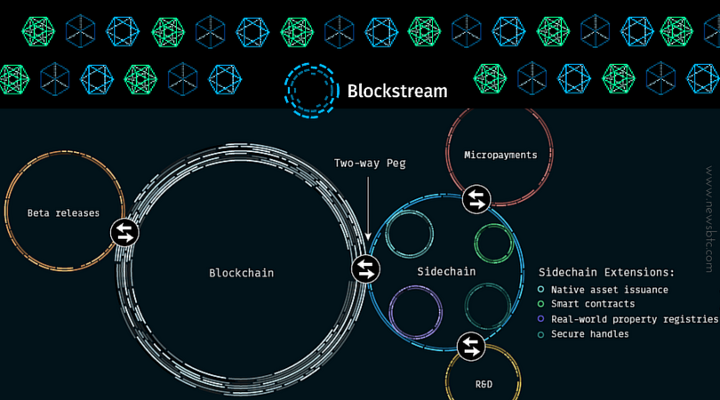

> 본 글은 Codestates BEB 코스의 자료에서 내용을 가져와 작성하였음을 알립니다.  

# Resolving Trilemma

---

## READ ME
  
 
블록체인과 암호화폐에 대한 관심이 높아지며 사용자와 거래 건수도 증가하고 있다.  
이처럼 증가하는 수요를 안정적으로 감당하려면 **확장성 문제**에 직면할 수밖에 없다.  
 
앞서 배운 것과 같이 현실적으로 블록체인 네트워크는,  
확장성, 보안성, 탈중앙성 3가지 요소 중 2가지 요소만 만족할 수 있다.  
 
이러한 한계를 극복하고자 블록체인 산업군에서는 **레이어1, 레이어2** 솔루션으로 분류되는 다양한 도전을 하고 있다.  

---

예를 들어, 기존 도로 위에 교통량이 많아지게 된다면, 자연스럽게 도로를 지나가는 데 많은 시간이 걸릴 것이다.  
도로가 수용할 수 있는 자동차의 수는 제한되어 있고, 증가하는 수요를 감당하기에는 한계가 있기 때문이다.  
 
이러한 교통 체증을 해결하는 방법은 무엇일까?  
 
첫째로, 도로를 넓혀 차선을 추가하는 방법이 있을 것이다. **(레이어1 솔루션)**  
둘째로, 추가 도로를 건설하거나 다른 교통수단을 추가하는 방법이 있을 것입니다. **(레이어2 솔루션)**

> 레이어1 솔루션이 기존에 우리가 알고 있는 **블록체인을 개선하는 것**을 의미한다면,
> 레이어2 솔루션은 이러한 **레이어1의 네트워크 위에서 작동하는 것**을 의미합니다.

---

## Layer 1 Solution
레이어1은 블록체인 네트워크 그 자체를 의미한다.  
대표적으로 우리가 이미 알고 있는 비트코인, 이더리움과 같은 블록체인을 의미한다.  
 
레이어1 솔루션은 기존의 블록체인의 규칙 또는 메커니즘을 **직접적**으로 개선하는 것을 의미한다.  
이러한 개선은 대부분 해당 블록체인을 직접적으로 개발하는 코어 팀에 의해 도입되는 경우가 많다.  

---

### PoS
비트코인과 이더리움은 둘 다 분산된 합의 알고리즘을 활용한다.  
하나의 트랜잭션을 처리하기 위해 여러 노드의 검증이 필요하고, 대표 블록을 선정하기 위해 수많은 연산을 요구한다.  
 
이러한 과정은 악의적인 공격에 비교적 안전하고, 정확하고 검증된 데이터를 기록할 수 있다는 장점이 있지만,  
속도가 느려서 더 많은 수요를 감당할 수 없다.  
즉, PoW(작업 증명)는 안전하지만, **확장성**이 떨어집니다. 대표적으로 비트코인의 경우 7TPS에 불과합니다.  
 
그렇기 때문에 많은 블록체인 네트워크(예. 이더리움 2.0으로의 업그레이드)가 지분증명(POS)으로의 전환을 시도하고 있다.  
채굴자가 상당한 컴퓨팅 연산을 사용하여 암호화 알고리즘을 해결하도록 요구하는 PoW 대신,  
PoS 합의 알고리즘은 네트워크 지분을 기반으로 검증인 상태를 결정한다.  
 
이는 이더리움 네트워크의 용량을 극적이고 근본적으로 증가시키는 동시에, 탈중앙화를 높이고 보안을 보장할 것으로 예상된다.  

---

### Sharding
샤딩은 기존 분산 데이터베이스에서 활용되는 솔루션이지만, 블록체인에도 도입되었다.  
다소 실험적인 특성에도 불구하고 현재 가장 인기 있는 레이어1 확장 솔루션 중 하나이다.  
 
샤딩은 트랜잭션을 **샤드(Shard; 조각)**라고 하는 더 작은 데이터 세트로 나눈다.  
이러한 샤드는 네트워크에서 동시에 병렬로 처리되므로 동시에 수많은 트랜잭션에 대한 순차적 작업이 가능하다.  
 
또한 각 네트워크 노드가 제네시스의 모든 블록 사본을 보유하도록 하는 대신,  
서로 다른 노드에 의해 분할되고 유지될 수 있게 하며 각 노드는 그 자체로 일관성을 유지한다.  
 
샤드는 메인 체인에 증거를 제공하고,  
교차 샤드 통신 프로토콜을 사용하여 주소, 잔액 및 일반 상태를 공유하기 위해 상호 작용한다.  

---

## Layer 2 Solution
레이어2는 **다른 블록체인 위에 구축된 네트워크**를 의미한다.  
이는 **레이어1 블록체인 위에서 작동**하며 확장성과 효율성을 향상하는 네트워크 또는 기술을 말한다.  
 
예를 들어, 비트코인은 레이어1 블록체인이고,  
라이트닝 네트워크는 비트코인 네트워크에서 트랜잭션 속도를 향상하기 위해 구축된 레이어2 솔루션이다.  
 
레이어2 솔루션은 최근 몇 년 동안 엄청난 성장을 이룩했으며,  
특히 PoW 네트워크의 확장성 문제를 극복하는 가장 효율적인 방법을 입증하고 있다.

---

### Rollup
롤업은 레이어1 외부에서 트랜잭션을 실행하지만, 레이어1에 트랜잭션 데이터를 저장하는 방식이다.
롤업은 레이어1 블록체인의 보안성은 건들지 않으면서도 확장성을 강화할 수 있다는 장점이 있다.  
 
롤업의 동작방식은 다음과 같다.
1. 레이어1 외부에서 트랜잭션 실행  
2. 트랜잭션 데이터는 레이어1에 저장
3. 레이어1의 트랜잭션 데이터를 사용하여, 레이어2에서 올바른 트랜잭션 실행할 수 있는 롤업 스마트 계약
 
롤업 기술은 대표적으로 두 가지로 나뉘는데,  
바로 **옵티미스틱 롤업(Optimistic Rollup)**과 **ZK롤업(Zero Knowledge Rollup, 영지식 롤업)**이다.  
 
`옵티미스틱 롤업`은 애플리케이션이 바로 상호 작용할 수 있게 해 주어 누구나 레이어1 클론에 연결할 수 있지만,  
`ZK롤업`은 자체 환경에서 독립적으로 존재하기 때문에 사용자들이 자체 롤업으로 애플리케이션에 연결해야 한다.  

---

### Nested Blockchain
중첩 블록체인은 메인 블록체인을 활용하여 더 넓은 네트워크에 대한 매개변수를 설정하고,  
실행은 보조 체인의 상호 연결된 웹에서 수행되는 분산형 네트워크 인프라이다.  
 
여러 블록체인 레벨이 이 메인 체인에 구축되며, 이러한 레벨은 부모-자식 연결을 사용한다.  
 
부모 체인 대리자는 자식 체인의 작업 결과를 다시 부모에게 보내는 작업을 수행한다.  
기본 블록체인은 분쟁 해결이 필요한 경우가 아니면 네트워크 기능에 참여하지 않는다.  
 
레이어2 중첩 블록체인 인프라의 대표적인 예로 OMG Plasma 프로젝트가 있다.  
OMG Plasma는 더 빠르고 저렴한 거래를 촉진하기 위해 만들어졌다.  
이 모델에 따른 작업 분배는 메인체인의 처리 부담을 줄여 확장성을 기하급수적으로 향상하게 한다.  

---

### State Channels
상태 채널은 기본적으로 두 사용자 간의 커뮤니케이션을 위한 양방향 채널로서,  
전체 트랜잭션 용량과 속도를 개선하기 위해 다양한 메커니즘을 사용하여,  
블록체인과 오프체인 트랜잭션 채널 간의 양방향 통신을 용이하게 한다.  
 
상태 채널은 트랜잭션을 검증하는 채굴 노드의 개입이 필요하지 않다.
상태 채널은 다중 서명 또는 스마트 계약 메커니즘을 사용하여 봉인된 네트워크 인접 리소스이기 때문이다.  
 
상태 채널을 열어서 참가자 간에 오프체인 트랜잭션을 수행 후,  
최종 결과에 해당하는 트랜잭션을 메인체인에 반영하여 기록한다.  
 
대표적으로 비트코인 라이트닝 네트워크, 이더리움의 라이덴(Raiden) 등이 상태 채널의 예이다.
트릴레마의 관점에서 상태 채널은 더 큰 확장성을 달성하기 위해 어느 정도의 탈중앙화를 희생한다.  

---

### Side Chain
사이드 체인(side chain)은 기존 블록체인의 확장성을 개선하기 위해 만들어진 체인이다.  
말 그대로, 기존 블록체인 옆(side)에서 대신 트랜잭션을 처리하는 역할을 한다.  
 
예를 들어, 기존에는 메인 체인에서 발행된 코인이나 토큰은 무조건 메인 체인을 통해서 거래할 수 있었다.  
따라서 거래 당사자는 메인 체인의 느린 속도와 비싼 수수료를 부담해야 했다.  
 
사이드 체인은 이러한 문제를 해결한다.  
사이드 체인은 메인 체인에 output 주소와 input 주소를 가지고 있다.  
 
거래 당사자가 사이드 체인의 output 주소로 자신의 코인을 보내면, 메인 체인에서 해당 코인은 사용할 수 없도록 잠기게 된다.  
대신, 동일한 양의 코인이 사이드 체인의 거래 당사자 주소로 발행된다.  
 
사용자는 비교적 높은 확장성을 가진 사이드 체인에서 거래를 진행한다.  
거래를 완료한 후, 사이드 체인에 있는 자신의 코인을 메인 체인으로 올리고 싶다면,  
메인체인에 있는 사이드 체인의 input 주소로 요청을 보내면 된다.  
 
이렇게 사이드 체인은 독립적인 네트워크로 존재하는 동시에, 메인 체인의 확장성 문제를 해결하는 데 사용된다.  

---

## Wrap Up
레이어1, 레이어2 솔루션 모두 각각의 장단점이 존재한다.  
 
레이어1 솔루션은 대규모 네트워크 개선을 효과적으로 할 수 있다는 장점이 있지만,  
기존 채굴자들 입장에서는 인센티브가 축소될 수 있는 여지가 있다. (PoW → PoS)  
 
레이어2 솔루션은 훨씬 빠르게 확장성을 향상할 수 있다는 장점이 있지만,  
사용하는 방법에 따라 기존 블록체인의 보안성을 희생해야 할 수도 있다.  
 
이미 수많은 거래가 이루어지며 운영되고 있는 비트코인과 이더리움 같은 블록체인을 개선하기란 쉽지 않은 일이다.  
이러한 솔루션이 실제로 확장성 트릴레마를 해결 못 할 수도 있기 때문이다.    
 
혹자는 “가장 좋은 솔루션은 이러한 솔루션이 내장된 새로운 블록체인(프로토콜)을 만드는 것이다.”라고도 한다.  