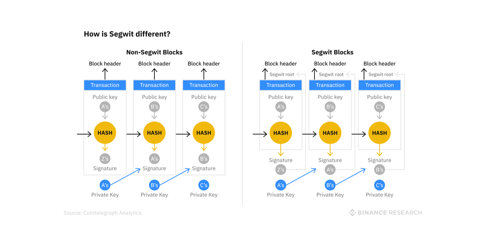
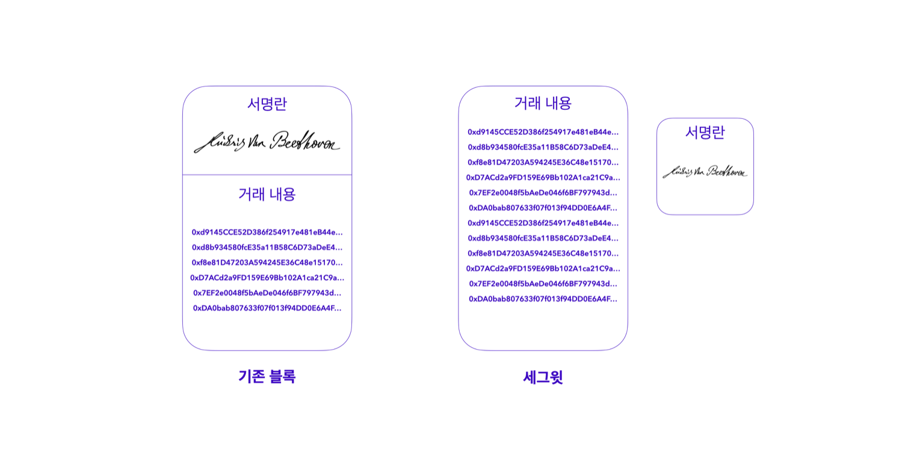
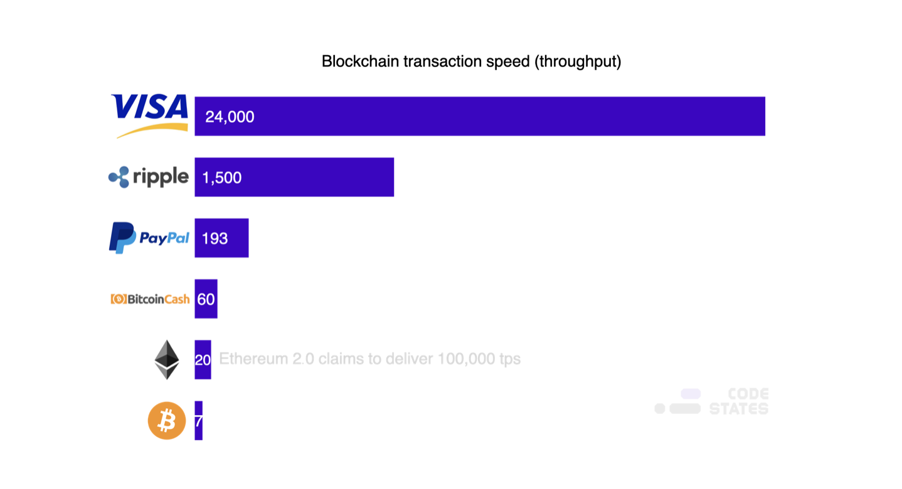

> 본 글은 Codestates BEB 코스의 자료에서 내용을 가져와 작성하였음을 알립니다.  

# Read Me
2009년 비트코인이 등장한 이래로, 블록체인을 실생활에 도입하기 위해 전 세계에서 다양한 시도를 하고 있다.  
비트코인에서도 네트워크 사용량 급증에 대응하기 위해 TPS(초당 트랙잭션 처리 수)를 늘리는 등,  
확장성을 개선하기 위한 여러 시도를 하였다.  
 
속도와 확장성 개선을 위한 여러 시도 중, 가장 대표적인 기술이 `SegWit`이다.  
지금부터 세그윗의 도입 배경과 특징을 확인해보자.  

---

## Background

---

### Time Consumption
비트코인은 매우 느리고 제한된 서비스이다.  
비트코인에서는 블록을 생성할 떄 약 10분 정도 소요되도록 설계되었다.  
다시 말해, 비트코인에서 거래를 기록하기 위해서는 최소 10분 이상 소요된다.  

> 트랜잭션이 바로 블록에 올라가지 않는다면, 20, 30분이 걸릴 수도 있다.  

또한 트랜잭션이 블록에 올라가도, 체인 재구성으로 인해 블록 자체가 취소되는 경우도 있다.  

> 일반적으로 체인 재구성이 일어나도 블록이 취소되지 않는 시점은,  
> 블록 생성 이후, 뒤어어 6개의 블록이 추가된 떄로 보고 있다.  
> 즉, 블록이 올라가고, 60분을 더 기다려야 블록이 취소되지 않는 셈이다.  

- 트랜잭션 : 거래기록, 약 10분 단위로 저장한다. (블록 생성)  
- 승인 : 안전한 거래를 위해서는 최소 6번의 승인 필요

결론적으로 트랜잭션을 안전하게 처리하기 위해서 **약 1시간 이상 소요**된다는 문제점이 있다.  

---

### Storage
또한 **블록 용량 문제**도 있다.  
비트코인의 블록 크기는 약 1MB이기 때문에, 한 블록에 담을 수 있는 트랜잭션의 개수도 그만큼 제한된다.  
 
비트코인이 대중적으로 알려지지 않았을 떄는 이 1MB 블록 크기가 큰 문제가 되지 않았으나,  
시간이 흐르면서 비트코인 네트워크 사용량이 급증하자 문제가 생겼다.  
 
비트코인 네트워크 사용량은 늘어났지만, 한 번에 처리할 수 있는 데이터는 제한되어 있다 보니,  
트랜잭션 하나를 처리하기 위해 오랜 시간을 기다려야 하는 문제가 발생했다.  
 
위와 같은 문제로 인해 비트코인은 화페 시스템으로 부적합하다는 평가를 받기도 한다.  
트랜잭션 처리 속도와 확장성 문제로 인해 결제 및 송금 서비스와 같은 실생활에 적용하기엔 부적합하기 때문이다.  
 
블록체인을 지역과 국가를 벗어난 탈중앙화 금융 시스템으로 사용하기 위해서는,  
강력한 탈중앙화, 보안, 초당 3,000건 이상의 트랜잭션을 처리할 수 있는 속도, 확장성이 필요하다.  

> 속도와 확장성의 차이
> |속도|확장성|
>|:---:|:---:|
>|합의에 도달하여 거래기록이 장부에 기록되는 데 걸리는 시간|갑자기 많은 트래픽이 발생했을 경우 지연 없이 서비스 연속성이 보장되는 성질|

블록체인의 속도와 확장성을 개선하기 위한 방법은 크게 4가지로 구분된다.  
1. 블록의 용량 증대 : 가용 용량 늘리기  
2. 블록체인 기술 도입 : 샤딩, etc.  
3. 블록체인 외부와 연계 : 레이어 2 솔루션  
4. 합의 알고리즘 재설계  

여기서 `SegWit`은  `1. 블록의 용량 증대`를 통한 개선 방법 중 한자이다.  

---

## SegWit
  
`SegWit`이란, Segregated Witness의 약자로,  
**비트코인의 블록에서 디지털 서명 부분을 분리함으로써 블록당 저장 용량을 늘리는 소프트웨어 업그레이드**를 말한다.  
 
즉, 고정된 블록의 가용 공간을 늘려서 속도를 개선하는 것입니다.  

---

### Existing Issues
기존 비트코인의 블록 구조는 다음과 같았다.  
|**데이터 종류**|**비율**|
|:---:|:---:|
|디지털 서명 데이터|75%|
|그 외 데이터|25%|

거래하기 위해서는 거라하는 당사자의 서명의 필요하다.  
서명은 신원을 증명하는 것인데, 디지털 서명은 이를 컴퓨터 상에서 숫자 등으로 암호화하여 만든다.  
 
디지털 서명이란, 송신자의 개인키로 암호화한 메시지를, 수신자가 송신자의 **공개키로 해독**하여 송신자의 신원이 일치하는지 확인하고 증명한다.  
비트코인 블록은 디지털 서명을 저장하는 공간, 그 외 데이터(트랜잭션 등)로 구성된다.  

  
서명란에 실제 서명 데이터가 차지하는 크기는 크지 않지만, 서명란 자체가 차지하는 부피가 크다.  
세그윗은 서명 부분을 따로 `Witness`라는 데이터 영역으로 분리해 더 많은 거래를 처리할 수 있도록 업데이트한다.  
 
단순히 블록의 크기를 늘리는 것도 방법이 될 수 있지만,  
블록의 크기가 더 커지면 더 많은 해시파워를 요구하고,  
소수의 해시파워를 가진 패굴 노드들로 인해 탈중앙화에서 점차 멀어질 수 있다.  

> **[Hash Power](http://wiki.hash.kr/index.php/해시파워)**  
> 해시파워는 블록체인 네트워크에서 채굴자들이 가지고 있는 채굴 역량이다.  
> 수학 문제를 푸는 속도를 의미하기도 하는데,  
> 해시파워가 높을 수록, 초당 계산할 수 있는 문제가 ㅁ낳이지므로 더 빠르게 채굴을 할 수 있다.  

전체 블록의 크기가 1MB인데, 그 중 디지털 서명 데이터가 75%를 차지하였기 때문에,  
당시 비트코인은 초당 처리할 수 있는 트랜잭션이 단 7TPS 정도로 확장성이 매우 제한적이었다.  

---

### Improving Scalability
비트코인 관련 커뮤니티에서는 **디지털 서명 데이터를 별도의 공간에 저장하고, 대신 블록에 더 많은 트랜잭션을 담자**는 `SegWit`이라는 제안이 나왔다.  
세그윗을 통해 디지털 서명 데이터만큼의 블록 저장 용량을 늘리기를 시도한 것이다.  
 
그렇다면 디지털 서명 데이터는 어디에 저장될까?
 
각 트랜젝션에 있는 디지털 서명 데이터는 `Merkle Root`형태로 저장되며,  
머클 루트 형태로 저장된 디지털 서명 데이터를 `Witness Merkel Root`라 한다.  

> Coin-base Transaction : 블록을 생성한 채굴자에게 보상을 주기 위해 비트코인에서 코인을 생성해 제공하는 트랜잭션.  
> 보통 블록의 가장 첫 번째 트랜잭션으로 들어간다.  

이때 `우지한`을 비롯한 채굴 세력들을 주축으로 비트코인 시스템에서 블록의 크기 자체를 늘리자는 하드포크 방식도 제안되었다.  
하지만 비트코인 커뮤니티는 보다 안정적인 개선이 가능한 세그윗, 즉 `소프트 포크` 방식을 택하게 되었다.  
 
비트코인은 2017년 8월 1일 업그레이드를 진행하였다.  

> **SegWit을 처음으로 활성화한 암호 화폐는?**
> 기존의 비트코인에서 세그윗을 처음으로 활성화한 암호화폐는 `Groestlcoin`이다.  
> 그로스톨코인은 개인정보 보호를 지향하며, 수수료가 거의 없고, 안전한 코인을 목표로 한다.  

> **우지한을 비롯한 채굴 세력들은 왜 세그윗에 반대했는가?**
> 세그윗을 진행할 경우, 중국의 채굴업자들이 사용하던 `AsicBoost`방식의 비트코인 채굴이 불가능해지게 된다.  
> 이에 `Antpool`, `viaBTC` 등 중국의 채굴업체들을 중심으로,  
> 기존 `ASIC` 채굴기를 사용한 비트코인 채굴을 지속하기 위해,  
> 기존 비트코인을 하드포크시켜 블록 용량을 8MB로 늘린 `Bitcoin Cash(BCH)`라는 새로운 암호화폐를 생성하였다.  

---

## Features
세그윗의 특징은 다음과 같다.  
- Scalability : 거래 속도와 확장성 문제를 해결  
- Transaction Malleability : 거래 가변성 문제를 해결  
- Version Compatibility : 버전 호환  

  

---

### Scalability
위 그림과 같이, 비트코인은 1초에 7개의 거래밖에 처리하지 못한다.  
이는 `visa`나, `master card`와 같은 금융기관이 처리하는 양에 비해 현저히 적은 수치이다.  
 
이를 **거래 속도의 확장성 문제**라고 한다.  
세그윗은 비트코인의 고질적인 확장성 문제를 개선하기 위해 도입되었다.  

---

### Transaction Malleability
모든 비트코인 거래는 해당 거래를 식별할 수 있는 거래의 `ID(Transaction ID: TXID)`를 포함한다.  
`TXID`가 `ID` 라면, TXID를 따라다니는 `디지털 서명`은 `비밀번호`라 할 수 있다.  
 
**거래 가변성**은 실질적인 거래 내용에는 변화가 없지만, 거래 ID(TXID)만 변경하여,  
새로운 거래를 만들어 낼 수 있는 일종의 버그이다.  
 
이를테면, 아래와 같은 flow가 있다.  
1. `유저1`은 `유저2`에게 1BTC를 송금한다. 이를 거래 `A`라고 한다.  
2. 1BTC 송금을 확인한 유저2는 해당 거래의 TXID만 바꿔서 거래 `B`를 만들어낸다.  
3. 유저2가 만들어 낸 거래가 네트워크에 전파되고 검증된다.  
4. 유저2는 유저1에게 거래 `A`의 TXID를 확인할 수 없다며 따진다.  
이미 거래 `B`를 통해 1BTC는 지급된 상태이다.  
5. 유저1은 유저2에게 다시 1BTC를 송금한다.  

즉, 위와 같이 두 개 이상의 거래 ID로 서로 다른 거래처럼 보이지만,  
실제 거래 내역은 동일한 거래를 가질 수 있는 것이 가변성의 문제이다.  
 
이러한 문제를 막기 위해, 서명을 거래와 따로 분리하자는 의견이 제시되었고,  
이것이 바로 세그윗이다.  
 
세그윗이 TXID를 따로 보관하고 관리함으로써,  
여러개의 ID를 가지고 조작할 수 없도록 (동일한 거래 내역을 여러개 만드는 등) 방지할 수 있다.  

---

### Version Compatibility
세그윗은 하드포크가 아닌 소프트포크이다.  
 
비트코인 소프트웨어의 업그레이드를 하지 않아도,  
세그윗 이전과 세그윗 적용 버전을 모든 노드에서 사용할 수 있다.  
 
`0.13.1`버전 이전의 비트코인 코어(비트코인 소프트웨어)는 크기가 1MB 이상인 블록을 읽을 수 없지만,  
디지털 서명 부분만 빠져있기 때문에 호환이 가능하다.  
 
단, 서명 부분이 빠져있기 때문에 구버전의 노드는 이를 검증하지 않고 그냥 받아들이지만,  
세그윗이 적용된 버전의 노드들은 디지털 서명을 사용해 신원을 증명한다.  

---

## Wrap Up
|**블록 용량 증가**|**트랜잭션 속도 증가**|**트랜잭션 가변성 해결**|
|:---:|:---:|:---:|
|디지털 서명 데이터 분리|더 많이 저장할 수 있는 블록을 통해 트랜잭션 속도를 증가|서명이 더 이상 트랜잭션 데이터의 일부가 아니기 떄문에 데이터를 변경 불가|
|실질 블록 크기는 1MB에서 4MB까지 증가|하나의 트랜잭션에서 30달러 이상에서 1달러 미만으로 절감|서명 조작 불가|

> **SegWit vs SegWit2x**
> 세그윗은 소프트 포크 업그레이드이며, 이는 이전 버전과 호환이 가능함을 의미한다.  
> 즉, 세그윗을 포함하도록 업데이트되지 않은 비트코인 노드도 여전히 트랜젝션을 처리할 수 있다.  
> 그러나 하드포크가 필요한 `SegWit2x(S2X)`라는 또 다른 세그윗이 제안되었다.  
>  
> 세그윗과 세그윗2x의 주된 차이점은,  
> 세그윗2x는 단지 트랜잭션을 일괄 처리하는 방식을 변화시킬 뿐만 아니라,  
> 블록 크기를 1MB에서 2MB로 증가 시킨다는 것이다.  
> 그러나 블록 크기가 더 커지면, 더 많은 데이터를 처리해야 하므로, 노드 운영자와 마이너의 부담이 증가한다.  
>  
> 또 한 가지 주목할만한 차이점은, 세그윗 제안은 비트코인 커뮤니티의 지지를 얻고 시행되었다는 것이다.  
> 해당 에피소드는 `UASF(User-Activated Soft Fork)`의 개념을 만들어 냈는데,  
> 이는 사용자 활성 소프트 포크를 뜻한다.
>  
> 반면, 세그윗2x는 비트코인 거버넌스의 기본 규칙 중 하나에 실질적인 변화를 제안했다.  
> 그러나 개발자들이 채택과 이행에 대한 합의를 달성하지 못했기 때문에,  
> 세그윗2x 움직임은 결국 중단되었다.  