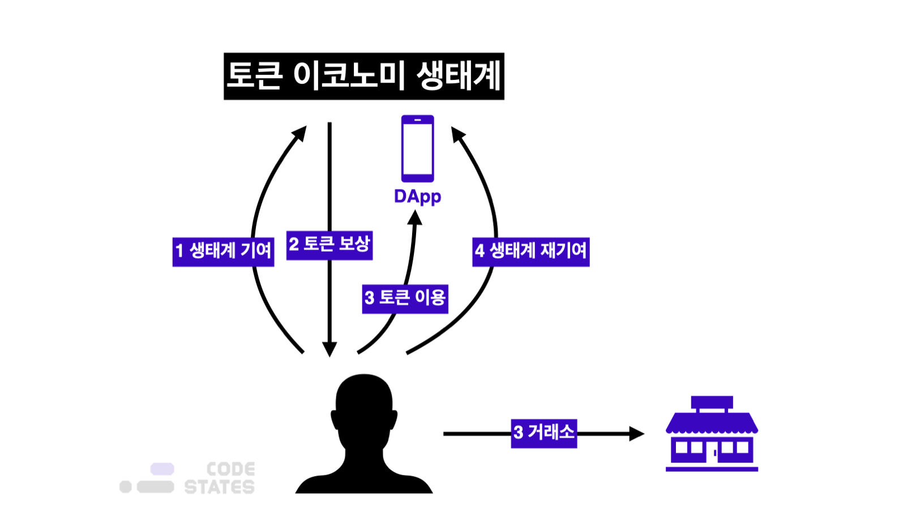

> 본 글은 Codestates BEB 코스의 자료에서 내용을 가져와 작성하였음을 알립니다.  

# Read Me
토큰 이코노미가 무엇인지 알아보고, 토큰 이코노미와 크립토 이코노미가 무엇이 다른지 알아보자.  

---

## Etymology
토큰 이코노미는 행동 심리학에서 나온 용어이다.  
위키피디아에서는 토큰 이코노미를 다음과 같이 정의한다.  

> "A Token economy is a system of contingency management based on the systematic reinforcement of **target behavior.**  
> The reinforcers are symbols or "**tokens**" that can be exchanged for other **reinforcers.**  
> A token economy is based on the principles of operant conditioning and behavioral economics can be situated within applied behavior analysis."  

즉, 토큰 이코노미는 특정한 목표 행동을 끌어내기 위해,  
목표 행동을 수행했을 때마다 '토큰'을 보수로 주고,  
그 토큰을 유/무형의 가치와 교환함으로써 목표 행동을 강화하는 방법이다.  

---

## The Three Elements
토큰 이코노미를 구성하는 세 가지 요소를 더 자세히 알아보자.  
- **Tokens**  
토큰은 물질적 강화제, 서비스, 또는 권한 등과 교환될 수 있는 물건이나 상징이다.  
토큰 그 자체는 가치가 없지만, 강화제(~~10개를 모으면 치킨이 공짜!~~)와 교환할 수 있기 때문에,  
가치를 지니게 된다는 점에서 토큰은 주요 강화제와 대비되는 보조 강화제라 볼 수 있다.  
- **Back-up Reinforcers**  
강화제는 특정 행동에 대한 보상으로, 토큰과 교환할 수 있는 것을 의미한다.  
강화제는 물건이 될 수 있지만, 무형의 형태일 수도 있다.  
 
토큰 이코노미에서는 특정 목표 행동을 하도록 보상을 마련하고,  
목표 행동을 수행했을 때 토큰을 지급하여, 토큰을 통해 보상을 획득할 수 있도록 한다.  
이때, 목표 행동을 하도록 동기부여하는 것이 바로 강화제인 것이다. (~~치킨~~)  
- **Specified Target Behavior**  
특정 목표행동은 토큰 이코노미가 마련된 환경 또는 생태계에서 수행해야 하는 바람직한 행동을 의미한다.  
생태계에서는 수행자가 특정 목표 행동을 하도록 토큰과 강화제를 통해 유도한다.  

---

## Problems  
행동 심리학에서의 토큰 이코노미의 네가지 문제점이 있다.  
1. **토큰의 교환가치가 비합리적인 경우**  
토큰 자체에 가치가 별로 없거나, 너무 조금 주는 바람에 사용자가 토큰을 받는, 받지 않든 큰 이익을 보지 않는 경우이다.  
사용자는 토큰을 받아 봤자 자신에게 충분한 이익이 되지 안흔ㄴ다고 생각하면, 토큰 보상에 대해서 별로 신경쓰지 않을 것이다.  
2. **토큰의 발행/지급/기록이 투명하지 않은 경우**  
토큰을 누가, 언제, 왜 발행했는지 공개하지 않는다면, 토큰 시스템 자체를 불신하게된다.  
토큰의 지급 경로를 모르면, 토큰을 발행하는 주체가 공정하게 토큰을 발행하고 있는지 알 수 없기 때문이다.  
3. **토큰의 교환가치 또는 비율에 일관성이 없는 경우**  
토큰 시스템 자체가 공정하지 않은 경우이다.  
4. **미래 교환가치에 확신이 없는 경우**  
토큰 시스템이 지속되지 않는 경우도 있다.  
특정 토큰 시스템의 인기가 떨어진다면, 토큰의 가치 역시 지속해서 하락할 것이다.  
공급에 비해 수요가 없기 때문이다.  
 
사람들은 토큰의 가치가 하락하는 것을 보고, 미래에 토큰의 가치가 유지되지 않으리라 판단할 수 있다.  
이 경우, 가지고 있는 토큰을 빠릴 강화제로 바꾸고, 더 이상 토큰을 구하기 위해 특정 목표 행동을 취하지 않을 것이다.  

---

### Central Authority
토큰 시스템에서 위의 네 가지 문제가 발생하는 이유는,  
토큰의 발행, 지급, 교환가치 주체가 **중앙 주체**라는 특성 때문이다.  
 
중앙 주체는 마음만 먹으면 토큰 발행 비율을 조작하거나,  
자신의 이익에 따라 규칙을 어기고 특정 사람 또는 단체에 토큰을 발행할 수 있다.  
 
따라서 토큰 시스템의 **지속적인 신뢰성**을 구축하기 위해서는,  
아주 신뢰도가 높은 관리자를 선정하는 등, 투명성을 확보하기 위해 많은 노력을 기울여야 한다.  

---

## In Blockchain
블록체인 기반 토큰 이코노미는 기존 토큰 시스템의 문제점을 해결할 수 있다.  
먼저, 블록에서의 토큰 이코노미가 어떻게 동작하는지 알아보자.
 
블록체인에서 토큰 이코노미는 블록체인 네트워크 위의 경제 구조 전체를 의미한다.  
  

1. 사용자가 토큰 이코노미가 적용된 생태계에 '특정 목표 행동'을 수행하여 생태게에 기여를 한다.  
2. 해당 플랫폼에서는 기여에 대한 보상으로 토큰(강화제)를 지급한다.  
3. 사용자는 금전적 가치를 지니는 토큰을 다시 생태계 내에서 사용하거나, 혹은 거래소를 통해 거래하여 이득을 취한다.  
4. 특정한 행동을 했을 때 보상(토큰)을 지급받기에, 사람들은 특정 목표 행동을 재수행하여 생태계에 재기여한다.  

이 과정을 통해 사용자는 금전적 이득을 취하고, 플랫폼은 자신들의 생태계가 활성화된다.  

---

### Actions with Tokens
심리학에서의 토큰 이코노미와는 다르게, 블록체인에서 토큰은 강화제와 별개가 아니라,  
**토큰 그 자체가 금전적인 가치**를 지니고, **시장에서 가격이 정해진다**는 차이가 있다.  
 
즉, 사용자가 기여한 만큼 받은 **토큰 자체에 환금성과 유동성**이 있는 것이다.  
토큰 자체에 시장에 생기다 보니, 사용자는 이 토큰을 가지고 세 가지 액션을 취할 수 있게 된다.  

1. **Hold (토큰 보유)**  
토큰의 생태계가 점점 더 커지고, 사용자가 많아진다면 토큰에 대한 수요도 많아지게 된다.  
토큰에 대한 수요가 많아지면, 공급에 비해 수요가 높아지기 때문에 토큰의 가격이 올라간다.  
이것을 기대하고 사용자는 자신이 받은 보상으로 계속 토큰을 가지고 있을 수 있다.  
2. **Exchange (토큰 교환)**  
생태계가 불안전하거나 토큰 이코노미가 견고하지 못한 경우, 토큰 가격이 불안정해질 수 있다.  
이 경우, 사용자는 보요하고 있는 토큰을 비교적 안정적인 화폐로 교환하여 원하는 상품이나 서비스를 구매한다.  
3. **Use (토큰 사용)**  
해당 토큰을 발행하는 플랫폼에서 생태계를 활성화하기 위해 플랫폼 자체에서 토큰을 사용하도록 할 수도 있다.  
또는 사용자가 다른 블록체인 서비스의 토큰과 보유하고 있는 토큰을 교환하여, 해당 블록체인 서비스를 이용할 수도 있다.  

---

## Resolving Problems
앞서, 행동 심리학에는 네가지 문제점이 있었다.  
1. 토큰의 교환가치가 비합리적인 경우
2. 토큰의 발행/지급/기록이 투명하지 않은 경우
3. 토큰의 교환가치 또는 비율에 일관성이 없는 경우
4. 미래 교환가치에 확신이 없는 경우.  

각 문제를 어떻게 해결하는지 확인해보자.  
1. **토큰의 교환가치**  
기본적으로 블록체인 기반 토큰 이코노미에서 토큰이자 강화제인 토큰의 가치는, 시장의 공급과 수요에 의해 정해진다.  
따라서 현실의 서비스/재화와의 교환가치가 합리적일 수밖에 없다.  
2. **블록체인 기술을 활용한 투명성 확보**  
블록체인은 한 번 기록된 데이터에 대해서는 수정 또는 삭제가 거의 불가능하다는 특정을 가지고 있다.  
또한 퍼블릭 블록체인의 경우, 모든 거래내역이 공개되어 있어 누구나 거래내역을 확인하고 검증할 수 있다.  
3. **탈중앙화된 토큰 관리 주체**  
기존 토큰 이코노미에서는 토큰을 발행해고 관리하는 주체가 중앙화되어 있었다.  
이로 인해 중앙 관리 주체가 임의로 토큰 분배 비율을 바꾸거나, 토큰 시스템 자체를 불공평하게 바꿀 수도 있다.  
결과적으로 생태계 참여자들이 토큰을 불신하여 생태계를 떠나버리는 문제가 발생한다.  
 
그러나 블록체인에서는 토큰을 '스마트 컨트랙트'로 관리한다.  
생태계 참여자들은 계약을 할 떄 합의한 규칙을 스마트 컨트랙트로 만들어 블록체인에 올린다.  
누구나 블록체인에 올라간 스마트 컨트랙트를 보고 실행할 수 있기 때문에,  
공정하면서도 중앙 주체를 신뢰할 필요가 없는 구조가 된다.  

---

## Purpose
블록체인 생태계에서 토큰 이코노미의 목적은 **인센티브를 통한 네트워크의 확장**이다.  
네트워크 확장이라는 목표 하에, 토큰 이코노미는 일종의 선순환 구조를 만든다.  
 
블록체인 네트워크는 참여자가 ㅁ낳아질 수록 네트워크의 사용서오가 범용성이 더 좋아진다.  
따라서 네트워크 참여자가 많아져 생태계가 활성화되면 토큰 자체의 가격이 올라, 생태계 참여자는 더 많은 인센티브를 얻는다.  
 
또한 네트워크 초기에 토큰 가격이 낮을 때 참여하는 사람이 더 많은 인센티브를 얻어갈 가능성이 높다.  
따라서 블록체인 네트워크를 만드는 개발팀이 처음 겪에 되는 "닭과 달걀의 문제",  
즉, "사용자를 유입하는 것이 먼저인지, 네트워크의 가치를 높이는 것이 먼저인지"의 문제로 해결된다.  
네트워크를 구성하고 나면, 사람들은 더 많은 인센티브를 얻기 위해 초기에 네트워크에 참여하기 때문이다.  
 
비트코인이 대표적인 예이다.  
비트코인 네트워크 참여자들은 '채굴'이라는 행위를 통해 비트코인 네트워크의 보안을 유지하는 목표 행동을 수행한다.  
대신, 비트코인 채굴 보상과 거래 검증 수수료를 인센티브로 받게 된다.  
채굴자들은 비트코인 생태계에 참여하여 사용 가치를 얻는 대신, 네트워크의 가치를 올린다.  
 
토큰에 투자한 투자자들은 수익 창출을 위해 토큰을 교환한다.  
이 교환 행위 자체가 시장에 유동성을 공급하여 토큰의 사용성을 높이는 역할을 한다.  
 
즉, 각자의 인센티브가 전체 네트워크의 인센티브로 직결되는 구조가 되는 것이다.  

---

## Design
네트워크를 확장한다는 목표를 달성하기 위해서는 생태계 참여자들에게 매력적인 인센티브를 제공하는 구조를 만들어야 한다.  
블록체인 상에서 토큰 이코노미를 설계하기 위해서 고려할 점은 다음이 있을 수 있다.  

- 보상(토큰)은 어떤 기준으로 어떤 참여자들에게 줄 것인가?  
- 어떻게 토큰이 가치를 갖게 할 것인가?
- 사람들이 토큰을 보유해야 할 유인은 무엇인가?
- 토큰의 발행량은 얼마로 하고 어떻게 분배할 것인가?
- 네트워크의 성장과 토큰의 가치 상승을 어떻게 연동할 것인가?
- 토큰의 가격 변동성은 어떻게 해결할 것인가?  

이러한 고민에 명확한 정답이 있는 것은 아니다.  
그러나 시중에 나와 있는 여러 블록체인 서비스는 이러한 문제를 각각 나름의 방법으로 해결하려 노력하고 있다.  

---

## Further Study
- 블록체인 플랫폼의 토큰 이코노미의 구조를 그려보기
- 블록체인 플랫폼의 토큰이 어떻게 가치를 가지는지 알아보기
- 토큰의 발행량과 분배량 조사하기
- 해당 플랫폼이 활성화 되었거나, 점점 비활성화되어 간다면, 그 이유를 알아보기.
- White Paper는 무엇인가?
- 양자식 증명은 무엇인가?

**플랫폼 예시**  
- Steemit
- UniSwap VS SushiSwap
- FCoin
- BNB
- StatesDAO
- Defi Kingdom
- PoolTogether