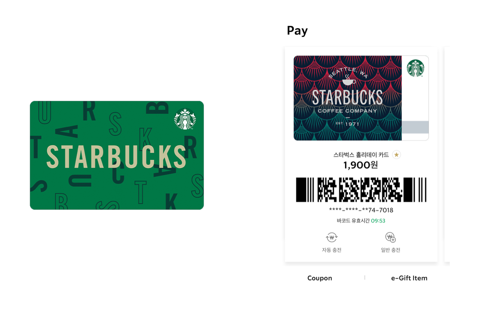

> 본 글은 Codestates BEB 코스의 자료에서 내용을 가져와 작성하였음을 알립니다.  

# Read Me
토큰은 블록체인 네트워크에 올라가 있는 스마트 컨트랙트를 통해 발행되기 떄문에,  
블록체인에서 자체 발행하는 코인과 무관하게 토큰 그 자체로 새로운 생태계를 구성할 수 있다.  
 
그러나 토큰을 통해 생성된 생태계는 블록체인 네트워크 위에 있기 때문에,  
어떤 블록체인에 올라가 있는지에 따라 토큰 이코노미의 형태도 달라진다.  
즉, 토큰 이코노미는 자신이 속해 있는 블록체인의 성격에 따라 그 모습이 조금씩 달라진다.  

---

## Token Economy of Public Blockchain
비트코인이나 이더리움 등, 기존 블록체인에서 새로운 생태계를 어떻게 구성할까? 
 
블록체인에 새로운 생태계를 구성한다는 것은, 기존의 코인을 가지고 새로운 합의 알고리즘을 추가하거나,  
기존 블록체인과는 다른 형태의 수익분배 모델을 만드는 것 등을 의미한다.  
하지만 실제로 블록체인 내에 새로운 생태계를 만드는 것은 불가능에 가깝다.  
 
비트코인이나 이더리움은 채굴에 대한 보상으로 코인을 배분한다.  
다시 말해, 비트코인아 이더리음 1.0처럼 `작업증명 기반 합의 알고리즘`을 사용하는 시스템을 구축해 놓은 상태에서,  
새롱ㄴ 합의 알고리즘을 추가하기는 매우 어렵다.  
 
토큰은 특정 블록체인 네트워크에서 스마트 컨트랙트를 통해 발행되기 떄문에, 여전히 블록체인 네트워크 안에 포함되어 있으나,  
자체적인 토큰 이코노미를 구축하여 독립적인 인센티브 시스템을 만들 수 있다.  
발행한 토큰을 기존의 다른 암호화폐(코인, 토큰)와 교환할 수 있도록 하거나,  
토큰을 사용할 수 있는 공간을 제공함으로써 토큰에 가치를 부여할 수 있기 때문이다.  

> 암호화폐 네트워크에서 제공되는 토큰은 **같은 네트워크 내에서만**상호 교환할 수 있다.  
> 이러한 동일한 네트워크 내 서로 다른 두 토큰을 교환하는 행위를 `Swap`이라 한다.  
>  
> `Swap`은 서로 같은 가치만큼 토큰을 교환하는 형태이다.   
> 예를 들어, ETH 1개는 UNI 100개와 Swap될 수 있다.  

토큰은 새로운 개념이 아니다.  
일상생활에서도 토큰 이코노미를 활용한 사례를 볼 수 있다.  
 
예를 들어, 스타벅스에는 카드 또는 어플리케이션에 일정량의 금액을 미리 충전해 둘 수 있다.  
  
이렇게 충전된 금액은 더 이상 실제 화폐는 아니다.  
스타벅스에서만 사용할 수 있는 디지털 자산(토큰)이 된 것이다.  
 
스타벅스에서는 토큰을 충전하여 스타벅스 생태계에 참여한 고객이 토큰을 사용할 수 있도록, 토큰을 음료 등의 상품으로 사용할 수 있게 한다.  
또한 해당 토큰은 원화와 1:1의 가치를 가지기 때문에 언제든지 스왑할 수도 있다.  
고객이 생태계에 지속해서 참여하도록 토큰과 원화의 비율을 낮추거나, 토큰 보유자를 대상으로 한 다양한 이벤트를 마련하기도 한다.  
 
이러한 토큰 시스템을 블록체인 네트워크 위에 구성하여 투명성과 신뢰도를 확보한 것이 바로 블록체인에서의 토큰 이코노미이다.  

> **블록체인에서의 토큰 이코노미**  
> 사용자들의 합의에 따라 정해진 토큰 기반 경제 시스템이라는 점에서 프로토콜 이코노미(Protocol Economy)라고도 불린다.  

---

## Token Economy of Private Blockchain and Consortium
컨소시엄 형태 또는 프라이빗 형태의 블록체인은 채굴자가 정해져 있다.  
허가받은 사람만 채굴할 수 있고, 채굴하더라도 보상이 없기 때문에, 채굴보다는 블록 생성자에 가깝다.  
 
그러나 이런 형태의 블록체인이라고 하더라도, 토큰 시스템을 구현하는 데에 전혀 무리가 없다.  
토큰은 블록체인 시스템에서 구현된 하나의 프로그램이기 때문이다.  
 
퍼블릭 블록체인에 비해 컨소시엄과 프라이빗 형태의 블록체인이 가지는 가장 큰 장점은 **높은 확장성과 빠른 처리 속도**이다.  
 
퍼블릭 블록체인 네트워크가 가지는 확장성의 한계로 인해, 토큰 시스템도 그 속도가 제한적일 수밖에 없다.  
그러나 컨소시엄, 프라이빗 블록체인은 탈중앙화와 타협하는 대신, 더욱 빠른 처리 속도의 토큰 시스템을 제공할 수 있다.  
 
그러나 비트코인에서 출발한 블록체인은, 탈중앙화에 큰 가치를 두고 있다.  
이 때문에 현재 시장에서는 탈중앙화와 타협한 이런 형태의 토큰 시스템이 환영받지는 못하고 있다.  
 
기업에서 채택하는 블록체인이 항상 컨소시엄이나 프라이빗일 필요는 없다.  
마찬가지로 항상 퍼블릭 블록체인을 고집할 필요도 없다.  
블록체인의 트릴레마를 고려하여, 제공하려는 서비스에 알맞은 네트워크를 선택하면 된다.
