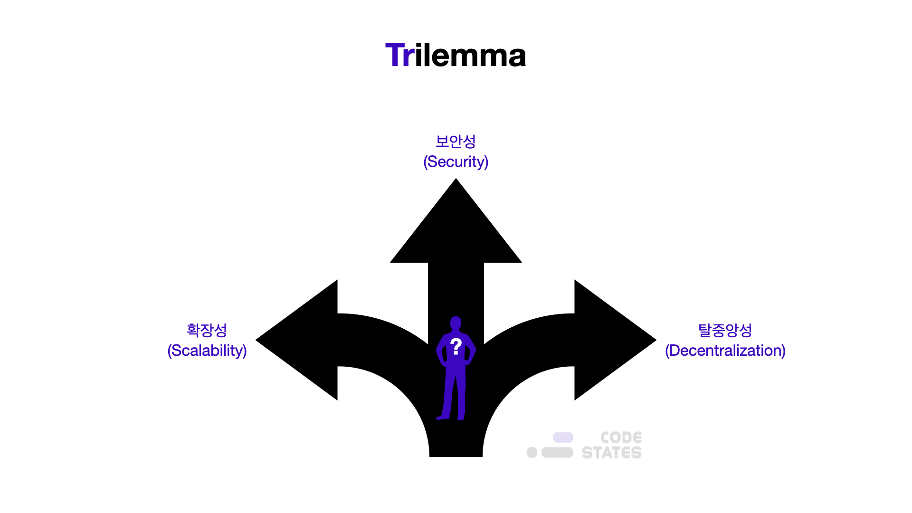
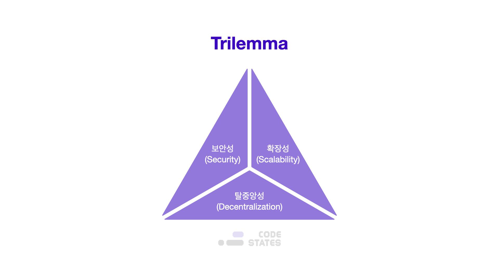

> 본 글은 Codestates BEB 코스의 자료에서 내용을 가져와 작성하였음을 알립니다.  

# Trilemma _

---

## Read Me
우리는 분산형 네트워크가 어떻게 작동해야 하고, 어떤 목적을 수행해야 하는지 이론적으로 알고 있다.  
그러나 이론을 현실로 옮기는 과정에서, 수많은 개발자가 마주친 난관이 있다.  
바로 블록체인의 세 가지 기본 기능을 모두 갖춘 블록체인을 만드는 데에서 오는 현실적인 한계이다.  
 
확장성, 보안성 및 탈중앙성은 블록체인 기술을 구현할 때 최소한으로 고려되어야 하는 기능이다.  
그러나 현재 우리가 알고 있는 개념으로 모든 측면을 유지하는 일은 매우 어렵다.  
 
비트코인, 이더리움과 같은 퍼블릭 블록체인 네트워크는 높은 탈중앙성과 보안성을 이루지만, 높은 확장성을 가지기는 어렵다.  
이 문제로 인해 블록체인 시스템은 광범위한 서비스에서 채택되기 매우 어렵다.  

---

## Background
블록체인 기술이 금융을 포함한 다양한 산업 문야에서 유용함을 입증하고 있지만,  
아직은 기존의 중앙집중적인 네트워크와 비교하기에는 무리가 있다.  
보편적으로 사용되기 위해선 아직 해결해야 할 문제들이 많기 때문이다.  
 
블록체인은 `확장성(Scalability)`, `보안성(Security)`, `탈중앙성(Decentralization)` 중 하나를 희생해야 하는 문제를 가지고 있다.  
이러한 문제를 `트릴레마(Trilemma)`라고 한다.  
 
예를 들어, 비트코인은 탈중앙화되어있고, 안전하지만 초당 약 7개의 트랜잭션(TPS)만 처리할 수 있다.  
 
반면, `하이퍼레저 패브릭` 같은 엔터프라이즈 블록체인은 안전하고 높은 트랜잭션을 처리할 수 있지만, 매우 제한된 수의 노드로 구성된 중앙 집중적 구조이다.  
 
그렇다면 비트코인과 하이퍼레저의 장점을 조합해서,  
**하이퍼레저 패브릭처럼 대규모의 트랜잭션을 처리할 수 있는 동시에,**  
**비트코인처럼 광범위하게 탈중앙화된 네트워크를 통해 완벽한 보안을 제공**하는 것이 과연 가능할까?  
 
오늘날 이러한 문제를 해결하기 위해 다양한 기업과 글로벌 커뮤니티에서 `레이어1`, `레이어2` 솔루션을 연구하고 개발하고 있다.  
 
이러한 솔루션을 이해하기 전, 이번 섹션에서는 블록체인의 풀리지 않는 문제인 트릴레마에 대해 알아보자.  

---

## Trilemma
트릴레마란, 선택해야 하는 길은 3가지가 되지만,  
그 어느쪽을 선택해도 남은 두 가지 또한 한 가지의 문제를 악화시키는 상황을 말한다.  

  
  

> **Dilemma**  
> 사전적 의미로는 "선택해야하는 길은 2개뿐이지만, 그 어느 쪽도 바람직하지 못한 결과를 초래하는 상황"을 말한다.  

블록체인은 이 트릴레마에 직면해 있다.  
 
블록체인 기술의 3대 요소인 `확장성(Scalability)`, `보안성(Security)`, `탈중앙성(Decentralization)` 모두를 만족시키는 것이 가장 이상적이지만 현실적으로는 한 번에 해결할 수 없음을 말한다.  
 
블록체인 기술의 세 요소는 다음과 같이 간략하게 설명할 수 있다.  
  

- **확장성(Scalability)**  
사용자 수가 늘어나더라도, 유연하게 대응할 수 있는 정도를 나타낸다.  
확장성이 높으면 사용자 수의 증가에 따라 거래 건수가 늘어나더라도, 무리 없이 전송 처리용량을 증가시킬 수 있다.  
`TPS(Transaction Per Second)`가 높다고도 표현한다.  
- **보안성(Security)**   
블록체인 내의 데이터나 프로그램을 권한이 없는 이용자가 사용할 수 없도록 제한하여,  
외부의 공격으로부터 프로그램을 보호한다.  
- **탈중앙성(Decentralization)**  
중앙집권화를 벗어나 분산된 소규모 단위가 모여, 자율적으로 운영되는 방식을 말한다.  
블록체인은 기존의 서버-클라이언트 관계가 아니라,  
개별 노드들의 자발적이고 자율적인 연결에 의해 P2P(Peer-to-Peer) 방식으로 동작한다.  

이제 트릴레마의 세 가지 요소에 대해 좀 더 자세하게 확인해 보자.  

---

## Scalability
확장성(Scalability)은 사용자의 수가 증가하거나 네트워크의 규모가 커지면서, 데이터 처리량이 얼마나 증가할 수 있는지를 말한다.  
즉, **1) 높은 트랜잭션 처리량**과 **2) 미래의 증가량**을 얼마나 견딜 수 있느냐를 말한다.  
 
어떤 블록체인이 사용성이 좋아 인기가 많아졌다고 생각해 보자.  
인기가 많아졌다는 것은,  
해당 블록체인에서 발행하는 코인을 보유한 사람과 해당 블록체인을 이용한 서비스가 많아진다는 것을 의미한다.  
그러면 자연스럽게 코인을 거래하는 트랜잭션과 컨트랙트를 배포하고 함수를 호출하는 트랜잭션이 많아질 것이다.  
 
이렇게 블록체인 네트워크에 처리해야 하는 트랜잭션의 양이 늘어나도,  
블록체인은 이전과 마찬가지로 예측 가능한 수준으로 트랜잭션을 처리할 수 있어야 한다.  
 
그러나 블록체인은 갑작스럽게 트랜잭션 처리량이 늘어나는 경우, 성능이 현저히 떨어지기도 한다.  
혹은, 처음부터 탈중앙성에 집중한 블록체인의 경우 비교적 처리량이 적기도 하다.  
 
이렇게, 특정 블록체인에서 한 번에 처리하는 트랜잭션 처리량이 적거나, 트랜잭션 채택이 증가함에 따라 성능이 떨어지는 현상을 “확장성 문제"라고 말한다.  

---

### High Transaction Thorughput
TPS(Transaction Per Second)는 초당 트랜잭션 처리 속도로, 블록체인 네트워크의 성능지표로 사용한다.  
높은 TPS를 가진 네트워크는 사용자가 많아지더라도, 네트워크를 안정적으로 운용할 수 있다.  
 
비트코인과 이더리움은 확장성의 문제로 인해 초당 트랜잭션 처리량(TPS)이 낮다.  
이는 처리에 드는 수수료가 비싸지는 이유이기도 하다.  

- 처리량이 낮다 → 공급이 적다
- 하지만 수요는 많다 → 가격 상승

지금 단계에서는 확장성을 블록체인의 트랜잭션 처리 속도로 동일시하여 이해해도 무방하다.  

> 실제로 TPS만으로 확장성을 설명하기에는 부족하다.  
> 확장성을 이해하는 데에 TPS가 도움이 되는 것이지, TPS=확장성으로 이해하는 것은 엄밀하게는 잘못된 것이다.  
>  
> 확장성을 설명할 때의 TPS를 `레드헤링(Red Herring)`이라고도 한다.  
> 레드헤링은 주의를 다른 곳으로 분산시키는 무언가를 지칭할 때 주로 사용하는 단어이다.  
> 확장성을 설명하는 데에 있어 TPS는 확장성을 쉽게 이해할 수 있도록 돕기도 하지만,  
> 확장성이라는 개념을 TPS와 같다고 이해하기에는 무리가 있다.  

비트코인과 이더리움의 확장성 문제를 개선하기 위해 등장한 블록체인들도 있다.  
이러한 블록체인을 3세대 블록체인이라고도 하며,  
대표적인 3세대 블록체인은 `이오스`, `트론`, `에이다`, `이오스트` 등이 있다.  
 
그러나 3세대 블록체인이 기존 비트코인과 이더리움의 확장성 문제를 완전히 해결한 것은 아니다.  
 
이오스(EOS)는 3천 TPS를 돌파하며, 많은 서비스에서 상용화할 수 있는 블록체인 네트워크로 개발되었다.  
그러나 1초에 6,000건 이상의 트랜잭션을 유발하는 dApp이나 토큰이 생긴다면,  
이오스마저도 비트코인이나 이더리움처럼 병목현상을 보일 수 있다.  

---

### Future Growth
확장성이 있는 블록체인은 사용 사례가 확장되고, 해당 블록체인의 채택이 가속화되더라도 성능이 전혀 저하되지 않는다.  
디앱이나 토큰을 기획하는 개인 또는 회사가 블록체인을 채택하는 일이 증가하면 할 수록,  
성능이 저조해지는 블록체인은 확장성이 부족하다고 한다.  
 
더 큰 확장성을 가지려 할수록, 보안성이나 탈중앙성에는 어려움을 겪을 수 있다.  

> 1,2,3 세대를 나누는 기준은 일반적으로 비트코인, 이더리움, 이오스이다.  
> 하지만 이러한 구분은 논쟁의 여지가 있는, 지나치게 단순한 해석이다.  
> 자신만의 기준을 세워보자.

단순히 블록체인 네트워크의 성능을 더 높이면 된다고 생각할 수도 있다.  
그러나 블록체인에서 더 큰 확장성을 가지려고 하면 할수록, 보안성과 탈중앙성을 침해한다.  
 
따라서 많은 블록체인 플랫폼이 보안성과 탈중앙성은 확립했지만,  
확장성을 달성하는 것은 오늘날의 주요 과제로 남아 있다.  
확장성이 해결되어야 기존의 결제 시스템 등, 중앙 집중적인 플랫폼과 경쟁할 수 있을 것이다.  
 
이러한 확장성 문제를 해결하기 위해, `레이어1`, `레이어2`로 분류되는 다양한 방법들이 진행되고 있다.  

---

## Security
보안성은 데이터나 프로그램이 보호되어 있고, 권한이 없는 사용자나 악의적인 사용자의 접근을 막는 것을 뜻한다.  
 
블록체인에서는 보안성이 매우 중요하다.  
블록체인은 코인이라는 합의 과정을 통해 화폐를 발행하고, 탈중앙화된 분산 원장을 통해 화폐의 흐름을 관리한다.  
즉, 블록체인은 화폐를 관리하는 시스템이기 때문에 보안이 중요하다.  
 
만약 트랜잭션 처리량을 늘리기 위해 광범위하게 분산된 노드의 분포를 제한, 조절하면 어떻게 될까?  
이러한 환경에서는 해커가 필요한 해시 파워를 더 쉽게 축적할 수 있어 51% 공격이 발생할 가능성이 더 높아질 것이다.  
 
블록체인 위에서 발행된 화폐가 이미 암호화폐(Cryptocurrency)라고 불리는 것처럼,  
암호화폐는 암호화되어 있어서 익명성과 함께 안전성을 가지고 있다.  

---

비트코인과 이더리움은 `PoW`와 `PoS`라는 합의 알고리즘을 채택하여 보안성을 높였다.  
 
물론 합의 알고리즘을 사용했다고 해서 공격 위협으로부터 완전히 벗어난 것은 아니다.  
2020년 8월에 이더리움(ETH)의 포크인 `이더리움 클래식(ETC)` 블록체인은 3번의 51% 공격을 받은 사건이 있다.  
 
이는 보안성이 취약해짐을 틈타 해커가 네트워크를 가로채고 금전적 이득을 위해 거래를 조작한 사건이다.  
또한 비트코인에서 하드 포크한 비트코인 골드도 51% 공격을 당했다.  
 
그러나, 비트코인 골드와 이더리움 클래식에서 발생한 공격은, 합의 알고리즘 자체의 결함 때문에 성공한 것이 아니다.  
51% 공격의 핵심은 ‘네트워크 전체에 충분한 해시 파워가 있는가’이다.  
 
원인은 비트코인 골드와 이더리움 클래식이 51% 공격을 당할 때쯤에는,  
해당 네트워크의 여러 문제와 동시에, 우후죽순 생겨난 새로운 네트워크로 인해,  
노드 수가 감소하고 해시레이트(Hashrate)가 낮아졌기 때문이다.  
 
실제로 비트코인과 이더리움도 동일한 잠재 위협이 있다.  
그러나 비트코인과 이더리움에는 매우 많은 노드가 있으며 네트워크 전체 해시 파워도 매우 크다.  
 
따라서 비트코인과 이더리움 네트워크를 해킹하기 위해서는 엄청난 자금이 필요하기 때문에,  
사실상 일반적인 해커가 해킹을 시도하는 일은 상당히 어렵다.  
 
이러한 코인들도 초기에는 해킹의 가능성이 존재했지만,  
이 정도의 규모를 해킹하기 위해서는 거대한 채굴 풀이 필요하기 때문에,  
사실상 회사 규모인 채굴 풀이 해킹을 하기 위해서 51%의 장비를 구비하는 것이 현실적으로 불가능에 가깝다.  
 
이처럼 보안 측면으로 볼 때, 비트코인과 이더리움과 같은 코인들은 보안성이 매우 높지만, 확장성이 떨어진다.  

---

## Decentralization
탈중앙성(Decentralization)은 네트워크가 클라이언트-서버 구조처럼 중앙집권화된 방식으로 운영이 되는 것이 아닌,  
노드 간 자율적으로 운영되는 것을 말힌다.  
 
탈중앙성은 블록체인 기술의 핵심 아이디어이다.  
탈중앙화 네트워크 또는 분산 기술이 보편화되면, 기존 중개자의 역할이 사라지고,  
산업 전반에 더욱 다양한 방식의 거래 형태가 활성화될 수 있다.  
 
예를 들어, 금융 상품에서 중앙집권식 중개자인 은행의 역할이 축소화되면,  
De-Fi(Decentralized Finance, 탈중앙 금융) 플랫폼이 되며,  
해당 플랫폼은 사용자로만 구성되어 더 많은 사람에게 이익을 분배할 수 있다.  
 
일반적인 중앙화된 분산 시스템은 데이터를 관리하는 중앙 노드가 존재한다.  
그러나 탈중앙화된 분산 네트워크는 합의(Consensus)를 통해 중앙관리자의 검열 없이도 데이터에 대한 의사결정을 내린다.  
 
그러나 최적의 탈중앙화를 달성하면, 트랜잭션 처리량이 감소하는 경향이 있다.  
즉, 확장성 문제가 발생하는 것이다.  
 
더 높은 탈중앙성을 달성할수록 확장성이 떨어지는 이유는,  
합의에 참여하는 채굴 노드들이 많아질수록 네트워크를 더 안전하게 보호할 수 있지만,  
합의에 도달하기까지 더 많은 시간이 소요되기 때문에 트랜잭션 속도(TPS)가 떨어지기 때문이다.  
 
이러한 문제점으로 인해 아직 다양한 서비스에서 블록체인 채택이 활성화되지 못했다.

