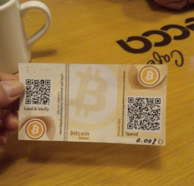
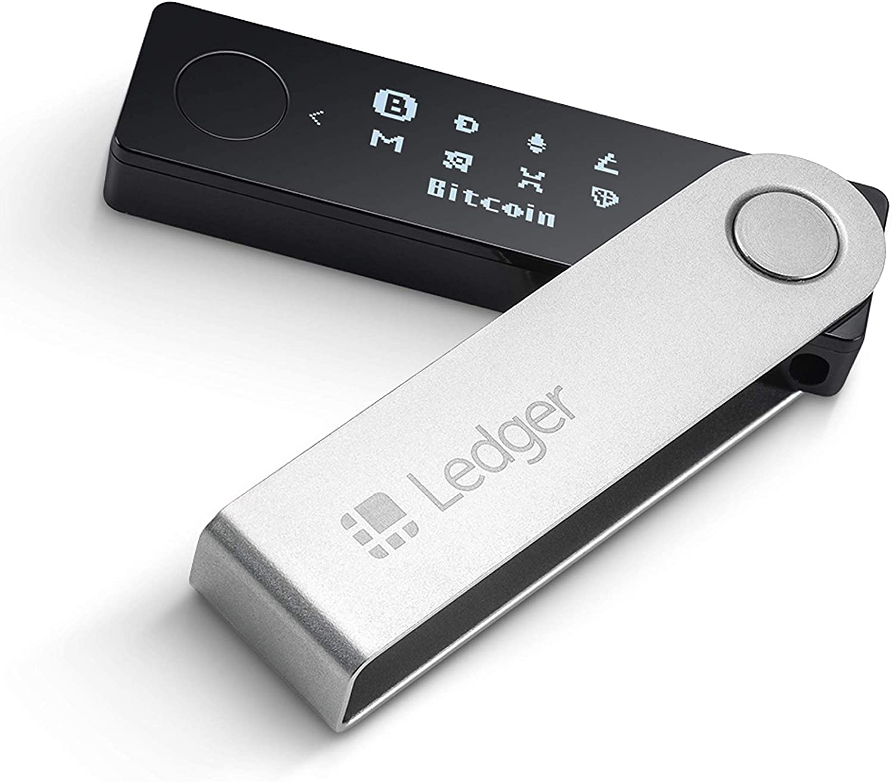
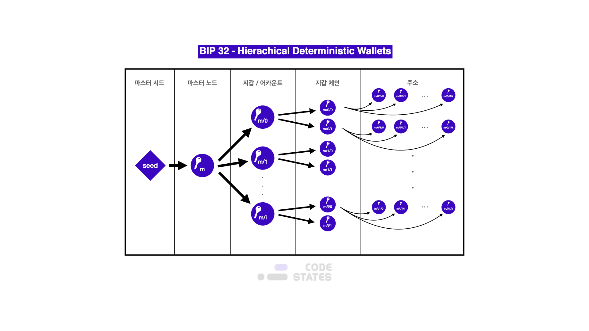

> 본 글은 Codestates BEB 코스의 자료에서 내용을 가져와 작성하였음을 알립니다.  

# Wallets
다양한 형태의 암호화폐 지갑에 대해 알아보자.  

---

## Hot Wallet
  
세상에는 수많은 핫 월렛이 존재하고, 핫 월렛에서 지원하는 코인, 토큰의 종류는 제각기 월렛마다 다르다.  
핫 월렛은 인터넷 주소가 네트워크에 연결되어 있어, 온라인 상태에서 실시간으로 거래 정보를 주고받을 수 있다는 장점이 있다.  
반면, 개인 키가 온라인에 노출되기에 해킹 등 보안 문제에 취약하다는 단점이 있다.
<br>
대표적인 핫 월렛의 종류에는 웹 월렛, 데스크톱 월렛, 모바일 월렛이 있다.  

---

### Types of Hot Wallets
- **Web Wallet**  
웹 월렛은 웹 기반으로 호스팅되는 지갑이다.  
웹 월렛을 사용하면 사용자가 계정을 생성하고 보관할 수 있다.  
<br>
인터넷 브라우저를 통해 접속하는 지갑으로 대부분 브라우저(ex: 크롬) 확장 프로그램이나 웹사이트 형태로 제공된다.  
항상 인터넷에 노출되어 있기 때문에 보안에 가장 취약하지만, 즉시 거래가 가능하다는 측면에서 가장 실용적이다.  
<br>
이더리움 플러그인인 메타마스크(MetaMask), 클레이튼의 카이카스(Kaikas) 역시 핫월렛 중 웹 월렛의 일종이다.  

- **Desktop(PC) Wallet**  
데스크톱 월렛은 Windows, Mac 또는 Linux와 같은 운영체제에 다운로드하여 작동할 수 있는 앱이다.  
인터넷 접속 여부에 따라 위에서 다룬 핫 월렛이나 콜드 월렛으로 작동할 수 있다.  
<br>
웹 월렛보다는 불편하지만 필요시 인터넷에 연결하여 거래가 가능하다는 점에서 하드웨어 월렛(콜드 월렛)에 비해서 실용적이다.  

- **Mobile Wallet**  
모바일 월렛은 데스크톱 및 웹 지갑의 모바일 버전이다.  
인터넷 접속 여부에 따라 위에서 다룬 핫 월렛 또는 콜드 월렛으로 작동할 수 있다.  
<br>
스마트폰 앱으로 다운로드하여 사용할 수 있으며, 언제 어디서나 거래가 가능하다는 점에서 편리하다.  
대표적인 모바일 월렛으로는 클레이튼의 클립(Klip)이 있다.  

---

## Cold Wallet  
콜드 월렛은 지갑의 개인 키를 오프라인으로 보관하는 지갑을 의미하며,  
인터넷에 연결되어 있지 않아서 오프라인 월렛이라고 불린다.  
<br>
콜드 월렛은 온라인에 연결되어 있지 않고, 오프라인 상태에 있기 때문에 보안 측면에서 안전하다는 장점이 있다.  
하지만 인터넷이 차단되어 있기 때문에 실시간 거래가 불가능해서 불편하다는 단점이 있다.  
<br>
대표적으로 페이퍼 월렛, 하드웨어 월렛이 있다.  

---

### Types of Cold Wallets  
- **Paper Wallet**  
  
페이퍼 월렛(Paper Wallet)은 지갑 주소를 만들고 주소를 종이에 써서 보관하는 형식입니다.
간단히 말해서 암호화폐의 개인 키를 종이에 인쇄한 것입니다.
상대적으로 키를 컴퓨터에 보관하는 것에 비해 온라인 해킹 등에 의한 위협에서 안전할 수 있지만 종이를 잃어버릴 위험이 있다는 특징이 있습니다.

  
하드웨어 월렛(Hardware Wallet)은 개인 키를 USB나 카드에 보관하는 방식이다.  
개인 키를 안전하게 보관하기 위해 고안된 장치를 의미한다.  
하드웨어 지갑을 다른 장치에 연결한 다음, 사용자는 소프트웨어를 통해 자신의 잔고를 확인하거나 트랜잭션을 생성할 수 있다.  

---

### Hot Wallet vs Cold Wallet
암호화폐 지갑은 인터넷 연결 유무에 따라 핫 월렛과 콜드 월렛으로 구별할 수 있다.  

- 핫 월렛: 온라인  
- 콜드 월렛: 오프라인  

핫 월렛과 콜드 월렛은 각각의 장단점이 있기 때문에,  
필요에 따라 각각의 편리성과 보안성의 트레이드오프를 고려하여 선택해야 한다.  
<br>
만약 암호화폐 거래를 자주 하는 경우, 접근성이 편리한 핫 월렛을 사용하는 것이 바람직하다.  
반대로, 암호화폐를 안전하게 보관하는 것이 목적인 경우에는 콜드 월렛을 사용하는 것이 좋다.  
<br>
일반적으로 거래소에서는 거래소 전체 자산의 70%는 콜드 월렛에 안전하게 보관하며, 30%를 핫 월렛에 보관한다.  
거래소에서 출금을 하는 경우, 거래소 데이터베이스에 저장된 개인키를 이용해 트랜잭션을 생성하는 방식으로 출금이 이루어진다.  
<br>
만약 암호화폐 거래를 자주 하는 경우, 접근성이 편리한 핫 월렛을 사용하는 것이 바람직할 것이다.  
반면에, 암호화폐를 안전하게 보관하는 것이 목적인 경우, 콜드 월렛을 사용하는 것이 좋다.  
일반적으로 거래소에서는 자산의 70%를 콜드 월렛에, 30%를 핫 월렛에 보관한다.  
<br>
거래소에서 출금을 하는 경우에는 거래소 데이터베이스에 저장된 개인키를 이용해,  
트랜잭션을 생성하는 방식으로 출금이 이루어진다.  

---

## Smart Contract Wallet
스마트 컨트랙트를 이용하는 월렛을 **스마트 컨트랙트 월렛**이라고 부른다.  
일반적으로 이더리움에서 사용자는 **EOA**로 자신의 자산을 관리한다.  
그러나 EOA는 코드(스마트 컨트랙트)를 계정에 담을 수 없기 때문에, 자산 관리 측면에서 기능이 제한적이다.  
<br>
반면 **CA**를 사용해 자산을 관리하는 경우,  
CA에 있는 컨트랙트 코드를 이용해 누가 어떤 조건에서 자산에 접근할 수 있는지를 프로그래밍화 할 수 있습니다.  
<br>
스마트 컨트랙트 월렛은 개인 키가 아닌 스마트 컨트랙트로 관리하기 때문에,  
기존의 단일키를 사용하는 EOA 기반 월렛보다 더 높은 수준의 보안, 유연성, 편의성을 제공한다.  
<br>
사용자는 스마트 컨트랙트 코드를 사용하여 다음과 같은 일을 할 수 있다.  

- 멀티 시그 트랜잭션
- 일일 송금 제한
- 긴급 계정 동결
- 안전한 계정 복구
- 다른 dApp과의 상호작용

---

### Features
- **2단계 인증**  
인증 앱 및/또는 기본 지갑 솔루션을 통해 추가 보안 기능을 제공합니다.  
- **ATM과 같은 인출 제한**  
트랜잭션 금액 제한을 설정할 수 있다.  
사용자의 잘못된 판단으로 높은 금액을 실수로 인출할 가능성을 줄이거나,  
공격자가 한 트랜잭션에서 지갑의 모든 금액을 탈취하는 것을 방지할 수 있다.  
- **화이트리스트 및 블랙리스트**  
사용자는 자신이 지정한 주소(화이트리스트)로만 전송할 수 있고, 차단한 주소(블랙리스트)에는 전송을 제한한다.  
- **사기 경보 및 긴급 잠금**  
장치를 분실하거나 도난당한 경우,  
계정을 잠그거나 손상된 장치에서 계정에 대한 액세스를 비활성화할 수 있다.  

---

### Multi Sig Wallet  
멀티 시그 월렛(Multi-Signature Wallet)은 멀티시그(Multi-Sig)를 통해서만 송금이 가능하다는 특징이 있다.  
<br>
기존의 핫 월렛과 콜드 월렛은 하나의 개인 키를 사용하기 때문에,  
이 단일 키가 노출될 경우 탈취자가 해당 개인 키에 연결된 자산에 쉽게 접근할 수 있다는 단점이 있었다.  
이러한 단점을 보완하기 위한 것이 바로 멀티 시그 월렛이다.  
<br>
멀티 시그 월렛은 하나의 지갑에 N명의 사용자가 지갑에 대한 소유 권한을 가지고,  
해당 지갑에서 트랜잭션을 만들기 위해서는 N명 중 k명이 트랜잭션에 서명해야 한다.
<br>
이더리움상에서 구현할 때는, 멀티 시그 월렛을 위한 스마트 컨트랙트를 만들어,  
N명 중 k명이 서명해야 컨트랙트를 이행한다는 서명 제한 룰을 추가하고,  
실제로 k명이 멀티 시그 월렛 컨트랙트에 트랜잭션을 보내야 한다.  
<br>
멀티 시그 월렛은 일반 지갑에 비해 보안이 우수하다는 장점이 있으며, 실수로 송금이 일어나는 경우를 방지할 수도 있다.  
N명 중 1명이 실수로 송금 트랜잭션을 생성해도, 나머지 N-1명이 서명하지 않으면 트랜잭션이 완료되지 않기 때문이다.  
<br>
그러나 멀티 시그 월렛은 스마트 컨트랙트 상에서 구현되기 때문에 사용성이 부족하다.  
가령, 대부분의 암호화폐 거래소에서는 일반 지갑 간에 이루어진 트랜잭션만 처리하기 때문에,  
멀티 시그 월렛에서 일어난 트랜잭션을 인식하지 못하기도 한다.
<br>
또한 멀티 시그 월렛은 스마트 컨트랙트 상에서 구현되기 때문에 컨트랙트 코드의 오류로 인해 문제가 발생할 수 있다.  
<br>
멀티 시그 월렛에는 `ConsenSys`, `Gnosis`, `Argent`, `BitGo` 등이 있다.

---

## Nondeterministic vs Seed Wallet

---

### Nondeterministic Wallet
**비결정적 월렛**은 매번 비밀키(=개인키)를 무작위로 생성하는 방식의 지갑이다.  
블록체인상에서 트랜잭션을 생성할 때는 개인 정보 보호를 위해 암호화폐 주소를 재사용하지 않는 것이 권장된다.  
따라서 트랜잭션을 생성할 때마다 새로운 비대칭키를 생성해 지갑에 저장해야 한다.  
<br>
그러나 이렇게 매번 무작위로 키를 생성하다 보면 문제가 생길 수 있다.  
실수로 지갑 데이터를 분실할 경우,  
해당 비밀키를 통해 생성된 주소에 들어있던 코인과 해당 주소로 생성한 스마트 컨트랙트에 접근하지 못하게 된다.  
<br>
따라서 비결정적 키 생성 방식을 사용하는 지갑은 데이터를 자주 백업해야 하므로 관리 측면에서 불편하다.

---

### Deterministic Wallet
이러한 비결정적 월렛의 불편함을 해결하는 방식의 지갑이 바로 **결정적 월렛**이다.  
<br>
결정적 지갑은 하나의 시드와 시드에서 파생된 시드키를 가지고 있다.  
시드키는 **비밀키를 만들기 위한 난수**로 사용된다.  
<br>
비밀키는 시드키를 인덱스(또는 다른 데이터)와 결합하여 만든다.  
즉, `비밀키`는 `시드키`와 `인덱스`의 조합으로 생성된 키라고 볼 수 있다.  
다시 말해, 생성될 비밀키의 인덱스와 시드키만 알고 있다면 새로 생성될 비밀키가 어떤 값을 가질지 알 수 있다.  
<br>
이러한 특징 때문에 시드키를 통해 만들어진 비밀키는 그 값이 미리 정해져 있다고 볼 수 있다.  
따라서 시드키를 이용한 지갑 방식을 **결정적 지갑(Deterministic Wallet)**이라고 한다.  
<br>
쉽게 말해서, 지갑을 통해 생성되는 모든 비밀키는 그 값이 ‘미리 결정되어 있다’는 것이다.  
<br>
결정적 지갑을 사용하면 하나의 시드키만 알고 있어도 시드키에서 파생된 모든 비밀키를 알 수 있기 때문에,  
모든 비밀키를 관리할 필요 없이, 시드키 하나만을 관리하면 된다.  
만약 지갑 데이터가 훼손되어 비밀키를 비롯한 주소를 잃어버렸어도, 시드키를 사용해 지갑을 복구할 수 있다.  
<br>
다음은 결정적 지갑의 대표적인 예시인 `HD 월렛`에 대해 설명한다.

---

#### HD Wallet
  
HD 월렛은 [BIP-32](https://github.com/bitcoin/bips/blob/master/bip-0032.mediawiki)에서 제안되고, [BIP-44](https://github.com/bitcoin/bips/blob/master/bip-0044.mediawiki)에서 개선된 비트코인 표준이다.  
<br>
HD 월렛은 결정적 지갑의 한 종류로, Hierarchical Deterministic Wallet(계층적 결정적 지갑)의 약자이다.  
가장 큰 특징은 하나의 시드(Seed) 값만 가지고 있으면 여러 개의 비밀키와 주소를 쉽게 생성할 수 있다는 점이다.  
<br>
앞서 결정적 지갑에 대해 설명했던 것처럼, 지갑에 있는 모든 비밀키를 일일이 관리할 필요 없이,  
시드키 하나만 관리하면 되기 때문에 관리에 용이하다는 장점이 있다.  
<br>
그렇다면 **“계층적”(hierarchical)**인 지갑이라는 것은 무엇을 의미하는가?  
<br>
위의 그림을 보면 알 수 있듯이,  
HD 월렛은 시드에서 시드키를 거쳐 비밀키를 생성하고, 비밀키로부터 주소를 생성하기까지 트리 구조로 이루어져 있다.  
<br>
트리 구조는 대표적인 계층적 자료 구조이다.  
상위 노드에서 하위 노드로 마치 나무의 모양처럼 뻗어나가는 것이다.  
HD 월렛이 주소를 만들고 관리할 때 트리 구조를 사용하기 때문에 “계층적”인 것이다.  
<br>
또한 트리 구조에 있는 각 노드의 인덱스와 시드키를 결합하여 비밀키를 생성한다는 점에서 결정적 지갑의 특징을 가지고 있다.  
<br>
“계층적”, 그리고 “결정적”이라는 두 특징을 결합하면,  
트리 구조에서 부모키는 인덱스에 따라 연속된 자식키를 유도할 수 있고, 각각의 자식키는 손자키를 유도할 수 있다.  

---

##### Key Concepts
앞서 HD 월렛에서 주소를 비밀키를 생성하기 위해서는 시드키와 인덱스만 알면 된다고 배웠다.  
여기서 말하는 인덱스란, 트리 구조의 루트부터 현재 노드까지의 경로를 의미한다.  

- **Seed**  
HD 월렛은 암호학적으로 안전한 무작위 숫자에서 니모닉 연상 단어(Mnemonic Code Words)를 생성한 후,  
니모닉 연상 단어에서 HD 지갑의 시드를 생성한다.  
HD 월렛의 모든 키는 루트 시드에서 결정적으로 파생되었다.  
<br>
루트 시드는 니모닉 연상 단어를 통해 생성되기 때문에,  
니모닉 연상 단어만 알고 있다면 언제 어디서나 수천 혹은 수백만 개의 키가 포함된 HD 지갑들을 백업하거나 복원할 수 있다.

- **Path**  
HD Wallet 키의 경로(path)는 규칙을 사용하여 식별하며, 각 트리 레벨은 슬래시(/) 문자로 구분한다.  
마스터 비밀키로부터 파생된 비밀키는 m, 마스터 공개키에서 파생된 공개키는 M으로 시작한다.  
<br>
예를 들어, `m/0은 마스터 비밀키의 첫 번째 자식 비밀키`이고, `M/0은 첫 번째 자식 공개키`가 된다.  
`m/0/1은 마스터 비밀키의 첫 번째 자식의 두 번째 자식 비밀키`이며, `마스터키의 손자의 비밀키`가 된다.  

---

## Further Study
**BIP-32**  
HD 지갑을 처음 제안한 비트코인 표준이다.  
결정적 지갑을 이진트리 형식으로 계층화하여 무한하게 비밀키를 생성할 수 있는 구조를 제안하였다.  
<br>
**BIP-44**  
BIP-44는 여러 계정이 여러 목적에 맞게 여러 지갑을 사용할 수 있는 HD 지갑 구조를 제안하였다.
BIP-44는 다섯 가지 트리 레벨로 구성된다.  
<br>
- **목적**  
항상 44로 설정된다.  
- **코인 종류**  
어떤 종류의 코인인지 나타낸다. SLIP-0044 문서에 각 코인의 종류와 할당된 번호가 있다.  
- **계정**  
사용자는 자신의 지갑을 논리적 계정으로 나눌 수 있다.  
가령 m/44'/0'/0'과 m/44'/0'/1'은 하나의 HD 지갑에 2개의 비트코인 계정이 있는 것이다.  
- **잔액 계정 여부**  
비트코인의 잔액 계정 여부.  
하위 트리에 있는 값이 입금 주소인지 잔액 주소인지 표기하며, 잔액 주소이면 1을 넣고, 아니면 0을 넣는다.  
이더리움에서는 UTXO가 아닌 어카운트 기반이기 때문에 늘 잔액 주소가 필요 없어 늘 이 값이 0이다.  
- **사용 가능한 주소**  
입금 주소나 잔액 주소를 표기한다.  
```bash
M/44'/60'/0'/0/2 : 이더리움 계정에 대한 세 번째 수신 공개키
M/44'/0'/3'/1/14 : 4번째 비트코인 계정의 15번째 주소 변경 공개키
m/44'/118'/0'/0/1 : 트랜잭션 서명을 위한 아톰 코인 메인 계정의 두 번째 개인키
```

---

**DRBG**
일반적으로 컴퓨터가 만들어내는 난수는 예측이 가능한 가짜 난수이기 때문에 안전하지 않다.  
따라서 컴퓨터로 만들어낸 난수를 해싱한 값을 사용하는데,  
이는 해시 알고리즘이 공개되지 않는 이상 해싱한 값은 완전한 난수이기 때문이다.  
<br>
이렇게 컴퓨터로 만든 난수를, 해시함수를 통해 진짜 난수로 만드는 알고리즘을 DRBG(Deterministic Random Bits Generate)이라고 한다.  
HD 지갑에서는 시드키를 생성할 때 DRBG를 사용한다.  

---

**HMAC-SHA512**
HD 지갑에서는 부모키를 통해 자식키를 확인할 수 있어야 하므로, HMAC 방식을 사용하여 자식키를 만든다.  
HMAC-SHA512는 부모의 키 값을 패딩하여 XOR 연산을 하고, 그 결과값을 해싱한다.  
마스터키는 시드키에 HMAC-SHA512를 연산한 결과값이다.  

---

**브레인 월렛(Brain Wallet)**
브레인 월렛은 비밀키를 랜덤하게 생성하지 않고,  
일련의 단어 목록이나 문장(Seed Phrase)을 사용해 비밀키를 만드는 지갑이다.  
따라서 비밀키를 만들 때 사용한 단어 목록이나 문장을 기억하고 있으면 언제든지 비밀키를 복구할 수 있기 때문에 저장 방식이 간편하다는 장점이 있다.  
<br>
또한 사용자에게 익숙한 문장을 시드로 삼는 경우 어딘가에 기록하지 않고도 사용할 수 있기 때문에 안전하다.  
그러나 사용자가 비밀키를 생성할 때 사용한 단어 목록이나 문장을 잊어버리는 경우, 해당 비밀키에 있는 자산에 영영 접근할 수 없게 된다.  
<br>
인간이 만들어내는 문장은 컴퓨터가 만들어내는 난수에 비해 임의성(Randomness)이 부족하기 때문에,  
무차별 대입 공격을 통해 비밀키를 해킹당할 수도 있다.  
따라서 오늘날 브레인 월렛은 잘 사용되지 않는다.