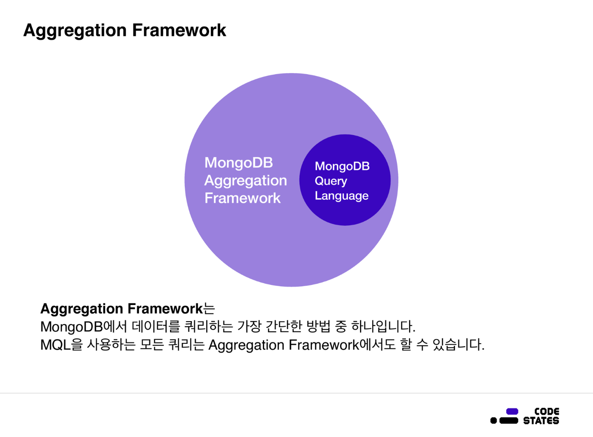

> 본 글은 Codestates BEB 코스의 자료에서 내용을 가져와 작성하였음을 알립니다.  

<!--  -->

# Read Me
`MongoDB`에서 데이터를 파이프라인에 따라 처리할 수 있는 강력한 프레임워크인 `Aggregation Framework`에 대해 알아보자.  
또한 이를 이용하여 쿼리하는 방법에 대해 알아본다.  

---

## Aggregation Framework
`Aggregation Framework`는 `MongoDB`에서 데이터를 쿼리하는 가장 간단한 방법 중 하나이다.  
`MongoDB` 쿼리 언어를 사용하는 모든 작업은 `Aggregation Framework`를 사용해서도 수행할 수 있다.  
Aggregatinon 파이프라인의 데이터는 파이프라인 내에 있기 때문에, 본질적으로 원본 데이터를 수정하지 않는다.  

---

## Pipeline
`Aggregation Framework`에서는 데이터를 파이프라인에 따라 처리한다.  
각각의 처리 작업은 나열한 배열의 순서에 의해 결정된다. 그리고 마지막으로 변환된 데이터가 파이프라인의 끝에 나타난다.  
  

---

## MQL vs Aggregation Framework
앞에서 다룬 MQL에서는 `find` 명령을 사용하여 쿼리와 `Projection`을 한다.  
`Aggregation Framework`에서는 `find`가 아닌 `aggregate` 명령을 사용한다.  
  

```bash
db.listingsAndReviews.find(
    {"amenities" : "Wifi"},
    {"Price" : 1, "address" : 1 , "_id" : 0}
    ).pretty()

db.listingsAndReviews.aggregate([
    { $match : {"amenities" : "Wifi"}},
    { $project : {"Price" : 1, "address" : 1 , "_id" : 0}}
    ]).pretty()
```

`aggregate`를 사용하면 도큐먼트를 필터링하지 않고 그룹으로 데이터를 집계하거나 데이터를 수정할 수 있다.  
`aggregate`를 사용하면 데이터 찾기 및 프로젝션 없이 작업을 수행하거나 계산할 수 있다.  
`aggregate`를 사용할 땐 대괄호를 이용해 배열을 인자로 사용한다.  
이는 파이프라인처럼 배열 요소의 순서대로 작업을 하기 때문이다.  
<br>
예시의 쿼리에선 파이프라인 작업 순서대로 amenities 배열에 Wifi가 포함되는 도큐먼트를 찾기 위해 `$match` 연산자를 사용하고,  
그렇게 찾은 도큐먼트들을 `$project` 연산자를 사용하여 price와 address 필드만 `Projection`한다.   
<br>
첫 번째 필터는 `$match` 단계로, amenities에 Wifi가 없는 모든 숙소가 파이프라인의 다음 단계를 통과하지 못하도록 필터 역할을 한다.  
두 번째 필터는 각 도큐먼트에서 address나 price가 아닌 모든 필드를 필터링하는 `$project` 단계이다.  
<br>
pipleline의 필터들은 **이전의 필터보다 이후의 필터가 더 자세한 필터**여야 한다.  
이렇게 배열에 작업 단계를 넣는다는 점 외에는 MQL과 비슷하게 각 조건에 맞는 쿼리를 작성하면 된다.  

---

### group
  
이 연산자는 들어온 데이터를 가지고 여러 개의 개별 저장소로 빨아들여 그룹화하는 연산자이다.  
여기에서 `Aggregation Framework`에 `$match` 등과 같은 필터링 단계가 없으면, 데이터 요약, 계산 및 그룹화를 수행할 때 원본 데이터를 수정하지 않는다는 점을 유의해야 한다.  
`$group`은 결과적으로 데이터를 압축, reduce하는 효과를 가진다.  

  
다음 그림처럼 필터링 단계가 있을 때에는 원본 데이터 대신 파이프라인의 이전 단계에서 가져온 데이터로 작업한다.  

```bash
{$group : 
            {
             "_id" : <expression>, # 표현식을 기준으로 그룹화
             <field 1> : { <accumulator 1>  : <expression 1> },
             ...   }}
```
위의 예시에 나온 `$group` 단계는 다음과 같은 형식을 갖는다.  
`$group` 단계는 이전 단계에서 도큐먼트를 받을 때 _id 필드에 표현식을 사용하여 이 도큐먼트가 속한 그룹을 식별한다.  
`$group` 구문의 두 번째 부분을 사용하면 파이프라인을 통해 들어오는 데이터에 대해 더 많은 양적 분석을 수행할 수 있다.  

---

## Practice

문법에 따라 listingAndReviews 컬렉션에서 국가 이름과 그 수의 목록을 가져오는 쿼리를 작성해보자.  
```bash
db.listingsAndReviews.aggregate([
                { $project : {"address" : 1, "_id" : 0}},
                { $group : { _id : "$address.country",
                                    "count" : {"$sum" : 1}}}
                ])
```
지금은 address 필드만 가져와도 되기 때문에, 첫 번째 단계에서 `$project`로 address 필드만을 쿼리한다.  
그다음 `$group` 연산자를 이용해 address.country 값으로 데이터를 그룹화한다.  
문법에 맞게 `$group`의 첫 번째 인자로 {_id : “$address.country”}로 작성한다.  
<br>
이후 각 국가에 위치한 숙소의 수를 세기 위해 파이프라인을 추가한다.  
두 번째 인자에서 `$group`에서 `$sum` 연산자를 사용하면, 쉽게 각 국가에 얼마나 많은 숙소가 있는지 집계할 수 있다.  
이는 자바스크립트의 `reduce` 메서드의 작동 방식과 비슷하다.  
<br>
여기서는 파이프라인의 첫 번째 단계에서 생성된 도큐먼트에 대해 `count` 필드를 만든다.  
그런 다음 `$sum` 연산자를 사용하여 각 그룹으로 들어오는 각 도큐먼트에 대해 1씩 추가하여 총계를 구할 수 있다.  
이렇게 쿼리를 작성하면 이 컬렉션에 있는 국가와 각 국가에 있는 숙소의 수를 알 수 있다.  

---

## Reference
[MongoDB Documentation](https://www.mongodb.com/docs/manual/reference/operator/aggregation/match/)