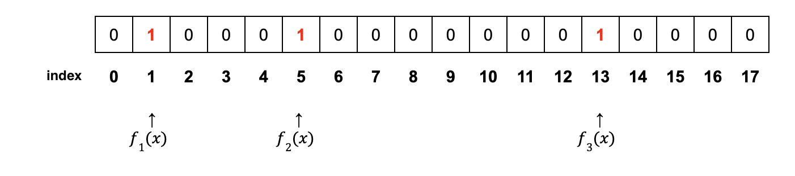
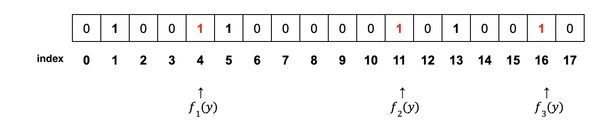
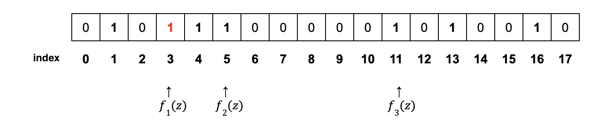
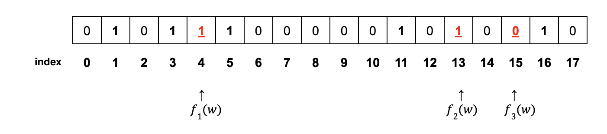

> 본 글은 Codestates BEB 코스의 자료에서 내용을 가져와 작성하였음을 알립니다.  

# Bloom Filter
블룸필터(Bloom Filter)는 특정 원소가 집합에 속하는지 검사하는 데 사용할 수 있는 확률형 자료 구조이다.  
 
확률적 검색 필터로 원하는 패턴이 무엇인지 정확하게 규정할 필요 없이,  
원하는 패턴을 설명하는 방식이라 할 수 있으며, 다시 말해 통계적 특성을 보였다고 할 수 있다.  
또한 많은 양의 데이터를 줄여서 공간 효율적으로 빠르게 검색을 할 수 있다.  
 
블룸필터는 프라이버시를 보호하면서 검색 패턴을 구현하기 위한 효율적인 방법을 제공한다.  
또한 블룸필터는 비트코인 언리미티드(Bitcoin Unlimited) 팀이 노드에 알려지지 않은 거래를 식별하는 데 도움을 주고 있다.  
 
SPV 노드는 블룸필터를 사용해 이웃 노드들에게 특정 거래를 제공해 달라고 요청하는데,  
이때 노드는 검색 중인 주소가 정확히 어떤 주소인지 밝힐 필요는 없다.  

> **SPV(Simplified Payment Verification) 노드**
> 블록체인의 모든 정보를 저장하는 대신, 블록 헤더만을 저장하여 거래의 유효성을 검사하는 노드를 의미한다.  

---

## Operations
블랙리스트 기반의 IP 주소 검색 및 차단의 예를 가지고 동작 방식을 살펴보자.  
`x`, `y`, `z`라고 하는 IP를 `블랙리스트`에 저장하고, `방화벽`에서 이러한 블랙리스트의 IP를 차단하기 위해 등록한다고 가정하자.  
 
블룸 필터는 N 비트 크기의 비트 배열 구조와, 서로 다른 J 가지의 Hash 함수를 사용하여 구현한다.  
여기서 해쉬함수는 N 가지의 값을 균일하게 출력해야만 한다.  
 
블랙리스트에 어떻게 IP 주소가 저장되는지, 그리고 패킷이 들어올 때 어떻게 블랙리스트와 IP 주소 비교를 어떻게 하는지를 살펴보자.  
 
먼저, 아래 예시에서는 18(N)개의 비트 배열, 그리고 3(J)개의 해싱 함수를 사용한다.  

---

### Storing Orders of IP Address to the Blacklist
1. 블랙리스트 로그에 x의 IP를 저장한다.  
2. IP x를 가져와 3개의 해싱함수(f1, f2, f3)로 해싱한다.  
3. 각 해싱 값에 해당하는 배열 인덱스값을 1로 수정한다.  
  
4. IP y로 1~3번 과정을 반복한다.  
  
5. IP z로 1~3번 과정을 반복한다.  
(혹, 이전 인덱스값이 0이 아닌 1인 경우 수정 없이 1로 유지한다.)  
  

---

### Comparison Orders of Blacklist and IP Address
1. w라는 IP를 가진 패킷을 받습니다.  
  
2. IP w를 위의 방식과 같이 3개의 해싱함수(f1, f2, f3)로 해싱한다.  
3. `4`, `13` 인덱스값은 1이지만 `15`의 인덱스값은 0이므로 w라는 IP는 블랙리스트 IP가 아니다.  
(만약 `4`, `13`, `15` 모두 1이라면 블랙리스트 IP입니다 → False Positive)  
  

---

### False Positive
블룸필터는 **길이 N의 이진 배열(Binary array)**과 1부터 N까지의 출력값을 갖는 **J개의 해시함수**를 가지고 있다.  
이 N과 J을 조절함으로써 정확도와 프라이버시 보호 수준을 조절할 수 있다.
 
오탐지율(false positive)이 존재하기 때문에 결정적(Deterministic) 결과 대신 부정확한 결과를 얻을 수 있다.  
 
- False Negative(거짓 - 부정, 존재하지만 부정하는 것)는 존재하지 않는다고 보장할 수 있다.  
- 하지만 False Positive(거짓-긍정, 존재하지 않지만 있다고 하는 것)가 존재할 수 있다.  

즉 특정 원소가 존재하지 않는다는 부정적인 답변을 받았다면, 이 원소는 확실하게 없다고 할 수 있다.  
 
블룸필터는 임의 테이블의 크기, 넣어야 하는 자료의 크기, 해시 함수의 수에 따라 오류의 확률이 정해진다.  
따라서 요구하는 긍정 오류율(허용하는 오류 범위)이 있다면 넣어야 하는 자료의 크기를 고려해,  
테이블의 크기와 해시 함수의 수를 정하는 것이 일반적이다.

---

### Irremovable
있는지 없는지만을 보는 그 특성(Lookup) 때문에 삽입만 가능하고 제거가 불가능하다.  
 
위 블랙리스트 IP를 예로 들면, 리스트에 IP가 추가될 때마다 비트 배열을 초기화하는 것이 아니라 그 위에 덮어쓰는 것이기 때문이다.  
그래서 정상 IP를 블랙리스트로 판단하여 차단할 확률이 존재한다.  

---

## Implementations
블룸필터는 처리능력 대비 적은 메모리 공간을 필요로 하는 장점 때문에 DB 이외에도 많은 곳에서 사용되고 있다.

- IP 주소 검색 및 차단 필터링
- 문자열 맞춤법 교정
- 가상화폐
- 라우터
- 크롬 브라우저
- 빅데이터 환경
