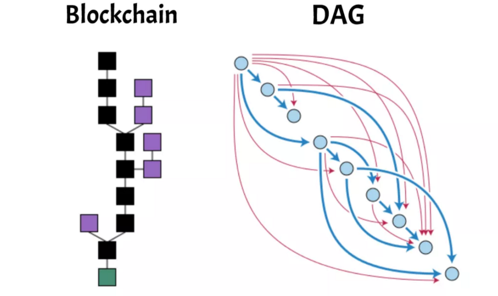
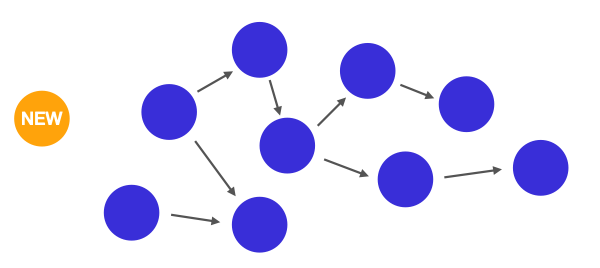
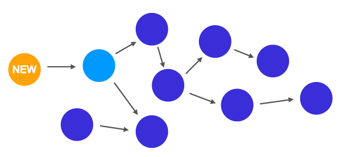
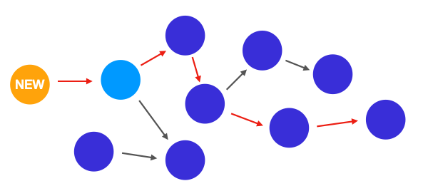
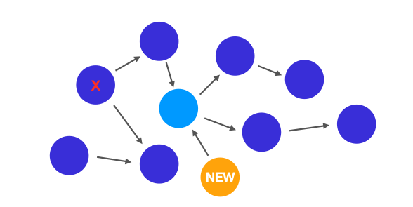

> 본 글은 Codestates BEB 코스의 자료에서 내용을 가져와 작성하였음을 알립니다.  

# DAG in Crypto Currency
일반적으로 암호화폐 플랫폼에서는 데이터 구조로 블록체인을 사용하지만, 블록체인 대신 DAG를 사용하는 경우도 있다.  
 
  
 
일반적인 블록체인에서는 각 정점이 “블록"으로 구성되어 있고 블록 안에 트랜잭션이 담겨있다.  
기차같이, 특정 시간대에, 역에 들어와 짐을 싣고 이동하는 것과 같다.  
만약 짐이 제시간에 역에 도착하지 않은 경우 다음 기차가 오길 기다려야 한다는 단점이 있다.  

---

## Operations
DAG는 “블록" 개념이 존재하지 않으며, 그래프의 각 정점은 블록이 아닌 개별 트랜잭션이다.  
따라서, 블록 개념이 없기 때문에 채굴 과정도 필요하지 않다.  
대신, 트랜잭션들은 서로를 참조함으로써 해당 트랜잭션의 유효성을 검증한다.  
 
그렇다면, DAG에서는 어떻게 네트워크의 트랜잭션의 유효성을 검사하는지 알아보자.
 
1. 노드가 트랜잭션을 네트워크에 제출합니다.  
  
 
2. 새로운 트랜잭션은 네트워크 내에 있는 이전 트랜잭션을 참조해야 네트워크에 승인되기 때문에, 이전 트랜잭션을 찾는다.  
  
> 이전 트랜잭션은 꼭 직전에 올라온 트랜잭션이 아니어도 상관없다.  
>  
> 일부 시스템에서는 새로운 트랜잭션이 더 많이 검증된 트랜잭션을 선택하는 알고리즘을 사용하도록 한다.  
> 더 많이 검증된 트랜잭션을 채택하도록 하므로 시스템은 안전하게 성장하게 된다.  

3. 이전 트랜잭션을 찾았다면, 해당 트랜잭션의 유효성을 검사한다.  
 
해당 트랜잭션의 송신자가 충분한 잔고를 가졌는지 확인하기 위해 그래프의 가장 처음 트랜잭션까지의 경로로 올라가면서,  
해당 트랜잭션이 유효한지 확인한다.  
  
 
만약, 해당 트랜잭션이 유효하지 않다면 새로운 트랜잭션은 이 트랜잭션을 참조하지 않고,  
다른 이전 트랜잭션을 참조한다.  
  
> 블록체인에서 이중 지불을 방지하는 다양한 메커니즘이 있는 것처럼,  
> DAG에서는 자신이 참조하는 트랜잭션의 전체 경로를 확인하고 잔고가 충분한지 트랜잭션을 검증함으로써 이중 지불을 방지한다.  

4. 이렇게 한다고 해서, 새로운 트랜잭션이 승인되는 것은 아니다.  
해당 트랜잭션이 승인되기 위해서는 이후 새로운 트랜잭션이 해당 트랜잭션을 참조하여 유효성을 검사해주어야 하며,  
참조되기 그전까지는 유효한 트랜잭션으로 승인된 것은 아니다.  
  
가령 앞의 그림에서 우리가 제출한 새로운 트랜잭션이 참조한 트랜잭션의 경우,  
우리 트랜잭션에 의해 참조되었기 때문에 “승인"된 것이다.

---

## Features
**트랜잭션 처리 속도**  
블록체인은 (비트코인 기준) 블록 생성이 10분에 한 번씩 이루어지기 때문에 트랜잭션이 체인에 올라가기까지 약 10분이 소요되며, 해당 트랜잭션이 완전히 처리되기까지는 1시간이 걸린다.  
 
반면, DAG는 블록 개념이 없고, 트랜잭션이 선형적으로 처리되는 것이 아니라, 병렬적으로 처리되기 때문에,  
블록체인과 비교했을 때 빠른 속도로 트랜잭션이 처리된다.  
 
**채굴이 없다**  
DAG의 경우, 채굴 과정 자체가 없기 때문에, 채굴자에게 내야 할 수수료도 없다.  
또한 작업 증명으로 인한 과도한 에너지 사용도 없기 때문에, 환경친화적이기도 하다.  
 
**확장성 문제에서 비교적 자유로움**  
DAG는 트랜잭션이 늘어날수록 새로운 트랜잭션들이 이전 트랜잭션을 많이 검증할 수 있기 때문에 확장성 문제에서 자유롭다.  
또한 앞서 말했던 것처럼 트랜잭션 처리 속도 역시 매우 빠른 편이기도 하다.   

---

## Further Study
DAG를 사용하는 암호화폐 플랫폼에는 대표적으로 IOTA와 ByteBall이 있다.  
- IOTA와 ByteBall은 어떤 목적으로 만들어졌는가?
- IOTA와 ByteBall은 DAG를 어떻게 적용하고 있는가?
- IOTA와 ByteBall은 기존 블록체인 플랫폼과 어떤 점이 다른가?
