> 본 글은 Codestates BEB 코스의 자료에서 내용을 가져와 작성하였음을 알립니다.  

# DHT
분산 해시테이블(Distributed Hash Table)은 해시 테이블을 활용해, 키-값 쌍 방식으로 데이터를 검색하는 분산형 데이터베이스이다.  
DHT는 Peer-to-Peer 환경에서 데이터를 분산하여 저장할 때 사용한다.  

---

## Store Operations
1. 다음과 같은 **해시테이블**이 있다고 가정한다. 이 해시 테이블의 범위는 0부터 7까지이다.  
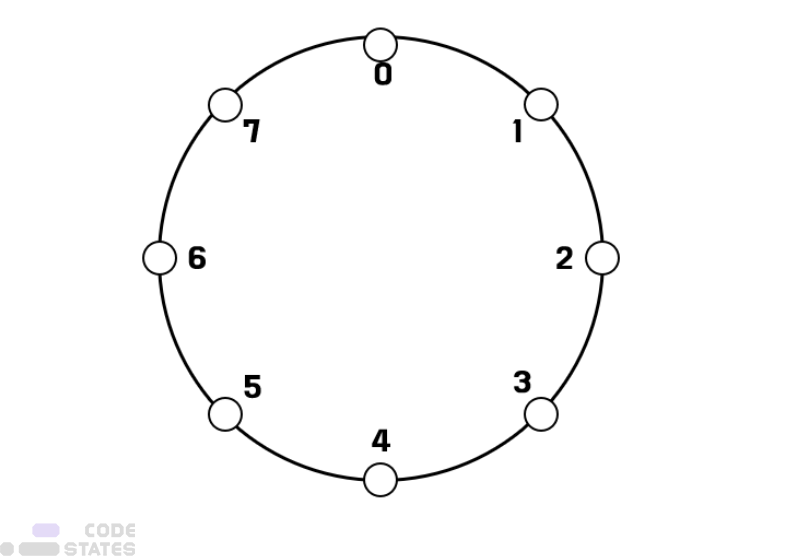  
2. 그리고 이 테이블을 4명의 호스트가 사용한다.  
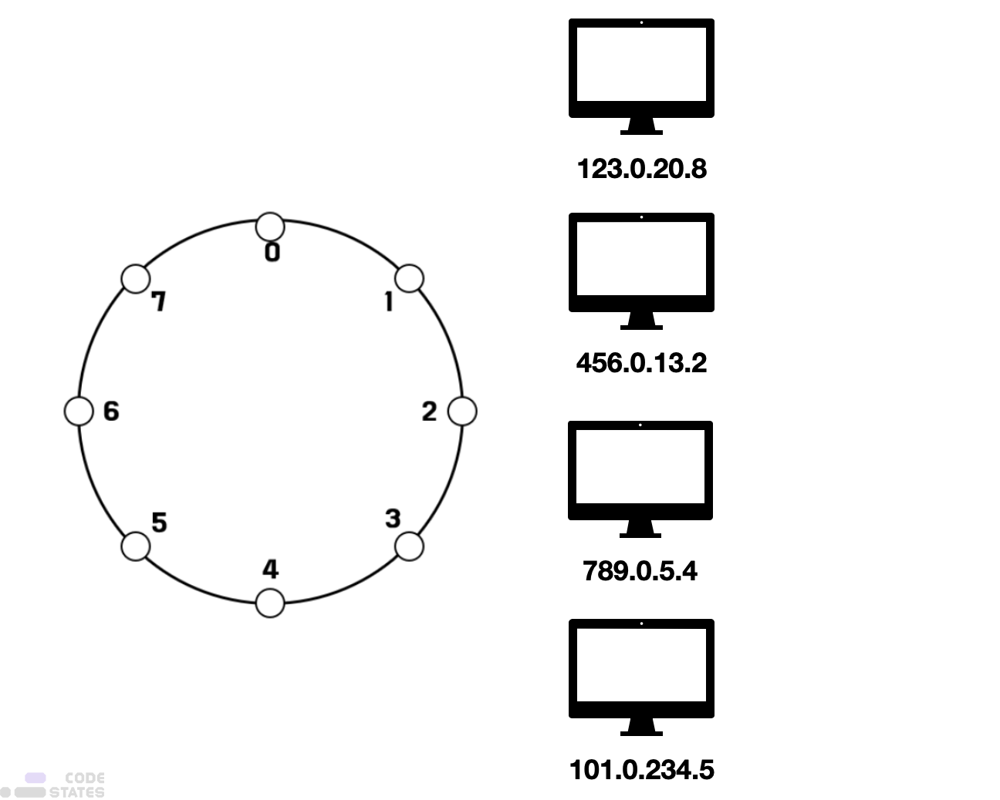  
호스트들은 각각 공유해야 할 데이터를 가지고 있다.  
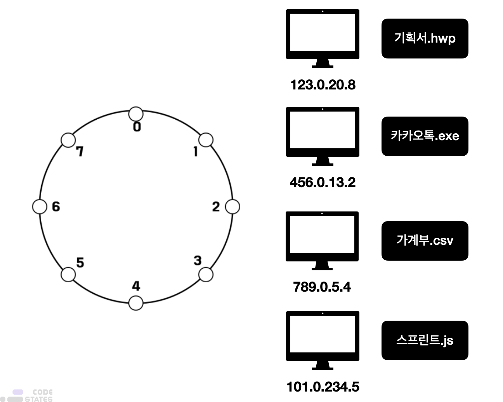  
3. 이제 각 해시테이블의 인덱스에 **호스트의 IP 주소**를 넣는다.  
정해진 해시테이블의 인덱스 안에 호스트의 주소를 할당하기 위해, 호스트의 IP주소를 해싱하여,  
해싱한 결과값을 8로 나눈 나머지 값을 인덱스로 한다.  
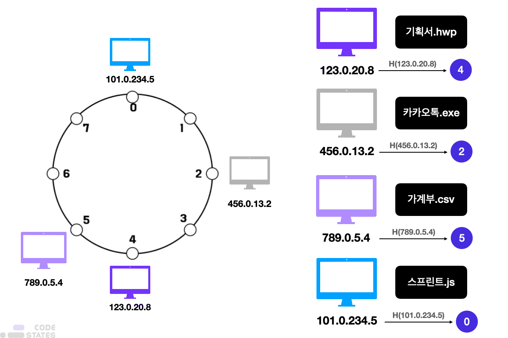  
이 호스트들은 자신 다음에 있는 호스트 중 가장 가까이에 있는 호스트의 IP주소를 알게 된다.  
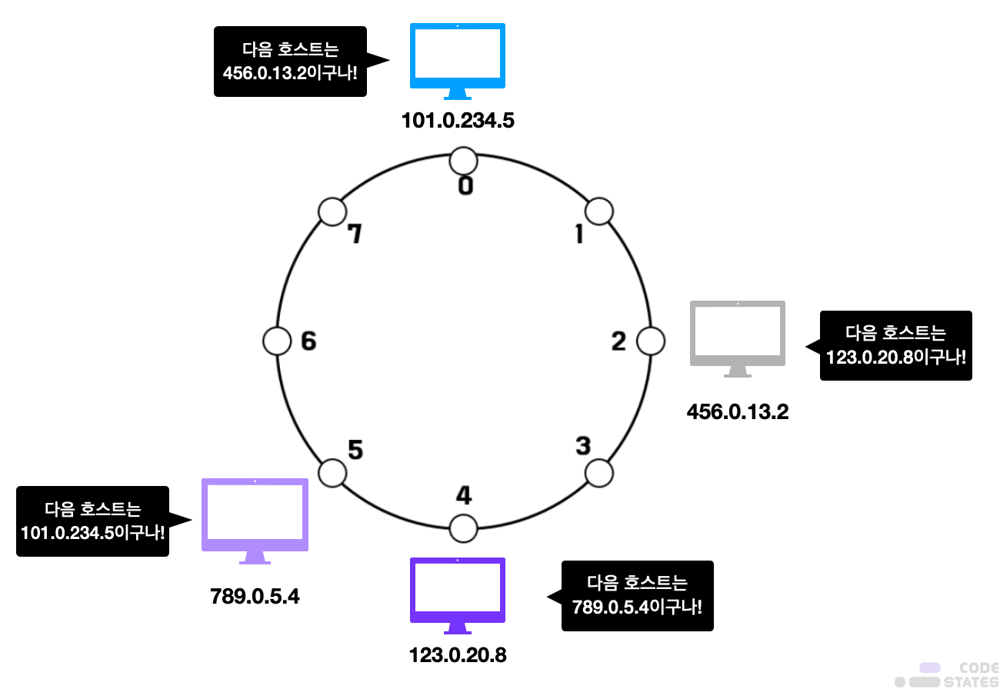  
4. **해시 테이블의 인덱스**에는 호스트의 IP주소 외에도, **데이터의 위치**를 저장한다.  
각 호스트가 갖고 있는 파일들 역시 IP주소를 해싱하여 인덱싱했던 것처럼 동일한 방식으로 해싱한다.  
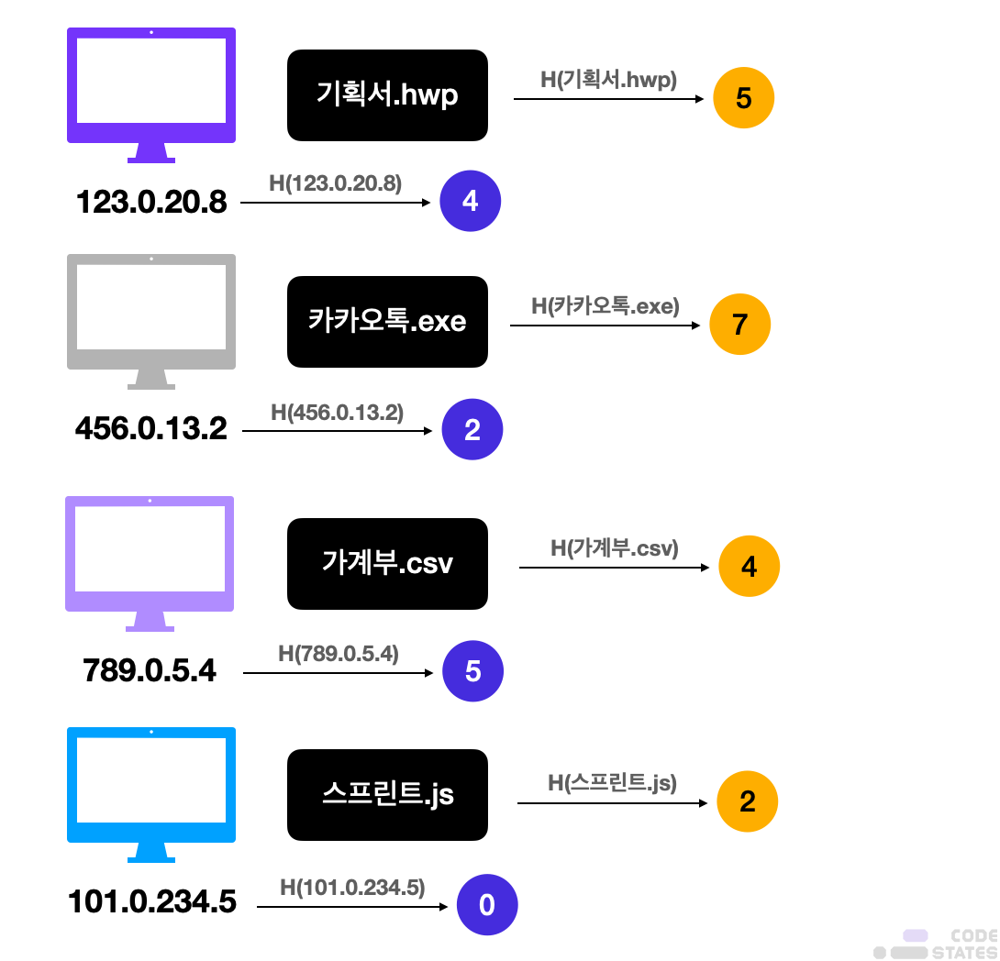  
이렇게 나온 해시값을 그대로 해시테이블에 인덱싱한다.  
가령, `기획서.hwp`의 해시값은 5이므로, 해시테이블의 인덱스 5에 있는 호스트인 `789.0.5.4`는  
“기획서.hwp는 123.0.20.8에 있다"라는 것을 기억하게 되는 것이다.  
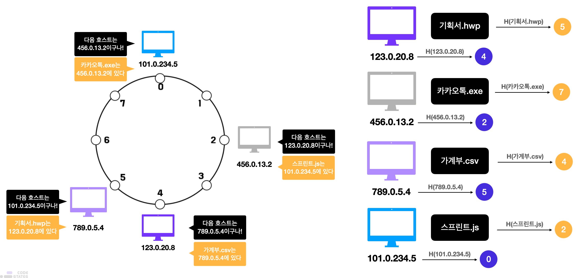  
카카오톡.exe의 해시값은 7이지만, 7번 인덱스에는 호스트가 없기 때문에,  
가장 인접한 호스트인 101.0.234.5가 카카오톡.exe의 위치를 저장한다.  

---

## Lookup
456.0.13.2 컴퓨터가 카카오톡.exe 파일을 찾는다 가정하자.  
> 자신이 갖고 있는 파일이지만, operation을 알아보기 위해 이렇게 상정해보자.  

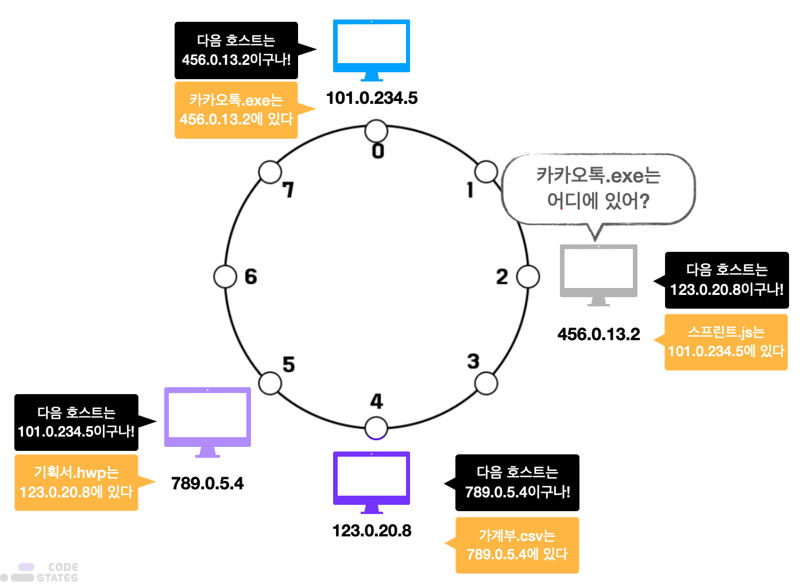  
1. `456.0.13.2`는 자신의 가장 가까운 컴퓨터인 `123.0.20.8`에게 묻는다.  
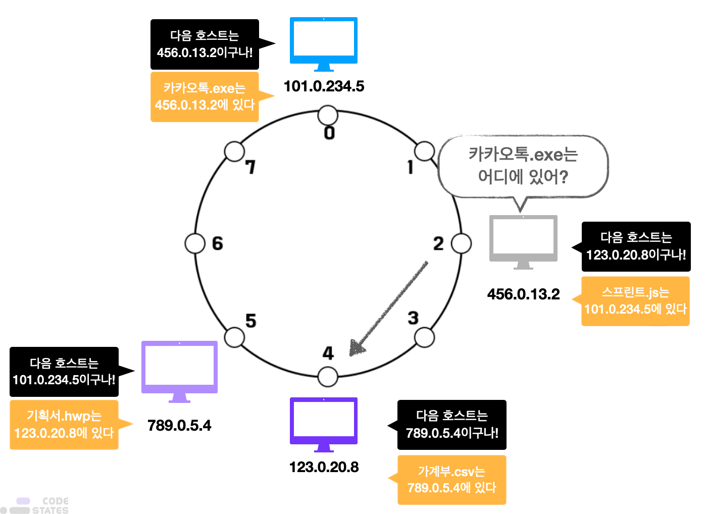  
2. `123.0.20.8`은 `가계부.csv`의 위치는 알지만, `카카오톡.exe`의 주소는 모른다.  
따라서 자신의 가장 가까운 컴퓨터인 `789.0.20.8`에게 `카카오톡.exe`가 어디 있냐고 묻는다.  
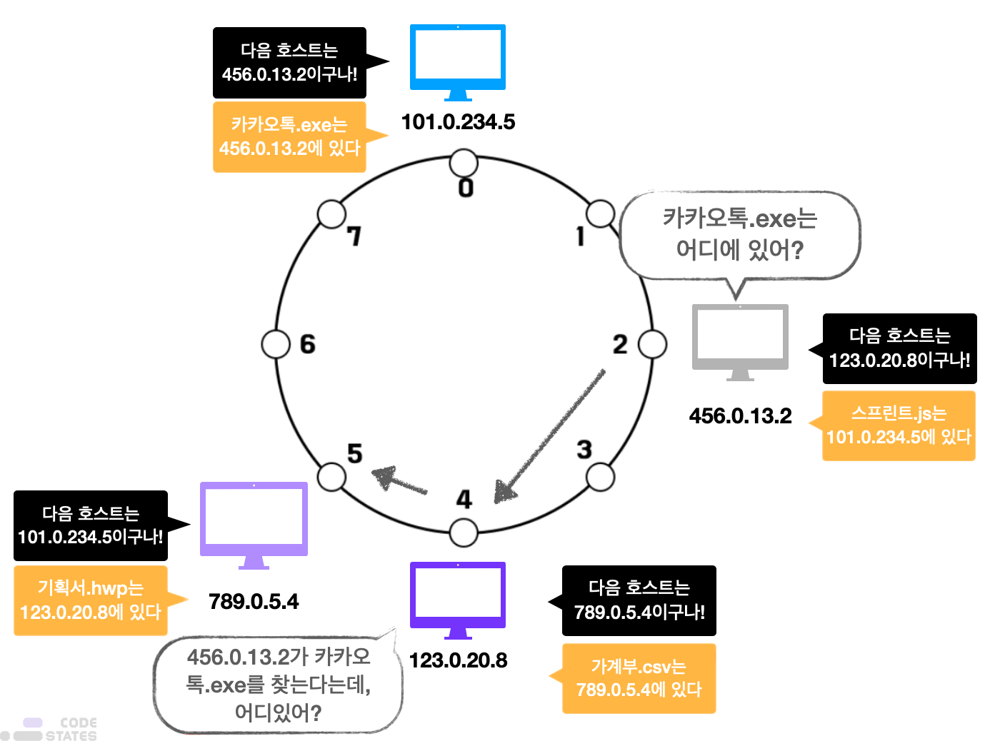  
3. `789.0.20.8` 도 모르기 때문에 자신의 가장 가까운 다음 컴퓨터에게 물어본다.  
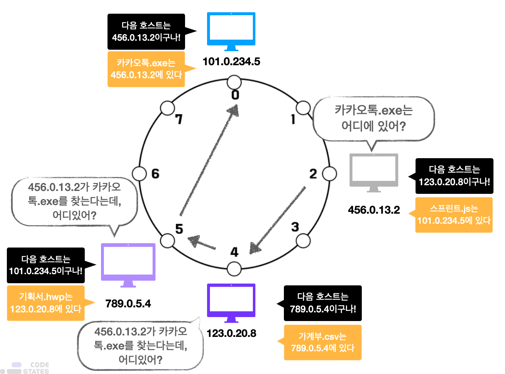  
4. `101.0.234.5`는 `카카오톡.exe`가 어디 있는지 알기 때문에,  
처음 질문했던 `456.0.13.2`에게 `카카오톡.exe`의 위치를 알려준다.  
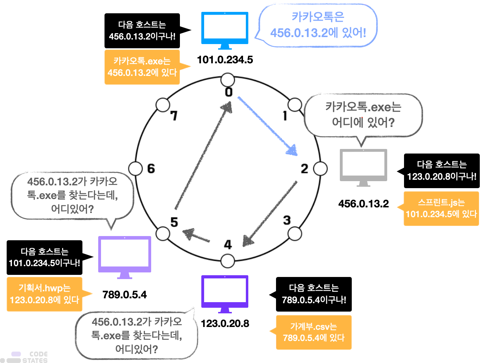  

---

## Implementations
DHT는 분산 파일 시스템, P2P 파일 공유, 인스턴트 메시징 등의 서비스를 구축하는 데 활용되고 있다.  
또한, `홀로체인`과 같은 DHT를 기반으로 한 블록체인도 존재한다.  