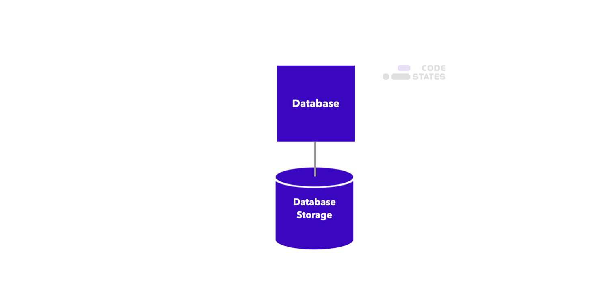
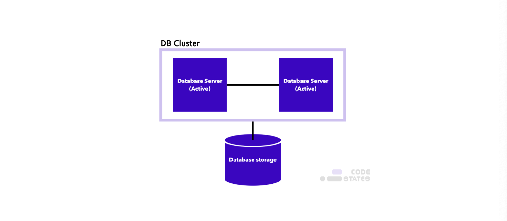
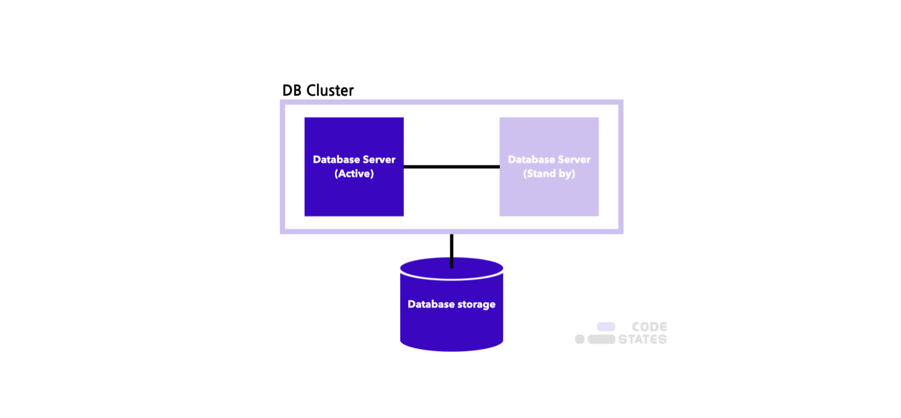
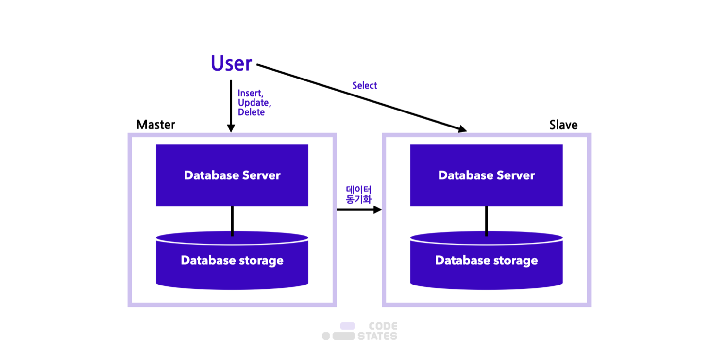
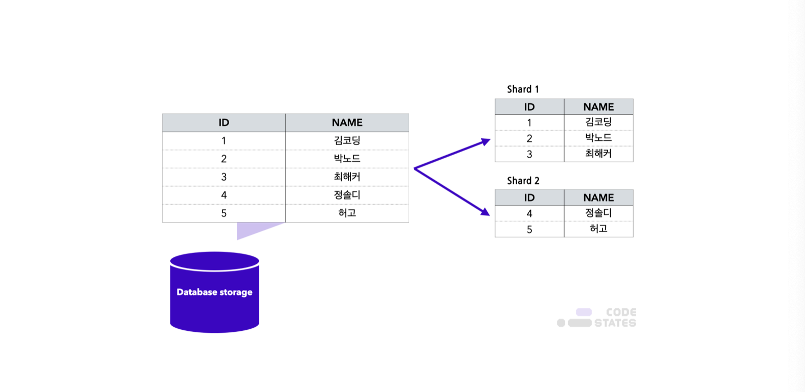
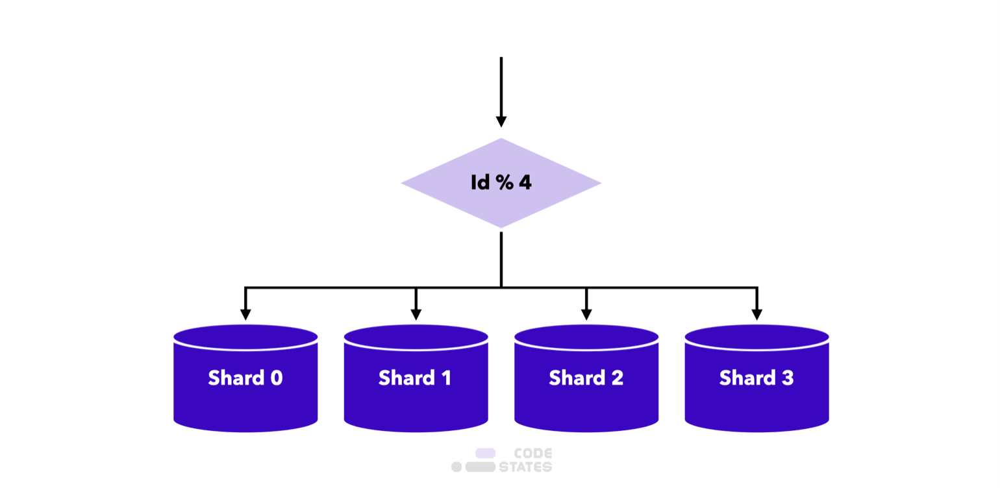
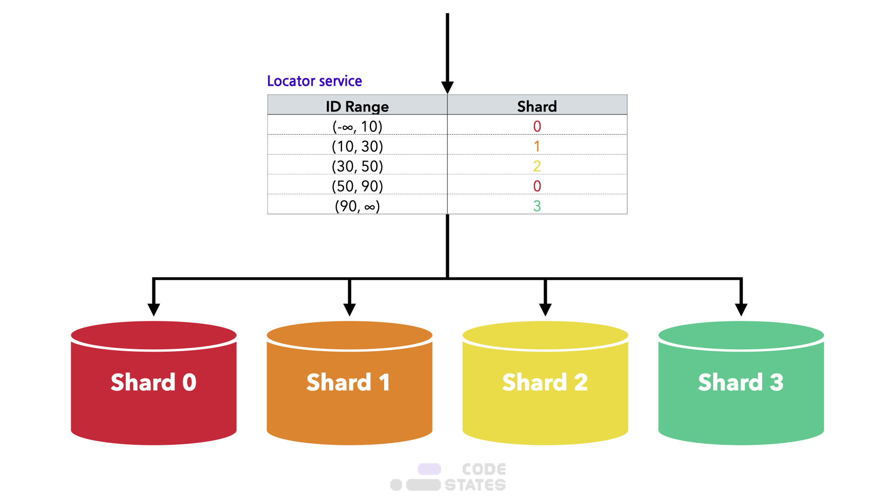
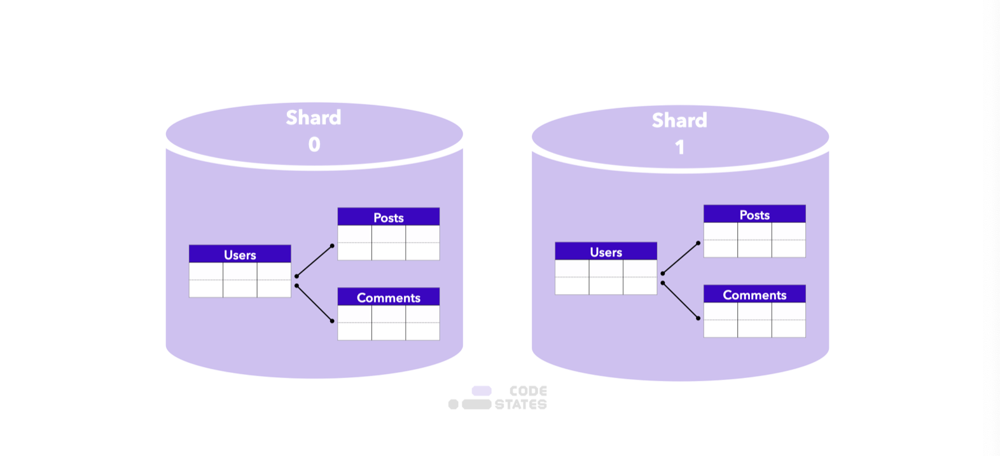

> 본 글은 Codestates BEB 코스의 자료에서 내용을 가져와 작성하였음을 알립니다.  

# Read Me
분산 데이터베이스와 블록체인이 어떻게 다른지 확인하기 위해서, 분산 데이터베이스가 무엇인지 알아보자.  

---

# Distributed Database
분산 데이터베이스는 하나의 **DBMS(데이터베이스 관리 시스템)**으로,  
여러 CPU에 연결된 저장장치들을 제어하는 형테의 데이터베이스이다.  
물리적으로는 여러 위치에 분산 저장하고 흩어져 있는 시스템이지만, 놀지거으로는 하나인 것처럼 활용한다.  
 
즉 데이터베이스에 접근하는 사용자 입장에서는 마치 하나의 데이터베이스에 접근하는 것과 다르지 않다.  

---

## Transparency

물리적으로 떨어져 있는 저장소인 **노드**들은 네트워크를 통해 연결된다.  
이 노드들은 **투명성 확보**가 가장 중요하다.  
목표로 하는 투명성은 총 6가지로써, 아래와 같다.  

|종류|내용|특징|
|:---:|:---:|:---:|
|병행|다수의 트랜잭션 수행 시 결과의 일관성 유지|지원처리 양 및 속도 개선|
|장애|장애 발생이 All or Nothing, 원자성 유지|데이터 일관성|
|지역사상|개별 지역의 물리적 이름과 관계없이 접근 가능|확장성 확보|
|위치|데이터를 물리적 저장 위치가 아닌 논리적 입장에서 접근|생산성, 활용성 강화|
|중복|데이터를 지역별로 중복으로 저장하여도 데이터 처리 가능|병목 현상 해소|
|분할|물리적 구조가 여러 단편으로 분할 저장되어 논리적 사용|성능 향상|

---

## Implementations
데이터베이스를 물리적으로 여러 개로 만들고 관리하기 위한 기술은 대표적으로 3가지가 있다.  
- Clustering
- Replication
- Sharding

다음은 일반적인 데이터베이스를 도식화 한 것이다.  
데이터 요청을 처리하는 서버와, 실제 데이터를 저장하는 스토리지가 1개씩 있는 모습이다.  

---

### Clustering
데이터베이스 서버가 뻗는 것을 대비해 백업 서버를 하나 더 만드는 방식이다.
- Active-Active : 클러스터를 항상 가동하여 가용할 수 있는 상태로 두는 구성 방식
  

- Active-Standby : 일부 클러스터는 가동하고, 일부 클러스터는 대기 상태로 구성하는 방식
  

**장점**  
- 데이터베이스 서버 하나가 죽어도 다른 서버가 역할을 대신할 수 있어서 지속 서비스 제공 가능
- 서버가 여러 대이기 때문에 성능적으로 유리함  

**단점**  
- 데이터베이스는 1개이기에 병목이 생길 수 있다  
- 서버 여러 대를 동시에 운영함으로써 비용이 많이 들어간다  

---

### Replication
저장된 데이터가 손실되는 것을 대비해 데이터베이스 스토리지도 여러개로 하는 방식이다.  
- Simple Backup Method  
  
 

- Distributed Load Balancing Method  
  
Slave에서는 Read만 가능하다.  
 

**장점**
- 데이터베이스 Read(Select) 성능을 높일 수 있다.  
- 비동기 방식으로 운영되어 지연시간이 거의 없다.  

**단점**
- 각 노드 간의 데이터 동기화 보장이 어렵다.
- Master 노드가 다운되면 복구 및 대처가 어렵다.  

---

### Sharding
데이터가 너무 많아 검색 성능이 좋지 않을 때 빠르게 하기 위해서 사용하는 방식이다.  
  
**장점**  
- 서버의 수평적 확장이 가능하다.
- 스캔 범위를 줄여주기 때문에 데이터의 질의(쿼리) 반응 속도가 빨라짐.

**단점**  
- 데이터를 적절히 분리하지 못하면 오히려 샤딩 전보다 비효율적일 수 있음.
- 한 번 분할되면 이전으로 다시 합치기 어려움.

이때 데이터를 보다 잘 분산시키는 것이 중요한데,  
이를 위해 Shard Key를 통해 나눠진 샤드 중 어떤 샤드를 사용할 지 결정한다.  
해당 Shard Key 결정 방식에 따라서 샤딩 방법이 나뉜다.  

---

#### Hash Sharding
  
 
**장점**
- 샤드의 수만큼 해싱하면 되기에 구현이 가능하다.  

**단점**  
- 샤드가 늘어나면 해시 함수가 다랄져야 하기에 확장성이 떨어진다.  
- 단순히 해시함수를 통해 나누기에 갹 샤드별 공간에 대한 효율을 고려하지 않는다.  

---

#### Dynamic Sharding
  
 
**장점**
- 샤드가 하나 더 추가되면 Locator service에 Shard Key를 추가하는 방식으로 확장성이 유연하다.  

**단점**  
- 데이터를 재배치 시 Locator service도 동기화를 해야한다.  
- Locator service에 의존적이라 해당 테이블에 문제가 생기면 데이터베이스에도 문제가 전이된다.  

---

#### Entity Group Sharding
  
샤딩을 할 떄 관계가 있는 테이블을 한 Shard에 저장하는 방식이다.  
 
**장점**  
- 단일 샤드 냐에서 데이터 질의가 효율적이다.  
- 단일 샤드 냐에서 강한 응집도를 가진다.  

**단점**  
- 다른 샤드의 엔티티와 연관이 되는 데이터의 질의 경우 실행 효율이 떨어진다.  

---

## Pros and Cons
분산 데이터베이스에는 두가지 특징이 있다.  
- 투명한 분산
분산 데이터베이스를 구성하는 노드들은 물리적으로 떨어져있다.  
그러나, 사용자의 입장에서 분산 데이터베이스를 사용할 때,  
마치 단일한 데이터베이스를 사용하는 것과 동일하게 데이터를 처리할 수 있어야한다.  
그렇기에, 일반적인 데이터베이스에 비해 구현 방법이 복잡하다.  
- 투명한 트랜잭션  
분산된 여러 노드는 하나의 트랜잭션에 대해 일관성을 보장해야한다.  
즉, 데이터 처리 요청이 들어왔을 때 일부 트랜잭션에만 적용되는 등, 일관성이 깨지면 안된다.  
트랜잭션은 일반적으로 여러 하위 트랜잭션으로 분리될 수 있다.  
이러한 개별 트랜잭션이 하나의 데이터베이스에 대응한다.  

이 두가지 특징으로 인해 분산 데이터베이스는 다음과 같은 장단점을 가진다.  

|장점|단점|
|:---:|:---:|
|시스템의 가용성 확보|트랜잭션에 대한 처리 알고리즘이 복잡|
|지역 업무에 특화된 서비스 제공|관리가 복잡하여 비용 증대|
|시스템 확장 및 적응성|통신망 장애 시 부가적 피해 가능성|
|장애에 대한 신뢰성 증진|점진적 오류 내재 가능성|
|지역별 자원 활용 및 확장성 용이|설계 및 구현의 어려움|

이를 풀어서 설명하자면 다음과 같다.  

---

### Pros
- **조직 구조 반영** : 기업에서 부서별로 데이터베이스를 놓고, 각 데이터베이스를 통합하여 분산 데이터베이스처럼 사용할 수 있다.  
- **부분 자율성** : 각 부서는 자체 보유한 데이터를 제어할 수 있다.  
- **중요한 데이터의 보호** : 데이터베이스가 물리적으로 떨어져 있기 때문에, 화재 등의 재해가 발생했을 때 모든 데이터를 잃는 것을 방지할 수 있다.  
- **성능 향상** : 자주 사용하는 데이터를 사용자와 물리적으로 가까운 위치에 두거나, 데이터베이스들을 병렬적으로 작동시켜 데이터베이스의 부하를 분산시킬 수 있다.  
- **경제성** : 거대한 고성능 컴퓨터 한 대보다 동일한 성능의 소형 컴퓨터 여러 대를 사용하는 것이 더 경제적이다.  
- **모듈화** : 분산 데이터베이스는 다른 모듈(시스템)에 영향을 주지 않고 개별 시스템을 갱신, 추가, 삭제할 수 있다.  
- 하나의 사이트에 장애가 발생해도 전체 기능은 손상되지 않으며, 모든 거래는 ACID 특성을 따른다.  

> ACID : 데이터베이스 트랜잭션이 안전하게 수행된다는 것을 보장하기 위한 4가지 성질(원자성, 일관성, 독립성, 지속성)을 의미한다.  

---

### Cons
- **복잡성** : 물리적으로 떨어져 있는 여러 데이터베이스의 투명성을 보장해야하므로 일반적인 데이터베이스보다 구현하는 방법이 까다롭다.  
또한 각 데이터베이스의 하드웨어가 다르거나, 접속이 끊어졌을 때의 동작을 고려해야 한다.  
- **비용** : 시스템의 규모와 복잡성이 증가함에 따라 관리 비용도 증가한다.  
- **보안** : 개별 데이터베이스의 보안뿐만아니라, 데이터베이스 간 네트워크의 보안도 확보해야 한다.  
데이터베이스와 네트워크의 보안을 모두 확보하지 않으면 데이터베이스 시스템의 보안이 위험해진다.  
- **무결성 보장을 위한 네트워크 자원** : 물리적으로 떨어져 있는 데이터베이스 간의 무결성을 보장하기 위해 상당한 네트워크 자원이 필요하다.  
- **불완전한 기술** : 일반적인 중앙 데이터베이스에 비해 분산 데이터베이스 기술은 비교적 미성숙한 분야이며, 실제 적용 사례가 적다.  
- **표준의 부족** : 아직 중앙 DBMS를 분산 DBMS로 변환하기 위한 표준 방식이 없다.  
- **데이터베이스 설계의 복잡성** : 단순히 데이터베이스를 설계하는 것 외에, 설계 시 고려해야할 사항들이 늘어난다.  
이를테면, 분산된 데이터베이스에 데이터를 어떻게 배치할 것인지, 복제에 관한 문제 등이 있다.  
- 운영 체제가 분산 컴퓨팅을 지원해야한다.  
- 동시성 제어가 중요하다.  

---

## Distributed Database vs Blockchain
> 이 단락에서 언급하는 `블록체인`은 `퍼블릭 블록체인`으로 한정한다.  

분산 데이터베이스와 블록체인의 가장 큰 차이점은 다음과 같다.  
1. 합의 알고리즘 : 블록체인은 악의적인 사용자를 전제하고 만들어진 시스템이다.  
2. 거버넌스 : 블록체인은 운영 주체가 사라져도 시스템 유지가 가능하다.

분산 데이터베이스는 데이터를 분산시켜 저장한다는 점에서는 동일하지만, 특별히 악의적인 사용자를 전제하지 않는다.  
이는 분산 데이터베이스가 **재해 복구, 백업, 성능사으이 이점**을 고려하여 만들어졌기 떄문이다.  
 
다시 말해, 분산 데이터베이스는 일반적인 데이터베이스와 비슷하게 중앙 관리자가 각 데이터베이스를 관리하기 떄문에,  
악의적인 사용자가 분산 데이터베이스로 참여하는 경우를 가정하지 않았다.  
 
이렇게, 분산 데이터베이스와 블록체인을 구분하는 가장 큰 차이점은, 블록체인은 **합의 과정을 통해서 악의적인 사용자의 공격을 방지**한다는 점이다.  
 
또한 분산 데이터베이스는 여전히 특정 기업, 단체에 종속되기 때문에, 중앙화된 운영 주체의 정책, 규칙에 따라 언제든지 서비스가 중단될 수 있다.  
 
반면 블록체인의 경우, 합의 알고리즘에 따라 특정 조건을 만족시키는 노드가 블록을 생성하지만, 탈중앙화가 되어 있기 때문에 해당 노드가 네트워크를 떠나도 다른 노드들에 의해서 운영이 지속된다.  

> 결론적으로 블록체인은 합의 알고리즘과 탈중앙화 거버넌스라는 특징이 포함된 분산 데이터베이스의 한 형태이다.  
> 따라서 모든 블록체인은 분산 원장 또는 분산 데이터베이스라고 할 수 있지만, 그 반대의 명제는 성립하지 않는다.  

