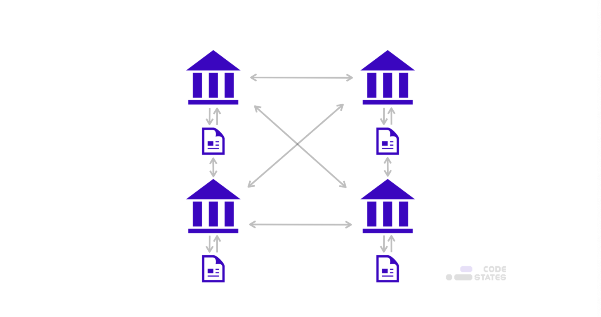
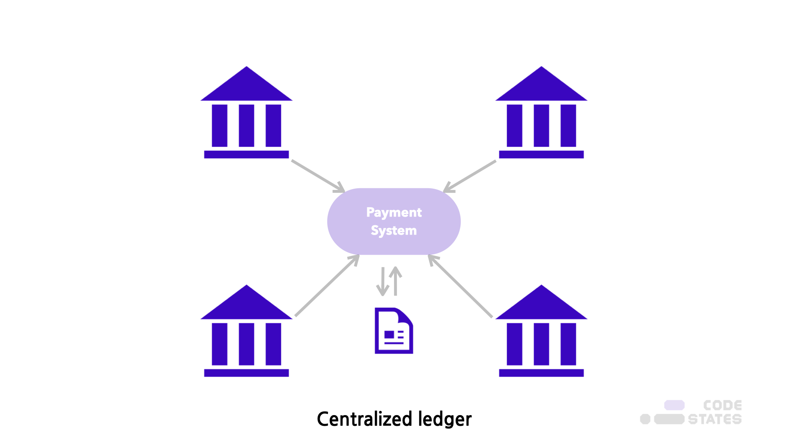

> 본 글은 Codestates BEB 코스의 자료에서 내용을 가져와 작성하였음을 알립니다.  

# Read Me
분산원장(DLT)은 **여러 위치에서, 여러 사람에 의해 복제, 공유 또는 동기화된 데이터베이스를 합의하는 방식**에 대한 기술이다.  
즉, 거래정보를 기록한 원장을 특정 기관의 중앙 서버가 아닌, **P2P 네트워크에 분산하여 참가자가 공동으로 저장하고 기록하는 기술**이다.  
 
분산원장 기술에서는 거래정보가 기록된 원장 전체를 모든 참여자가 각각 보관하고 새로운 거래를 반영하여 갱신하는 작업도 공동으로 수행한다.  
 
분산 원장을 구현하기위해, **P2P 네트워크**와 **각 노드가 가지는 데이터 사본**을 위한 **합의 알고리즘**이 필요하다.  

> P2P 네트워크 : 네트워크를 구성하는 노드들이 중앙 관리자에게 연결된 것이 아닌, 서로 연결된 형태로 구성된 네트워크

즉, 분산원장 기술은 P2P 네트워크로 연결된 각 노드가 데이터베이스가 되는 것이기 때문에, 분산 데이터베이스의 한 종류라고 볼 수 있다.  

  
기업은 분산 원장 기술을 사용하여 트랜잭션 또는 기타 유형의 데이터 교환을 처리, 검증 또는 인증한다.  
 
이미 많은 기관 또는 국가에서 분산 원장 기술에 대해 연구 및 투자를 진해앟고 있으며, 국가 간 송금, 지급 등의 데이터베이스에 사용될 예정이다.  
 
블록체인 역시 이러한 분산 원장 기술의 한 종류이다.  

---

## Centralized Ledger System
근대 이후, 자산에 대한 소유권은 실물 보관 여부와 무관하게 특정한 기관에서 관리하는 **원장(Ledger)**에 기록하여 관리하였다.  
이를 `중앙 집중형 원장 방식`이라 한다.  
  
 
현재 유통되는 통화(M1)의 대부분을 차지하는 결제성 예금은 은행이 고객별로 잔고를 관리하며, 입출금을 승인하고 기록한다.  
중앙은행은 은행별 잔고를 원장에 기록하고 은행 간 자금 이체를 처리한다.  

> [M1 화폐](https://www.investopedia.com/terms/m/m1.asp) : 교환 수단으로 사용되는 국가의 기본 화폐 공급을 의미한다.  

주식, 채권 등 대다수 금융자산의 경우, 실물 증권은 주로 예탁 결제원에 보관하며,  
소유권을 이전하는 내용을 원장에 기록하여 매매 결과를 처리한다.  
토지, 건물, 부동산과 자동차, 지식 재산권 등의 경우에도 공인된 원장에 소유주 및 권리-채무 관계를 기록한다.  
 
이렇게, 중앙집중형 원장 시스템은 **신뢰할 수 있는 제3의기관(TTP : Trusted Third Party)**을 신뢰하는 방식을 사용한다.  
따라서 제3의 기관에 데이터 조작과 같은 문제가 발생하여 시스템에 대한 신뢰가 훼손되는 것을 예빵하기 위해 감시 등, 규제를 제도화 해야하며,  
전산 시스템의 오류 및 해킹으로 시스템이 마비되거나 이용자 피해가 발생하지 않도록,  
IT 인프라와 보안 등에 대해 대규모 인력 및 설비를 투자해야한다.  

---

### Pros 
- 금고에 자산을 보관하는 등 자산을 직접 보관하는 방식과 비교했을 때, **비용을 절감하고 소유권을 명확히 할 수 있다.**

---

### Cons
- 원장 기록을 관리하는 권환과 책임이 특정 기관에 집중되어 해당 기관에 대한 **신뢰에 크게 의존할 수 밖에 없는 한계**가 있다.  
- 신뢰할 수 있는 제3의 기관을 설립하여 운영하는 데 소요되는 높은 사회적 비용이 금융산업 발전의 제약 요인으로 작용할 수 있다.  
- 또한 이 비용은 이용자의 높은 수수료 부담으로 전가된다.  

---

## Distributed Ledger Technology
분산 원장 기술은 모든 기록이 집중된 제3의 기관이 없기 떄문에 기존 중앙집중형 시스템에 비해 다음과 같은 장점과 단점을 가질 수 있다.  

---

### Pros
- **효율성(Efficiency)** : 신뢰할 수 있는 제3의 기고나이 필요하지 않다.  
따라서 별도의 기관을 설립하고 유지하기 위한 인력과 자원을 투입할 필요가 없다.  
또한 시스템 오류 등을 예방하고 해킹 등 보안사고를 방지하기 위한 인프라 투자 비용도 절감할 수 있다.  
- **보안성(Security)** : 분산 원장에는 데이터가 한 곳에 집중된 중앙노드가 없다.  
이를 담당하는 조직도 존재하지 않기 때문에 해킹 등 내외부의 악의적인 공격으로부터 안전하다.  
또한, 원장이 모든 참가자에게 공개되기 때문에 원칙적으로 정보 유출 소지가 없다.  
- **시스템 안정성(Resilience)** : 단일 실패점(Single Point of Failure)이 존재하지 않기 때문에,  
일부 노드에 오류 또는 성능 저하가 발생하더라도 전체 네트워크에 미치는 영향이 미미하다.  
- **투명성(Transparency)** : 분산원장 기술은 모든 거래 기록을 공개하기 때문에 높은 투명성을 갖는다.  
거래 추적이 용이하고, 규제(고객 확인 의무 : Know your Customer 등) 준수 비용도 낮다.  

---

### Cons
분산원장 기술에서는 **신뢰를 담보해 줄 외부 기관 등이 존재하지 않기 떄문에, 시스템 자체에서 신뢰를 형성하는 메커니즘을 설계해야한다.**  
- 분산원장 기술에서는 모든 참가자가 새로운 거래를 반영하여 원장을 갱신하는 권환과 책임을 갖고 있다.  
따라서 특정 내부 참가자가 악의적으로 원장을 조작하여 배포하는 것을 방지해야한다.  
- 그러나 비트코인이 등장하기 전까지, 조작 간으성을 차단하면서 동시에 우너장을 갱신할 수 있는 합의 절차를 마련하지 못했으며, 분산원장 기술을 지급결제시스템 및 여타 금융서비스 등에 실제로 적용하지 못했다.  

비트코인은 분산 원장을 기반으로, 작업증명(PoW) 합의 알고리즘을 통해 악의적인 노드의 데이터 조작을 방지하고,  
노드들이 원장을 갱신할 수 있도록 구현한 결과물이다.  

---

## Technical Challenge
블록체인이 금융 서비스에 적용되기 위해서는 **거래 비밀성, 권한 통제, 신뢰 및 보안 유지, 확장성 확보** 등의 기술적 과제가 아직 남아있다.  

1. **거래 비밀성, 권한 통제**  
블록체인에 저장되는 정보는 개인정보이기 때문에, 개인 소유자와 합의된 관리자만 거래 정보 접근이 가능해야한다.  
2. **신뢰 및 보안 유지**  
신뢰와 보안 유지를 위해서는 비트코인과 같은 퍼블릭 블록체인을 도입하는 것도 고려해야한다.  
3. **확장성 확보**  
실제 사용이 가능하게 하기 위해서는 적어도 초당 3,000건 이상 처리할 수 있는 성능을 보유한 블록체인이 필요하다.  
4. **규제 준수**  
분산원장 기술이 금융에 적용될 경우 발생할 수 있는 검증되지 않은 요소들(보안상의 위험, 법적인 위험성 증가)를 해결해야한다.  

> Smart Contract를 분산원장 기술과 결합해서 사용할 경우,  
> 소프트웨어 자체의 오류 혹은 의도적인 DDoS 공격으로 해당 컨트랙트가 무효화되는 등 위험요소가 존재한다.  

금융 서비스 입장에서 가장 중요한 점은 **대량의 거래 데이터를 신속하게 안전하게 처리하는 것**이다.  
 
블록체인 기반의 분산 원장 기술을 금융 서비스에 도입하는 것은 **인프라 구축 비용 절감, 거래 효율성 증가, 안전성 향상** 등의 측면에서 많은 이점이 있다.  
하지만, **거래 비밀성, 권한통제, 신뢰 및 보안 유지, 확장성 확보** 등 기술적 해결이 우선되어야만 한다.  