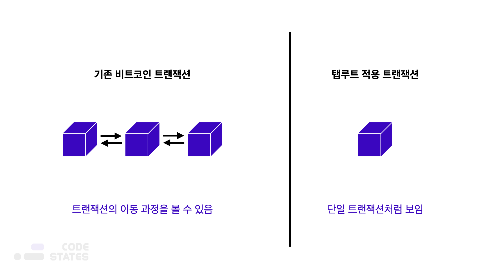
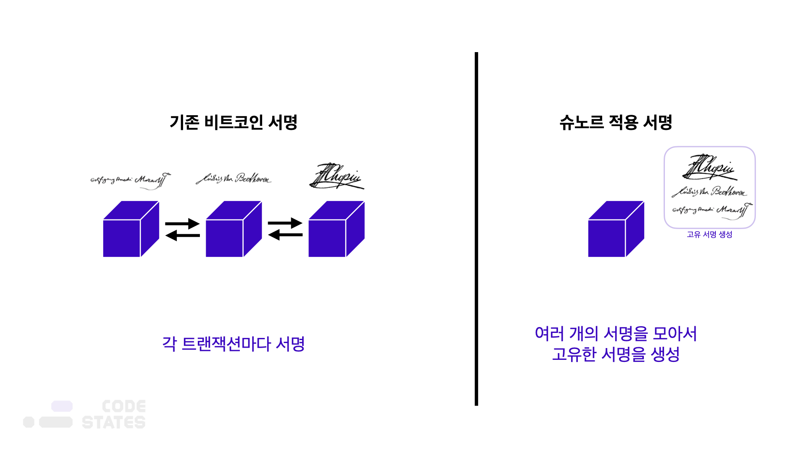

> 본 글은 Codestates BEB 코스의 자료에서 내용을 가져와 작성하였음을 알립니다.  

# Tap Root
  
탭루트(Taproot)는 비트코인의 스크립트를 개선하여 프라이버시를 향상하고 복잡한 트랜잭션과 관련된 요소를 개선하기 위한 소프트 포크 업그레이드이다.  
 
비트코인에서는 트랜잭션을 보낼 때 스크립트를 사용해 타임락(time lock), 다중 서명 등 다양한 기능을 추가할 수 있다.  
비트코인은 퍼블릭 블록체인이기 때문에, 다중 서명 트랜잭션을 보낼 때 누가 서명했는지 확인할 수 있었다.  
그러나 다중 서명 트랜잭션에서 누가 서명을 했는지 확인할 수 있기 때문에, 프라이버시가 확보되지 않는다는 단점이 있었다.  
 
이 단점을 해결하기 위해 탭루트 업그레이드에서는 스크립트를 사용했다.  
탭루트 업그레이드를 통해 다중 서명 트랜잭션을 생성하더라도,  
일반적인 트랜잭션처럼 단일한 하나의 트랜잭션처럼 보이게 되며, 보내는 주소와 받는 주소만 확인할 수 있다.  

---

## READ ME
탭루트(Taproot)는 슈노르 서명(Schnorr Signatures)과 함께 세그윗 도입 이후 많은 기대를 모은 비트코인의 업그레이드이다.  
탭루트의 특징은 **프라이버시, 확장성, 보안을 강화하기 위해 비트코인 스크립트 작동 방식에 변화**를 주는 것이다.  
 
암호화폐 관점에서 봤을 때, 블록체인에서 가장 중요한 것은 **프라이버시, 확장성, 보안**이다.  
비트코인은 최초의 블록체인 플랫폼이자 암호화폐이지만, 이러한 측면에서 봤을 때 여전히 해결해야 할 문제들이 있다.  
탭루트는 이러한 문제를 해결하고자 한다.  

---

## Schnorr Signatures
  
탭루트 업그레이드에서는 슈노르 서명(Schnorr Signatures) 체계를 적용했다.  
슈노르 서명은 독일의 수학자이자 암호학자인 클라우스 슈노르(Claus Schnorr)가 개발한 암호학적 서명 체계로 구성되어 있다.
 
기존 비트코인의 창시자 사토시 나카모토가 채택한 서명 체계는 타원 곡선 디지털 서명 알고리즘(ECDSA)이었다.  
당시 슈노르 서명 대신 이를 선택한 이유는,  
이미 널리 사용되고 있었고, 잘 알려져 있었으며, 안전하고, 튼튼한 오픈 소스였기 때문이다.  
 
그러나 기존의 타원 곡선 디지털 서명 알고리즘(ECDSA)을 사용해 다중 서명을 하게 되는 경우,  
하나의 트랜잭션에 여러 명의 디지털 서명이 그대로 들어가기 때문에 트랜잭션의 크기가 매우 커졌으며,  
이로 인해 블록에 들어갈 수 있는 트랜잭션의 개수가 줄어든다는 단점이 있었다.  
즉, 비트코인의 확장성에도 영향을 준 것이다.
 
슈노르 서명은 다중 서명된 트랜잭션에 있는 여러 디지털 서명을 단일한 서명으로 만들어 기존의 프라이버시 및 확장성 문제를 해결했다.  
 
슈노르 서명의 주된 특징은 복잡한 비트코인 트랜잭션 내에 다수의 키를 포함할 수 있고, 단일하고 고유한 서명을 생성할 수 있다는 것이다.  
즉, 트랜잭션에 포함된 다수의 주체가 진행한 서명이 단일한 슈노르 서명으로 통합된다.  
다른 말로는 서명 통합(signature aggregation)이라고도 한다.  

---

## Pros
정리하면, 탭루트 업그레이드는 다음과 같은 장점을 가진다

- 다중 서명 시, 프라이버시 향상
- 블록체인에 저장해야 하는 데이터의 양을 줄임
- 블록당 더 많은 트랜잭션 처리(TPS 향상)
- 더 저렴한 트랜잭션 수수료  

또한, 탭루트의 또 다른 장점 중 하나는 서명을 더 이상 변경할 수 없다는 것이다.  
 
서명을 변경할 수 있다는 것은 비트코인 네트워크에 존재하는 보안 위협 중 하나였다.  
> **서명 가변성(Signature Malleability)**  
> 트랜잭션이 승인되기 전에 서명을 변경하는 일을 말한다.  

이러한 공격을 통해 트랜잭션이 발생한 적이 없었던 것처럼 보이게 할 수 있다.  
서명 가변성이 존재한다면, 비트코인은 악명 높은 이중 지불 문제에 노출되며, 이는 분산화된 원장의 무결성을 훼손할 수 있다.  
 
탭루트 업그레이드는 슈노르 서명을 통해 서명 가변성 문제를 해결했다.  
슈노르 서명 방식을 사용하는 경우 서명을 변경할 수 없기 때문이다.