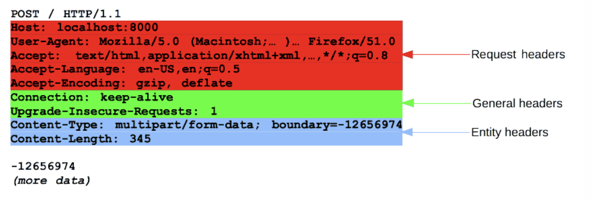

>   본 글은 Codestates BEB 코스의 자료에서 내용을 가져와 작성하였음을 알립니다.  

<!--  -->

# HTTP
이 챕터에서는 HTTP의 작동 원리에 대해서 정리한다.  

---

**Client**  
사용자가 볼 수 있는 화면, 사용자와 상호작용할 수 있는 곳.  
혹은 리소스를 사용하는 어플리케이션.  
모든 클라이언트가 항상 GUI의 형태를 가지진 않는다.  

---

**Server**  
눈에 보이지 않지만, 데이터를 전달해 주거나, 로직을 수행하는 곳.  
리소스가 존재하는 곳.  

---

**2 Tier Architecture**  
클라이언트 - 인터넷 - 서버 구조.  
클라이언트와 서버가 물리적으로 구분되어있고, 이 둘 사이를 인터넷이 연결하는 형태이다.  

---

**3 Tier Architecture**  
클라이언트 - 서버 - 데이터베이스 구조이다.  
2 Tier Architecture의 기능을 확장한 형태.  
계층이 더 나뉘어졌으므로 관심사 분리의 효과를 가진다.  

---

## URL vs URI
브라우저의 주소창에 입력한 URL은 서버가 제공되는 환경에 존재하는 파일의 위치를 나타낸다.  
`CLI`환경에서 폴더와 파일의 위치를 찾아 이동하듯이,  
슬래시 `/`를 이용하여 서버의 폴더에 진입하거나, 파일을 요청할 수 있다.  
 
그러나 기본적인 보안의 일환으로 외부에서 직접 접근이 가능한 경우는 거의 없다.  
브라우저의 검색창을 클릭하면 나타나는 주소가 URI이다.  
URL는 URL을 포함하는 상위 개념이다.  

---

### URL
`URL`은 `Uniform Resource Locator`의 줄임말로, 네트워크 상에서 웹 페이지, 이미지, 동영상 등의 파일이 위차한 정보를 나타낸다.  
`URL`은 scheme, hosts, ulr-path로 구분할 수 있다.  

가장 먼저 작성하는 scheme은 통신 방식(프로토콜)을 결정한다.  
일반적인 웹 브라우저에서는 http(s)를 사용한다.  
hosts는 웹 서버의 이름이나 도메인, IP를 사용하며 주소를 나타낸다.  
url-path는 웹 서버에서 지정한 루트 디렉터리부터 시작하여 접근하고자하는 파일의 경로와 파일명을 나타낸다.  

---

### URI
URI는 Uniform Resourse Identifier의 줄임말로,  
일반적으로 URL의 기본 요소인 scheme, hosts, url=path에 더해, query, bookmark를 포함한다.  
query는 웹 서버에 보내는 추가적인 질문이다.  

|부분|명칭|설명|
|:---:|:---:|:---:|
|`file://`, `http://`. `https://`|scheme|통신 프로토콜|
|`127.0.0.1`, `www.google.com`|hosts|데이터 파일이 위치한 웹 서버, 도메인 또는 IP|
|`:80`, `:433`, `:3000`|port|웹 서버에 접속하기 위한 통로|
|`/search`. `/Users/username/Desktop`|url=path|웹 서버의 루트 디렉토리로부터 데이터 파일 위치까지의 경로|
|`q=JavaScript`|query|웹 서버에 전달하는 추가 질문|

> `127.0.01`은 로컬 PC를 나타낸다.

---

## IP
특정 PC의 주소를 나타내는 체계를 IP address(Internet Protocol address)라고 한다.  
IP는 Internet Protocol의 줄임말로, 인터넷 상에서 사용하는 주소체계를 의미한다.  
인터넷에 연결된 모든 PC는 IP주소 체계를 따라 `.`으로 나뉜 4 덩어리의 숫자로 구분된다.  
이러한 IP주소 체계를 IPv4라고 한다.  
 
IPv4는 Internet Protocol version 4의 줄임말로, IP 주소 체계의 네번째 버전을 뜻한다.  
IP 주소를 확인하는 명령어로는 `nslookup`이 있다.  
IPv4는 각 덩어리마다 0 부터 255까지 숫자를 나타낼 수 있다.  
이들을 총 조합하면 약 43억개의 IP주소를 표현할 수 있지만, 그 중 몇가지는 용도가 정해져 있다.  

- `localhost`, `127,0,01` : 현재 사용 중인 로컬 PC.  
- `0.0.0.0`, `255.255.255.255` : broadcast address, 로컬 네트워크에 접속된 모든 장치와 소통하는 주소.  
서버에서 접근 가능 IP 주소를 broadcast address로 지정하면, 모든 기기에서 서버에 접근할 수 있다.  

개인 PC의 보급으로 IPv4로 할당할 수 있는 PC가 한계를 넘어서고 있다.  
이를 해결하기 위해 나온 것이 `IPv6`이다.  
`IPv6`은 표기법을 달리 책정하여 2^(128)개의 IP주소를 표현할 수 있다.  

---
### PORT
`127.0.0.1:3000` 주소에서 보이는 `:3000`이 포트이다.  
포트는 IP주소가 가리키는 PC에 접속할 수 있는 통로(채널)을 의미한다.  
이미 사용 중인 포트는 중복해서 사용할 수 없다.  
포트 번호는 0~65, 535까지 사용할 수 있다.  
그 중에서 0~1024번까지의 포트 번호는 주요 통신을 위한 규약에 따라 이미 정해져 있다.  
 
그 중에서 반드시 알아야할 포트는 다음과 같다.  

- 22: SSH
- 80 : HTTP
- 443 : HTTPS  

> 더 많은 포트에 관한 내용은 다음 링크에서 확인하자.  
> [List of TCP and UDP port numbers](https://en.wikipedia.org/wiki/List_of_TCP_and_UDP_port_numbers)   

---

## Domain name
웹 브라우저를 통해 특정 사이트에 진입할 때, IP주소를 대신하여 사용하는 주소가 있다.  
- Domain name : codestates.com
- IP Adress : 15.165.183.216  

---
## DNS
네트워크상에 존재하는 모든 PC는 IP주소가 있다.  
그러나 모든 IP주소가 도메인 이름을 가지는 것은 아니다.  
로컬 PC를 나타내는 `127.0.01`은 `localhost`로 사용할 수 있지만,  
그외의 모든 도메인 이름은 일정 기간동안 대여하여 사용한다.  
이렇게 대여한 도메인 이름과 IP주소를 매칭하기 위해서, 해당 도메인 이름과 매칭된 IP주소를 확인하는 작업을 수행해야한다.  
 
네트워크에는 이 일을 위한 서버가 별도로 있다.  
DNS는 Domain Name System의 줄임말로, 호스트의 도메임 이름을 IP주소로 변환하거나,  
반대의 경우를 수행할 수 있도록 개발된 데이터베이스 시스템이다.  

- naver.com 입력 : DNS에서 IP 주소 `125.209.222.142` 반환  

---

## HTTP definition
HTTP는 HyperText Transfer Protocol의 줄임말로, HTML과 같은 문서를 전송하기 위한 `Application Layer` 프로토콜이다.  
HTTP는 웹 브라우저와 웹 서버의 소통을 위해 디자인 되었다.  
전통적인 클라이언트-서버 모델에서 클라이언트가 HTTP messages 양식에 맞춰 요청을 보내면,  
서버도 HTTPs messages 양식에 맞춰 응답한다.  
HTTP는 특정 상태를 유지하지 않는 특징이 있다.  
이러한 특징을 `Stateless(무 상태성)` 라 한다.  

---

### HTTP messages
HTTP messages는 클라이언트와 서버 사이에서 데이터가 교환되는 방식이다.  
HTTP messages에는 다음과 같은 두가지 유형이 있다.  

- 요청 (Requests)
- 응답 (Responses)  

HTTP messages는 몇 줄의 텍스트 정보로 구성된다.  
구성파일, API, 기타 인터페이스에서 HTTP messages를 자동으로 완성하기 때문에,  
개발자는 이런 메세지를 직접 작성할 필요가 거의 없다.  

- HTTP messages의 구조
  

요청(Requests)과 응답(Responses)는 다음과 같은 유사한 구조를 가진다.  
1. start line : startline에는 요청이나 응답의 상태를 나타낸다.  
항상 첫 번째 줄에 위치한다. 응답(Responses)에서는 status line이라 부른다.
2. HTTP headers : 요청을 지정하거나, 메시지에 포함된 본문을 설명하는 헤더의 집합이다.  
3. empty line : 헤더와 본문을 구분하는 빈 줄이 있다.  
4. body : 요청과 관련된 데이터나 응답과 관련된 데이터 또는 문서를 포함한다.  
요청과 응답의 유형에 따라 선택적으로 사용한다.  

이 중 start line과 HTTP headers를 묶어 요청이나 응답의 헤드(head)라고 하고, 페이로드(payload)는 body라고 한다.  

> 페이로드(payload)는 사용에 있어서 전송되는 데이터를 뜻한다.  
> 페이로드는 전송의 근본적인 목적이 되는 데이터의 일부분으로, 그 데이터와 함꼐 전송되는 헤더와 메타데이터와 같은 데이터는 제외한다.  
> 페이로드에 관한 자세한 정의는 [여기](https://ko.wikipedia.org/wiki/페이로드_(컴퓨팅))에서 확인하자.  

---

### 요청 (Requests)
HTTP Requests는 Pull protocol로 설명될 수 있다.  

---

**Start line**  
`Request line`이라고도 부른다.  
HTTP 요청은 클라이언트가 서버에 보내는 메세지이다. Start line에는 세 가지 요소가 있다.  
1. 수행할 작업(GET, PUT, POST 등)이나 방식(HEAD or OPTIONS)을 설명하는 HTTP method를 나타낸다.  
예를 들어 GET method는 리소스를 받아야하고, POST method 는 데이터를 서버로 전송한다.  
2. 요청대상(일반적으로 URL이나 URI) 또는 프로토콜, 포트, 도메인의 절대 경로는 요청 컨텍스트에 작성된다.  
이 요청 형식은 HTTP method마다 다르다.
    - origin 형식 : `?`와 쿼리 문자열이 붙는 절대경로이다. POST, GET, HEAD, OPTIONS등의 method와 함께 사용한다.  
    `POST / HTTP 1.1`  
    `GET /background.png HTTP/1.0`  
    `HEAD /test.html?query=alibaba HTTP/1.1`  
    `OPTIONS /anypage.html HTTP/1.0`  
    - absolute 형식 : 완전한 URL형식으로, 프록시에 연결하는 경우 대부분 GET method와 함꼐 사용한다.  
    `GET http://developer.mozilla.org/en-US/docs/Web/HTTP/Messages HTTP/1.1`  
    - authority 형식 : 도메인 이름과 포트 번호로 이루어진 URL의 authority component이다.  
    HTTP 터널을 구축하는 경우, `CONNECT`와 함께 사용할 수 있다.  
    `CONNECT developer.mozilla.org:80 HTTP/1.1`  
    - asterisk 형식 : `OPTIONS`와 함께 별표(`*`)하나로 서버 전체를 표현한다.  
    `OPTIONS * HTTP/1.1`  
3. HTTP 버전은 메시지의 다른 구조를 결정한다. 이를 위해서 HTTP 버전을 함꼐 입력한다.  

---

**Headers**  
요청의 Headers는 기본 구조를 따른다.  
대소문자 구분 없는 문자열과 콜론(`:`), 값을 입력한다.  
값은 헤더에 따라 다르다.  
여러 종료의 헤더가 있고, 다음과 같이 그룹을 나눌 수 있다.  
- General headers : 메시지 전체에 적용된다.  
- Request headers : User-Agent, Accept-Type, Accept-Language과 같은 헤더는 요청을 보다 구체화한다.  
Referer처럼 컨텍스트를 제공하거나, If-None과 같이 조건에 따라 제약을 추가할 수 있다.  
-  Entity headers : Content-Length와 같은 헤더는 body에 적용된다.  
body가 비어있는 경우, entity headers는 전송되지 않는다.  
  

---

**Body**  
요청의 본문은 HTTP messages 구조의 마지막에 위차한다.  
모든 요청에 body가 필요하지는 않다.  
GET, HEAD, DELETE, OPTIONS처럼 서버에 리소스를 요청하는 경우에는 본문이 필요하지 않다.  
POST나 PUT과 같은 일부 요청은 데이터를 업데이트하기 위해 사용한다.  
body는 다음과 같이 두 종류로 나눌 수 있다.  
- Single-resource bodies(단일-리소스 본문) : 헤더 두 개(Content-Type과 Content-Length)로 정의된 단일 파일로 구성된다.  
- Multiple-resource bodies(다중-리소스 본문) : 여러 파트로 구성된 본문에서는 각 파트마다 다른 정보를 지닌다.  보통 [HTML form](https://developer.mozilla.org/en-US/docs/Learn/Forms)과 관련이 있다.  

---

### 응답(Responses)

---

**Status line**  
응답의 첫 줄은 Status line이라고 부르며, 다음의 정보를 포함한다.  
1. 현재 프로토콜의 버전 (HTTP/1.1)  
2. 상태 코드 : 요청의 결과를 나타낸다. (200, 302, 404, etc.)  
3. 상태 텍스트 : 상태 코드에 대한 설명  
Status line은 `HTTP/1.1 404 Not Found.`과 같이 생겼다.  

---

**Headers**  
응답에 들어가는 HTTP headers는 요청(Requests) 헤더와 동일한 구조를 갖고 있다.  
대소문자 구분 없는 문자열과 콜론(`:`), 값을 입력한다.  
값은 헤더에 따라 다르며, 요청의 헤더와 마찬가지로 몇 그룹으로 나눌 수 있다.  
- General headers : 메시지 전체에 적용된다.  
- Response headers: Vary, Accept-Ranges와 같이 상태 줄에 넣기에는 공간이 부족했던 추가 정보를 제공한다.  
- Entity headers: Content-Length와 같은 헤더는 body에 적용된다.  
body가 비어있는 경우, entity headers는 전송되지 않는다.  
  

---

**Body**  
응답의 본문은 HTTP messages 구조의 마지막에 위치한다.  
모든 응답에 body가 필요하지는 않다.  
201, 204와 같은 상태 코드를 가지는 응답에는 본문이 필요하지 않다.  
응답의 body는 다음과 같이 두 종류로 나눌 수 있다.  
- Single-resource bodies(단일-리소스 본문)
    - 길이가 알려진 단일0리소스 본문은 두 개의 헤더(Content-Type, Content-Length)로 정의한다.  
    - 길이를 모르는 단일 파일로 구성된 단일-리소스 본문은 Transfer-Encoding이 `chunked`로 설정되어 있으며,  
    파일은 chunk로 나뉘어 인코딩 되어있다.  
- Multiple-resource bodies(다중-리소스 본문) : 서로 다른 정보를 담고 있는 body이다.  

---

## Stateless
`Stateless`는 말 그대로 상태를 가지지 않았다는 뜻이다.  
HTTP로 클라이언트와 서버가 통신을 주고 받는 과정에서, HTTP가 클라이언트나 서버의 상태를 확인하지 않는다.  
즉, 클라이언트에서 발생한 모든 상태를 HTTP 통신이 추적하지 않는다.  
이를테면 HTTP 통신은 클라이언트가 로그인하거나 다른 행동하는 것을 알 수 없다.  
만약 쇼핑몰에서 장바구니 담기 버튼을 눌렀을 때, 장바구니에 담긴 상품 정보(상태)를 저장해둬야 한다.  
하지만 HTTP는 통신 규약일 뿐이므로, 상태를 저장하지 않는다.  
따라서, 필요에 따라 다른 방법(쿠키-세션, API, etc.)을 통해 상태를 확인한다.  

---

## References
- [MDN: HTTP 요청 메서드](https://developer.mozilla.org/ko/docs/Web/HTTP/Methods)  
- [MDN: HTTP 메시지](https://developer.mozilla.org/ko/docs/Web/HTTP/Messages)  
- [MDN: HTTP 상태 코드](https://developer.mozilla.org/ko/docs/Web/HTTP/Status)  
- [Software Testing Material: Software Architecture](https://www.softwaretestingmaterial.com/software-architecture/)  
- [IBM: What is 3-Tier Architecture?](https://www.ibm.com/topics/three-tier-architecture)  

---  

## Further Study
- HTTP's Stateless
- [MIN: MIME Type](https://developer.mozilla.org/ko/docs/Web/HTTP/Basics_of_HTTP/MIME_types)
    - `Content-Type`
- [How does a browser work?](https://d2.naver.com/helloworld/59361)  