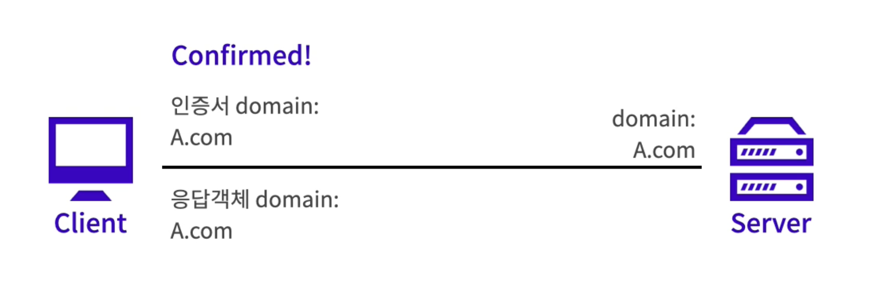
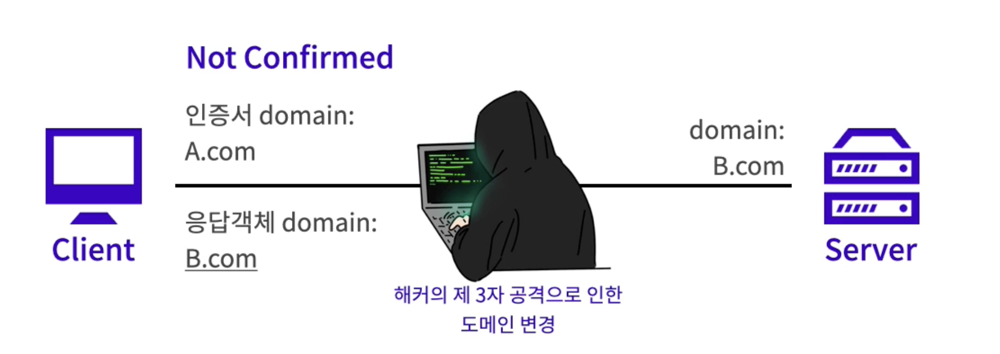
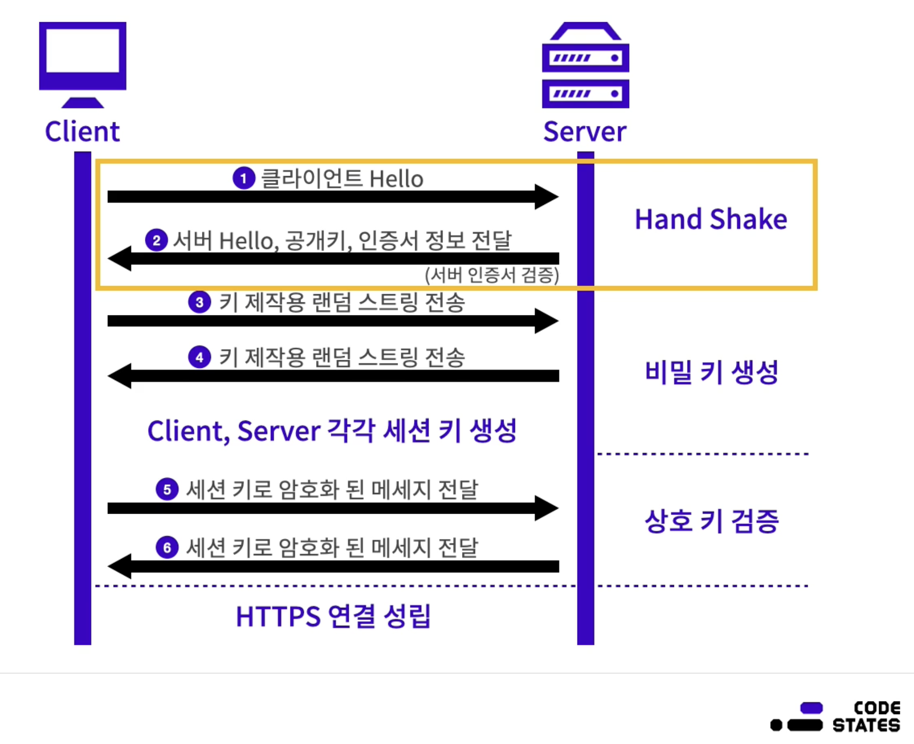

>   본 글은 Codestates BEB 코스의 자료에서 내용을 가져와 작성하였음을 알립니다.  

<!--  -->

# HTTPS
`HTTP` 에 보안이 추가된 프로토콜로, `Hyper Text Transfer Protocol Secure Socket layer`의 약자이다.  
`HTTP over SSL(TLS)`, `HTTP over Secure`라고 부르기도 한다.  

---

## Entrance Settings
기존의 HTTP 요청은 누군가가 요청을 보면 모든 정보가 노출된다.  
반면 HTTPS는 알맞는 키가 없다면 내용을 알 수 없다.  
 
인증에서 HTTPS를 사용해야만 하는 이유는 HTTP보다 상대적으로 안전한 방법이고,  
데이터 제공자의 신원을 보장받을 수 있기 때문이다.  
 
데이터 제공자의 신원을 확인하고 보장받는 것이 인증에서 중요한 이유는 다음과 같다.  
- 클라이언트는 데이터 제공자가 제공해준 데이터를 사용해야만 한다.  
클라이언트는 서버에 데이터 요청을 하고 이후 받은 데이터를 이용하여 작업을 한다.  

- 따라서 요청 밑 응답을 가로채는 **중간자 공격**에 취약하다.  
데이터가 중간에 다른 도메인을 거쳐서 전달되기 때문에, 서버가 서버의 도메인 정보를 응답 객체에 실어 보낸다면,  
클라이언트는 제공한 도메인과 전달받은 도메인의 내용을 비교하여 중간자 공격이 존재하는지 확인할 수 있다.  
 
물론 중간자 공격으로 인해 추가 데이터 또한 변조할 수 있기 때문에, 암호화 작업이 필요하다.   

> `중간자 공격` (`MITM`: Man In The Middle)  
> 클라이언트와 서버 사이에서 공격자가 서로의 요청, 응답의 데이터를 탈취 및 변조하여 다시 전송하는 공격이다.  

---

## Features
HTTPS의 특징은 아래 3가지와 같다.  
- Certificate 
- CA
- Asymmetric key encryption

---

### Certificate
인증서는 데이터를 제공한 서버가 정말로 데이터를 보내준 서버인지 확인할 수 있는 수단이다.  
즉, 브라우저가 응답과 함께 전달된 인증서를 클라이언트에서 확인하여 안전한 연결인지 확인한다.  
 
인증서는 도메인에 종속되어 있으며, 인증서 내용에 서버의 도메인 관련 정보가 있기 때문에, 데이터 제공자 인증을 용이하게 한다.  

---

  
서버가 요청을 받으면 인증서와 함께 응답을 전송한다.  
응답을 받은 클라이언트는 인증서에 작서된 도메인과 응답객체에 작성된 도메인을 비교한다.  
그 둘이 같다면, 데이터를 제공해준 서버가 확실하다고 판단한다.  

---

  
하지만 중간에 해커가 요청을 탈취하여 서버인 척 혹은 클라이언트인 척, 공격이 발생한다면,  
도메인이 달리지기 떄문에 데이터를 제공해준 서버가 확실하다고 보장할 수 없게 된다.  
따라서 클라이언트에서 제공자가 달라졌음을 인지할 수 있다.  

---

### CA
Certificate Authority의 약자이다.  
인증서를 발급하는 공인된 기관, 즉 공인 인증서 발급 기관이다.  
 
앞서 말한 인증서를 발급하는 기관이며, 각 브라우저는 각자 신뢰하는 CA의 정보를 갖고 있다.  
따라서 각 브라우저는 인증서가 다를 수 있다.  
CA는 그 자격이 영구적이지 않기 때문에 때에 따라서 박탈될 수 있다.  

---

### Asymmetric key encryption
HTTPS 프로토콜의 특징 중 하나는 암호화된 데이터를 주고받기 때문에, 중간에 인터넷 요청이 탈취되더라도 그 내용을 알아볼 수 없다는 점이다.  

> 데이터 패킷 분석은 `wireshark`과 같은 프로그램을 이용하여 할 수 있다.  

HTTPS는 전혀 다른 키 한쌍으로 암호화 및 복호화를 진행한다.  
다만 모든 통신에서 공개키 방식을 사용하지는 않는다.  
공개 키 방식은 많은 클라이언트를 대상으로 매번 사용하기에는 연산이 복잡한 알고리즘이기 때문이다.  
따라서 통신의 초창기에서만 비밀키로 사용하기 위한 키를 만들기 위해 사용한다.  
  

통신과정은 각 부분은 다음 3가지로 나뉜다.  
- Hand Shake : 서로를 확인하고, 서버는 클라이언트에게 공개키와 인증서를 전달한다.  
- 비밀 키 생성 : 클라이언트는 전달받은 키를 이용하여 서버와 키를 만들어낼 임의의 정보를 암호화하여 전송한다.  
서버 또한 클라이언트에게 임의의 정보를 암호화하여 전송한다.  
클라이언트 및 서버는 서로 만들고 교환한 임의의 정보를 바탕으로 비밀 키를 생성한다.  
- 상호 키 검증 : 각자 생성한 키를 바탕으로 클라이언트가 테스트용 데이터를 암호화 하여 서버에 전달한다.  
서버 또한 만들어진 비밀 키로 복호화를 하고, 다시 암호화 하여 클라이언트에게 전달한다.  
 
이때 클라이언트가 같은 내용을 복호화하는데 성공했다면, 성공적으로 비밀키가 만들어진 상태이다.  
즉, HTTPS 연결이 성립된 상태이다.  
이후에 이 비밀키를 바탕으로 데이터 송수신을 진행한다.  
