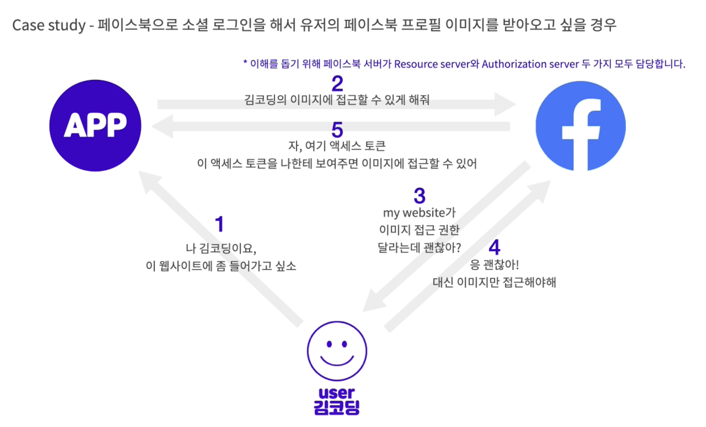
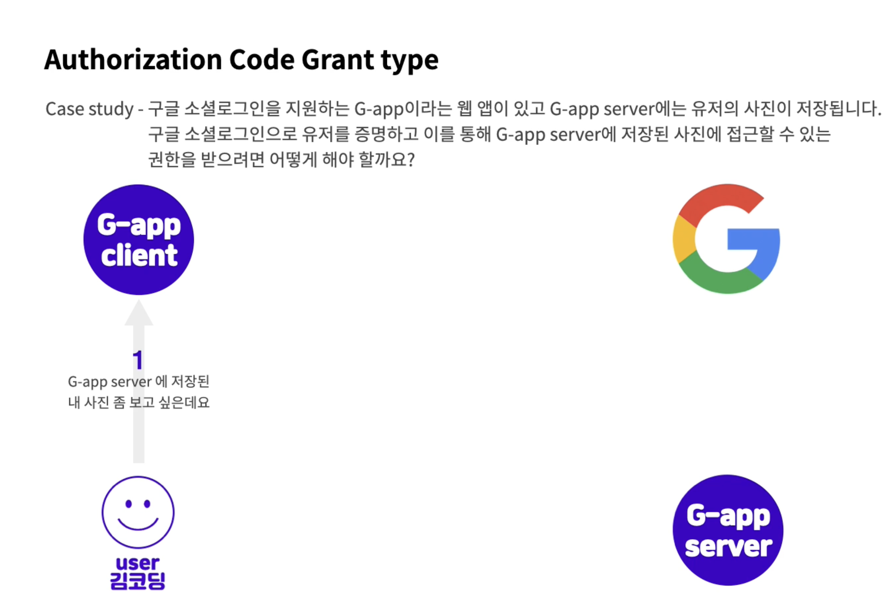
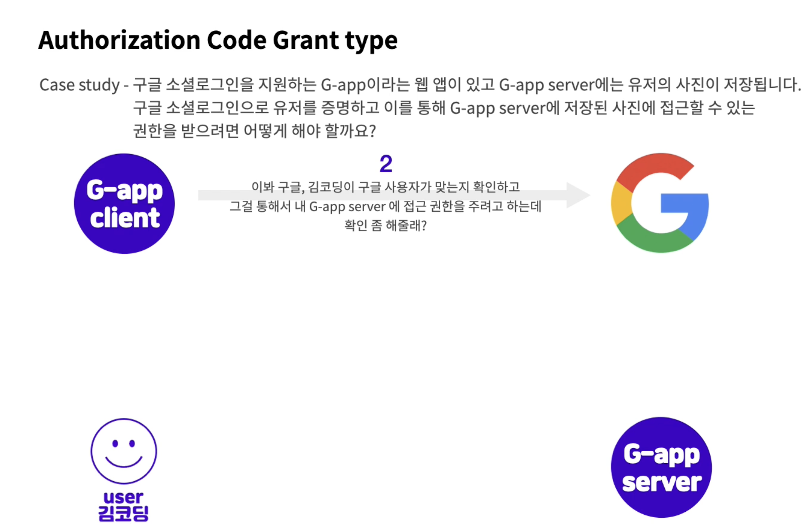
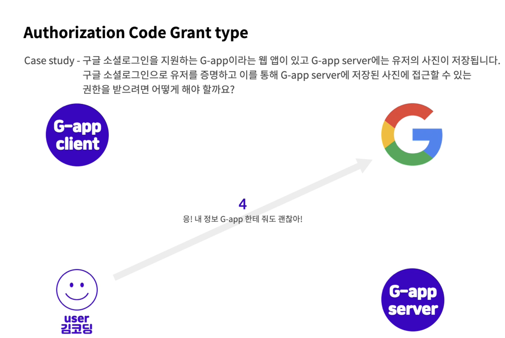
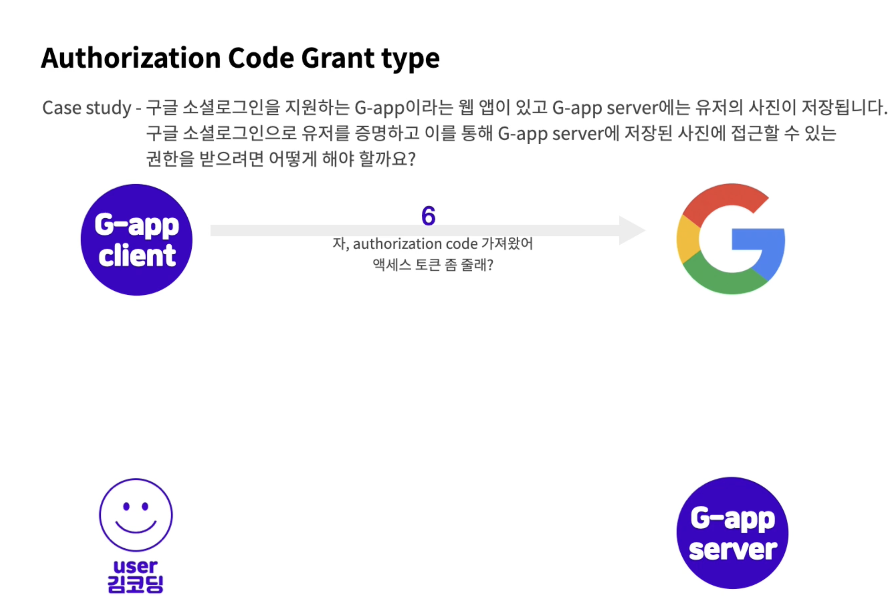
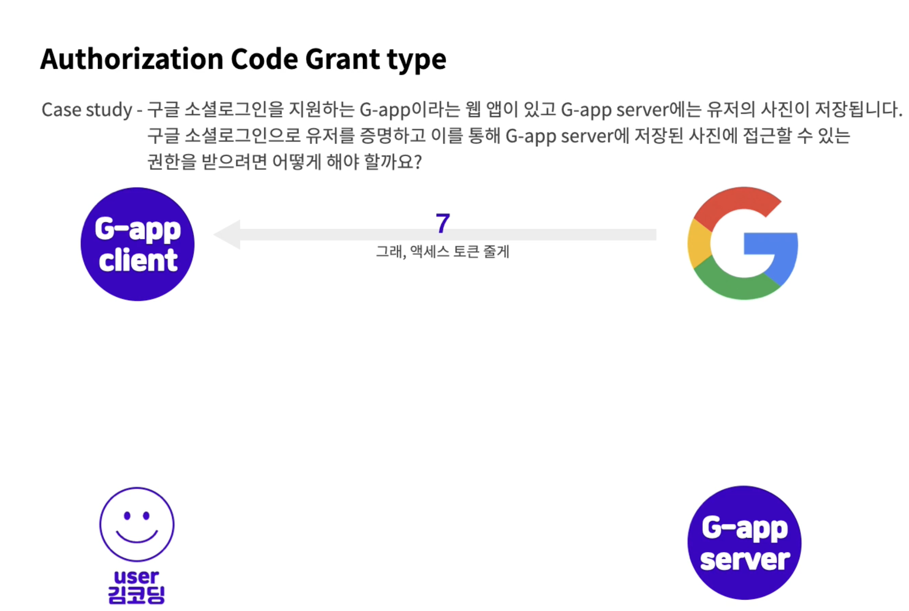
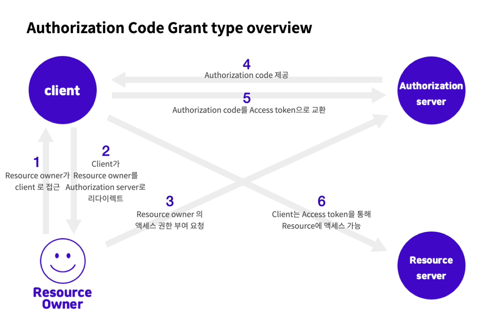
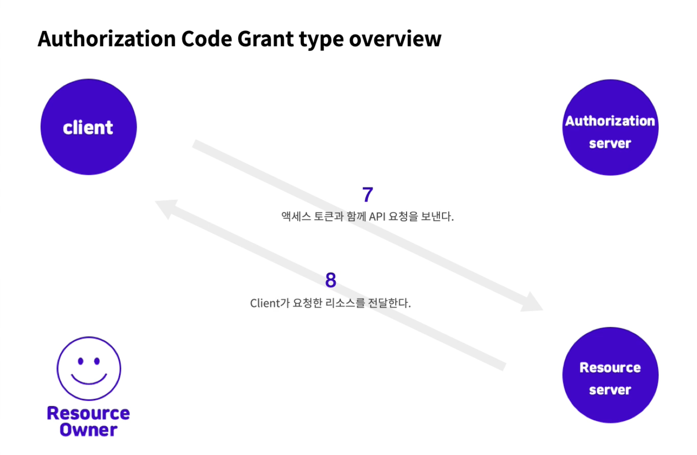
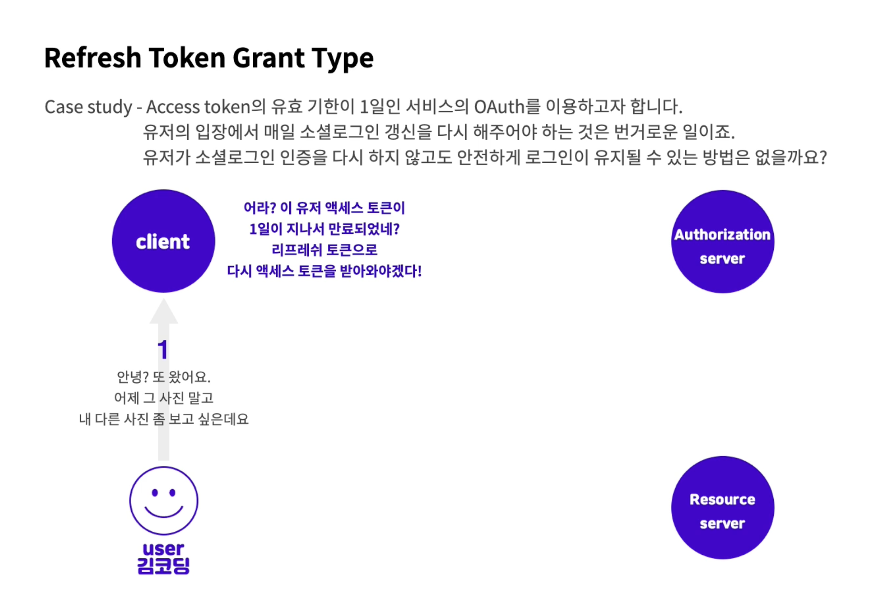
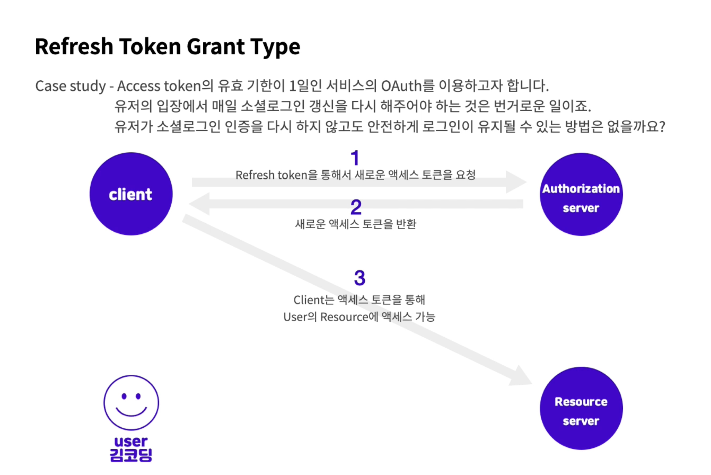

>   본 글은 Codestates BEB 코스의 자료에서 내용을 가져와 작성하였음을 알립니다.  

<!--  -->

# Read Me
우리가 웹이나 앱에서 흔히 찾아볼 수 있는 소셜 로그인 인증 방식은 `OAuth 2` 기술을 바탕으로 구현된다.  
 
OAuth가 모든 것을 해결해주는 솔루션은 아니다.  
여전히 사용자 정보가 서버에 저장되는 것은 변함이 없다.  
OAut는 인증을 다른 서비스에 맡길 뿐, 접근 권환 관리는 순전히 서비스의 몫이다.  
그러므로, OAuth의 작동 방식을 알기 위해서는, 기존 인증 방식에 대한 이해가 필수적이다.  

---

## OAuth 2
OAuth 2.0은 인증을 위한 표준 프로토콜의 한 종류이다.  
전통적으로 직접 작성한 서버에서 인증을 처리해 주는 것과는 달리, `OAuth`는 인증을 중개해주는 메커니즘이다.  
보안된 리소스에 액세스하기 위해 클라이언트에게 권하을 제공하는 프로세스를 단순화하는 프로토콜이다.  
 
즉, 이미 사용자 정보를 가지고 있는 웹 서비스에서, 사용자의 인증을 대신해주고,  
접근 권한에 대한 토큰을 발급한 후, 이를 이용해 내 서버에서 인증이 가능해진다.  

---

## Why OAuth
유저 입장에서 생각하자면, 우리는 웹상에서 많은 서비스를 이용하고 있고,  
각각의 서비스들을 이용하기 위해서는 회원가입 절차가 필요한 경우가 대부분이다.  
그 서비스별로 ID와 Password를 다 기억하는 것은 매우 귀찮은 일이다.  
 
OAuth를 활용한다면, 자주 사용하고 중요한 서비스들만 기억해놓고,  
해당 서비스들을 통해서 로그인이 가능하다.  
 
또한 검증되지 않은 App에서 OAuth를 사용하여 로그인한다면,  
직접 유저의 민감한 정보가 App에 노출될 일이 없고,  
인증 권한에 대한 허가를 미리 유저에게 구해야 하므로 더 안전하게 사용할 수 있다.  

---

## Jargons
- `Resource Owner` : 액세스 중인 리소스의 유저이다.  
갑이 구글 계정을 이용하여 App에 로그인할 경우, Resource owner는 갑이 된다.  
- `Client` : Resourve owner를 대신하여 보호된 리소스에 액세스하는 응용프로그램이다.  
클라이언트는 서버, 데스크톱, 모바일 또는 기타 장치에서 호스팅할 수 있다.  
- `Resource server` : client의 요청을 수락하고 응답할 수 있는 서버.
- `Authorization server` : Resource server가 액세스 토큰을 발급받는 서버.  
즉, 클라이언트 및 리소스 소유자를 성공적으로 인증한 후, 액세스 토큰을 발급하는 서버.  
- `Authorization grant` : 클라이언트가 액세스 토큰을 얻을 때 사용하는 자격 증명의 유형
- `Authorization code` : access token을 발급받기 전에 필요한 code.  
client ID로 이 code를 받아온 후, client secret과 code를 이용해 Access token을 받아온다.  
- `Access token` : 보호된 리소스에 액세스하는데 사용되는 credentials.  
Authorization code와 client secret을 이용해 받아온 Access token으로 reousrce server에 접근한다.  
- `Scope` : scope는 토큰의 권한을 정의한다.  
주어진 액세스 토큰을 사용하여 액세스할 수 있는 리소스의 범위이다.  
- `Grant type` : Client가 Access Token을 얻는 방법.  

---

## Grant Type
`Grant Type`에는 여러가지 종류가 존재한다.  
- **Authorization Code Grant Type**  
- Implicit Grant Type  
- Client Credentials Grant Type  
- Resource Owner Credentials Grant Type 
- **Refresh Token Grant Type**    

이 중 중요한 `Authorization Code Grant Type`과 `Refresh Token Grant Type`에 대해 알아본다.  

---

### Authorization Code Grant Type
액세스 토큰을 받아오기 위해서 먼저 Authorization code를 받아 액세스 토큰과 교환하는 방법이다.  
`Authorization code` 절차를 거치는 이유는 보안성 강화에 목적이 있다.  
 
Client에서 client-secret을 공유하고 액세스 토큰을 가지고 오는 것은 탈취될 위험이 있기 떄문에,  
Client에서는 authorization code만 받아오고, Server에서 Acess Token요청을 진행한다.  

---

#### Case Study
- 페이스북으로 소셜 로그인을 해서 유저의 페이스북 프로필 이미지를 받아오고 싶을 경우,  
웹사이트가 사용자인지 식별하기 위해서 ID와 PWD를 받는 방법은 매우 위험하다.  
 
OAuth는 이 문제를 해결하기 위해서 다음과 같이 접근한다.  
  
- `1` : 사용자가 소셜 로그인(페이스북)을 통해 어플리케이션 로그인을 시도한다.  
- `2` : 사용자의 이미지에 접근하도록 페이스북에 요청한다.  
- `3` : 페이스북 서버가 유저에게 어플리케이션에게 이미지 권한을 부여해도 괜찮은지 확인한다.  
- `4` : 유저는 페이스북에게 이미지 접근을 허용한다.  
- `5` : 페이스북 서버는 어플리케이션에게 권한을 허락한다는 Access Token을 준다.  
- `6` : 어플리케이션은 받은 Access Token을 통해 유저가 허락한 리소스들에 접근할 수 있다.  
어플리케이션은 페이스북에게 유저의 프로필 이미지를 요청한다.  
- `7` : 페이스북은 Access Token을 확인하고 리소스를 제공한다.  
 
Resource Owner : 사용자  
Client : 어플리케이션  
Resource server : 페이스북  
Authorization server : 페이스북  
Scope : 이미지  

- 구글 소셜로그인을 지원하는 G-app이라는 웹 앱이 있고, G-app server에는 유저의 사진이 저장된다.  
구글 소셜 로그인으로 유저를 증명하고, 이를 통해 G-app server에 저장된 사진에 접근할 수 있는 권한을 받아보자.  
  

---

  

---

  

---

  

---

  

---

  

---

  

---

  

---

  

---

#### General flow
  

---

  

---

### Refresh Token Grant Type
일정 기간 유효 시간이 지나서 만료된 액세스 토큰을 편리하게 다시 받아오기 위해 사용하는 방법이다.  
`Access token`보다 `Refresh token`의 유효 시간이 대체로 조금 더 길게 설정하기 때문에 가능한 방법이다.  
 
서버마다 Refresh token에 대한 정책이 다 다르기 때문에,  
Refresh token을 사용하기 위해서는 사용하고자하는 server의 정책을 잘 알아야 한다.  

---

#### Case Study
Access token의 유효기간이 1일인 서비스의 OAuth를 이용하고자 한다.  
유저의 입장에서 매일 소셜로그인 갱신을 다시 하지 않도록, 안전하게 로그인이 유지되도록 하자.  
  

---

  