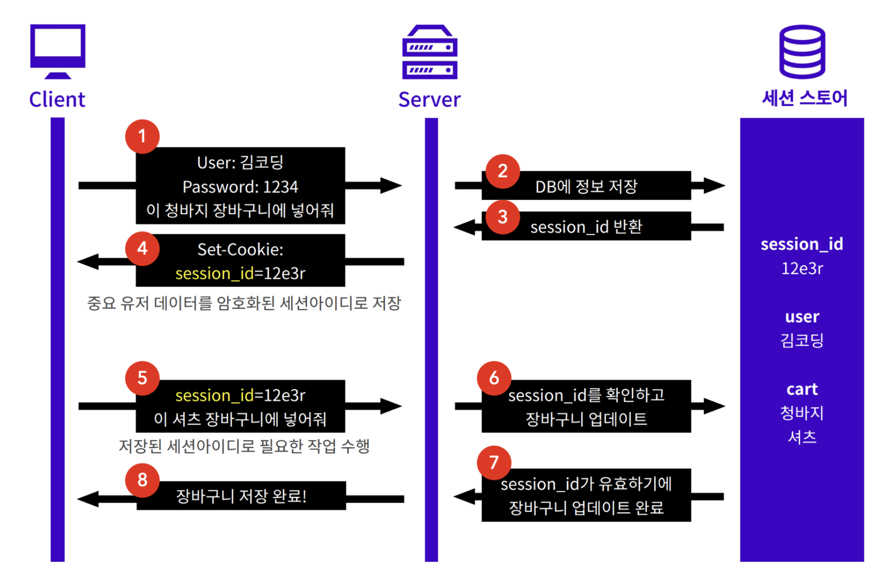

>   본 글은 Codestates BEB 코스의 자료에서 내용을 가져와 작성하였음을 알립니다.  

<!--  -->

# Session
세션이란, 서버와 클라이언트가 연결된 상태, 사용자가 인증에 성공한 상태를 의미한다.  
쿠키와 달리 세션은 **데이터를 서버에 저장**한다.  

---

## Cookie vs Session

||설명|접속 상태 저장 경로|장점|단점|
|:---:|:---:|:---:|:---:|:---:|
|Cookie|쿠키는 그저 http의 stateless feature를 보완해주는 도구|클라이언트|서버에 부담을 덜어줌|쿠키 그 자체는 인증이 아님|
|Session|접속 상태를 서버가 가짐 (stateful) 접속 상태와 권한 부여를 위해 세션아이디를 쿠키로 전송|서버|신뢰할 수 있는 유저인지 서버에서 추가로 확인 가능|하나의 서버에서만 접속 상태를 가지므로  분산에 불리|

---

## Cons
세션은 서버의 메모리에 세션정보를 저장한다.  
서버의 이용자가 매우 많아지게 되면, 메모리의 일정 부분을 항상 차지하므로,  
가용 메모리의 양이 줄어들어 서버의 성능이 저하된다.  
 
또한 세션은 기존 쿠키를 완전하게 대체한 것이 아니기 때문에, 여전히 쿠키를 사용한다.  
쿠키는 `HttpOnly` 옵션이 없을 때 `XSS 공격`에 취약해진다.  
이는 쿠키를 사용하는 세션에도 그대로 적용되어 쿠키의 한계도 그대로 갖고 있는 모습이다.  

---

## Case Study
다음 Case study로 세션(을 어떻게 전달하는지 알아보고,  
Session-based Authentication이 어떻게 수행되는지 확인하자.  

---

### Login
로그인을 통해 인증 정보가 저장되고, 인증된 사용자가 어떤 식으로 웹사이트를 이용하는지 간단하게 알아보자.  
다음 예시는 세션으로 유저를 저장하는 쇼핑몰에서 유저가 장부구니에 물건을 담으려는 경우이다.  
설명은 아래 그림의 숫자 순서에 따라 진행한다.  
  
`1` : 사용자가 웹사이트에서 아이디 및 비밀번호를 이용하여 로그인을 시도한다.  
 
사용자가 정확한 아이디와 비밀번호를 입력했다면, 서버는 인증(Authentication)에 성공했다고 판단한다.  
그렇다면, 이후의 또 다른 인증을 요청을 할 경우, 서버는 아이디 및 비밀번호의 해시를 이미 알고 있기 때문에,  
**인증에 성공했음**을 서버가 알고 있다면, 매번 로그인할 필요가 없다.  

> 인증에 따라 리소스의 접근 권한(Authorization)이 달라진다.  

이때 서버와 클라이언트에 각각 필요한 것이 다음과 같다.  
- 서버는 사용자가 인증에 성공했음을 알고 있어야 한다.  
- 클라이언트는 인증 성공을 증명할 수단을 갖고 있어야 한다.  

`2` : 서버는 일종의 저장소에 세션을 저장한다.  
주로 in-memory, 또는 세션 스토어(redis, etc. 와 같이 트랜잭션이 빠른 DB)에 저장한다.  
 
`3` : 세션이 만들어지면, 서버가 클라이언트에게 각 세션을 구분할 수 있는 유일하고 암호화된 **세션 ID**를 만들어준다.  
 
`4` 보통 클라이언트에서 세션 성공을 증명할 수단으로써 세션 아이디를 전달한다.  
**이때, 웹사이트에서 로그인을 유지하기 위한 수단으로 쿠키를 사용한다.**  
쿠키에는 서버에서 발급한 세션 아이디를 저장한다.  
 
`5` : 쿠키를 통해 유효한 세션 아이디가 서버에 전달되고,  
`6` : 세션 스토어에 해당 세션이 존재한다면,  
`7,8` : 서버는 해당 요청에 접근 가능하다고 판단한다.  
 
하지만 쿠키에 세션 아이디 정보가 없는 경우, 서버는 해당 요청이 인증되지 않았음을 알려준다.  

---

### Logout
세션 아이디가 담긴 쿠키는 클라이언트에 저장되어 있으며, 서버는 세션을 저장하고 있다.  
서버는 그저 세션 아이디로만 요청을 판단한다.  



그러므로, 로그아웃은 다음 두 가지 작업을 해야 한다.  
- 서버의 세션 정보를 삭제한다.  
- 클라이언트의 쿠키를 갱신한다.  

서버가 클라이언트의 쿠키를 임의로 삭제할 수는 없다.  
대신, `set-cookie`로 세션 아이디의 키값을 무효한 값으로 갱신해야 한다.  

---

## express session
이런 세션을 대신 관리해주는 `express-session` 모듈이 존재한다.  
`express-session`은 세션을 위한 미들웨어로, `Express`에서 세션을 다룰 수 있는 공간을 더우 쉽게 만들어 준다.  
 
또한 필요한 경우, 세션 아이디를 쿠키에 저장하고, 해당 세션 아이디에 종속되는 고유한 세션 객체를 서버 메모리에 저장한다.  
이때 세션 객체는 서로 독립적인 객체이므로 각각 다른 데이터를 저장할 수 있다.  
 
`req.session이` 바로 세션 객체이며, `req.session`은 세션 객체에 세션 데이터를 저장하거나 불러오기 위해 사용한다.  

---

## Reference
[Github : express-session](https://github.com/expressjs/session#reqsession)  