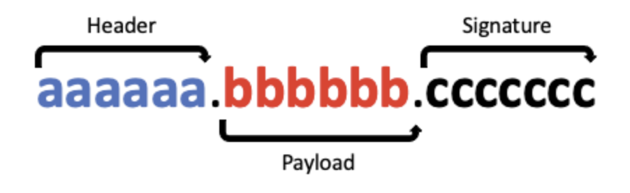
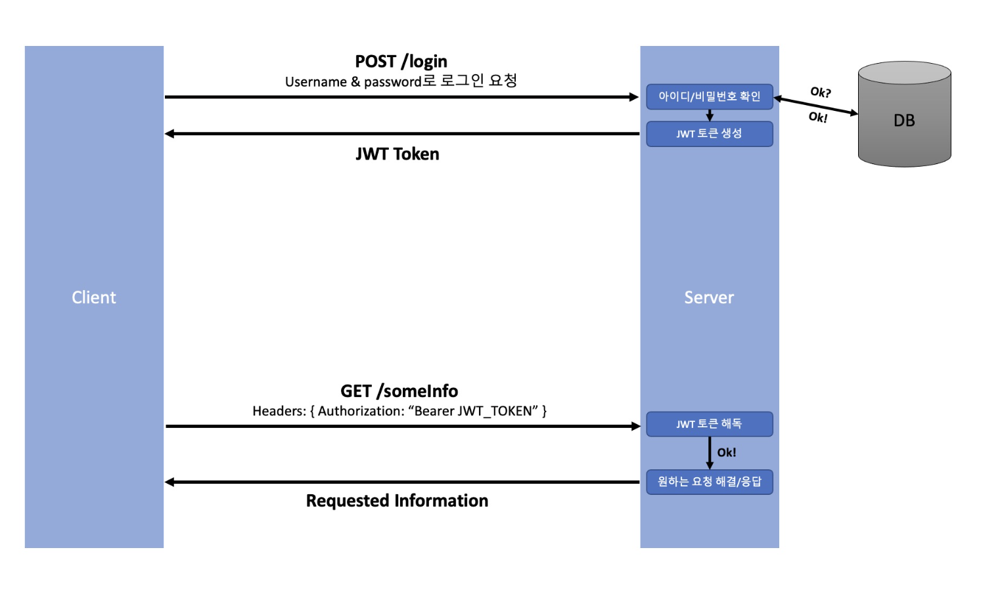

>   본 글은 Codestates BEB 코스의 자료에서 내용을 가져와 작성하였음을 알립니다.  

<!--  -->
# Token
클라이언트에서 인증 정보를 보관하는 방법으로, 토큰 기반 인증이 고안되었다.  
클라이언트가 토큰을 가지고 있다면, 보통의 다른(돈을 내지 않은) 유저들과는 다르게,  
서버에서 제공하는 다양한, 더 프리미엄의 기능을 요청할 수 있을 것이다.  
<br>
하지만 앞서 클라이언트는 `XSS`, `XSRF 공격`에 노출이 될 위험이 있으니, 민감한 정보를 담아서는 안된다고 했다.  
그러나 토큰은, 유저 정보를 **암호화**한 상태로 담을 수 있고, 암호화 했기 때문에 클라이언트에 담을 수 있다.  

---

## Background
세션 기반 인증은 서버(혹은 DB)에 유저 정보를 담는 인증방식이었다.  
서버에서는 유저가 민감하거나 제한된 정보를 요청할 때마다, 
`지금 요청을 보낸 유저에게 우리가 정보를 줘도 괜찮은가?`를 확인하기 위해, 가지고 있는 세션 값과 일치하는지 확인한다.  
요청마다 데이터베이스를 확인하는 오버헤드를 줄이기 위해서 토큰기반 인증을 쓴다.  
그 중 `JWT (JSON Web Token)`에 대해서 알아보자.  

---

## JWT
`JWT`에서는 두 종류의 토큰을 사용한다.  
- Access Token
- Refresh Token  

`Access Token`은 보호된 정보들 (유저의 이메일, 연락처, 사진 등)에 접근할 수 있는 권한 부여에 사용한다.  
클라이언트가 처음 인증을 받게 될 때 (로그인 시), `Access Token`과 `Refresh Token` 두 가지를 다 받지만,  
실제로 권한을 얻는데 사용하는 토큰은 `Access Token`이다.  
즉, **권한을 부여받는 데엔 Access Token**만 있으면 된다.  
<br>
하지만 `Access Token`을 악의적인 유저가 얻어냈을 때, 마치 자신이 그 유저인 것 처럼 서버에 여러가지 요청을 보낼 수 있다.  
따라서 `Access Token`에는 비교적 `짧은 유효기간`을 주어 탈취 되더라도, 오래송안 사용할 수 없도록 한다.  
<br>
`Access Token`의 유효기간이 만료되면 `Refresh Token`을 사용하여, 새로운 `Access Token`을 발급받는다.  
이때, 유저는 다시 로그인할 필요가 없다.  
<br>
유효기간이 긴 `Refresh Token`마저 악의적인 유저가 얻어낸다면, 그 유효기간 동안 `Access Token`이 만료되면,  
다시 발급 받으며 유저에게 피해를 줄 수 있다.  
<br>
따라서 유저의 **편의**보다 **정보를 지키는 것이 더 중요**한 웹사이트들은 `Refresh Token`을 사용하지 않는 곳이 많다.  
세상에 완벽한 보안은 없기 떄문에, 각 방법의 장단점을 잘 활용해야한다.  

---

### Structure
  
JWT는 위 그림과 같이 `.`으로 나누어진 세 부분이 존재한다.  
각 부분은 `JSON` 객체를 `base64`로 인코딩한 것이다.  

1. Header  
Header는 이것이 어떤 종류의 토큰인지(지금의 경우 JWT 토큰), 어떤 알고리즘으로 sign(암호화) 할 지 적혀있다.  
JSON Web Token이므로, JSON의 형태로 볼 수 있다.  
```json
{
    "alg": "HS256",
    "typ" : "JWT"
}
```
이 JSON 객체를 base64 방식으로 인코딩하면 JWT의 첫 번째 부분이 완성된다.  

2. Payload
Payload에는 정보가 담겨 있다.  
어떤 정보에 접근 가능한지에 대한 권한을 담을 수도 있고, 사용자의 유저 이름 등, 필요한 데이터를 암호화시킨다.  
헤더에서 정의한 암호화를 진행하지만, 민감한 정보를 되도록 담지 않는 것을 권장한다.  
```json
{
    "sub" : "someInformation",
    "name" : "phillip",
    "iat" : 151623391
}
```

3. Signature
원하는 비밀키(암호화에 추가할 salt)를 사용하여 암호화한다.  
base64 인코딩을 한 값은 누구나 쉽게 디코딩할 수 있지만,  
서버에서 사용하고 있는 비밀키를 보유한게 아니라면 해독하는데 많은 시간이 들어간다.  
HMAC SHA256을 사용한다면 Signature는 아래와 같은 방식으로 생성된다.  
```javascript
HMACSHA256(base64UrlEncode(header) + '.' + base64UrlEncode(payload), secret);
```

---

### Usage
JWT는 `권한 부여`에 굉장히 유용하다.  
새로 다운로드한 `A`라는 앱이 Gmail과 연동되어 이메일을 읽어와야한다고 가정하자.  
<br>
유저는 다음의 과정을 거치게 된다.  
1. Gmail 인증 서버에 로그인 정보(아이디, 비밀번호)를 제공한다.  
2. 성공적으로 인증 시 JWT를 발급받는다.  
3. A앱은 JWT를 사용해 해당 유저의 Gmail을 읽거나 사용할 수 있다.  

---

## Token based Authentication
1. 클라이언트가 서버에 아이디/비밀번호를 담아 로그인 요청을 보낸다.  
2. 아이디/비밀번호가 일치하는지 확인하고, 클라이언트에게 보낼 암호화된 토큰을 생성한다.  
    - access/refresh 토큰을 모두 생성한다.  
        - 토큰에 담길 정보(payload)는 유저를 식별할 정보, 권한이 부여된 카테고리(사진, 연락처, etc.)가 될 수 있다.  
        - 두 종류의 토큰이 **같은 정보를 담을 필요는 없다.**  
3. 토큰을 클라이언트에게 보내 주면, 클라이언트는 토큰을 저장한다.  
    - 저장하는 위치는 local storage, cookie, react의 state 등 다양하다.  
4. 클라이언트가 HTTP 헤더(authorization 헤더)에 토큰을 담아 보낸다.
    - bearer authentication을 이용한다.
5. 서버는 토큰을 해독하여 `서버가 발급한 토큰이 맞다` 판단이 될 경우, 클라이언트의 요청을 처리한 후 응답을 보낸다.  

  

---

### Pros
1. Statelessness & Scalability (무상태성 & 확장성)
    - 서버는 클라이언트에 대한 정보를 저장할 필요 없이, 토큰 해독이 되는지만 판단한다.  
    - 클라이언트는 새로운 요청을 보낼 때마다 토큰을 헤더에 포함시키면 된다.  
    - 서버를 여러 개 가지고 있는 서비스라면, 같은 토큰으로 여러 서버에서 인증하 할 수 있어 용이하다.  
2. 안전하다.  
    - 암호화한 토큰을 사용하고, 암호화 키를 노출할 필요가 없기 떄문에 안전하다.  
3. 어디서나 생성 가능하다.  
    - 토큰을 확인하는 서버가 토큰을 만들어야 하는 법이 없다.  
    - 토큰 생성용 서버를 만들거나, 다른 회사에서 토큰 관련 작업을 맡기는 것 등 다양한 활용이 가능하다.  
4. 권한 부여에 용이하다.  
    - 토큰의 payload 안에 어떤 정보에 접근 가능한지 정할 수 있다.  

    
## References
[Postman : bearer authentication](https://learning.postman.com/docs/sending-requests/authorization/#bearer-token)
[RFC : bearer authentication](https://www.rfc-editor.org/rfc/rfc6750)