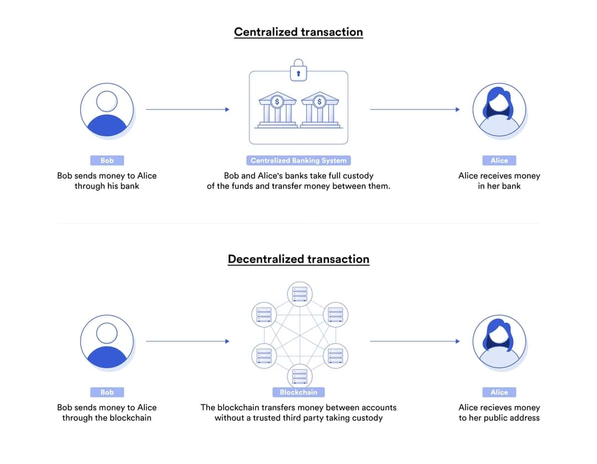

# Smart Contract
스마트 컨트랙트는 블록체인 네트워크에 호스팅 되고 실행되는 프로그램으로,  
조건을 지정해 두고, 해당 조건이 충족되면 미리 정해둔 계약을 이행하는 방식으로 코드를 작성합니다.  
<br>
작성된 로직을 바탕으로 스스로 동작하는 스마트 컨트랙트는,  
어떠한 계약을 수립, 검증하고 특정 조건이 충족되었을 경우 이행하기 위한 컴퓨터 프로토콜입니다.  
<br>
서면으로 이루어져 검증이 복잡하고 시간이 오래 걸렸던 계약의 과정이,  
디지털로 변환되어 자동화를 통해 간단하고, 빠르고, 정확하게 이행할 수 있습니다.  
<br>
스마트 컨트랙트는 전통적인 중앙 집중형 서버가 아니라 탈중앙화된 블록체인에서 실행하기 때문에,  
계약 조건이나 이행 내용을 변조하기 어려우며 계약을 신뢰하기 위한 제3자가 필요하지 않습니다.  

---

## Background
스마트 컨트랙트의 개념은 1994년 닉 재보(Nick Szabo)에 의해 만들어졌습니다.  
닉 재보는 스마트 컨트랙트를 다음과 같이 정의했습니다.  
> "계약 조건을 실행하는 전산화된 트랜잭션 프로토콜"은 "일반적인 계약 조건을 만족하고,  
> 악의적이거나 우발적인 예외를 최소화하며, 신뢰할 만한 중개자의 필요성을 최소화하는 것"을 목표로 한다.  

닉 재보는 스마트 컨트랙트가 마치 자판기와 같다고 말했습니다.  
<br>
커피 자판기에 일정 금액을 넣으면 자판기는 우리에게 커피를 내려 줍니다.  
이 과정에서 자판기와 사용자 사이에는 **커피 제공이라는 계약**이 있습니다.  
<br>
그리고 **이 계약의 주체는 자판기와 사용자, 둘 뿐입니다.**  
신용을 위한 다른 무언가가 포함되어 있지 않다는 의미입니다.  
<br>
"일정 금액을 넣으면 커피를 내려 준다"라는 계약은 자판기 내에 프로그래밍되어 있기 때문입니다.  
원한다면 이 자판기에 커피 제공 계약 대신 더 복잡하고 어려운 계약을 프로그래밍할 수도 있을 것입니다.
<br>
닉 재보는 스마트 컨트랙트 기반의 **비트 골드(Bit Gold)**를 제안했으나,  
기술적 한계로 인해 실제로 구현되지는 못했습니다.  
<br>
스마트 컨트랙트를 실제로 지원하기 시작한 첫 화폐는 비트코인입니다.  
비트코인은 “스크립트” 언어를 사용하여 화폐 거래와 관련된 특정 로직을 설정할 수 있습니다.  
하지만 본질적으로 비트코인은 전자 화폐를 중점으로 둔 시스템이기에 제한적인 프로그래밍만이 가능합니다.  
<br>
이후 프로그래밍 가능한 스마트 컨트랙트를 지원하는 블록체인을 만들겠다는 비탈릭 부테린의 지휘 아래,  
이더리움이라는 블록체인이 등장하였습니다.  
<br>
이더리움에서는 솔리디티(Solidity)라는 언어를 통해 스마트 컨트랙트를 위한 코드를 작성하고,  
EVM(Ethereum Virtual Machine)을 통해 이더리움 블록체인 위에서 코드를 실행시킬 수 있습니다.  
<br>
이를 통해 이더리움은 여러 개의 독립적인 스마트 컨트랙트를 동시에 실행할 수 있어서  
**월드 컴퓨터(World Computer)**라고 불리기도 합니다.  

---

## Features
스마트 컨트랙트는 **제3자의 존재 여부와 상관없이, 조건이 충족된다면 계약이 이행되고, 조건이 충족되지 않는다면 이행되지 않는다**는 단순한 특징을 가지고 있습니다.  
스마트 컨트랙트의 배포는 누구든지 할 수 있고, 자동화할 수 있습니다.  
검증도 제약 없이 자유로우며 변경이 불가합니다.  
<br>
전통적인 계약 방식과 비교했을 때, 스마트 컨트랙트는 거래 수수료를 절감할 수 있습니다.  
전통적인 계약 방식에서는 이 거래 계약을 보장하는 ‘신뢰할 수 있는 제3자’가 필요하기 때문입니다.  
<br>
이 제3자는 은행이나 정부 등이 될 수도 있습니다.  
이 제3자를 통해 계약하기 위해서는 제3자에게 많은 수수료를 지불해야 합니다.  
<br>
그러나 스마트 컨트랙트에서는 컨트랙트에 작성된 코드에 의해 실행되며,  
그 내용을 변경할 수 없고, 모두에게 공개되어 있기 때문에 계약의 조건과 이행을 보증할 제3자가 필요하지 않습니다.  
따라서 거래 수수료도 거의 들지 않게 됩니다.  
<br>
또한 스마트 컨트랙트는 그 내용이 블록체인상에 올라가게 됩니다.  
블록체인에 올라간 컨트랙트는 네트워크에 참여한 누구라도 확인할 수 있기 때문에,  
그 거래 내역이 투명하게 공개될 수밖에 없습니다.  

---

## Operations
스마트 컨트랙트의 로직은 다음과 같습니다.  
```python
if or when (이벤트 x가 실행되면) { 
    # 계약 이행
}
```
코드가 블록체인 네트워크에 올라가면, 네트워크는 미리 제시된 조건이 충족되고, 검증된 경우 조건에 따른 액션을 실행합니다.  
이러한 액션은 트랜잭션에 기록되며, 완료된 트랜잭션은 블록체인에 올라갑니다.  
다시 말해, 스마트 컨트랙트는 한번 액션이 수행되면 되돌리거나 수정할 수 없다는 것을 의미합니다.  
<br>
따라서 스마트 컨트랙트는 당사자가 스마트 컨트랙트와 상호작용하는 방법을 정의하고,  
누가, 언제, 어떤 입력이 어떤 결과를 초래하는지 담고 있습니다.  
<br>
결과 값이 담겨 있다는 것은 어떤 확률적인 상태(Probabilistic State)가 아니라,  
조건에 따른 결과가 미리 결정되어 있다는 것을 의미합니다.  
<br>
코드에 따라 계약이 실행됨을 보장하는 결정론적인 상태(Deterministic State)인 다자간 디지털 계약이 바로 스마트 컨트랙트입니다.  
<br>
개발자라면 누구나 스마트 컨트랙트를 만들고 퍼블릭 블록체인에 배포할 수 있습니다.  
간단한 예로, 누구나 참여할 수 있는 게임 컨트랙트 등을 만들 수도 있습니다.  
이런 경우, 상대방의 입력값에 따라 상태가 “win”, “lose”등으로 결정되도록 스마트 컨트랙트 코드를 작성할 수 있습니다.  

---

## Pros
일반적인 금융 거래로 예를 들어봅시다.  
A가 B에게 송금을 한다고 했을 때, 우리는 은행이라는 제3의 신뢰 기관을 통하게 됩니다.  
<br>
송금을 포함한 대부분의 거래에서는 상대방의 신용, 계약 이행 등 수많은 신뢰 이슈가 발생할 수 있는데,  
이런 부분을 은행이라는 중앙화된 기관이 해결하는 역할을 합니다.
<br>

  

스마트 컨트랙트는 일반적인 중앙집권화된 디지털 계약과는 다른 몇 가지 장점이 있습니다.  
- **보안**  
스마트 컨트랙트는 분산형 블록체인 인프라 위에서 실행됩니다.  
스마트 컨트랙트 코드가 블록체인 네트워크에 올라가면,  
모든 노드가 스마트 컨트랙트 내용과 이행 결과를 가지게 되어, 계약에 대한 중앙화된 공격 지점이 없습니다.  
그렇기 때문에 누군가에게 뇌물을 주고 계약 내용이나 결과를 변조할 위험이 없습니다.  
- **신뢰성**  
스마트 컨트랙트 로직이 조건에 부합해 계약이 이행되면,  
블록체인 네트워크에 있는 노드들에 의해 여러 번 수행되고 검증되기 때문에, 위변조가 매우 어렵고 신뢰성이 높습니다.  
- **공평함**  
계약 조건을 공유하고 강제하기 위해 분산화된 블록체인 네트워크를 사용하기 때문에,  
수수료를 가져가는 등 영리적 목적의 제3자가 필요하지 않습니다.  
- **효율성**  
계약 이행을 자동화하기 때문에 계약 당사자들은 수동으로 데이터를 입력하거나,  
상대방의 계약 의무 이행 여부를 검증하거나, 제3자가 계약을 집행하는지 확인할 필요가 없습니다.  

---

## Cons
스마트 컨트랙트에도 한계점이 분명히 존재합니다.  

- **컨트랙트 배포 이후엔 작동 수정이 불가합니다.**  
내용을 수정할 수 없다는 것은 장점이 될 수 있고, 반대로 한계점이 될 수 있습니다.  
만약, 배포한 컨트랙트에 보안 측면에서 허점이 발견될 경우 해킹에 취약합니다.  
- **블록체인 외의 정보를 스스로 얻지 못합니다.**  
블록체인 내부에 있는 정보 외의 정보는 스스로 얻을 수 없기에,  
외부 데이터의 조건 충족을 확인할 때 문제가 발생합니다.  
이는 결국 제3자에 의해 직접 데이터를 입력해야 되는 상황을 야기합니다.  
또한 신뢰할 수 있는 기관으로부터 외부 데이터를 가지고 온다고 하더라도,  
전달 과정에서 오류가 나거나 악성코드를 의도해서 입력하는 문제 또한 발생할 수 있습니다.  