# Smart Contract in Bitcoin
스마트 컨트랙트의 본격적인 도입은 이더리움이 등장하면서 시작되었습니다.  
그렇다면 최초의 블록체인 시스템인 비트코인에는 스마트 컨트랙트 기능이 없을까요?  
 
그것에 대해 알아보기 전에 우선 비트코인의 트랜잭션이 처리되는 방식인 UTXO와 스크립트의 동작 방식에 대해 먼저 학습해 봅시다.  

---

## UTXO
우선 비트코인은 특정 지갑에 저장되는 것이 아니라, **UTXO**에 저장되며,  
이 UTXO를 통해 코인의 존재 여부를 확인할 수 있습니다.

---

## Structure of Transaction
UTXO의 동작 방식을 이해하기 위해서는 우선 트랜잭션 구조를 알아야 합니다.  
 
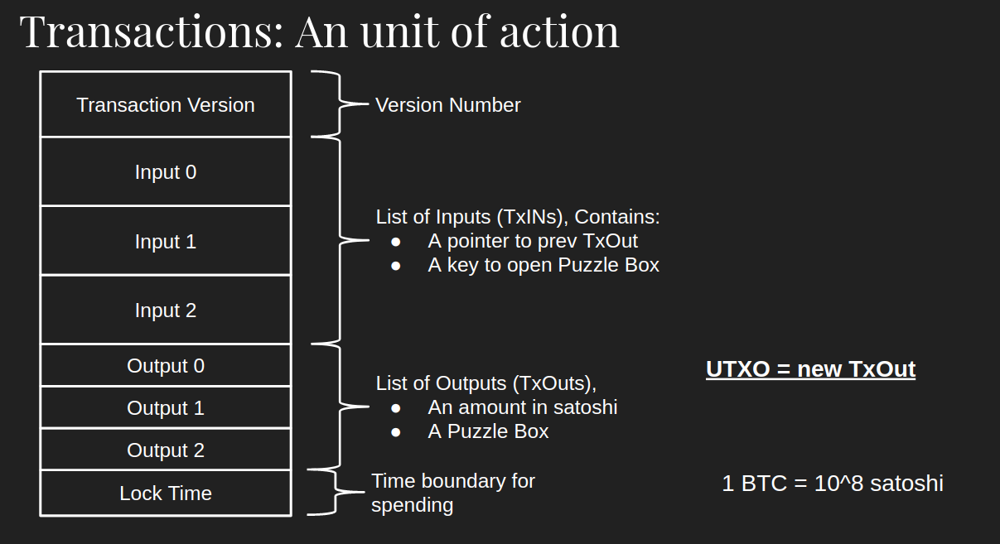  
 
하나의 트랜잭션은 위와 같은 모양이며, 다양한 데이터 구조들로 구성되어 있습니다.  
각 데이터 구조들이 무엇을 의미하는지 확인해 봅시다.  

- **트랜잭션 버전(Transaction Version)**  
트랜잭션 버전은 네트워크에서 트랜잭션의 유형을 지정하는 버전 번호입니다.  
트랜잭션은 버전 별로 그 구조와 규칙이 조금씩 다릅니다.  
따라서 트랜잭션 버전 번호를 확인해야 해당 트랜잭션을 어떻게 읽어야 하는지 파악할 수 있습니다.  
- **잠금 시간(Lock Time)**  
마지막 데이터는 잠금 시간(Lock Time)으로, 트랜잭션을 블록체인에 바로 포함할 수 있는지,  
아니면 지정된 시간이 지나면 포함할 수 있는지 지정합니다.  
- **입력(Inputs)과 출력(Outputs)**  
트랜잭션 버전과 잠금 시간 사이에는 입력과 출력 목록이 들어옵니다.  
 
트랜잭션의 출력은 지폐를 사용하는 것과 같습니다.  
우리가 5만 원권 한 장을 가지고 있는데, 2만 원짜리 치킨을 사 먹기 위해 돈을 지불해야 한다면 어떻게 해야 할까요?  
우리는 지폐의 2/5를 잘라 지불하는 것이 아니라, 일단 5만 원을 전부 건네주고, 2만 원을 제외한 3만 원을 돌려받을 것입니다.  
UTXO도 동일합니다.  
 
트랜잭션 출력은 일종의 5만 원권과 같습니다.  
출력은 잠금(Lock)과 값(Value)으로 구성되어 있습니다.  
출력은 기본적으로 잠겨(Lock) 있으며, 입력에는 잠금을 해제할 수 있는 키(Key)가 들어 있습니다.  
값은 출력 내에 잠겨 있는 사토시(비트코인의 단위)의 양을 의미합니다.  
 
트랜잭션 입력은 우리가 지불할 치킨값 2만 원과 비슷합니다.  
입력에는 포인터(Pointer)와 해제키(Unlocking key)가 들어 있습니다.  
포인터는 이전 트랜잭션 출력을 가리킵니다.  
그리고 키는 포인터로 가리키고 있는 이전 출력을 해제하는 데 사용됩니다.  
그리고 남은 3만 원은 돈을 지불한 사람에게 돌려주어야 하므로 새로운 출력을 만듭니다.  
 
정리하자면, 출력에는 자산이 잠겨있고, 입력으로 출력을 해제하여 출력에 있는 값을 꺼내, 새로운 출력에 자산을 담습니다.  
트랜잭션에는 다른 곳에 잠겨있는 출력을 해제하는 입력과, 입력의 결과로 생긴 새로운 출력이 담기게 됩니다.  
따라서 트랜잭션은 이전 출력을 해제하고, 새로운 출력을 만드는 추상적인 액션이라고 볼 수 있습니다.  
이렇게 입력에 의해 생성된 후, 다른 입력에 의해 해제되지 않은 트랜잭션 출력을 UTXO라고 합니다.  
 
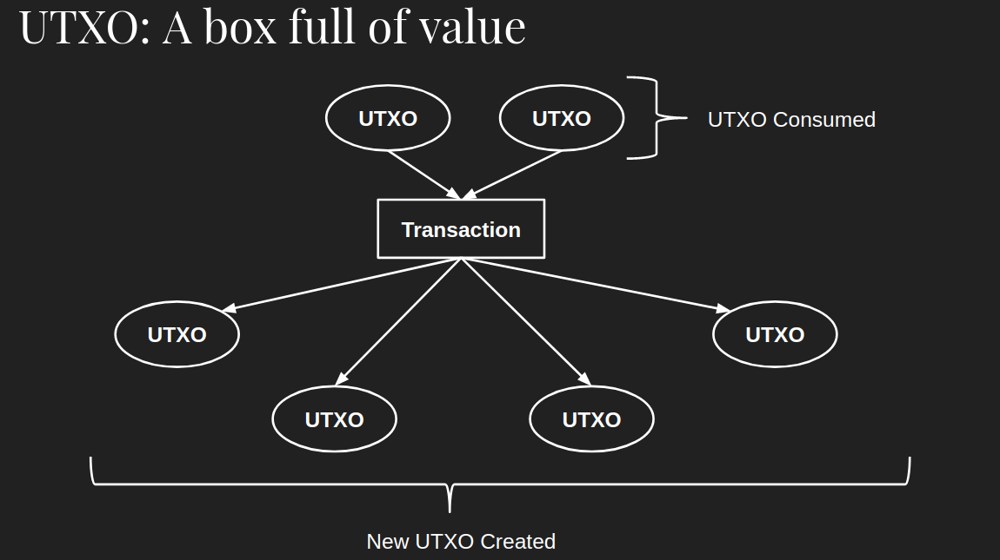  
 
UTXO는 잠겨 있는 비트코인 그 이상도 이하도 아닙니다.  
UTXO는 코인을 담고 있는 상자이며, 다양한 양의 코인을 담을 수 있습니다.  
 
만약 처음 비트코인을 가지게 된다면, 블록체인에서는 UTXO를 하나만 가지고 있을 것입니다.  
그리고 트랜잭션이 일어나면 누군가에게 코인을 전달해야 하므로 UTXO 상자에서 코인을 모두 꺼내고,  
새로운 상자에 지불해야 할 코인을 담아 전달하고, 다른 새로운 상자에는 남은 코인을 저장합니다.  
 
예시를 통해 UTXO의 흐름을 살펴볼까요?  
 
앨리스가 밥으로부터 자동차를 구매했다고 가정해 봅시다.  
 
  
 
자동차의 가격은 6BTC입니다.  
앨리스는 현재 10BTC를 가지고 있으며, 이 10BTC는 하나의 UTXO에 들어있습니다.  
 
이런 경우, 트랜잭션은 입력을 통해 우선 10BTC가 든 출력을 해제한 후에 두 가지 새로운 출력을 만듭니다.  
하나는 밥에게 지불되어야 할 6BTC가 든 출력이고, 다른 하나는 앨리스에게 거슬러줄 4BTC가 든 출력입니다.  
 
지불이 완료되면, 밥이 사용할 수 있는 6BTC를 담은 UTXO가 생성되고,  
앨리스의 10 BTC가 담긴 UTXO는 사용할 수 없게 됩니다.  
이렇게 생성된 새로운 출력들은 아직 다른 입력에 의해 해제되지 않았기 때문에 UTXO(미사용 트랜잭션의 출력값)가 됩니다.  
 
UTXO 모델은 트랜잭션 로직이 매우 단순하여 병렬적으로 여러 개의 트랜잭션을 동시에 검증할 수 있으며,  
이로 인하여 확장성이 좋다는 장점을 갖게 됩니다.  
트랜잭션 로직이 매우 단순하기 때문에 병렬적으로 트랜잭션을 검증할 수 있습니다.  

---

## Script
UTXO를 이용해 화폐를 주고받기 위해서는 이를 컴퓨터가 이해하고 처리할 수 있도록 해야 하는데,  
비트코인에서는 이를 **스크립트(Script)**라는 스크립트 언어를 사용하여 구현합니다.  
 
일반적으로 비트코인에서 사용하는 스크립트는 **비트코인 스크립트**라고 부릅니다.  
비트코인 스크립트는 일반적인 프로그래밍 언어와는 다르게 어떤 공식적인 문법이나 구문이 있는 것은 아닙니다.  
대신 간단한 연산 목록으로 구성되어 있으며, 스크립트에서 사용하는 연산들은 Opcode에 해당합니다.  

> **Opcode**  
> Operation code의 약자로, 컴퓨팅에서 수행할 작업을 지정하는 기계어 명령의 일종입니다.  
> 즉, 로우 레벨 기계 언어로, 약 140 종류의 연산이 존재합니다.  

스크립트는 트랜잭션에 연결되어 있습니다.  
네트워크의 모든 노드는 트랜잭션을 받을 때마다 자신의 로컬 컴퓨터에서 트랜잭션에 연결된 스크립트를 실행하며,  
이를 통해 비트코인의 송금이 이루어집니다.  
이러한 특징으로 인해 비트코인은 **프로그래밍할 수 있는 화폐(Programmable Money)**에 대한 대중성을 추가했다고 볼 수 있습니다.  
 
블록체인에 올라간 트랜잭션은 데이터 위변조가 매우 어렵기 때문에,  
모든 노드는 동일한 스크립트를 실행하고, 정확히 동일한 결과를 얻게 됩니다.  
 
만약 악의적인 노드가 변조한 트랜잭션을 퍼뜨린다면,  
변조된 트랜잭션의 스크립트 실행 결과와 다른 트랜잭션의 스크립트 실행 결과가 달라질 것입니다.  

---

### Input and Output
UTXO를 빠르게 복습해 봅시다.  
 
비트코인 트랜잭션은 입력(Inputs)과 출력(Outputs) 목록을 가지고 있습니다.  
출력은 잠금(Lock)과 값을 가지고 있으며,  
입력은 연결된 과거의 출력(Previous Output)을 가리키는 포인터와 해제 키를 가지고 있습니다.  
스크립트는 이 잠금과 해제 메커니즘에 관한 것입니다.  
 
입력과 출력의 구조는 다음과 같습니다.
 
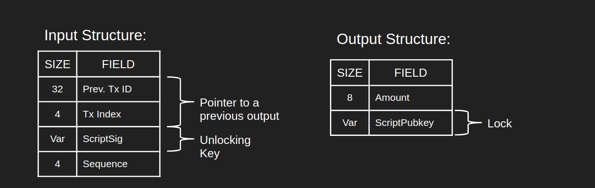  
 
- **입력 구조**  
    - Prev. Tx ID, TxIndex: 해제하고자 하는 이전의 출력을 가리키는 포인터  
    - ScriptSig: 이전의 출력을 해제하는 키  
- **출력 구조**  
    - ScriptPubkey: 잠금. ScriptPubkey의 소유자(해당 공개키의 소유자)만이 ScriptSig를 만들 수 있습니다.  
    - Amount: 잠긴 비트코인의 양(단위:사토시)  

노드는 피어로부터 트랜잭션을 받으면,  
먼저 해당 트랜잭션 안에 들어있는 입력과 출력 목록에서,  
각 입력과 출력에 해당하는 ScriptSig와 ScriptPubkeys를 추출합니다.  
 
그리고 기존 블록들을 찾아보며 입력과 연결된 이전 출력을 찾고,  
각 입력과 출력에 들어있는 ScriptSig와 ScriptPubekey를 연결합니다.
 
ScriptSig와 ScriptPubkey는 각각 연속적인 정보를 담고 있습니다.  
노드가 ScriptSig와 ScriptPubkey를 연결하고,  
그 연결한 전체 시퀀스를 파싱 하면 온전한 스크립트 코드가 나타납니다.  
노드는 이 코드를 단계별로 실행합니다.

---

## Operation of the Script
스크립트는 역 폴란드 표기법(Reverse Polish Notation)으로 작성된 스택 기반 튜링 불완전 언어입니다.  
즉, 스크립트는 스택 구조로 작동한다.  
 
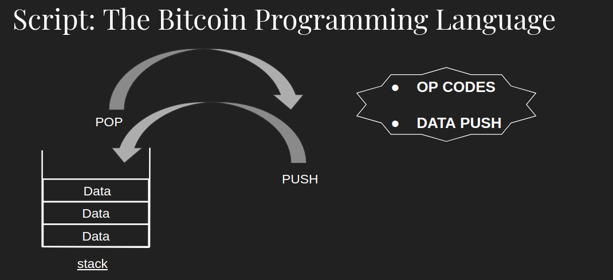  
 
스크립트는 빈 스택에서 시작하며, 이 스택에서 데이터가 들어오거나(Push) 나가게 됩니다(Pop).  
 
스크립트 프로그램은 두 종류의 객체를 가지고 있습니다.  
- **Opcode**: 덧셈, 뺄셈, 곱셈과 같은 연산 작업을 나타냅니다.  
- **데이터**: Opcode가 아닌 모든 데이터는 원시 데이터로 해석되며, 스택에 들어가게 됩니다.  
- **스택 조작 연산**: POP, PUSH, DUP, SWAP  
- **산술/비교/비트 연산**: ADD, SUB, GT, LT, OR  
- **환경 연산**: CALLER, CALLVE, NUMBER  
- **메모리 조작 연산**: MLOAD, MSTORE, MSTORE8, MSIZE  
- **스토리지 조작 연산**: SLOAD, SSTORE  
- **프로그램 카운터 관련 연산**: JUMP, JUMPI, PC, JUMPDEST  
- **작업 중지 연산**: STOP, RETURN, REVERT, INVALID, SELFDESTRUCT  

스크립트는 이 Opcode와 DATA를 일렬로 늘어놓은 것입니다.  
여기서 포인터(Pointer)는 일렬로 늘어진 Opcode와 데이터를 순서대로 하나씩 가리킵니다.  
만약 포인터가 데이터를 가리키면 데이터를 스택에 넣고, Opcode를 가리키면 스택에서 데이터를 꺼내옵니다.  
 
Opcode는 스택에서 데이터를 하나 이상 가져올 수 있지만,  
중요한 것은 스택 구조이기 때문에 가장 나중에 들어온 데이터부터 가져온다는 것입니다.  
 
스크립트 실행이 성공적이면, 스택의 가장 상단에 있는 요소는 1이 됩니다.  
만약 스크립트를 끝까지 실행했는데도 스택 최상단에 1이 아닌 다른 값이 들어있다면,  
스크립트 실행을 실패한 것으로 간주합니다.  
 
노드가 네트워크로부터 새로운 트랜잭션을 받으면,  
ScriptSig와 ScriptPubkey 필드를 추출 후 연결하여 최종적으로 `<ScriptSig><ScriptPubkey>` 형태의 스크립트를 얻게 됩니다.  
노드는 이 스크립트와 빈 스택 하나를 사용해 스크립트를 실행하고, 실행이 완료되면 최상위 스택 요소가 1인지 확인합니다.  
 
1이면 트랜잭션이 유효하다고 간주하고 노드는 트랜잭션을 주변 노드들에게 전파합니다.  
만약 트랜잭션이 유효하지 않은 경우 트랜잭션을 보내지 않고,  
이런 경우 주변 노드들에게 전파되지 않으므로 네트워크에 트랜잭션이 공유되지 않게 됩니다.  
 
트랜잭션은 네트워크에 있는 모든 노드가 받을 수 있기 때문에,  
네트워크의 모든 노드는 전체 네트워크의 상태를 지키는 문지기 같은 역할을 하게 됩니다.  
 
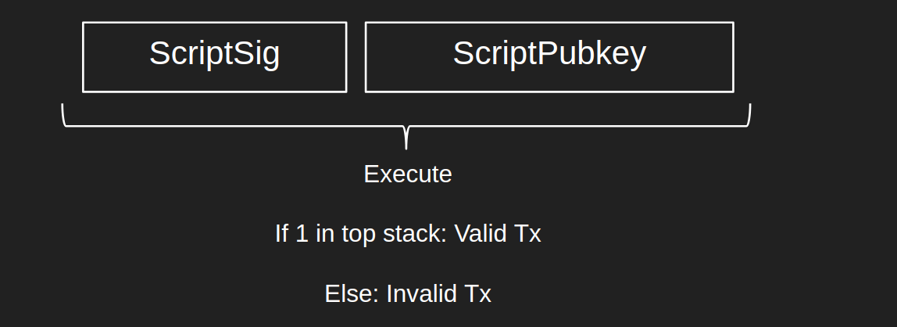  

---

## Standard Scripts
비트코인에는 다양한 스탠더드 스크립트 종류들이 있다.  

- p2pk : pay-to-pubkey
- **p2pkh : pay-to-pubkey-hash**  
- **p2sh : pay-to-script-hash**  
- **p2wpkh : pay-to-witness-pubkey-hash**  
- p2wsh : pay-to-witness-script-hash  

다양한 스크립트의 종류와 그중 많이 쓰이는 것으로는 p2pkh, p2sh, p2wpkh가 있고,  
스크립트의 동작 방식을 이해하기 위해 p2pk, p2pkh를 살펴보도록 하겠습니다.  

---

### Pay To PubKey(P2PK)
두 개의 데이터와 하나의 Opcode만 사용하는 가장 간단한 종류의 비트코인 스크립트입니다.  
비트코인 초기 버전에는 이러한 유형의 스크립트가 사용되었습니다.  
P2PK는 퍼블릭 키에 직접 코인을 송금하는 데 사용합니다.  
> 이러한 P2PK 방식은 보안에 취약하기 때문에 오늘날에는 수신자의 공개키를 직접 노출하는 문제로 쓰이지 않습니다. 
> 하지만 스크립트 실행 방식을 이해하는데 초점을 맞춰보자.  

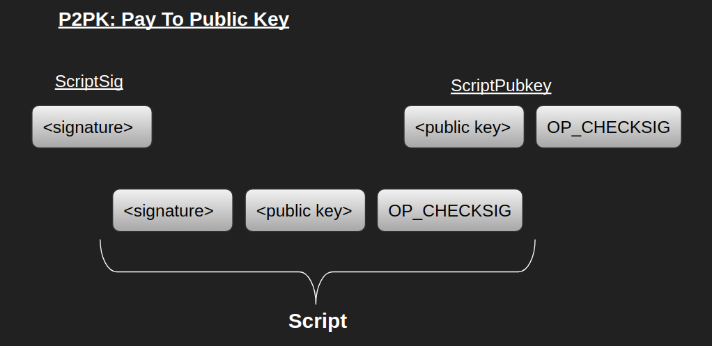  
 
ScriptPubkey는 잠금을 정의하는 데이터 구조이며, ScriptSig는 해제 키를 정의하는 데이터 구조입니다.  
ScriptSig는 트랜잭션 입력(Input) 내부에 존재하며,  
ScriptPubkey는 이 트랜잭션 입력이 잠금을 해제하려는 이전 트랜잭션의 출력(Output)에서 추출됩니다.  
 
"잠금을 해제한다"는 것은 ScriptSig와 ScriptPubkey를 연결하여 스크립트 코드로 만들어 실행하고,  
실행 후 스택 최상단에 값이 1인 요소를 남긴다는 것과 같습니다.  
 
P2PK 유형의 트랜잭션에서의 ScriptPubkey와 ScriptSig 필드는 위의 그림과 같습니다.  
전체 P2PK 스크립트는 서명(Signature), 공개 키(Public Key), OP_CHECKSIG라는 Opcode로 구성됩니다.  
이 OP_CHECKSIG는 서명이 주어진 공개 키와 연결되는지 확인합니다.  
만약 연결되면 스택에 1을 반환하고, 그렇지 않으면 0을 반환합니다.  
 
자세한 순서는 다음과 같습니다.

1. 빈 스택에서 포인터가 서명을 가리킵니다.  
 
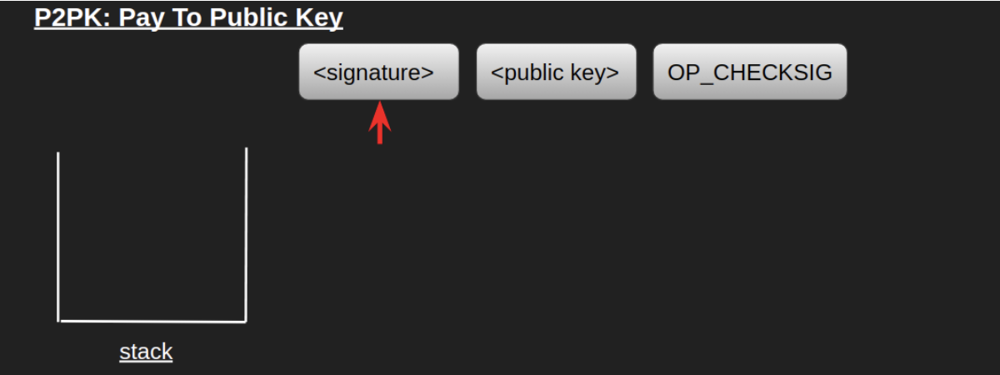  
 
2. 서명은 데이터이므로 스택에 들어갑니다. 포인터는 그다음 요소인 공개 키를 가리킵니다.  
 
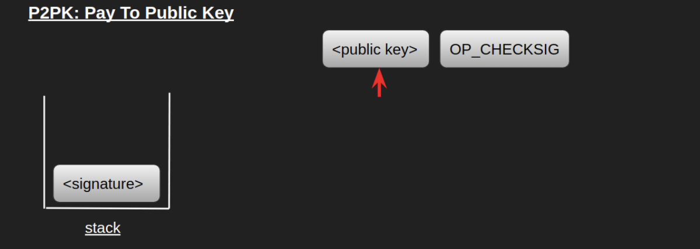  
 
3. 공개 키도 데이터이니 스택에 넣습니다. 포인터는 이제 OP_CHECKSIG를 가리킵니다.  
 
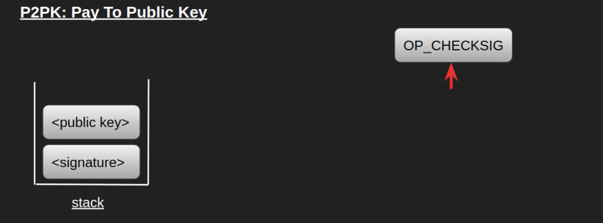  
 
4. OP_CHECKSIG는 스택에서 아이템 두 개(공개키와 서명)를 꺼내는 Opcode입니다.  
OP_CHECKSIG는 스택에서 공개키와 서명을 꺼내고, ECDSA 알고리즘을 사용해 서명을 검증합니다.  
만약 검증에 성공하면 1, 실패하면 0을 스택에 넣습니다.  
 
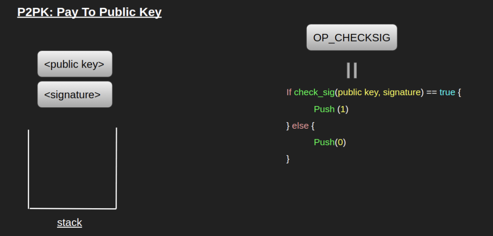  
 
> **ECDSA 알고리즘 (ECDSA; Elliptic Curve Digital Signature Algorithm)** 
> 타원곡선 알고리즘에 디지털 서명을 추가한 알고리즘입니다.  
> 비트코인과 이더리움에서 서명을 검증할 때 사용합니다.  

5. 검증을 마치고 스택에 1이 들어있으면, 트랜잭션 검증이 완료되고 UTXO가 해제됩니다.  
 
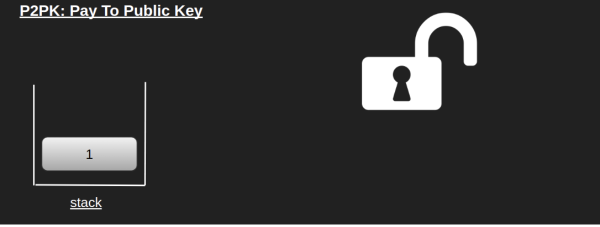  
 
스크립트가 성공적으로 실행되면 트랜잭션은 유효한 것으로 간주됩니다.  
이전 UTXO가 소비되고, 해당 트랜잭션의 출력 목록에 따라 새로운 UTXO가 생성됩니다.  

---

### PayToPubKeyHash(P2PKH)
P2PKH는 P2PK 메커니즘과 거의 동일하며,  
한 가지 차이점은 P2PKH에서는 ScriptPubkey가 공개 키의 해시값을 가지고 있다는 점입니다.  
P2PK 방식과 달리 수신자의 공개키를 직접 공개하지 않기 때문에 비교적 보안에 유리합니다.  
 
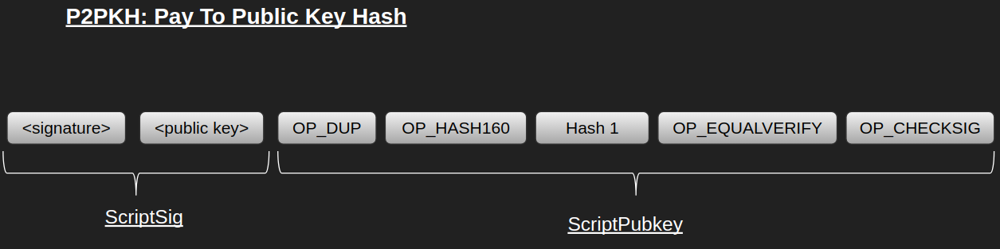  
 
P2PK와는 다르게, 서명과 공개키가 ScriptSig에 들어있습니다.  
ScriptPubkey는 P2PK에서와 다르게 여러 개의 Opcode를 가지고 있으며,  
수신자의 공개키를 해싱한 값인 Hash 1 객체가 들어있습니다.  
비트코인을 보내는 동안 송신자는 공개키의 해시값을 보내기 때문에 스크립트 이름의 PayToPubkeyHash인 것입니다.  
 
자세한 순서는 다음과 같습니다.

1. 빈 스택에서, 포인터는 서명을 가리킵니다.  
 
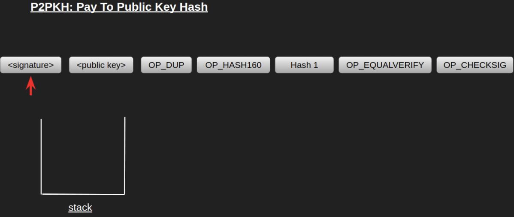  
 
2. 서명은 데이터이기 때문에 스택에 들어가고, 포인터는 다음 요소인 공개 키를 가리킵니다.  
 
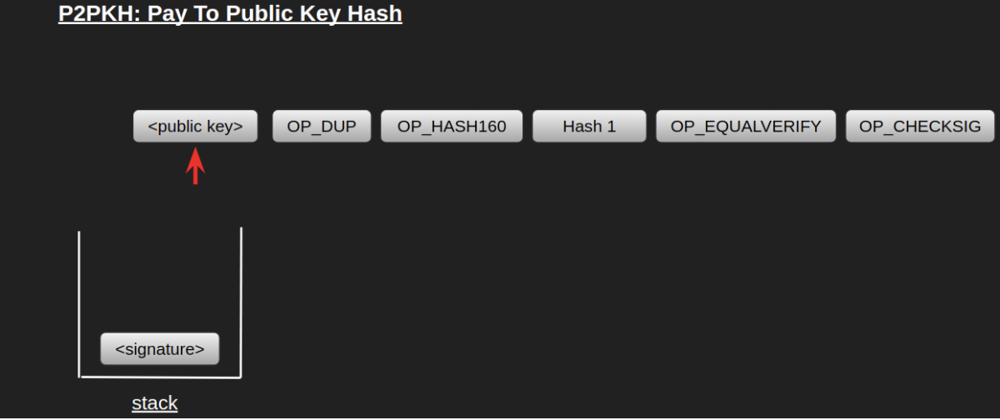  
 
3. 공개 키도 데이터이기 때문에 스택에 들어가고, 포인터는 다음 요소인 OP_DUP을 가리킵니다.  
 
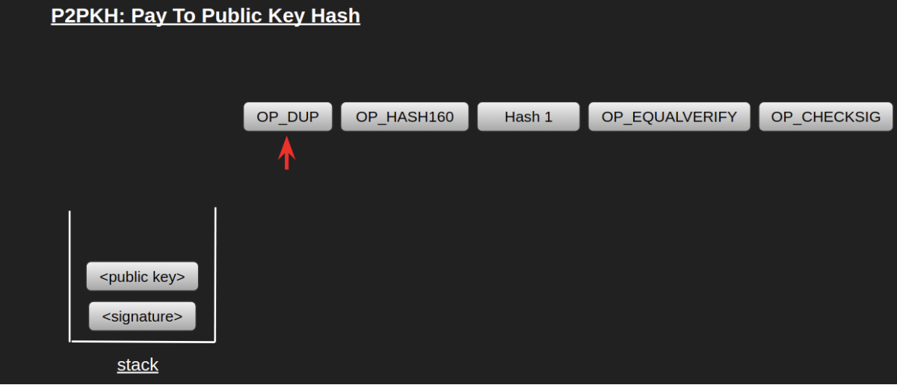  
 
4. OP_DUP은 스택 최상단 요소를 복사하는 Opcode입니다.  
OP_DUP이 실행되면 스택에는 공개 키가 두 개 쌓이게 됩니다.  
포인터는 다음 요소인 OP_HASH160을 가리킵니다.  
 
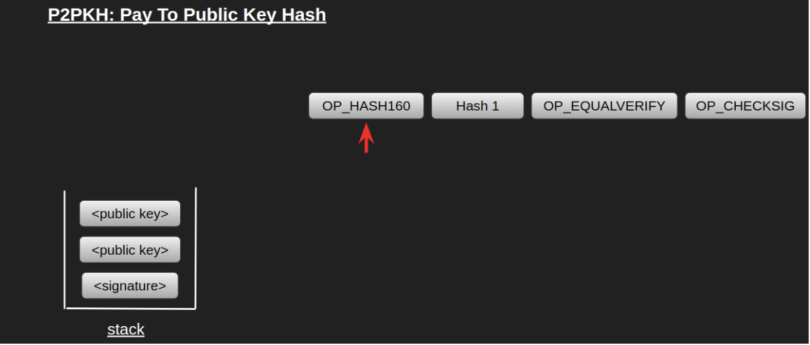  
 
5. OP_HASH160은 스택 최상단 요소를 해싱하는 Opcode입니다.  
최상단에 있는 공개 키가 해싱되어 Hash 2가 됩니다.  
포인터는 다음 요소인 Hash 1을 가리킵니다.  
 
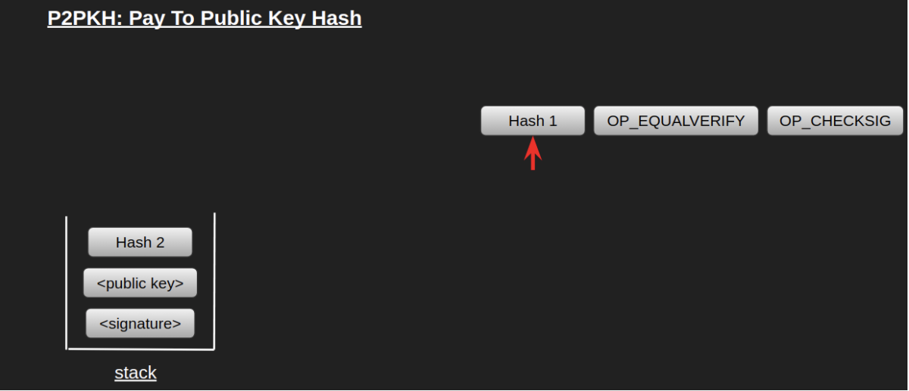  
 
6. Hash 1은 데이터이기 때문에 스택에 쌓입니다.  
포인터는 다음 요소인 OP_EQUALVERIFY를 가리킵니다.  
 
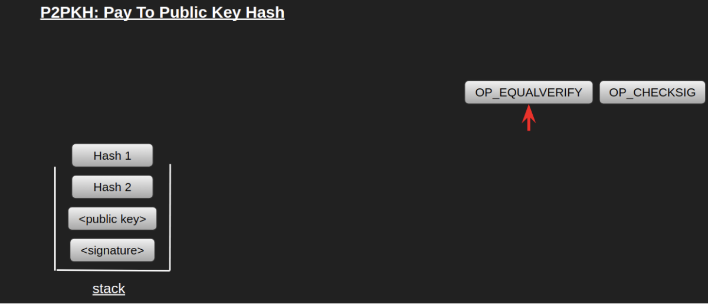  
 
7. OP_EQUALVERIFY는 스택에 있는 두 요소가 같은지 확인하는 op_code입니다.  
만약 두 요소가 같다면, 해당 요소 두 개를 제거하고, 다르다면 실행에 실패하게 됩니다.  
 
만약 ScriptSig에 올바른 공개 키가 들어있었다면,  
ScriptPubkey에 들어있던 Hash 1과 공개키를 해싱한 값인 Hash 2가 동일할 것이고, 스택에서 제거됩니다.  
이제 포인터는 다음 요소인 OP_CHECKSIG를 가리킵니다.
 
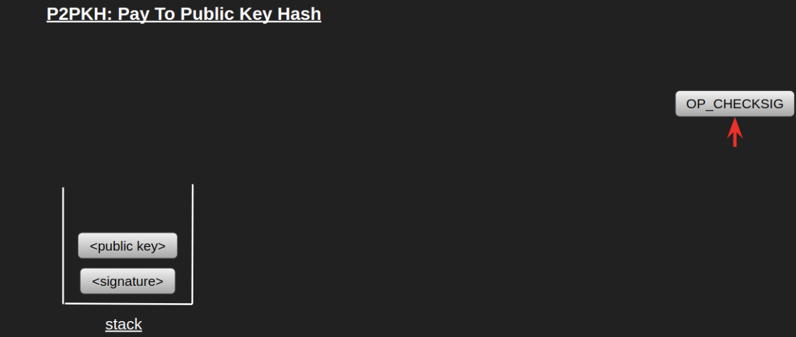  
 
8. OP_CHECKSIG는 앞서 P2PK와 동일하게 동작합니다.  
ECDSA 알고리즘으로 서명을 검증하고, 서명이 올바르다면 스택에 1을 쌓습니다.  
 
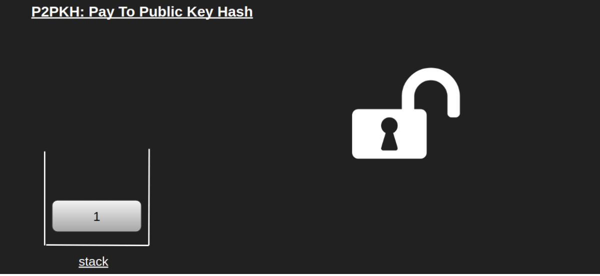  
 
실행이 완료되고 1이 남아있다면 검증이 성공한 것이고, UTXO가 해제됩니다.  

P2PKH는 서명에 대해 공개 키로 검증을 한다는 점에서는 P2PK 스크립트와 동일하지만,  
공개 키가 아닌 공개 키 해시값을 사용한다는 점에서 우회적인 방식으로 좀 더 좋은 프라이버시를 제공합니다.  
 
P2PK와 P2PKH라는 기본적인 비트코인 스크립트의 동작 방식을 살펴보았습니다.  
이러한 기존에 작성된 스크립트 외에도 직접 스크립트를 작성할 수도 있습니다.  
직접 작성한 스크립트는 regtest라는 비트코인 테스트 네트워크에서 테스트할 수 있으며,  
[btcdeb](https://github.com/bitcoin-core/btcdeb)라는 CLI를 사용해 스크립트를 디버깅할 수도 있습니다.  

---

## Why is it Smart Contract
UTXO의 ScriptPubkey는 일종의 수학적 퍼즐의 형태이고,  
올바른 ScriptSig를 추가함으로써 이 퍼즐을 풀 수 있습니다.  
 
가령 트랜잭션의 입력과 연결된 출력에 다음과 같은 ScriptPubkey와 ScriptSig가 들어있다고 합시다.  

- ScriptPubkey: `2, 2, OP_ADD, OP_EQUAL`  
- ScriptSig: `4`  

이러한 ScriptPubkey를 가진 UTXO는 위의 ScriptSig를 통해서 해제됩니다.  
ScriptSig의 값이 3이나 5였으면,  
OP_EQUAL(스택의 두 요소를 꺼내 같은지 확인하는 Opcode)의 결과값이 거짓이 되어 UTXO가 해제되지 않았을 것입니다.  
 
UTXO는 일종의 "계약"으로 정의될 수 있으며, 이 계약은 유효한 해제 조건을 주면 잠긴 비트코인을 이동시킵니다.  
오직 유효한 해제 조건을 줘야만 코인을 송금할 수 있는 계약인 것입니다.  
이 계약의 실행은 비트코인 네트워크가 보장하기 때문에 계약 이행을 강제하기 위한 제3자가 필요하지 않습니다.  

---

## Limitations
비트코인은 최초의 블록체인 알고리즘이지만 확장성이나 성능 등의 한계가 존재했습니다.  
오늘날에는 비트코인의 단점을 극복하기 위한 다양한 플랫폼과 프로젝트가 존재합니다.  

---

### 라이트닝 네트워크(Lightning Network)
비트코인의 거래량이 늘어날수록 처리해야 할 트랜잭션이 많아집니다.  
그러나 비트코인의 TPS는 트랜잭션 양과 관계없이 고정되어 있기 때문에,  
저장해야 할 트랜잭션이 많아질수록 트랜잭션이 처리되는 속도가 느려지게 됩니다.  
 
이러한 성능 문제를 해결하기 위해 등장한 것이 라이트닝 네트워크입니다.  
라이트닝 네트워크는, 트랜잭션의 내용을 블록체인 외부에 저장하고,  
최종 결과만 블록체인에 올리는 방법을 사용해 비트코인의 성능 문제를 해결합니다.  
트랜잭션이 블록체인 바깥에서 이루어지기 때문에 트랜잭션이 처리되기까지 대기 시간이 필요하지 않아 즉시 처리됩니다.  
 
이러한 기능을 구현하기 위한 핵심 기술은,  
다중 서명(Multi Signature, Multi-Sig)과 시간 잠금 계약(Hashed Timelock Contract)입니다.  
다중 서명을 통해, 블록체인 외부에서 트랜잭션을 실행할 때는 계약 당사자들끼리 합의를 진행하고,  
트랜잭션 결과를 체인에 기록할 때 계약 당사자들의 개인 키로 공동 계좌를 만들어 비밀 키를 생성합니다.  
또한 시간 잠금 계약은 일정 시간이 지나 트랜잭션이 확정되었을 때까지 트랜잭션을 변경할 수 없게 하여,  
계약 당사자가 트랜잭션을 임의로 수정하지 못하도록 합니다.  

---

### 루트스탁(Rootstock, RSK)
루트스탁은 비트코인에 스마트 컨트랙트 기능을 탑재하는 사이드체인 프로젝트입니다.  
비트코인에서도 스마트 컨트랙트 구현이 가능하지만,  
기본적으로 연산에 대한 수수료가 비싸기 때문에, 실질적으로는 사용이 어려웠습니다.  
또한 비트코인 스크립트는 튜링 불완전하기 때문에 사용성 측면에서 제약이 컸습니다.  
 
루트스탁은 2-Way peg를 이용해 비트코인에 튜링 완전한 스마트 컨트랙트를 지원하는 블록체인을 쌍방향으로 연결하며,  
병합 채굴(Merge-Mining)을 통해 비트코인 채굴 노드가 사이드체인 블록까지 채굴할 수 있도록 연결합니다.  
이를 통해 비트코인 네트워크에서도 튜링 완전한 스마트 컨트랙트를 실행할 수 있게 되었습니다.  

---

### 탭루트(TapRoot)
탭루트는 2021년 11월 14일에 이루어진 비트코인 업그레이드를 의미합니다.  
탭루트에는 슈노르 서명과 MAST 등 중요한 사항들이 포함되어 있습니다.  
 
MAST와 슈노르 서명을 통해 스크립트 실행에 대한 효율성이 극도로 커지기 때문에,  
궁극적으로 기존에 제약이 많았던 비트코인 스마트 컨트랙트의 활용성이 확장될 것으로 기대됩니다.  

> **MAST(Merkelized Abstract Syntax Tree, 머클 추상화 구문트리)**  
> 비트코인 스크립트에서 해시값을 추출하는 자료구조로, 스크립트의 조건 중 필요한 부분만 먼저 검증할 수 있도록 하였습니다.  
> 또한 MAST를 슈노르 서명과 결합하는 경우, 서명을 한 번만 해도 트랜잭션이 이루어질 수 있기 때문에,  
> 속도가 개선되고, 효율성이 증대되는 효과가 있습니다.