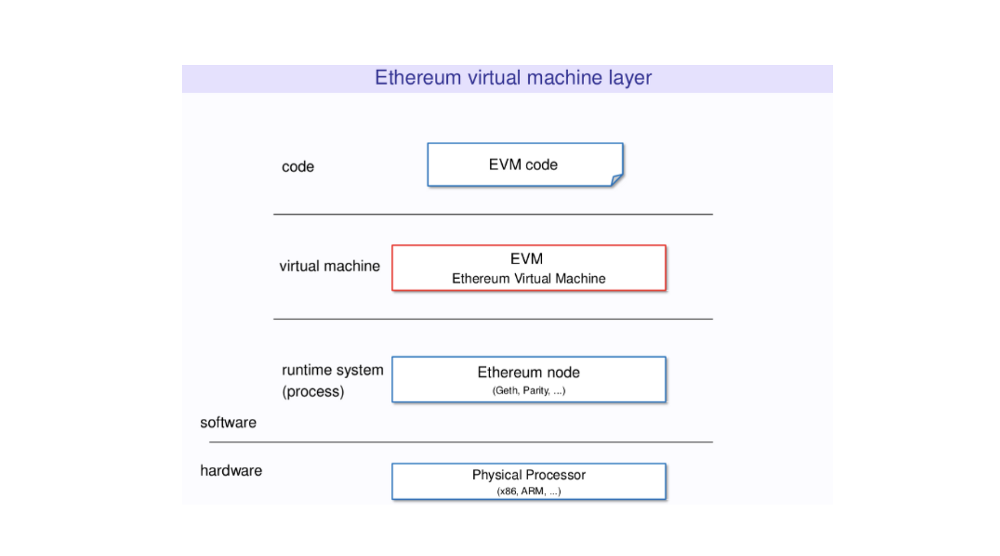
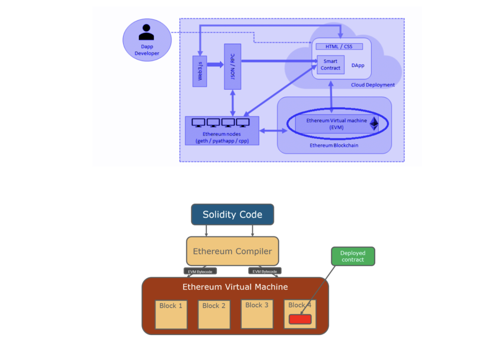
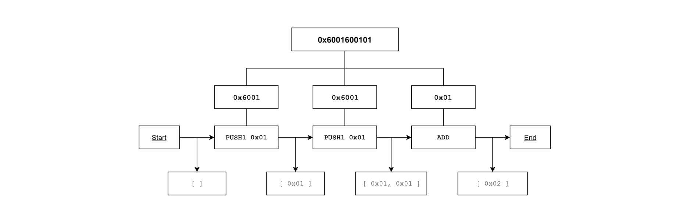

# Smart Contract in Ethereum

---

## Ethereum
이더리움은 블록체인 기술을 활용해, 스마트 컨트랙트와 암호화폐 거래를 제3자 없이 안전하게 이뤄질 수 있도록 하는 오픈소스 퍼블릭 서비스입니다.  
누구든지 분산형 애플리케이션(dApp)을 이더리움 네트워크에 배포할 수 있습니다.  
이더리움은 개발자들이 dApp을 만들 수 있도록 튜링 완전한 언어인 **솔리디티(Solidity)**를 제공하였으며,  
이더리움 네트워크에 올라간 솔리디티 코드는 **EVM(Ethereum Virtual Machine)**을 통해 실행됩니다.  

---
## Backgrounds
비탈릭 부테린은 2011년 비트코인 생태계에 관심을 가지기 시작했으며,  
비트코인 매거진(Bitcoin Magazine)을 공동 창립하였습니다. 
 
부테린은 비트코인에서 단순 암호화폐 거래를 하는 것에서 그치지 않고, **애플리케이션을 실행할 수 있는 범용적인 블록체인**을 만들고자 하였습니다.  
그리고, 2013년 일반적인 스크립트 언어를 사용하는 이더리움의 백서를 내놓게 됩니다.  
 
비트코인과 비교했을 때, 주요 차이점은,  
이더리움이라는 블록체인 플랫폼은 단순 암호화폐를 주고받는 것 이상의 일을 할 수 있게 해 준다는 것이었습니다.  
 
2014년, 부테린과 다른 이더리움 공동 창업자들은 클라우드 소싱 캠페인을 통해 참여자들에게 이더를 팔았고, 1,800만 달러를 모금했습니다.  
프런티어(Frontier)로 알려진 이더리움의 첫 번째 라이브 릴리스는 2015년 출시되었습니다.  
이후, 이더리움은 가파르게 성장하고 있으며 오늘날 수백 명의 개발자가 참여하고 있습니다.  
 
궁극적으로 부테린은 "이더리움은 특별한 시스템에 의존할 필요가 없는 블록체인의 모든 활용 사례에 대한 솔루션이 되기를 바란다"라고 말했습니다.  
이더리움은 여전히 성장통을 겪고 있기도 하고, 비트코인이 이전에 확장성과 관련되어 겪었던 문제들을 똑같이 겪기도 했습니다.  
2016년에는 약 5천만 달러의 이더가 해킹당했으며, 이에 따라 이더리움의 보안에 대한 의문이 제기되기도 했습니다.  
이에 따라 이더리움 커뮤니티에 분열이 일어났고, 결국 두 블록체인으로 분리되었습니다.  
기존 이더리움은 이더리움 클래식(ETC)이 되었으며, 하드포크하여 분리된 블록체인은 이더리움(ETH)이 되었습니다.  

---

## Bitcoin vs Ethereum
- 비트코인은 암호화폐를 거래하는 반면, 이더리움은 암호화폐 거래뿐만 아니라 스마트 컨트랙트를 활용한 분산 애플리케이션(dApp)을 만들 수 있도록, 솔리디티 언어와 EVM(Ethereum Virtual Machine)을 지원합니다.  
오늘날 블록체인 대부분은 VM을 제공하는데, 이 블록체인 VM의 시초가 이더리움입니다.  
- 비트코인은 무허가 퍼블릭 트랜잭션만을 허용하지만, 이더리움은 허가 트랜잭션과 무허가 트랜잭션을 모두 허용합니다.  

---

## EVM  

---

### VM(Virtual Machine)?
우리가 사용하는 물리적인 시스템 위에 논리적인 가상 시스템을 올려서 독립적으로 사용할 수 있도록 해주는 기법입니다.  
즉, 컴퓨터 안에 또 다른 컴퓨터를 가상으로 만들어 동작시키는 행위라고 할 수 있습니다.  
 
이 가상 컴퓨터는 실제(물리적)로는 존재하지 않기 때문에 가상 머신(Virtual Machine)이라고 합니다.  
이 가상 머신은 프로그램과 하드웨어 사이에 존재하는 계층으로,  
소프트웨어의 이식성을 향상하고, 애플리케이션이 서로 분리되어 독립적으로 실행할 수 있도록 합니다.  
 
이러한 가상 머신을 사용하는 가장 대표적인 경우는,  
하나의 컴퓨터로 서로 다른 운영체제를 실행 및 사용하고자 할 때입니다.  
우리가 사용하는 맥북에서 윈도우 OS 기반의 소프트웨어를 실행하고자 할 때 사용한다고 생각하면 되겠습니다.  

---

### EVM이란?
  
EVM(Ethereum Virtual Machine)은 우리가 작성한 코드와 이더리움 블록체인 사이에 있는 가상 머신으로,  
블록체인에서 코드가 실행될 수 있도록 합니다.  
 
이더리움 스마트 컨트랙트에 기반한 dApp은 솔리디티라는 언어로 작성됩니다.  
우리는 솔리디티로 작성된 dApp을 이더리움 네트워크에 올려야 합니다.  
 
그런데 솔리디티 언어는 고급 언어이기 때문에 EVM이 바로 해석하기 어렵습니다.  
EVM은 가상머신, 말 그대로 기계이기 때문에 기계가 이해할 수 있는 **바이트코드(bytecode)**로 변환해 주어야 합니다.  
 
먼저 우리가 작성한 솔리디티 코드를 solc를 이용해 컴파일하여 EVM이 읽을 수 있는 바이트코드 형태로 만듭니다.  
그리고 이 바이트코드를 이더리움 클라이언트를 이용해 이더리움 네트워크에 올립니다.  
이후 바이트코드를 EVM이 Opcode 단위로 해석하여 실행시킵니다.  
즉, **솔리디티 코드 → 바이트코드 → Opcode** 흐름입니다.  
  
블록체인에 저장된 바이트코드 형태의 dApp은 EVM에서 실행하게 되며,  
EVM에서는 바이트코드를 **Opcode로** 변환하여 실행합니다.  
솔리디티로 작성된 스마트 컨트랙트는 EVM에서 동작하기 때문에 특정 운영체제나 하드웨어에 종속되지 않습니다.  

---

### Operation of Opcode
내부적으로 EVM은 명령어 집합(Opcode)을 사용하여 특정한 작업을 실행합니다.  
모든 Opcode에는 1바이트가 할당됩니다.  
100개가 넘는 고유한 Opcode가 있으며, 따라서 충분한 리소스만 있다면 무엇이든 계산할 수 있습니다.  
 
Opcode를 크게 7 가지로 나눈다면 다음과 같다.  
- **스택 조작** : POP, PUSH, DUP, SWAP  
- **산술/비교/비트 연산** : ADD, SUB, GT, LT, AND, OR  
- **환경** : CALLER, CALLVALUE, NUMBER  
- **메모리 조작** : MLOAD, MSTORE, MSTORE8, MSIZE  
- **스토리지 조작** : SLOAD, SSTORE  
- **프로그램 카운터** : JUMP, JUMPI, PC, JUMPDEST  
- **중지** : STOP, RETURN, REVERT … etc  

가령 STOP 은 0x00입니다.

  

1. 바이트 코드가 바이트로 쪼개집니다. (`0x6001600101` → `0x60` `0x01` `0x60` `0x01` `0x01`)  
2. 첫 번째 바이트 0x60은 한 개의 데이터를 스택에 넣는 PUSH1 연산입니다.  
0x60~0x7f 사이의 바이트는 데이터를 스택에 넣는 PUSH 연산 (PUSH1 ~ PUSH32)으로,  
다른 Opcode와는 다르게 처리됩니다.  
3. PUSH1 연산 뒤에는 스택에 추가할 데이터가 옵니다.  
따라서 두 번째 바이트인 0x01을 스택에 추가합니다.  
4. 두 번째 명령어는 첫 번째 명령어와 같은 0x60이기 때문에, 동일하게 스택에 뒤따라온 데이터인 0x01을 쌓습니다.  
5. 세 번째 명령어 `0x01`은 ADD 연산입니다.  
이 연산은 스택에서 요소 두 개를 꺼내오고 두 요소의 합을 스택에 추가합니다.  
스택에서 `0x01`, `0x01` 두 개를 꺼내오고 더한 결과값 `0x02`를 스택에 추가합니다.  

---

## Solidity
솔리디티는 스마트 컨트랙트를 실행하는 객체 지향(Object-Oriented), 정적 타입(Static Typed), 고급(High-Level) 스크립트 언어로, EVM 즉 이더리움 가상머신 위에서 실행됩니다.  
 
솔리디티는 C++과 파이썬, 자바스크립트의 영향을 받아 만들어졌으며,  
이더리움 네트워크에서 스마트 컨트랙트를 생성할 수 있도록 설계되었습니다.  
정적 타입 스크립트 언어이기에, 런타임 언어와는 달리, 컴파일 시 제약 조건을 확인하고 적용합니다.  

---

### Applications of Solidity
만약 개발자가 은행 앱을 만들어 앱스토어에 올리려면, Swift라는 언어를 사용해 프로그래밍해야 합니다.  
그리고 Swift로 만든 앱을 앱스토어에 올리기 위해 애플에 신청하면,  
애플은 앱을 심의하고 적합한 경우 앱스토어에 올립니다.  
그리고 사용자는 언제든지 앱스토어에서 원하는 앱을 다운로드할 수 있습니다.  
 
이더리움도 마찬가지입니다.  
이더리움 네트워크에서 언제든지 원하는 분산형 앱(dApp)을 사용할 수 있습니다.  
이더리움 네트워크에 dApp을 올리기 위해서는 솔리디티로 프로그래밍해야 합니다.  
다만 앱스토어처럼 중앙기관의 심의를 받을 필요 없이,  
누구나 약간의 비용만 내면 이더리움 네트워크에 자신이 만든 dApp을 올릴 수 있습니다.  

---

### Fully Turing Language
비트코인 스크립트와 비교해서 솔리디티의 가장 큰 특징은 튜링 완전성을 제공한다는 것입니다.  

---

#### Turing Machine
1930년대에 앨런 튜링(Alan Turing)은 유니버설 튜링 머신(Universal Turing Machine)이라는 개념을 고안했습니다.  
튜링 머신은 실제로 구현된 기계가 아니라 이론상으로 존재하는 기계로,  
오늘날 우리가 구축할 수 있는 가장 강력한 성능의 컴퓨터를 설명할 때 사용하는 수학적 연산 모델입니다.  
 
어떤 프로그래밍 언어나 추상 기계가 튜링 머신과 동일한 연산 능력을 갖출 때,  
우리는 그것이 튜링 완전(Turing-Complete) 하다고 말합니다.  
반대로 튜링 머신보다 연산 능력이 떨어질 경우 튜링 불완전(Turing-Incomplete) 하다고 합니다.  
 
비트코인 스마트 컨트랙트에서는 Opcode를 사용해 스크립트를 구성하였습니다.  
그러나 비트코인 스크립트에는 치명적인 단점이 하나 있었습니다.  
바로 몇 가지 Opcode를 사용할 수 없다는 점입니다. 
 
사토시 나카모토는 무한 반복 공격과 같은 보안상의 이슈를 고려해 의도적으로 반복문 Opcode를 제외했습니다.  
따라서 비트코인 스크립트를 두고 튜링 불완전하다고 말합니다.  
 
비트코인으로 스마트 컨트랙트를 구현할 때는 반복문을 사용할 수 없다 보니,  
단순한 스마트 컨트랙트를 만드는 데에 그칠 수밖에 없었습니다.  
 
이더리움의 핵심은 이러한 비트코인의 튜링 불완전성이라는 한계를 넘어,  
**개발자가 원하는 스마트 컨트랙트를 유연하게 구현할 수 있도록 튜링 완전을 제공하는 것**입니다.  
 
EVM은 반복문 Opcode들을 지원하는 대표적인 튜링 완전 머신이며,  
솔리디티는 튜링 완전 머신을 동작하게 하는 튜링 완전 언어입니다.

### Solidity Dev Tools
dApp의 백엔드 개발 도구들은 대표적으로 다음과 같은 것들이 있습니다.  
- **Remix IDE**  
Remix는 솔리디티를 사용한 dApp 개발을 도와주는 통합 개발 환경입니다.  
Remix IDE는 자바스크립트로 만들어졌기 때문에 브라우저에서 사용이 가능하며, 로컬이나 데스크톱 버전을 사용할 수도 있습니다.  
- **solc**  
솔리디티는 고급 언어이기 때문에 가상 머신인 EVM은 솔리디티를 읽을 수 없습니다.  
따라서 솔리디티를 바이트코드로 컴파일해야 하는데, 이때 solc라는 컴파일러를 사용합니다.  
- **Ganache**  
Ganache는 개발 단계에서 시뮬레이션 테스트 환경을 구성해 주는 도구입니다.  
실제 이더리움 메인넷에서 테스트를 하기 위해서는 이더를 내야 하지만,  
Ganache를 사용하면 테스트용 이더를 받아 가상 이더리움 환경에서 횟수의 제한 없이 트랜잭션 테스트를 할 수 있습니다.  
- **TestNet**  
이더리움에서 제공하는 퍼블릭 테스트 네트워크를 TestNet이라고 합니다.  
테스트 네트워크는 실제 이더리움 메인넷과 유사한 환경을 제공하여, 미리 스마트 컨트랙트를 테스트해 볼 수 있게 합니다.  
메인넷과 동일하게 트랜잭션 수수료를 테스트넷 자산으로 지불하게 되는데,  
해당 자산은 파우셋(faucet)을 통해 무료로 지급받아 사용할 수 있습니다.  
 
하지만 테스트 네트워크는 소수의 검증인들에 의해 운영되기 때문에, 언제든지 종료될 수 있다는 위험이 있습니다.  
이더리움에는 현재 Goerli(deprecated), Sepolia 두 개의 퍼블릭 테스트넷이 제공되고 있습니다.  
- 프레임워크: **Truffle, Embark, Dapple, Hardhat**  
솔리디티 코드를 이더리움 네트워크에 올리기 위한 여러 복잡한 과정을 해결해 주는 다양한 프레임워크들이 있습니다.  
이 프레임워크들은 솔리디티 코드에 대해 테스트, 디버깅, 컴파일, 배포를 제공합니다.