# Smart Contract in Ethereum

---

## Ethereum
이더리움은 블록체인 기술을 활용해, 스마트 컨트랙트와 암호화폐 거래를 제3자 없이 안전하게 이뤄질 수 있도록 하는 오픈소스 퍼블릭 서비스입니다.  
누구든지 분산형 애플리케이션(dApp)을 이더리움 네트워크에 배포할 수 있습니다.  
이더리움은 개발자들이 dApp을 만들 수 있도록 튜링 완전한 언어인 **솔리디티(Solidity)**를 제공하였으며,  
이더리움 네트워크에 올라간 솔리디티 코드는 **EVM(Ethereum Virtual Machine)**을 통해 실행됩니다.  

---
## Backgrounds
비탈릭 부테린은 2011년 비트코인 생태계에 관심을 가지기 시작했으며,  
비트코인 매거진(Bitcoin Magazine)을 공동 창립하였습니다. 
<br>
부테린은 비트코인에서 단순 암호화폐 거래를 하는 것에서 그치지 않고, **애플리케이션을 실행할 수 있는 범용적인 블록체인**을 만들고자 하였습니다.  
그리고, 2013년 일반적인 스크립트 언어를 사용하는 이더리움의 백서를 내놓게 됩니다.  
<br>
비트코인과 비교했을 때, 주요 차이점은,  
이더리움이라는 블록체인 플랫폼은 단순 암호화폐를 주고받는 것 이상의 일을 할 수 있게 해 준다는 것이었습니다.  
<br>
2014년, 부테린과 다른 이더리움 공동 창업자들은 클라우드 소싱 캠페인을 통해 참여자들에게 이더를 팔았고, 1,800만 달러를 모금했습니다.  
프런티어(Frontier)로 알려진 이더리움의 첫 번째 라이브 릴리스는 2015년 출시되었습니다.  
이후, 이더리움은 가파르게 성장하고 있으며 오늘날 수백 명의 개발자가 참여하고 있습니다.  
<br>
궁극적으로 부테린은 "이더리움은 특별한 시스템에 의존할 필요가 없는 블록체인의 모든 활용 사례에 대한 솔루션이 되기를 바란다"라고 말했습니다.  
이더리움은 여전히 성장통을 겪고 있기도 하고, 비트코인이 이전에 확장성과 관련되어 겪었던 문제들을 똑같이 겪기도 했습니다.  
2016년에는 약 5천만 달러의 이더가 해킹당했으며, 이에 따라 이더리움의 보안에 대한 의문이 제기되기도 했습니다.  
이에 따라 이더리움 커뮤니티에 분열이 일어났고, 결국 두 블록체인으로 분리되었습니다.  
기존 이더리움은 이더리움 클래식(ETC)이 되었으며, 하드포크하여 분리된 블록체인은 이더리움(ETH)이 되었습니다.  

---

## Bitcoin vs Ethereum
- 비트코인은 암호화폐를 거래하는 반면, 이더리움은 암호화폐 거래뿐만 아니라 스마트 컨트랙트를 활용한 분산 애플리케이션(dApp)을 만들 수 있도록, 솔리디티 언어와 EVM(Ethereum Virtual Machine)을 지원합니다.  
오늘날 블록체인 대부분은 VM을 제공하는데, 이 블록체인 VM의 시초가 이더리움입니다.  
- 비트코인은 무허가 퍼블릭 트랜잭션만을 허용하지만, 이더리움은 허가 트랜잭션과 무허가 트랜잭션을 모두 허용합니다.  

---

## EVM  

---

### VM(Virtual Machine)?
우리가 사용하는 물리적인 시스템 위에 논리적인 가상 시스템을 올려서 독립적으로 사용할 수 있도록 해주는 기법입니다.  
즉, 컴퓨터 안에 또 다른 컴퓨터를 가상으로 만들어 동작시키는 행위라고 할 수 있습니다.  
<br>
이 가상 컴퓨터는 실제(물리적)로는 존재하지 않기 때문에 가상 머신(Virtual Machine)이라고 합니다.  
이 가상 머신은 프로그램과 하드웨어 사이에 존재하는 계층으로,  
소프트웨어의 이식성을 향상하고, 애플리케이션이 서로 분리되어 독립적으로 실행할 수 있도록 합니다.  
<br>
이러한 가상 머신을 사용하는 가장 대표적인 경우는,  
하나의 컴퓨터로 서로 다른 운영체제를 실행 및 사용하고자 할 때입니다.  
우리가 사용하는 맥북에서 윈도우 OS 기반의 소프트웨어를 실행하고자 할 때 사용한다고 생각하면 되겠습니다.  

---

### EVM이란?
  
EVM(Ethereum Virtual Machine)은 우리가 작성한 코드와 이더리움 블록체인 사이에 있는 가상 머신으로,  
블록체인에서 코드가 실행될 수 있도록 합니다.  
<br>
이더리움 스마트 컨트랙트에 기반한 dApp은 솔리디티라는 언어로 작성됩니다.  
우리는 솔리디티로 작성된 dApp을 이더리움 네트워크에 올려야 합니다.  
<br>
그런데 솔리디티 언어는 고급 언어이기 때문에 EVM이 바로 해석하기 어렵습니다.  
EVM은 가상머신, 말 그대로 기계이기 때문에 기계가 이해할 수 있는 **바이트코드(bytecode)**로 변환해 주어야 합니다.  
<br>
먼저 우리가 작성한 솔리디티 코드를 solc를 이용해 컴파일하여 EVM이 읽을 수 있는 바이트코드 형태로 만듭니다.  
그리고 이 바이트코드를 이더리움 클라이언트를 이용해 이더리움 네트워크에 올립니다.  
이후 바이트코드를 EVM이 Opcode 단위로 해석하여 실행시킵니다.  
즉, **솔리디티 코드 → 바이트코드 → Opcode** 흐름입니다.  
  
블록체인에 저장된 바이트코드 형태의 dApp은 EVM에서 실행하게 되며,  
EVM에서는 바이트코드를 **Opcode로** 변환하여 실행합니다.  
솔리디티로 작성된 스마트 컨트랙트는 EVM에서 동작하기 때문에 특정 운영체제나 하드웨어에 종속되지 않습니다.  

---

### Operation of Opcode
내부적으로 EVM은 명령어 집합(Opcode)을 사용하여 특정한 작업을 실행합니다.  
모든 Opcode에는 1바이트가 할당됩니다.  
100개가 넘는 고유한 Opcode가 있으며, 따라서 충분한 리소스만 있다면 무엇이든 계산할 수 있습니다.  
<br>
Opcode를 크게 7 가지로 나눈다면 다음과 같다.  
- **스택 조작** : POP, PUSH, DUP, SWAP  
- **산술/비교/비트 연산** : ADD, SUB, GT, LT, AND, OR  
- **환경** : CALLER, CALLVALUE, NUMBER  
- **메모리 조작** : MLOAD, MSTORE, MSTORE8, MSIZE  
- **스토리지 조작** : SLOAD, SSTORE  
- **프로그램 카운터** : JUMP, JUMPI, PC, JUMPDEST  
- **중지** : STOP, RETURN, REVERT … etc  

가령 STOP 은 0x00입니다.

  

1. 바이트 코드가 바이트로 쪼개집니다. (`0x6001600101` → `0x60` `0x01` `0x60` `0x01` `0x01`)  
2. 첫 번째 바이트 0x60은 한 개의 데이터를 스택에 넣는 PUSH1 연산입니다.  
0x60~0x7f 사이의 바이트는 데이터를 스택에 넣는 PUSH 연산 (PUSH1 ~ PUSH32)으로,  
다른 Opcode와는 다르게 처리됩니다.  
3. PUSH1 연산 뒤에는 스택에 추가할 데이터가 옵니다.  
따라서 두 번째 바이트인 0x01을 스택에 추가합니다.  
4. 두 번째 명령어는 첫 번째 명령어와 같은 0x60이기 때문에, 동일하게 스택에 뒤따라온 데이터인 0x01을 쌓습니다.  
5. 세 번째 명령어 `0x01`은 ADD 연산입니다.  
이 연산은 스택에서 요소 두 개를 꺼내오고 두 요소의 합을 스택에 추가합니다.  
스택에서 `0x01`, `0x01` 두 개를 꺼내오고 더한 결과값 `0x02`를 스택에 추가합니다.  

---

## Solidity
솔리디티는 스마트 컨트랙트를 실행하는 객체 지향(Object-Oriented), 정적 타입(Static Typed), 고급(High-Level) 스크립트 언어로, EVM 즉 이더리움 가상머신 위에서 실행됩니다.  
<br>
솔리디티는 C++과 파이썬, 자바스크립트의 영향을 받아 만들어졌으며,  
이더리움 네트워크에서 스마트 컨트랙트를 생성할 수 있도록 설계되었습니다.  
정적 타입 스크립트 언어이기에, 런타임 언어와는 달리, 컴파일 시 제약 조건을 확인하고 적용합니다.  

---

### Applications of Solidity
만약 개발자가 은행 앱을 만들어 앱스토어에 올리려면, Swift라는 언어를 사용해 프로그래밍해야 합니다.  
그리고 Swift로 만든 앱을 앱스토어에 올리기 위해 애플에 신청하면,  
애플은 앱을 심의하고 적합한 경우 앱스토어에 올립니다.  
그리고 사용자는 언제든지 앱스토어에서 원하는 앱을 다운로드할 수 있습니다.  
<br>
이더리움도 마찬가지입니다.  
이더리움 네트워크에서 언제든지 원하는 분산형 앱(dApp)을 사용할 수 있습니다.  
이더리움 네트워크에 dApp을 올리기 위해서는 솔리디티로 프로그래밍해야 합니다.  
다만 앱스토어처럼 중앙기관의 심의를 받을 필요 없이,  
누구나 약간의 비용만 내면 이더리움 네트워크에 자신이 만든 dApp을 올릴 수 있습니다.  

---

### Fully Turing Language
비트코인 스크립트와 비교해서 솔리디티의 가장 큰 특징은 튜링 완전성을 제공한다는 것입니다.  

---

#### Turing Machine
1930년대에 앨런 튜링(Alan Turing)은 유니버설 튜링 머신(Universal Turing Machine)이라는 개념을 고안했습니다.  
튜링 머신은 실제로 구현된 기계가 아니라 이론상으로 존재하는 기계로,  
오늘날 우리가 구축할 수 있는 가장 강력한 성능의 컴퓨터를 설명할 때 사용하는 수학적 연산 모델입니다.  
<br>
어떤 프로그래밍 언어나 추상 기계가 튜링 머신과 동일한 연산 능력을 갖출 때,  
우리는 그것이 튜링 완전(Turing-Complete) 하다고 말합니다.  
반대로 튜링 머신보다 연산 능력이 떨어질 경우 튜링 불완전(Turing-Incomplete) 하다고 합니다.  
<br>
비트코인 스마트 컨트랙트에서는 Opcode를 사용해 스크립트를 구성하였습니다.  
그러나 비트코인 스크립트에는 치명적인 단점이 하나 있었습니다.  
바로 몇 가지 Opcode를 사용할 수 없다는 점입니다. 
<br>
사토시 나카모토는 무한 반복 공격과 같은 보안상의 이슈를 고려해 의도적으로 반복문 Opcode를 제외했습니다.  
따라서 비트코인 스크립트를 두고 튜링 불완전하다고 말합니다.  
<br>
비트코인으로 스마트 컨트랙트를 구현할 때는 반복문을 사용할 수 없다 보니,  
단순한 스마트 컨트랙트를 만드는 데에 그칠 수밖에 없었습니다.  
<br>
이더리움의 핵심은 이러한 비트코인의 튜링 불완전성이라는 한계를 넘어,  
**개발자가 원하는 스마트 컨트랙트를 유연하게 구현할 수 있도록 튜링 완전을 제공하는 것**입니다.  
<br>
EVM은 반복문 Opcode들을 지원하는 대표적인 튜링 완전 머신이며,  
솔리디티는 튜링 완전 머신을 동작하게 하는 튜링 완전 언어입니다.

### Solidity Dev Tools
dApp의 백엔드 개발 도구들은 대표적으로 다음과 같은 것들이 있습니다.  
- **Remix IDE**  
Remix는 솔리디티를 사용한 dApp 개발을 도와주는 통합 개발 환경입니다.  
Remix IDE는 자바스크립트로 만들어졌기 때문에 브라우저에서 사용이 가능하며, 로컬이나 데스크톱 버전을 사용할 수도 있습니다.  
- **solc**  
솔리디티는 고급 언어이기 때문에 가상 머신인 EVM은 솔리디티를 읽을 수 없습니다.  
따라서 솔리디티를 바이트코드로 컴파일해야 하는데, 이때 solc라는 컴파일러를 사용합니다.  
- **Ganache**  
Ganache는 개발 단계에서 시뮬레이션 테스트 환경을 구성해 주는 도구입니다.  
실제 이더리움 메인넷에서 테스트를 하기 위해서는 이더를 내야 하지만,  
Ganache를 사용하면 테스트용 이더를 받아 가상 이더리움 환경에서 횟수의 제한 없이 트랜잭션 테스트를 할 수 있습니다.  
- **TestNet**  
이더리움에서 제공하는 퍼블릭 테스트 네트워크를 TestNet이라고 합니다.  
테스트 네트워크는 실제 이더리움 메인넷과 유사한 환경을 제공하여, 미리 스마트 컨트랙트를 테스트해 볼 수 있게 합니다.  
메인넷과 동일하게 트랜잭션 수수료를 테스트넷 자산으로 지불하게 되는데,  
해당 자산은 파우셋(faucet)을 통해 무료로 지급받아 사용할 수 있습니다.  
<br>
하지만 테스트 네트워크는 소수의 검증인들에 의해 운영되기 때문에, 언제든지 종료될 수 있다는 위험이 있습니다.  
이더리움에는 현재 Goerli(deprecated), Sepolia 두 개의 퍼블릭 테스트넷이 제공되고 있습니다.  
- 프레임워크: **Truffle, Embark, Dapple, Hardhat**  
솔리디티 코드를 이더리움 네트워크에 올리기 위한 여러 복잡한 과정을 해결해 주는 다양한 프레임워크들이 있습니다.  
이 프레임워크들은 솔리디티 코드에 대해 테스트, 디버깅, 컴파일, 배포를 제공합니다.  

---

## EVM Operations
본격적으로 EVM의 내부 동작 구조를 확인해 봅시다.

### Transaction-Based State Machine
이더리움은 거래에 기반을 둔 상태 머신(Transaction-Based State Machine)입니다.  
상태 머신이란 일련의 입력을 읽고, 그 입력을 기반으로 새로운 상태로 전환하는 것을 의미합니다.  
<br>
이더리움이라는 상태 머신은 Genesis State에서 시작합니다.  
그리고 트랜잭션이 실행되면, 다음 상태로 전환하게 됩니다.  
더 이상 트랜잭션이 들어오지 않은 마지막 상태가 바로 이더리움의 현재 상태입니다.  
> **Genesis State**  
> 어떠한 트랜잭션이 네트워크 상에서 발생하진 전 상태를 의미합니다.  

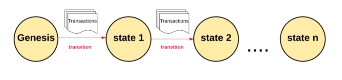  

이더리움의 상태에는 수천 개의 트랜잭션이 있습니다. 이 트랜잭션은 블록이라는 그룹에 묶여 있으며, 블록은 직전에 만들어진 블록과 이어져 있습니다.
<br>
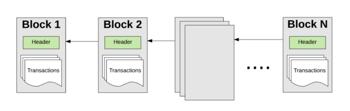  
<br>

---

### EOA와 CA
이더리움에는 EOA(External Owned Account)와 CA(Contract Account)라는 두 종류의 계정이 있습니다.  
모든 계정은 160bit 길이의 주소로 식별되며, 동일한 주소 공간을 가집니다.  
<br>
EOA와 CA 모두 잔액(Balance), 논스(Nonce), 스토리지(Stroage), 컨트랙트 코드(Contract Code)로 구성되어 있습니다.  
<br>
EOA의 주소는 상응하는 비밀 키를 가지고 있지만, CA는 비밀 키가 없습니다.  
- **Balance**: 계정의 현재 이더 잔고  
- **Nonce**: EOA의 경우, 해당 EOA로부터 보내진 트랜잭션의 숫자.  
CA의 경우, 해당 CA로부터 생성된 컨트랙트의 숫자를 의미합니다.  
- **StorageRoot**: 머클 패트리샤 트리의 루트 노드를 해싱한 값입니다.  
- **Contract Code**: EVM이 실행할 코드의 해싱된 값. EOA에는 코드를 저장할 수 없기 때문에 비어 있습니다.  

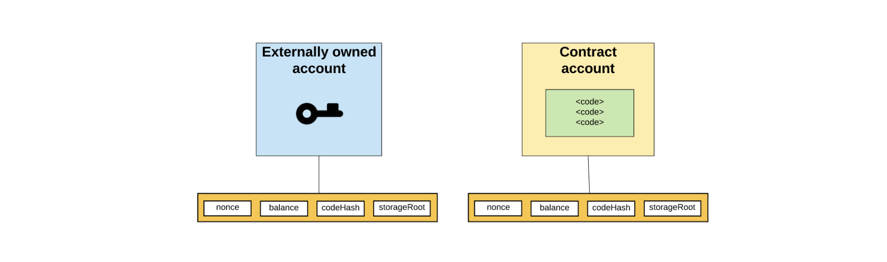  

또한 CA는 스스로 새로운 트랜잭션을 만들 수 없으며,  
CA는 EOA나 다른 CA에게서 받은 트랜잭션에 대한 응답에 대해서만 트랜잭션을 만들 수 있습니다.  

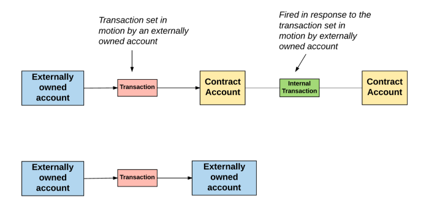  
따라서, 이더리움 블록체인에서 일어나는 모든 액션은 항상 EOA에서 만든 트랜잭션에서부터 시작합니다.  

---

### 전역 상태
이더리움의 전역 상태는 계정 주소와 계정 상태를 매핑한 것으로 구성되어 있습니다.  
이 매핑은 머클 패트리샤 트리(Merkle Patricia Tree) 형태로 저장되어 있습니다.  
<br>
머클 트리(Merkle Tree)는 이진 트리의 한 종류로, 다음의 특징을 가지고 있습니다.  
- 트리 맨 아래에 있는 노드들은 데이터를 가지고 있다.  
- 부모 노드는 두 자식 노드를 모아 해싱한 값을 가진다. 맨 위의 루트 노드도 자식 노드의 해싱한 값이다  

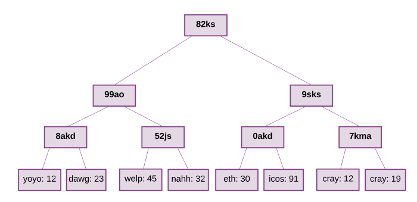  

트리 맨 아래에 있는 데이터는 저장하려는 데이터를 청크(Chunk)로 분할한 다음, 각 청크를 두 개씩 모아 해시를 취하여 부모 노드를 만듭니다. 그렇게 하나의 루트 노드가 만들어질 때까지 동일한 과정을 반복합니다.
<br>
이더리움의 블록 헤더에는 세 개의 머클 트리 구조의 루트 노드의 해시값이 저장되어 있습니다.
- **상태 트리(State Tree)**: 트랜잭션과 연관된 계정의 상태 정보 저장  
- **트랜잭션 트리(Transaction Tree)**: 현재 블록의 트랜잭션 정보 저장  
- **영수증 트리(Receipt Tree)**: 현재 블록의 거래 영수증 정보 저장  

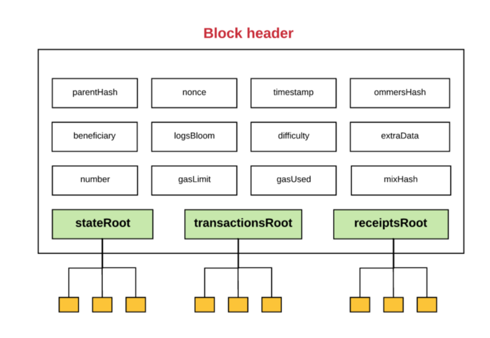  

부모 노드는 자식 노드의 해싱 값이기 때문에,  
단방향 함수인 해시의 특성상 자식 노드의 값이 조금이라도 바뀌면 부모 노드의 값도 바뀌게 됩니다.  
따라서 머클 패트리샤 트리에서 변조가 시도되면 그 즉시 발견됩니다.  
<br>
이러한 원리로 루트 노드는 데이터에 대한 보안 ID처럼 사용될 수 있습니다.  
또한 블록 헤더는 상태, 트랜잭션, 영수증 트리의 루트 노드 값을 가지고 있기 때문에,  
네트워크의 노드들은 모든 상태를 저장하고 있지 않더라도 이더리움의 상태 일부분을 검증할 수 있습니다.  

---

### 트랜잭션과 메시지
앞서 우리는 이더리움이 트랜잭션 기반 상태 머신이라는 것을 배웠습니다.  
다시 말해, 계정 간에 일어난 트랜잭션은 이더리움의 전역 상태를 하나의 상태에서 다음 상태로 이동시킨다는 것입니다.  
<br>
기본적으로 트랜잭션은 EOA에서 생성되고, 일련의 과정을 거쳐 블록체인에 올라간 암호화 서명된 명령어의 집합입니다.  
<br>
그 외의 트랜잭션은 **메시지 호출(Message Call)**과 **컨트랙트 생성(Contract Creations)** 두 종류로 나뉩니다.  
<br>
이더리움의 모든 트랜잭션은 항상 EOA에서 만들어지고 블록체인에 올라갑니다.  
즉, 트랜잭션은 외부 세계를 이더리움 내부의 상태로 연결해 주는 다리와 같습니다.  
그리고 연결의 창구가 바로 CA입니다.  
  
그렇다고 해서 CA가 다른 CA와 전혀 연관 없는 것은 아닙니다.  
이더리움 전역 상태에 있는 CA는 **메시지(Message)**나 **내부 트랜잭션(Internal Transaction)**을 통해 다른 CA와 상호작용할 수 있습니다.  
메시지와 내부 트랜잭션은 일반적인 트랜잭션과 비슷하지만, EOA에서 생성되지는 않으며, 오로지 CA에서만 생성됩니다.  
또한 일반적인 트랜잭션과는 다르게, 메시지와 내부 트랜잭션은 EVM에만 존재하는 가상 객체입니다.  
<br>
한 CA가 다른 CA에 내부 트랜잭션을 보내면, 수신하는 CA에 있는 관련 코드가 실행됩니다.  

  

### CA 생성
트랜잭션의 두 종류 중 **컨트랙트 생성(Contract-Creating)** 트랜잭션을 알아봅시다.  
<br>
새로운 CA를 만들기 위해서는 먼저 특별한 공식을 이용해 새로운 계정의 주소를 정의해야 합니다.  
그리고 다음의 과정을 통해 새로운 CA를 만들 수 있습니다.  
1. 논스를 0으로 설정한다.  
2. 송신자가 CA 생성 트랜잭션에 이더를 함께 보낸 경우, 이를 CA의 잔금(Balance)으로 설정한다.  
3. EOA 계정의 잔금에서 Value 만큼을 제외한다.  
4. CA의 스토리지를 빈 값으로 초기화한다.  
5. CA의 코드를 빈 문자열의 해시값으로 초기화한다.  

한번 계정을 초기화하고 나면, 트랜잭션에서 보낸 init 코드를 사용해 새로운 CA를 생성할 수 있습니다.  
이 init 코드가 실행되는 동안에는 다양한 일이 발생합니다.  
계약 생성자에 따라 CA의 스토리지를 업데이트하거나, 다른 CA를 새롭게 생성하거나, 다른 메시지 호출을 만들 수 있습니다.  
<br>
계약을 초기화하는 이 init 코드를 실행할 때는 가스를 사용합니다.  
트랜잭션은 남아있는 가스보다 더 많은 가스를 소비할 수 없기 때문에,  
만약 남아 있는 가스를 다 사용한 경우 OOG(Out-of-Gas) 예외 처리와 함께 코드 실행이 종료됩니다.  
OOG로 인한 트랜잭션 종료가 발생하면 상태는 트랜잭션 실행 이전 상태로 돌아갑니다.  

> **Gas**  
> 이더리움에서는 트랜잭션에 있는 연산을 수행할 때마다 비용을 청구하는데, 이 비용의 단위를 가스(Gas)라고 합니다.  
> 트랜잭션을 보낼 때는 코드에 수행되는 만큼의 가스를 함께 보내야 합니다.  

트랜잭션이 실패해도 트랜잭션 송신자는 소진된 가스를 환불받을 수 없습니다.  
그러나 송신자가 트랜잭션과 함께 이더 값을 보낸 경우, 이더는 환불됩니다.  
<br>
init 코드가 성공적으로 실행되면, 마지막으로 CA 코드에 대한 비용이 지불됩니다.  
이 비용은 스토리지 비용이며, 생성된 CA 코드의 크기에 비례합니다.  
<br>
만약 CA 코드에 대한 비용을 지불할 가스가 남아있지 않은 경우, 트랜잭션은 OOG 예외와 함께 중단됩니다.  
예외 없이 트랜잭션 생성이 완료된 경우, 미사용 된 가스는 송신자에게 환불되고, 변경된 상태가 저장됩니다.  

---

### 메시지 호출(Message Call)
메시지 호출을 실행하는 것은 CA 생성과 비슷하지만, 몇 가지 다른 점이 있습니다.  
<br>
새 계정이 생성되지 않기 때문에 메시지 호출 실행에는 init 코드가 포함되지 않습니다.  
그러나 입력 데이터를 가지고 있을 수는 있습니다.  
메시지 호출은 한번 실행되면 출력 데이터를 포함한 추가적인 요소들을 가지게 될 수도 있는데,  
이 추가 요소들은 뒤에 이어질 다른 실행에 필요한 데이터입니다.  
<br>
CA 생성과 마찬가지로, 메시지 호출을 실행할 때 가스가 부족하거나, 트랜잭션이 잘못되어 종료되는 경우  
(예를 들어, 스택 오버플로우가 발생하거나, jump 실행의 결과가 올바르지 않거나, 잘못된 명령어를 사용하는 경우)  
사용된 가스는 환불되지 않으며 상태는 직전 상태로 돌아갑니다.  

---

### 트랜잭션 실행 모델과 EVM
그렇다면 트랜잭션은 실제로 EVM에서 어떻게 동작할까요?  
<br>
트랜잭션 처리를 실제로 처리하는 프로토콜은 EVM입니다. EVM의 구성 요소를 하나씩 살펴봅시다.  
- **스택**  
EVM은 비트코인 스크립트와 마찬가지로, 스택 기반 아키텍처를 가지고 있습니다.  
EVM 내에는 하나의 빈 스택이 있으며, 스택에 들어가는 요소의 크기는 256 bits이며,  
스택의 최대 크기는 1,024 elements(개수)입니다.  
- **메모리**  
EVM은 메모리를 가지고 있으며, 메모리에서는 Word-Address 형식의 바이트 배열로 데이터를 저장합니다.  
메모리는 휘발성이기 때문에, 프로그램이 종료되면 메모리에 들어있는 데이터는 사라집니다.  
- **스토리지**  
메모리와 다르게, 스토리지는 비휘발성이며 시스템 상태에 따라 유지됩니다.  
EVM은 특정한 명령어로만 접근할 수 있는 **가상 ROM**이라는 공간에 프로그램 코드를 분리해서 저장합니다.  

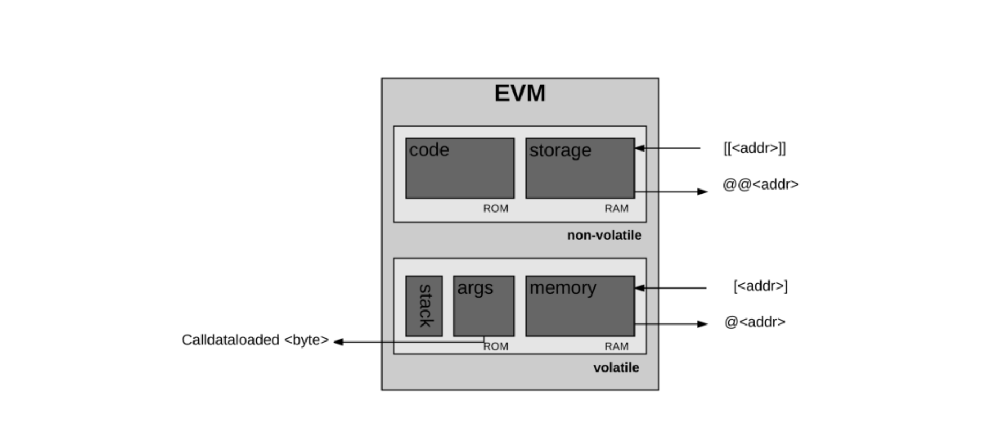  

EVM이 솔리디티 코드를 컴파일한 바이트 코드를 받으면 실행이 시작됩니다.  
맨 처음에는 메모리와 스택은 비어있으며, 프로그램 카운터(연산 실행 횟수)는 0입니다.  
```python
PC(Program Counter): 0
Stack: []
Memory: []
Storage: {}
```
EVM은 트랜잭션을 반복적으로 실행하며,  
각 사이클에서 **시스템 상태(이더리움의 전역 상태)**와 **머신 상태(Machine State)**를 계산합니다.  
머신 상태는 다음과 같이 구성됩니다.  

- 사용 가능한 가스  
- 프로그램 카운터  
- 메모리에 들어있는 값  
- 메모리에서 활성화된 단어의 수  
- 스택에 들어있는 값  

코드가 실행되면서 스택에 있는 요소들은 왼쪽에서부터 순서대로 추가되거나 제거되며,  
남은 가스에서 적절한 양의 가스가 제거되고, 프로그램 카운터가 올라갑니다.  

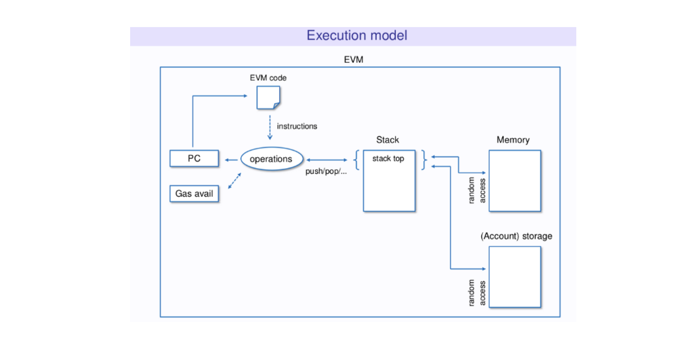  

매 사이클이 끝날 때 다음과 같은 세 가지 케이스가 발생할 수 있습니다.  

1. EVM이 예외 상황을 만나 중지되고, 변경 사항은 폐기된다.  
(가스 부족, 명령어가 잘못된 경우, 스택에 잘못된 요소가 들어간 경우, 스택에 있는 요소가 1,024 elements(개수)를 넘는 경우 등)  
2. 다음 사이클을 돌아야 하는 경우  
3. 머신이 프로세스 실행을 끝낸 경우  

머신이 정상적으로 실행을 마치면, 결과적으로 발생한 상태와 남아 있는 가스, 발생한 세부 상태, 결과값을 생성합니다.

---

## Execution Cost
트랜잭션 실행 수수료는 이더리움에서 가장 중요한 개념 중 하나입니다.  
이더리움에서 트랜잭션의 결과로 발생하는 모든 연산은 수수료를 요구하며, 이 수수료를 가스(Gas)라고 합니다.  
<br>
Gas는 트랜잭션 코드에 있는 모든 Opcode를 실행하는데 필요한 수수료를 측정하는 데 사용하는 단위입니다.  
- Gas Price는 gas 당 지불하려고 하는 이더의 양을 의미하며, Gwei라는 단위를 사용합니다.  
- Gas Limit은 송신자가 트랜잭션을 실행하는데 지불하고자 하는 Gas의 최대량을 의미합니다.  

즉, 1 이더 = 10^18 wei이며, 1 Gwei= 10^9 wei입니다.  
<br>
트랜잭션 **송신자**는 트랜잭션을 보낼 때 Gas Limit과 Gas Price를 트랜잭션에 지정해야 합니다.  
<br>
예를 들어, 송신자가 Gas Limit을 50,000으로 지정하고, Gas Price를 20 Gwei로 지정했다고 가정해 봅시다.   
이것은 송신자가 최대 `50,000 x 20 Gwei = 10^15 Wei = 0.001 이더`를 트랜잭션을 실행하는 데 지불한다는 것을 의미합니다.  
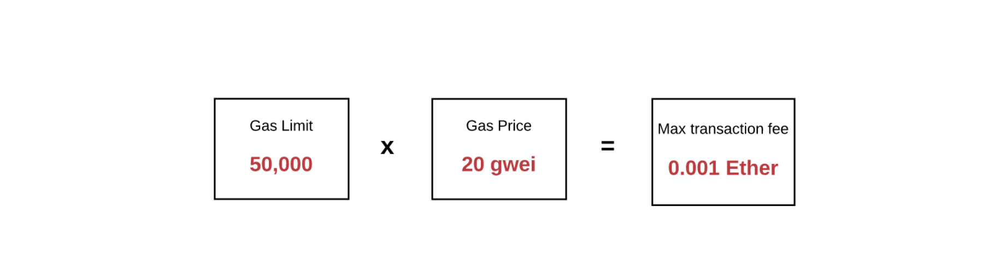  
Gas Limit은 송신자가 지불하고자 하는 Gas의 최대값을 의미합니다.  
만약 EOA에 이 최대치를 지불하고도 남을 충분한 이더가 들어있다면 트랜잭션은 문제없이 실행될 것입니다.  
송신자는 트랜잭션이 완료된 후, 사용되지 않은 Gas를 기존 비율로 환불받습니다.  
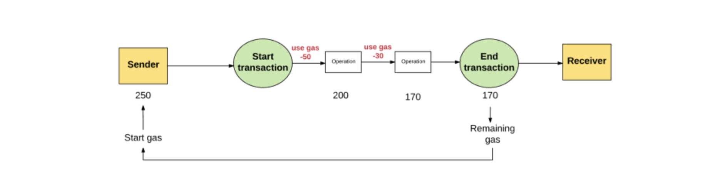  
`Gas Limit - Use Gas(50) - Use Gas(30) = Remaining Gas`  
<br>
반대로 송신자가 트랜잭션을 실행할 만한 충분한 Gas를 제공하지 않은 경우,  
트랜잭션은 OOG(Out of Gas;가스 부족) 상태가 되며, 실행이 중지됩니다.  
상태가 변경되었다면, 트랜잭션이 실행되기 이전의 상태로 돌아갑니다.  
<br>
또한 실패한 트랜잭션에 대한 기록이 남으며, 이 기록에서 어떤 트랜잭션이 시도되었고 어디에서 실패했는지 남게 됩니다.  
또한 EVM은 트랜잭션 실행이 중지되기 전까지 연산을 수행했기 때문에, **연산에 사용된 Gas는 환불되지 않습니다.**  
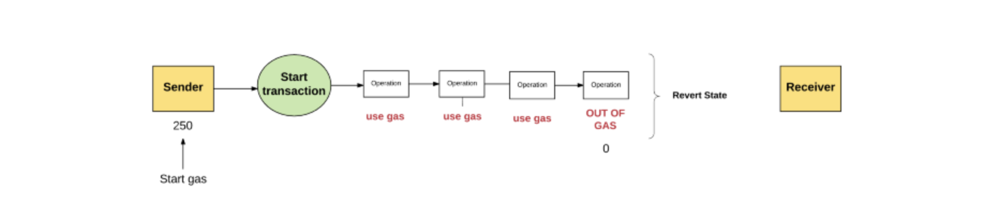  
이 Gas는 블록 생성자의 주소로 송금됩니다.  
블록 생성자는 연산을 수행하고 트랜잭션을 검증하는 데에 자원을 소모하기 때문에,  
이에 대한 보상으로 Gas 수수료를 받습니다.  
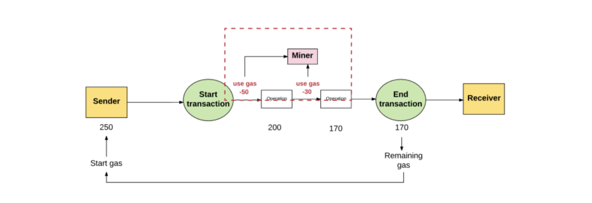  
일반적으로, 송신자가 지불하고자 하는 Gas 가격이 높을수록, 또는 실제 연산에 드는 Gas의 양이 높을수록,  
블록 생성자는 트랜잭션에서 수수료를 더 많이 받을 수 있습니다.  
<br>
따라서 블록 생성자들은 수수료를 많이 받을 수 있는 트랜잭션을 선택하려 하며,  
블록 생성자들은 트랜잭션 송신자가 Gas Price를 어느 정도로 설정해야 할지 알려주기 위해,  
트랜잭션을 실행하거나 검증하는 데 드는 Gas Price의 최소값을 광고하기도 합니다.  

---

### Storage Fee
연산할 때뿐만 아니라, 스토리지를 사용할 때도 수수료를 내야 합니다.  
스토리지의 최종 수수료는 32 바이트 단위에 비례합니다.  
<br>
스토리지 수수료는 일반적인 수수료와는 다르게 약간 특이한 부분이 있습니다.  
가령, 스토리지가 증가하면 모든 노드에서 이더리움 상태 데이터베이스의 크기가 커지기 때문에,  
저장되는 데이터의 양을 최대한 적게 유지할수록 인센티브를 부여합니다.  
<br>
이러한 이유로 만약 트랜잭션이 스토리지에 있는 특정 요소를 지우는 연산을 수행하면,  
해당 연산을 수행하는 데에 대한 수수료는 면제하고, 저장 공간을 확보했기 때문에,  
기존에 요소를 스토리지에 추가했을 때 지불했던 Gas를 환불받습니다.  
<br>
예를 들어, 스토리지에 요소 하나를 할당했을 때 100 Gas를 지불해야 한다고 가정합시다.  
트랜잭션에서 스토리지에 요소 하나를 할당하여 100 Gas를 지불했습니다.  
<br>
이후 해당 요소를 다시 스토리지에서 제거하는 연산을 수행할 때는,  
제거 연산에 대한 수수료는 0 gas이며, 더 이상 스토리지 자리를 차지하지 않기 때문에,  
할당할 때 들었던 100 gas를 환불해 줍니다.  

---

#### Why do we pay Fee?
이더리움은 비트코인과는 달리, 스마트 컨트랙트에서 수행되는 모든 연산에 대해 gas라는 수수료를 부과합니다.  
이렇게 수수료를 부과하는 이유는,  
이더리움 네트워크 위에서 동작하는 스마트 컨트랙트 작업들이 전체 노드에 영향을 미치기 때문입니다.  
<br>
이더리움은 튜링 완전 언어이기 때문에, 튜링 불완전한 비트코인 스크립트와는 달리 반복문을 지원합니다.  
그러나 반복문의 가장 큰 단점은 무한 루프 문제가 일어날 수 있다는 것입니다.  
<br>
만약 악의적인 사용자가 큰 자원을 소모하는 무한 루프 코드가 들어있는 트랜잭션을 실행시킨다면,  
트랜잭션은 이더리움 네트워크의 엄청난 양의 자원을 소모하게 될 것이고,  
심각하게는 이더리움 네트워크 전체가 멈출 수도 있습니다.  
<br>
수수료는 이러한 악의적인 공격으로부터 네트워크를 보호합니다.  
연산마다 수수료를 부과하면 악의적인 사용자라도 수수료를 지불해야 하므로 쉽게 무한 루프 코드를 실행시킬 수 없습니다.  
<br>
또한 의도치 않게 무한 루프를 만든 코드를 실행시키더라도,  
Gas Limit을 설정해 둔다면 지정해 둔 Gas를 다 소모하기 전에 실행을 멈출 수 있습니다.  
