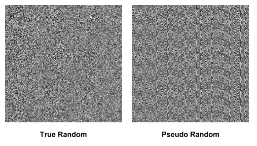
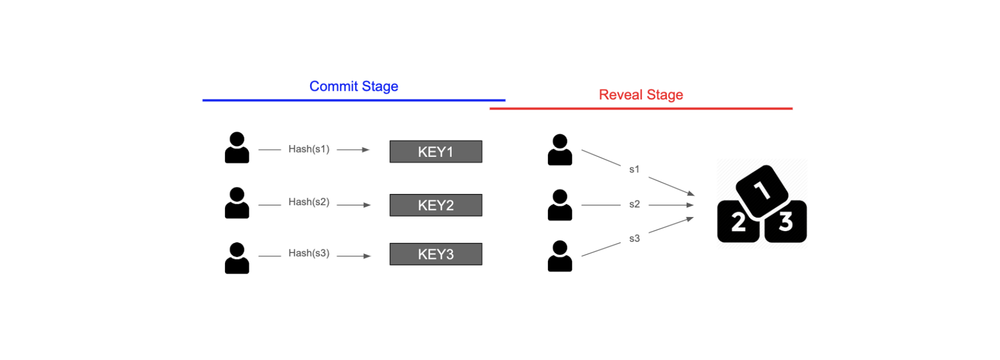
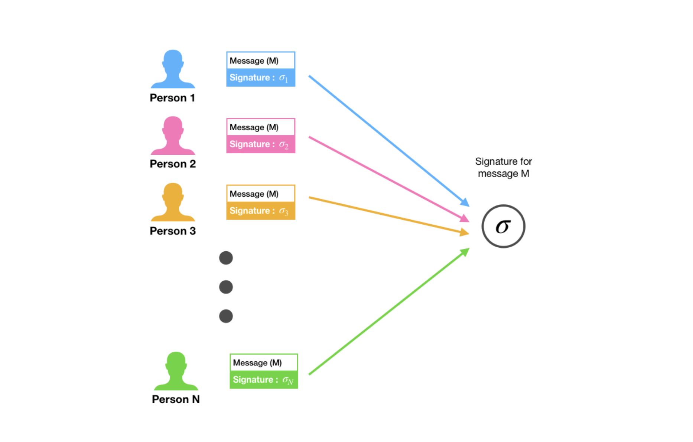

# Oracle Problem

---

## Oracle
오라클은 Web API나 마켓 데이터 피드와 같은 방식을 통해 블록체인과 스마트 컨트랙트용 외부 데이터를 검색하고 검증하는 것을 의미합니다.  
스마트 컨트랙트에서 요구하는 데이터 종류에는 가격 정보, 날씨 정보, 또는 게임을 위한 난수 생성 등이 있을 것입니다.  
 
오라클은 특정 정보에 대해 데이터 자원을 쿼리하고, 블록체인과 외부 데이터 간의 인터페이스를 제공하는 것으로 구성됩니다.  
그 결과, 스마트 컨트랙트는 외부 데이터로부터 오는 특정 정보에 의해 실행될 수 있습니다.  
 
중요한 것은 외부에서 오는 데이터는 블록체인이나 스마트 컨트랙트처럼 결정적(Deterministic)이지 않다는 점입니다.  
오라클은 외부에서 오는 비결정적인 정보를 블록체인이 이해하고 특정 조건에서 실행할 수 있도록 하는 형식으로 만들어주는 다리 역할을 합니다.  

---

## What is an Oracle Problem
오라클 문제는 서드 파티 오라클과 스마트 컨트랙트의 무신뢰성 실행 간 보안, 인증, 신뢰 충돌 문제에 관한 것입니다.  
 
스마트 컨트랙트는 주어진 데이터에 따라 계약 이행 여부를 결정할 뿐이지,  
데이터에 대한 자체적인 판단 능력은 갖추고 있지 않습니다.  
 
즉, 스마트 컨트랙트로 들어오는 데이터에 대한 출처나 신뢰도가 불명확할 수 있다는 것입니다.  
출처가 분명하더라도 외부 데이터를 가져오는 과정에서 해커에 의해 위변조가 일어날 수도 있습니다.  
이러한 문제로 인해 데이터 자체에 대한 신뢰성에 의문이 제기될 수도 있습니다.  
 
대표적인 오라클 문제로는 난수 생성 문제가 있습니다.

---

### Random Number Generation
우리는 복권, 게임을 만들거나, 테스트 데이터를 얻기 위해 난수를 만들고 싶을 때가 있습니다.  
특히나 이더리움의 등장으로 블록체인상에서 다양한 dApp을 만들게 되면서 난수에 대한 필요성은 더욱 높아졌습니다.  
 
그러나 컴퓨터 과학에서 난수를 생성하는 것은 단순히 주사위를 던지는 것보다 더 어려운 문제입니다.  
컴퓨터는 입력받은 값에 대해 정해진 행동을 하므로, 조종할 수 없는 새로운 데이터를 생성하는 것을 잘하지 못합니다.  
따라서 컴퓨터 과학에서 난수는 유사 난수(Pseudo Random)와 진짜 난수(True Random)로 나뉩니다.  
 
유사 난수는 컴퓨터에 있는 데이터와 알고리즘을 통해 얻게 되는 난수입니다.  
이 난수는 컴퓨터 내부에 있는 알고리즘과 데이터를 가지고 생성되었기 때문에 특정한 패턴을 가지게 되고, 이에 따라 예측할 수 있습니다.  
 
진짜 난수는 외부로부터 불확실성을 가져와 생성한 난수 값입니다.  
예를 들어, 외부 소음을 가져와 디지털화하여 난수를 생성하면 무작위성을 확보할 수 있습니다.  
컴퓨터 외부에서 값을 가져왔기 때문에 조작할 수 없으며, 따라서 예측할 수도 없습니다.  
 
일반적으로 우리가 알고 있는 난수 생성 알고리즘은,  
컴퓨터 내부에 있는 데이터와 알고리즘을 이용한 유사 난수 생성기입니다.  
결과가 편향되지는 않지만, 결과값을 어느 정도 예측할 수 있고, 조종할 수도 있기 때문에 진짜 난수는 아닙니다.

  
> 진짜 난수와 유사 난수를 시각화한 그림.  
> 유사 난수의 경우 패턴이 나타나고 있으며, 이 패턴으로 다음 난수값을 예측할 수 있다.

---

### The Problem of Random Number Generation in Blockchain
블록체인에서 난수를 생성하는 방식에는 다음과 같은 방식을 떠올릴 수 있습니다.  
1. **물리 현상을 가져오기**  
앞서서 소음과 같은 외부의 값을 가져와서 무작위성을 확보할 수도 있습니다.  
그러나 블록체인에서는 난수를 생성하는 과정에서 노드가 자신에게 유리한 값이 나올 때까지 물리 현상을 관측하고,  
유리한 값이 나오면 그 값을 스마트 컨트랙트에 사용할 수도 있습니다.  
이 경우 사용자가 고의로 난수 생성을 조작하는 것이나 마찬가지입니다.  
2. **여러 사용자가 가져온 값을 사용하기**  
여러 사용자가 가져온 값을 사용하여 난수를 생성할 수도 있을 것입니다.  
일반적으로는 여러 사람이 참여했기 때문에 조작이 불가능하다고 생각하기 쉽지만,  
값을 보내는 여러 사용자 중 악의적인 사용자가 다른 사용자들의 값을 참고하여,  
자신에게 유리한 값이 나오는 값을 보내 난수 생성을 조작할 수도 있습니다.  
3. **블록체인 내부의 값 사용하기**  
블록체인에 사용되는 블록 해시값 등을 사용할 수도 있습니다.  
블록 해시는 블록이 생성되기 전까지는 아무도 모르기 때문에 예측할 수 없다고 생각할 수 있습니다.  
그러나, 블록 해시는 이전 블록의 해시값을 참조하기 때문에,  
블록을 생성하는 채굴 노드가 자신에게 유리한 블록 해시값이 나올 때까지 해시값을 조작할 수 있습니다.  

블록체인에서는 모든 노드가 트랜잭션을 검증함으로써 데이터의 무결성을 보장하기 때문에,  
블록체인에서 일어나는 모든 동작은 결정적인 방식으로 일어납니다.  
 
예를 들어, 이더리움 스마트 컨트랙트에는 랜덤 함수가 구현되어 있지 않습니다.  
노드들이 블록을 검증하기 위해서는 블록에 있는 트랜잭션을 실행한 결과 상태 값과,  
현재 자신이 가지고 있는 상태 값을 비교해야 합니다.  
 
그런데 트랜잭션에서 무작위 값이 나오면, 트랜잭션을 실행한 결과 상태 값이 매번 변할 것이기 때문에  
데이터의 무결성을 증명하기가 매우 어려워집니다.
 
그러나 우리가 원하는 난수 생성은 결정적이면 안 됩니다.  
매번 예측할 수 없는 값이 나와야 예측하거나 조작할 수 없기 때문입니다.  
 
블록체인에서는 진짜 난수를 만들 수 없기 때문에,  
난수 생성 과정에서 나온 값이 진짜 무작위 값이라는 것을 보장할 수 없습니다.  
위의 방식에서 나온 것처럼 악의적인 사용자가 난수 생성을 조작할 수 있기 때문입니다.
 
따라서 블록체인에서 조작하거나 예측할 수 없는 진짜 난수를 만들 때는,  
이 난수값이 정말로 조작되지 않았는지 증명할 수 있어야 합니다.  

---

## Generating Random Number in Blockchain
1. **Commit Reveal Scheme**  
Commit Reveal Scheme은 기존의 "여러 사용자가 가져온 값을 사용하는 경우"를 개선한 방식입니다.  
기존에는 서로가 서로의 값을 알 수 있었지만, 스마트 컨트랙트를 사용하면 서로의 값을 모른 채로 값을 제출할 수 있습니다.  
  
먼저 Commit Stage에서는 자신이 보내려는 값을 암호화하고, 일정 금액의 토큰과 함께 스마트 컨트랙트에 보냅니다.  
토큰은 예치금의 역할을 합니다.  
 
그리고 일정 기간이 지나면 참여자들은 자신이 제출하려고 했던 원래 값을 스마트 컨트랙트에 보냅니다.  
스마트 컨트랙트는 사용자가 보낸 원래 값을 암호화하여, 이전에 보낸 암호화된 값과 비교합니다.  
 
만약 다른 값을 보냈다면 이 유효성 검사를 통과하지 못하게 됩니다.  
사용자가 올바른 값을 보냈다면 토큰을 돌려줍니다. 그리고 스마트 컨트랙트는 주어진 값들을 사용해 난수를 생성합니다.  
 
Commit Reveal Scheme을 사용하면 서로가 어떤 값을 보내는지 모르기 때문에,  
난수 값을 예상하거나 난수 생성을 조작할 수 없을뿐더러,  
유효성 검사 과정을 통해 난수값을 조작할 수 없다는 것을 증명할 수 있습니다.  
2. **BLS Scheme**  
  
BLS Scheme은 임계값 서명의 한 종류입니다.  
BLS Scheme에서는 N명의 사용자가 개인키 S를 쪼개어 가지고 있다가,  
난수를 생성해야 할 때 참여자들이 각자 자신이 가지고 있는 개인키 조각을 제출합니다.  
이때 개인키를 k명 이상이 제출하면 k개의 개인키 조각을 가지고 난수를 생성합니다.  
 
Commit Reveal Scheme은 한두 명이 정직하지 않더라도 난수 생성이 불가능해질 수 있지만,  
BLS Scheme은 k명의 사람이 정직하면 난수를 생성할 수 있다는 장점이 있습니다.  