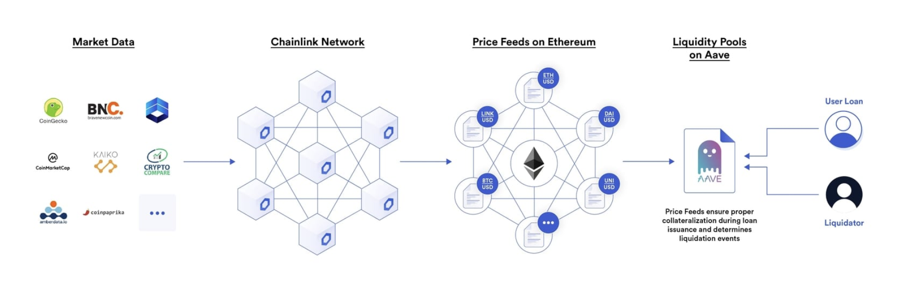
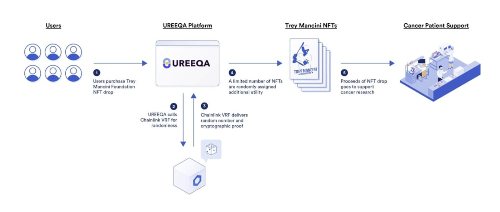

# Applications of Smart Contract
스마트 컨트랙트를 활용한 서비스의 종류에는 어떤 것들이 있는지 알아보도록 하겠습니다.  

---

## DeFi
탈중앙화 금융(Decentralized Finance)은 스마트 컨트랙트를 활용해 금융 시장, 스테이블 코인, 거래소, 자산 관리 등 전통적인 금융 상품과 서비스를 재창조하고,  
여러 서비스들을 결합하여 새로운 금융 서비스를 만들어 제공하는 애플리케이션입니다.  
 
스마트 컨트랙트는 사용자의 자금을 보관하고 미리 정해진 조건에 따라 사용자 간에 분배할 수 있도록 합니다.  
예를 들어, Aave는 스마트 컨트랙트를 사용하여 무허가 및 탈중앙화된 방식으로 대출과 차입을 용이하게 합니다.  
  
> Aave는 자산 가격을 활용해 사용자의 차입자를 결정하고,  
> 대출 담보 부족 여부 등의 정보를 바탕으로 청산 대상인지 파악해 분산형 대출 시장을 제공한다.

---

## Games and NFT
블록체인 기반 게임은 게임 내 액션의 변조 방지를 위해 스마트 컨트랙트를 사용합니다.  
한 가지 예로, 사용자가 유동성 풀에 자금을 투자한 다음, 이자가 발생하면 금융 시장으로 이동하는 PoolTogether이라는 게임이 있습니다.  
이는 참가자 모두가 돈을 잃지 않는 복권이라고 알려져 있는데, 진행 과정은 다음과 같습니다.  
1. 사용자는 토큰을 구매함으로 게임에 참여할 수 있습니다.  
2. 토큰을 구매하여 참여한 사람들의 자금은 DeFi 플랫폼인 컴파운드 파이낸스로 전송되어 1주일 동안 예치됩니다.  
(이때 예치된 자금에 대한 이자가 적립되게 됩니다.)  
3. 이후 결과가 정해지면, 위에서 적립된 이자를 당첨자에게만 제공하며, 참여자 모두에게 토큰을 돌려줍니다.  
4. 위 과정은 모두 스마트 컨트랙트에서 진행되기 때문에 모두가 확인할 수 있으며,  
중앙화된 주체로 인해 조작의 위험이 없습니다.  

스마트 컨트랙트 기반의 게임은 위와 같이 DeFi 등의 새로운 서비스를 접목시킴과 동시에,  
진행 과정이 모두에게 공개되어 투명하고 조작이 없는 장점을 갖게 됩니다.  

  
> MLB 야구선수 트레이 만치니는 암 환자 지원을 위한 기금을 모으기 위해 NFT를 드롭했다.

---

## DAO(Decentralized Autonomous Organization)
DAO는 컴퓨터 프로그램으로 인코딩 되고, 조직 구성원들이 통제하며, 중앙 정부의 영향을 받지 않는 규칙들로 구성된 탈중앙화 자율조직으로,  
영리 및 비영리 기업을 조직하기 위한 새로운 분산형 비즈니스 모델을 제공합니다.  
조직의 규칙은 코드에 내장되어 있기 때문에 관리자가 필요하지 않으며, 따라서 관료제나 계층적 구조가 없습니다.  
 
2016년 6월, the DAO가 해커들에게 360만 개의 이더(한화 약 640억 원)를 탈취당한 사건이 일어나기도 했습니다.  
이에 따라 이더리움에서 하드 포크가 일어났고, 이더리움과 이더리움 클래식이 나뉘게 되었습니다.  

---

## ICO(Initial Coin Offering)
ICO는 기업 공개(IPO)와 비슷한 개념으로, 새로운 암호화폐를 만들기 위해 투자자들에게 투자금을 받고,  
그 대가로 코인을 나눠주는 것을 의미합니다.  
투자자들은 기업이 성공하여 코인에 대한 수요가 증가하여 코인 시세가 오를 것을 기대하고 ICO에 참여하며,  
기업은 ICO로 초기 개발 자금을 모아 사업을 성장시켜 코인의 수요를 높이기 위해 노력합니다.  

---

## 브리지(Bridge)
브리지는 토큰이나 임의의 데이터를 하나의 체인에서 다른 체인으로 전송할 수 있게 하는 연결을 의미합니다.  
두 체인은 서로 다른 프로토콜, 규칙, 거버넌스 모델을 가질 수도 있지만,  
브리지는 양쪽에서 안전하게 상호 운용할 수 있는 호환 가능한 방법을 제공합니다.  

---

## Implementations
일반적으로 스마트 컨트랙트가 빠르게 도입되고 있는 분야는 세 경우가 있습니다.  

---

### 일정한 형식의 반복적인 계약이 많은 경우
보험업에서 특정 조건을 만족시키면 계약에 대한 보상금이 지급되도록 스마트 컨트랙트를 작성하여,  
조건 성취 시 자동으로 보험금을 지불하도록 합니다.  
 
**사례: 보험**  
- AXA와 Fizzy는 비행기가 일정 시간 이상 지연되었을 경우,  
보험 가입자에게 자동으로 보험료를 제공하는 여행 보험 상품을 출시하였습니다.  
고객의 보험 구입 내용을 이더리움에 저장하고,  
이를 전 세계 비행기 데이터베이스에 연결하여 비행기 지연이 발생할 경우 자동으로 보험료를 지급하도록 하였습니다.  
- 15개의 글로벌 보험회사로 구성된 B3i(Blockchain Insurance Industry Initiative)는 블록체인 기술을 연구하고 보험업계에 적용할 수 있는 표준을 개발하며,  
2017년 컨퍼런스에서 스마트 컨트랙트를 사용한 보험 계약 관리 시스템 프로토타입을 론칭하기도 했습니다.  

---

### 원격자 간 계약 체결이 필요한 경우
집이나 자동차를 공유하는 경우, 계약 조건을 정하고 이에 따라 금전을 지급하거나 서비스를 제공하도록 합니다.  
가령, 집을 일정 시간 빌리는 경우, 스마트 컨트랙트에 비용을 지불하면 자동으로 집 문이 열려 사용 가능하도록 합니다.  
 
**사례: 자동차 렌탈 서비스**  
- DocuSign과 Visa는 자동차 렌탈 서비스에 스마트 컨트랙트를 결합한 서비스를 시범적으로 운영하였습니다.  
고객이 자동차를 시운전한 후에 자동차가 마음에 들어 렌탈을 진행하기로 결정하면,  
별도의 서류를 제출할 필요 없이 차 내부의 스마트 컨트랙트 시스템을 통해 계약 조건을 선택하여 렌트할 수 있습니다.  

---

### 제품의 유통 추적이 필요한 경우
유통에 참여하는 당사자들(생산자, 공급자, 운영자, 배급업체, 유통 업체, 규제당국, 소비자 등)이 유통 물품에 대한 정보를 확인하고,  
계약 조건이 만족하면 스마트 컨트랙트 상에서 대금을 지불합니다.  
 
**사례: 물류 유통**  
- Wells Fargo, Brighann Cotton, The Commonwealth Bank of Australia는 스마트 컨트랙트와 IoT를 결합하여 솜 거래 및 유통을 자동화하였습니다.  
스마트 컨트랙트를 통해 거래를 체결하고, GPS를 통해 솜의 유통 현황을 추적합니다.  
물건이 최종 목적지에 도착을 하면 그 사실을 관련 업체들에 통지하고,  
스마트 컨트랙트가 자동으로 실행되어 거래 업체에 돈을 지불합니다.  

---

### 그 외: 저작권 등
Binded에서는 온라인에서 유통되는 저작권 있는 작품을 사용자가 업로드하면,  
소유 증명서를 발급하고, 사용자 정보를 저장하여 저작권을 요구할 수 있는 서비스를 제공합니다.

