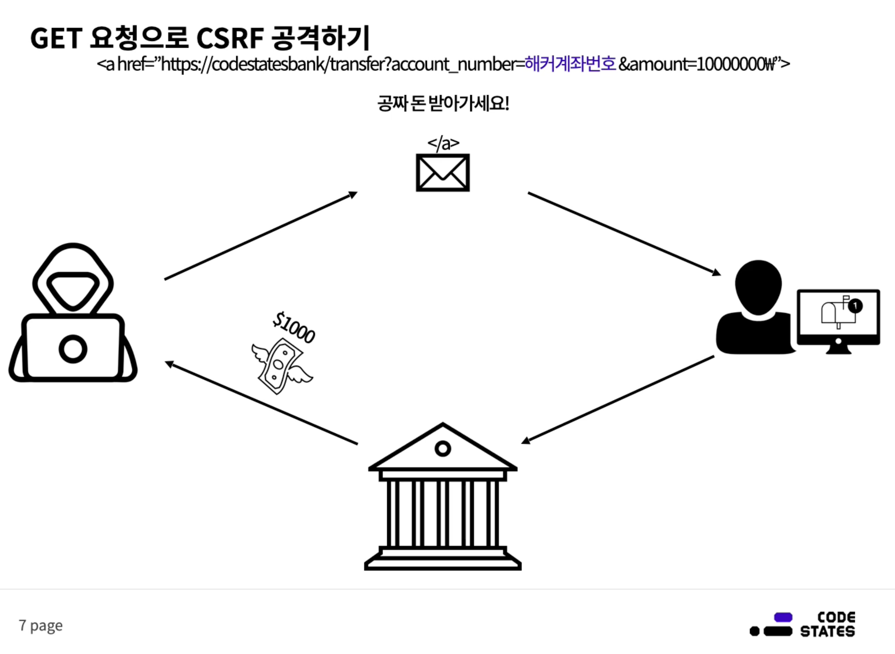
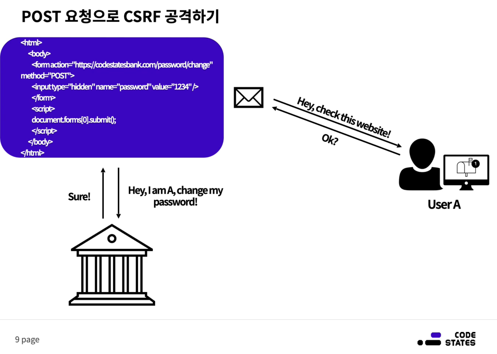

>   본 글은 Codestates BEB 코스의 자료에서 내용을 가져와 작성하였음을 알립니다.  

<!--  -->

# Browser Operation Principles
이 챕터에서는 웹개발을 할 때 필요한 개념인 `AJAX`, `XHR`, `Fetch`, `SSR`, `CSR`, `CORS`에 대해 배운다.  
`API`의 대표적인 아키텍처인 `REST API`를 알아보고, 이를 활용하는 방법을 알아본다.  

---  

## AJAX
`AJAX`는 `Asynchronous JavaScript And XMLHttpRequest`의 약자로,  
`JavaScript`, `DOM`, `Fetch`, `XMLRequest`, `HTML` 등의 다양한 기술을 사용하는 웹 개발 기법이다.  
`AJAX`의 가장 큰 특징은 웹 페이지에 필요한 부분에 필요한 데이터만 비동기적으로 받아와 화면에 그려낼 수 있다는 점이다.  
이를테면, 이벤트가 발생할 때마다 `Fetch`를 통해 데이터를 가져와 업데이트하고 렌더링 하는 것에 사용할 수 있다.  

---   

### Core Functionality
`AJAX`를 구성하는 핵심 기술은 `JavaScript`와 `DOM`, 그리고 `Fetch`이다.  
전통적인 웹 어플리키에션에서는 `<form>`태그를 이용해 서버에 데이터를 전송해야 했다.  
또한 서버는 요청에 대한 응답으로 **새로운 웹 페이지**를 제공해주어야 했다.  
<br>  

그러나 `Fetch`를 사용하면, 페이지를 이동하지 않아도, 서버로부터 필요한 데이터를 받아올 수 있다.  
`Fetch`는 사용자가 현재 페이지에서 작업을 하는 동안, 서버와 통신할 수 있도록 한다.  
<br>  

즉, 브라우저는 `Fetch`가 서버에 요청을 보내고 응답을 받을 때까지 모든 동작을 멈추는 것이 아니라,  
계속해서 페이지를 사용할 수 있게 하는 비동기적인 방식을 제공한다.  
또한 `자바스크립트`에서 `DOM`을 사용해 조작할 수 있기 때문에, `Fetch`를 통해 전체 페이지가 아닌,  
**필요한 데이터**만 가져와 `DOM`에 적용시켜 새로운 페이지로 이동하지 않고, 기존 페이지에서 필요한 부분만 변경 가능하다.  

--- 

#### XHR vs Fetch
`Fetch` 이전에는 `XHR(XMLHttpRequest)`를 사용하였다.  
`Fetch`는 `XHR`의 단점을 보완한 새로운 Web API이며, `XML`보다 가볍고 `JavaScript`와 호환되는 `JSON`을 사용한다.  
따라서 오는날에는 `XHR`보다 `Fetch`를 많이 사용한다.

```javascript
// Fetch를 사용
fetch('http://52.78.213.9:3000/messages')
    .then(function(response) {
        return response.json();
    })
    .then(function(json) {
        // ...
        }
);
```
`Fetch`의 등장 이전에는 표준화된 `XHR`을 사용하였다.  
그러나 `XHR`은 `Cross-Site` 이슈 등의 불편함이 있었고,  
그에 비해 `Fetch`는 간편함, `promise` 지원 등의 장점을 가지고 있기 때문에, 이제는 `Fetch`를 사용한다.  
아래는 `XMLHttpRequest`의 예제이다.  

> Cross-Site Issue
> 웹 브라우저에서 `AJAX` 등을 통해 다른 도메인의 서버에 url(data)를 호출할 경우에 나타나는 보안 문제를 말한다.  
> 예를들어, A라는 도메인이 있는데 브라우저 상에서 다른 B라는 도메인을 호출하게 된다면 크로스 도메인(CORS) 이슈가 발생할 수 있다.  

```javascript
// XMLHttpRequest를 사용
var xhr = new XMLHttpRequest();
xhr.open('get', 'http://52.78.213.9:3000/messages');

xhr.onreadystatechange = function(){
    if(xhr.readyState !==4) return;
    // readyState 4: 완료

    if(xhr.status === 200){
    // status 200: 성공
        console.log(xhr.responseText): // 서버로부터 온 응답
    } else {
        console.log('에러: ' + xhr.status); // 요청 도중 에러 발생
    }
}

xhr.send(); // 요청 전송
```

이 외에도 `Axios`와 같은 라이브러리도 존재하며, 경우에 따라 적절한 것을 선택하여 사용한다.  

---  

### Pros and Cons  
**장점**  
- 서버에서 `HTML`을 완성하여 보내주지 않아도 웹페이지를 만들 수 있다.  
이전에는 서버에서 `HTML`을 완성하여 보내주어야 화면에 렌더링을 할 수 있었다.  
그러나 `AJAX`를 사용하면, 서버에서 완성된 `HTML`을 보내주지 않아도,  
필요한 데이터를 비동기적으로 가져와 브라우저에서 화면의 일부만 업데이트하여 렌더링 가능하다.  
- 표준화된 방법 이전에는 브라우저마다 다른 방식으로 `AJAX`를 사용했으나,  
`XHR`이 표준화 되면서부터 브라우저에 상관 없이 `AJAX`를 사용할 수 있게 되었다.  
- 사용자 중심 어플리케이션 개발 `AJAX`를 사용하면, 필요한 일부분만 렌더링하기 때문에,  
빠르고, 더 많은 상호작용이 가능한 어플리케이션을 만들 수 있다.  
- 더 작은 대역폭 (네트워크 통신 한 번에 보낼 수 있는 데이터의 크기).  
이전에는 서버로부터 완성된 `HTML` 파일을 받아와야 했기 때문에, 한 번에 보내야하는 데이터의 크기가 컸다.  
그러나 `AJAX`에서는 필요한 데이터를 텍스트 형태(`JSON`, `XML`, etc.)로 보내면 되기 때문에, 비교적 데이터의 크기가 작다.  

---  

**단점**  
- `Search Engile Optimization(SEO)`에 불리하다.  
`AJAX` 방식의 웹 애플리케이션은 한 번 받은 `HTML`을 렌더링 한 후,  
서버에서 비동기적으로 필요한 데이터를 가져와 그려낸다.  
따라서, 처음 받는 `HTML` 파일에는 데이터를 채우기 위한 틀만 작성된 경우가 많다.  
검색 사이트에서는 전 세계 사이트를 크롤링하여, 사용자에게 검색 결과를 보여준다.  
하지만 `AJAX` 방식의 웹 어플리케이션의 `HTML` 파일은 뼈대만 있고 데이터는 없기에, 사이트의 정보를 긁어가기 어렵다.  
- 뒤로가기 문제  
일반적으로 사용자는 뒤로가기 버튼을 누르면 이전 상태로 돌아갈 것으로 예상하지만,  
`AJAX`에서는 이전 상태를 기억하지 않기 때문에, 사용자가 의도한 대로 동작하지 않는다.  
따라서 뒤로가기 기능을 구현하기 위해서는 별도의 `History API`를 사용해야 한다.  

---

### Reference
[지메일이 핫메일을 이긴 진짜 이유 : AJAX가 가져온 유저 인터페이스의 혁신](https://sungmooncho.com/2012/12/04/gmail-and-ajax/)  

--- 

## SSR
  
`SSR`은 `Server Side Rendering`의 줄임말이다.  
웹 페이지를 브라우저에서 렌더링하는 대신에, 서버에서 렌더링 한다.  
브라우저에서 서버의 URI로 `GET` 요청을 보내면, 서버는 정해진 웹 페이지 파일을 브라우저로 전송한다.  
그리고 서버의 웹 페이지가 브라우저에 도착하면 완전히 렌더링 된다.  
<br>  

서버에서 웹 페이지를 브라우저로 보내기 전에, 서버에서 완전히 렌더링 했기 때문에 `SSR`이라 부른다.  
웹 페이지에의 내용에 데이터베이스의 데이터가 필요한 경우, 서버는 데이터베이스의 데이터를 불러온 다음,  
웹 페이지를 완전히 렌더링 된 페이지로 변환한 후에 브라우저에 응답으로 보낸다.  
웹 페이지를 살펴보면 사용자가, 브라우저의 다른 경로로 이동한다면,  
브라우저가 다른 경로로 이동할 때마다 서버는 이 작업을 다시 수행한다.  

---  

## CSR
  
`CSR`은 `Client Side Rendering`을 의미한다.  
일반적으로 `CSR`은 `SSR`의 반대로 여겨진다.  
`SSR`이 서버 측에서 페이지를 렌더링 한다면, `CSR`은 클라이언트에서 페이지를 렌더링 한다.  
웹 개발에서 사용하는 대표적인 클라이언트는 웹 브라우저이다.  
브라우저의 요청을 서버로 보내면, 서버는 웹 페이지를 렌더링하는 대신,  
웹 페이지의 골격이 될 단일 페이지를 클라이언트에 보낸다.  
<br>
이때 서버는 웹 페이지와 함꼐 `JavaScript 파일`을 보낸다.  
클라이언트가 웹 페이지를 받으면, 웹 페이지와 함꼐 전달된 `JavaScript 파일`은,  
브라우저에서 웹 페이지를 완전히 렌더링 된 페이지로 바꾼다.  
<br> 
웹 페이지에 필요한 내용이 데이터베이스에 저장된 데이터인 경우에는,  
블라우저가 데이터베이스에 저장된 데이터를 가져와서 웹 페이지에 렌더링 해야한다.  
이를 위해 `API`가 사용된다.  
즉, 웹 페이지를 렌더링 하는 데에 필요한 데이터를 `API` 요청으로 해소한다.  
<br>
또한 브라우저가 다른 경로로 이동한다면, `CSR`에서는 `SSR`과 다르게,  
서버가 웹 페이지를 다시 보내지 않는다.  
브라우저는 브라우저가 요청한 경로에 따라 페이지를 다시 렌더링한다.  
이때 보이는 웹 페이지의 파일은 맨 처음 서버로부터 잔달받은 웹 페이지 파일과 동일한 파일이다.  

---  

### The Difference
`CSR`과 `SSR`의 주요 차이점은, 페이지가 렌더링 되는 위치이다.  
`SSR`은 서버에서 페이지를 렌더링하고,  
`CSR`은 브라우저(클라이언트)에서 페이지를 렌더링한다.  
브라우저는 사용자가 다른 경로를 요청할 때마다 페이지를 새로고침하지 않고, 동적으로 라우팅을 관리한다.  

---

### Usage
**SSR**  
- [SEO(Search Engine Optimination)](https://en.wikipedia.org/wiki/Search_engine_optimization)이 우선순위인 경우, 일반적으로 `SSR`을 사용한다.  
- 웹 페이지의 첫 화면 렌더링이 빠르게 필요한 경우에도, 단일 파일 용량이 작은 `SSR`이 적합하다.  
- 웹 페이지가 사용자와 상호작용이 적은 경우, `SSR`을 활용한다.  

---

**CSR**  
- `SEO`가 우선순위가 아닌 경우, `CSR`을 이용할 수 있다.  
- 사이트에 풍부한 상호 작용이 있는 경우, `CSR`은 빠른 라우팅으로 강력한 사용자 경험을 제공한다.  
- 웹 어플리케이션을 제작하는 경우, `CSR`을 이용해 더 나은 사용자 경험(빠른 동적 렌더링, etc.)을 제공할 수 있다.  

---

## Browser Security Model
> 이 섹션은 Web administrator에 관심이 많다면 유심히 읽기를 바란다.  

웹 보안에는 서버, 데이터베이스, 그리고 클라이언트 보안이 있는데,  
이 중 클라이언트에 속하는 (대부분의 클라이언트가 브라우저를 사용하므로) 브라우저의 보안에 대한 내용이다.  
브라우저의 보안에 대해서 대표적인 내용을 알아보자.  

- CORS  
- XSS  
- CSRF  

이 중 `CORS`는 보안 메커니즘이며, `XSS`와 `CSRF`는 공격 방식이다.  

---

### CORS
`CORS`는 `Cross-Origin Resource Sharing`의 이니셜이다.  
`CORS`는 서로 다른 `origin`간에 리소스를 공유하는 메커니즘이다.  
추가적인 `HTTP` 헤더를 이용해서, 브라우저에게 웹 어플래케이션이 어떤 `origin`의 `permission`을 갖고있는지 알게 해준다.  
다시 말해, 처음 전송되는 리소스의 도메인과 다른 도메인으로부터 리소스가 요청될 경우,  
해당 리소스는 **cross-origin HTTP 요청**에 의해 요청된다.  
<br>
이를테면, `http://domain-a.com`으로부터 전송되는 HTML 페이지가  
` src` 속성을 통해 `http://domain-b.com/image.jpg`를 요청하는 경우가 있다.  
오늘날 많은 웹 페이지들은 CSS, 이미지, 그리고 스크립트와 같은 리소스들을 각각의 출처로부터 읽어온다.  
CORS는 **브라우저만의 자발적인 (브라우저의 어플리케이션을 사용하는) 유저들을 보호하는 정책이다.**  

   

위 그림처럼 같은 `origin request`는 항상 허용한다.  
하지만 `다른 origin`으로부터 `request`가 있을 때 (`domain-b`),  
`CORS`설정에 따라, 해당 이미지가 불려질 수도 있고, 불려지지 않을 수 있다.  

---

#### Usage
다음 리퀘스트들이 `CORS`를 사용한다.  
- Invocation of `XMLHttpRequest` or `Fetch` APIs in a cross-site manner
- Web Fonts
- WebGL textures
- Images/video frames drawn to a canvas using `drawImage()`

결국 두가지 이상의 도메인으로부터 리소스가 요청될 시, `CORS`를 사용하게 한다.  
자세한 내용은 [여기](https://developer.mozilla.org/en-US/docs/Web/HTTP/CORS)를 보자.  

### XSS

---

### CSRF
`CSRF`란, 다른 사이트에서 유저가 보내는 요청을 조작하는 것으로,  
Cross-Stie Request Forgery의 이니셜이다.  
<br>  

이를테면, 이메일이 첨부된 링크를 누르면, 내 은행계좌의 돈이 빠져나가는 일이 해당한다.  
`CSRF`는 해커가 요청만 조작하는 것이기 떄문에, `response`에 직접 해커가 접근할 수 없다.  

---

#### Conditions
`CSRF`가 작동을 하기 위해서는 몇가지 조건이 필요하다.  
- 쿠키를 사용한 로그인  
유저가 로그인 했을 때, 쿠키로 어떤 유저인지 알 수 있어야 한다.  
- 예측할 수 있는 요청/parameter를 가지고 있어야 한다.  
request에 해커가 모를 수 있는 정보가 담겨있으면 안된다.  

---

#### Attack Flow : GET
`GET` 요청으로 `CSRF` 공격을 시도한다고 가정해보자.  
  
본래 누군가에게 돈을 보내려는 요청을 해커의 계좌번호로 바꿔서 공격하는 모습이다.  
요청 API는 준비가 되었으니, 송신자인 척, 송신자의 브라우저 환경에서 이 GET 요청을 보내면 된다.  
<br>
해커는 `공짜 돈 받아가세요!`라는 악성 링크를 송신자가 클릭하게 만들어서,  
자신에게 돈을 보내도록 유도한다.  
<br>
은행에서는 송신자가 로그인 되어있는 상태이고,  
그 유저가 이체 요청을 보냈으니, 정상적인 요청이라 판단하고 이체를 수행한다.  

---

#### Attack Flow : POST
POST 요청에서는 파라미터의 정보를 담아서 보내지 않고,  
보통, body에 정보를 담아 요청하는 것이 일반적이다.  
즉, 공격하기가 더 힘든 환경이다.  
  
해커가 웹사이트를 만들어서, document의 form을 작성한 모습이다.  
이 페이지가 로딩이 되는 순간, 숨겨진 form들이 비밀번호를 변경하는 `POST` 요청을 보낸다.  

---

### Prevention
`CSRF`를 막기 위해서는, `CSRF`가 실행될 조건들을 막으면 된다.  
- CSRF 토큰 사용하기  
서버측에서 CSRF공격에 보호하기 위한 문자열을, 유저의 **브라우저와 웹 앱에만** 제공한다.  
- Same-site cookie 사용  
같은 도메인에서만 세션/쿠키를 사용할 수 있도록 제한한다.  